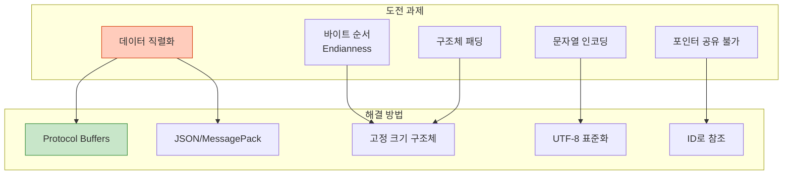

## 들어가며

현대 시스템은 **여러 언어**로 작성된 컴포넌트들이 협력합니다. C로 작성된 고성능 모듈, Python의 AI 모델, Go의 웹 서버가 IPC로 통신하는 방법을 배웁니다.

## 언어 간 IPC 도전 과제

### 주요 문제



## C ↔ Python IPC

### 1. Unix Socket 사용

```c
// c_server.c
#include <stdio.h>
#include <stdlib.h>
#include <string.h>
#include <unistd.h>
#include <sys/socket.h>
#include <sys/un.h>

#define SOCKET_PATH "/tmp/c_python_socket"

typedef struct {
    int id;
    float value;
    char message[64];
} __attribute__((packed)) data_t;

int main() {
    int server_fd = socket(AF_UNIX, SOCK_STREAM, 0);

    struct sockaddr_un addr = {0};
    addr.sun_family = AF_UNIX;
    strncpy(addr.sun_path, SOCKET_PATH, sizeof(addr.sun_path) - 1);

    unlink(SOCKET_PATH);
    bind(server_fd, (struct sockaddr*)&addr, sizeof(addr));
    listen(server_fd, 5);

    printf("C Server waiting on %s\n", SOCKET_PATH);

    int client_fd = accept(server_fd, NULL, NULL);
    printf("Python client connected\n");

    // Python으로부터 데이터 수신
    data_t received;
    read(client_fd, &received, sizeof(data_t));

    printf("Received from Python:\n");
    printf("  id: %d\n", received.id);
    printf("  value: %.2f\n", received.value);
    printf("  message: %s\n", received.message);

    // 응답 전송
    data_t response = {
        .id = 999,
        .value = 3.14159,
        .message = "Hello from C!"
    };
    write(client_fd, &response, sizeof(data_t));

    close(client_fd);
    close(server_fd);
    unlink(SOCKET_PATH);

    return 0;
}
```

```python
# python_client.py
import socket
import struct

SOCKET_PATH = "/tmp/c_python_socket"

# C 구조체와 동일한 포맷
# i: int (4 bytes)
# f: float (4 bytes)
# 64s: char[64] (64 bytes)
DATA_FORMAT = "if64s"

def main():
    # Unix socket 연결
    sock = socket.socket(socket.AF_UNIX, socket.SOCK_STREAM)
    sock.connect(SOCKET_PATH)

    print("Connected to C server")

    # 데이터 전송
    data = struct.pack(DATA_FORMAT,
                       42,                          # id
                       2.71828,                     # value
                       b"Hello from Python!")       # message

    sock.send(data)
    print("Sent data to C server")

    # 응답 수신
    response = sock.recv(struct.calcsize(DATA_FORMAT))
    id, value, message = struct.unpack(DATA_FORMAT, response)

    message = message.decode('utf-8').rstrip('\x00')  # null 제거

    print(f"Received from C:")
    print(f"  id: {id}")
    print(f"  value: {value:.5f}")
    print(f"  message: {message}")

    sock.close()

if __name__ == "__main__":
    main()
```

### 실행

```bash
# 터미널 1
gcc -o c_server c_server.c
./c_server

# 터미널 2
python3 python_client.py

# 출력:
# [C Server]
# C Server waiting on /tmp/c_python_socket
# Python client connected
# Received from Python:
#   id: 42
#   value: 2.72
#   message: Hello from Python!
#
# [Python Client]
# Connected to C server
# Sent data to C server
# Received from C:
#   id: 999
#   value: 3.14159
#   message: Hello from C!
```

### 2. POSIX 메시지 큐 사용 (Python)

```python
# python_mq.py
import posix_ipc
import struct

QUEUE_NAME = "/c_python_queue"

# 메시지 큐 생성
mq = posix_ipc.MessageQueue(
    QUEUE_NAME,
    posix_ipc.O_CREAT,
    max_messages=10,
    max_message_size=256
)

# 데이터 전송
data = struct.pack("if64s", 123, 1.23, b"Python message")
mq.send(data, priority=5)
print("Sent to queue")

# 수신
message, priority = mq.receive()
id, value, text = struct.unpack("if64s", message)
text = text.decode('utf-8').rstrip('\x00')

print(f"Received: id={id}, value={value}, text={text}")

# 정리
mq.close()
mq.unlink()
```

## C ↔ Go IPC

### 1. Unix Socket 사용

```go
// go_client.go
package main

import (
    "bytes"
    "encoding/binary"
    "fmt"
    "net"
)

// C 구조체와 동일한 레이아웃
type Data struct {
    ID      int32
    Value   float32
    Message [64]byte
}

func main() {
    // Unix socket 연결
    conn, err := net.Dial("unix", "/tmp/c_go_socket")
    if err != nil {
        panic(err)
    }
    defer conn.Close()

    fmt.Println("Connected to C server")

    // 데이터 준비
    data := Data{
        ID:    42,
        Value: 2.71828,
    }
    copy(data.Message[:], "Hello from Go!")

    // 바이너리로 직렬화 (Little Endian)
    buf := new(bytes.Buffer)
    binary.Write(buf, binary.LittleEndian, data)

    // 전송
    conn.Write(buf.Bytes())
    fmt.Println("Sent data to C server")

    // 응답 수신
    response := Data{}
    binary.Read(conn, binary.LittleEndian, &response)

    // Message 출력 (null-terminated 처리)
    messageLen := bytes.IndexByte(response.Message[:], 0)
    if messageLen == -1 {
        messageLen = len(response.Message)
    }

    fmt.Printf("Received from C:\n")
    fmt.Printf("  ID: %d\n", response.ID)
    fmt.Printf("  Value: %.5f\n", response.Value)
    fmt.Printf("  Message: %s\n", string(response.Message[:messageLen]))
}
```

```c
// c_server_go.c (C 서버)
// (앞의 C 서버와 유사, SOCKET_PATH만 변경)
#define SOCKET_PATH "/tmp/c_go_socket"
// ... (나머지 동일)
```

## JSON 기반 통신 (언어 중립적)

### C에서 JSON 생성/파싱

```c
// c_json.c
#include <stdio.h>
#include <string.h>
#include <jansson.h>  // apt install libjansson-dev

void send_json(int fd) {
    // JSON 객체 생성
    json_t *root = json_object();
    json_object_set_new(root, "type", json_string("request"));
    json_object_set_new(root, "id", json_integer(123));
    json_object_set_new(root, "value", json_real(3.14));

    json_t *array = json_array();
    json_array_append_new(array, json_string("item1"));
    json_array_append_new(array, json_string("item2"));
    json_object_set_new(root, "items", array);

    // 문자열로 변환
    char *json_str = json_dumps(root, JSON_COMPACT);
    printf("Sending: %s\n", json_str);

    write(fd, json_str, strlen(json_str));

    free(json_str);
    json_decref(root);
}

void receive_json(int fd) {
    char buffer[1024];
    ssize_t n = read(fd, buffer, sizeof(buffer) - 1);
    buffer[n] = '\0';

    printf("Received: %s\n", buffer);

    // JSON 파싱
    json_error_t error;
    json_t *root = json_loads(buffer, 0, &error);

    if (!root) {
        fprintf(stderr, "JSON error: %s\n", error.text);
        return;
    }

    const char *type = json_string_value(json_object_get(root, "type"));
    int id = json_integer_value(json_object_get(root, "id"));
    double value = json_real_value(json_object_get(root, "value"));

    printf("Parsed: type=%s, id=%d, value=%.2f\n", type, id, value);

    json_decref(root);
}
```

### Python에서 JSON 통신

```python
# python_json.py
import socket
import json

SOCKET_PATH = "/tmp/json_socket"

sock = socket.socket(socket.AF_UNIX, socket.SOCK_STREAM)
sock.connect(SOCKET_PATH)

# JSON 전송
data = {
    "type": "response",
    "id": 456,
    "value": 2.71,
    "items": ["python1", "python2"]
}

json_str = json.dumps(data)
sock.send(json_str.encode('utf-8'))
print(f"Sent: {json_str}")

# JSON 수신
response = sock.recv(1024).decode('utf-8')
print(f"Received: {response}")

parsed = json.loads(response)
print(f"Type: {parsed['type']}")
print(f"ID: {parsed['id']}")

sock.close()
```

## Protocol Buffers (Protobuf)

### 정의 파일

```protobuf
// message.proto
syntax = "proto3";

message Request {
    int32 id = 1;
    float value = 2;
    string message = 3;
    repeated string items = 4;
}

message Response {
    int32 status = 1;
    string result = 2;
}
```

### 생성

```bash
# C용 생성 (protobuf-c)
protoc --c_out=. message.proto

# Python용 생성
protoc --python_out=. message.proto

# Go용 생성
protoc --go_out=. message.proto
```

### Python 사용

```python
# python_protobuf.py
import socket
import message_pb2

sock = socket.socket(socket.AF_UNIX, socket.SOCK_STREAM)
sock.connect("/tmp/protobuf_socket")

# Request 생성
request = message_pb2.Request()
request.id = 123
request.value = 3.14
request.message = "Hello from Python"
request.items.extend(["item1", "item2"])

# 직렬화 및 전송
data = request.SerializeToString()
sock.send(len(data).to_bytes(4, 'little'))  # 길이 먼저
sock.send(data)

# 응답 수신
size = int.from_bytes(sock.recv(4), 'little')
response_data = sock.recv(size)

response = message_pb2.Response()
response.ParseFromString(response_data)

print(f"Status: {response.status}")
print(f"Result: {response.result}")

sock.close()
```

## MessagePack (경량 직렬화)

### C에서 MessagePack

```c
// c_msgpack.c
#include <msgpack.h>

void send_msgpack(int fd) {
    msgpack_sbuffer sbuf;
    msgpack_packer pk;

    msgpack_sbuffer_init(&sbuf);
    msgpack_packer_init(&pk, &sbuf, msgpack_sbuffer_write);

    // Map 시작 (3개 키)
    msgpack_pack_map(&pk, 3);

    // "id" = 123
    msgpack_pack_str(&pk, 2);
    msgpack_pack_str_body(&pk, "id", 2);
    msgpack_pack_int(&pk, 123);

    // "value" = 3.14
    msgpack_pack_str(&pk, 5);
    msgpack_pack_str_body(&pk, "value", 5);
    msgpack_pack_float(&pk, 3.14);

    // "message" = "Hello"
    msgpack_pack_str(&pk, 7);
    msgpack_pack_str_body(&pk, "message", 7);
    msgpack_pack_str(&pk, 5);
    msgpack_pack_str_body(&pk, "Hello", 5);

    write(fd, sbuf.data, sbuf.size);

    msgpack_sbuffer_destroy(&sbuf);
}
```

### Python에서 MessagePack

```python
# python_msgpack.py
import socket
import msgpack

sock = socket.socket(socket.AF_UNIX, socket.SOCK_STREAM)
sock.connect("/tmp/msgpack_socket")

# 데이터 직렬화
data = {
    "id": 456,
    "value": 2.71,
    "message": "Hello from Python"
}

packed = msgpack.packb(data)
sock.send(packed)

# 수신 및 역직렬화
received = sock.recv(1024)
unpacked = msgpack.unpackb(received, raw=False)

print(unpacked)

sock.close()
```

## 직렬화 방식 비교

| 방식 | 크기 | 속도 | 스키마 | 호환성 |
|------|------|------|--------|--------|
| **Raw Binary** | ⭐⭐⭐⭐⭐ | ⭐⭐⭐⭐⭐ | ❌ | ⚠️ 낮음 |
| **JSON** | ⭐⭐ | ⭐⭐⭐ | ❌ | ⭐⭐⭐⭐⭐ |
| **MessagePack** | ⭐⭐⭐⭐ | ⭐⭐⭐⭐ | ❌ | ⭐⭐⭐⭐ |
| **Protocol Buffers** | ⭐⭐⭐⭐⭐ | ⭐⭐⭐⭐⭐ | ✅ | ⭐⭐⭐⭐⭐ |

## 크로스 플랫폼 주의사항

### 1. Endianness

```c
// 항상 네트워크 바이트 순서 사용
#include <arpa/inet.h>

uint32_t host_value = 0x12345678;
uint32_t net_value = htonl(host_value);  // Host to Network Long

// 전송...

uint32_t received = ntohl(net_value);  // Network to Host Long
```

### 2. 구조체 패딩

```c
// ❌ 패딩으로 인한 문제
struct bad {
    char a;      // 1 byte
    // 3 bytes padding
    int b;       // 4 bytes
};  // sizeof = 8

// ✅ 패딩 제거
struct good {
    char a;
    int b;
} __attribute__((packed));  // sizeof = 5
```

### 3. 문자열 인코딩

```python
# Python: 항상 UTF-8 사용
text = "한글 테스트"
encoded = text.encode('utf-8')

# C에서도 UTF-8로 디코딩
```

## 모범 사례

### 체크리스트

```
✅ 직렬화
  [ ] 명시적 직렬화 사용 (JSON/Protobuf)
  [ ] Raw binary는 같은 언어끼리만
  [ ] 스키마 버저닝

✅ 호환성
  [ ] Little Endian 명시 or htonl() 사용
  [ ] 구조체 패딩 제거 (__attribute__((packed)))
  [ ] 문자열은 UTF-8로 통일

✅ 에러 처리
  [ ] 파싱 실패 처리
  [ ] 버전 불일치 감지
  [ ] 길이 검증
```

## 다음 단계

언어 간 IPC를 마스터했습니다! 다음 글에서는:
- **분산 IPC** - 로컬 → 네트워크 IPC 전환
- 마이그레이션 전략
- gRPC, ZeroMQ

---

**시리즈 목차**
17. **언어 간 IPC** ← 현재 글
18. 분산 IPC (다음 글)

> 💡 **Quick Tip**: 단순한 구조는 JSON, 성능이 중요하면 Protocol Buffers, 스키마가 자주 바뀌면 MessagePack을 사용하세요. Raw binary는 같은 언어 간에만 사용!
