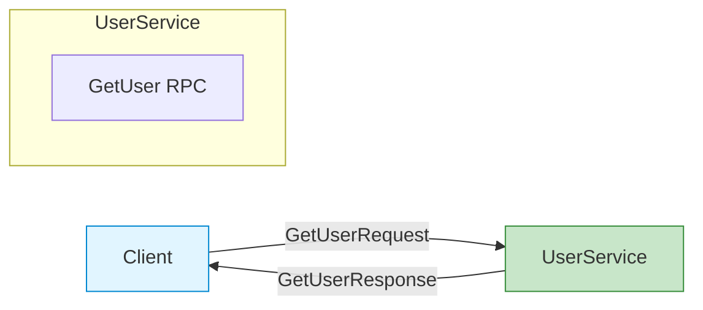
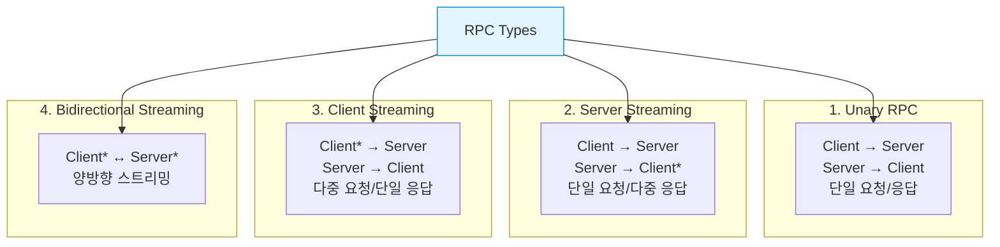
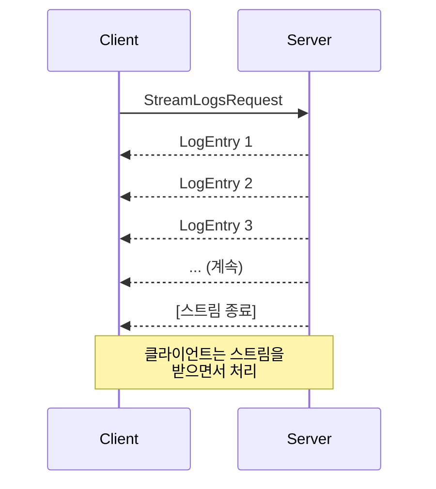
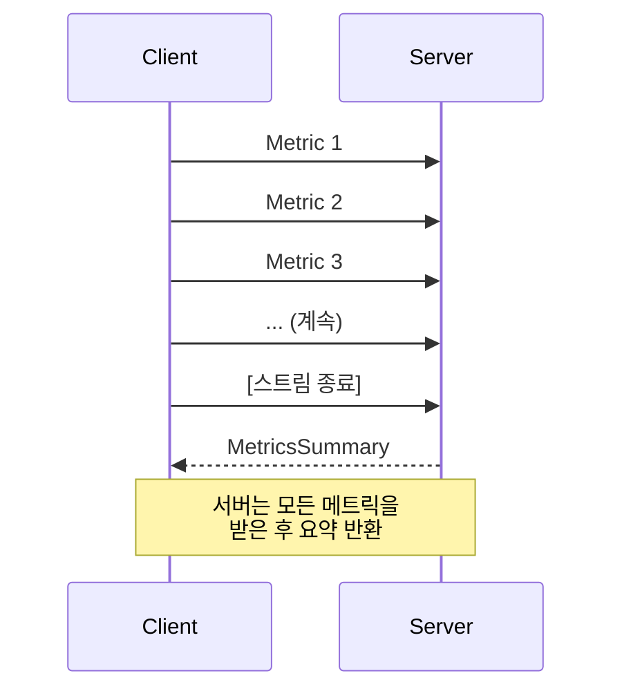
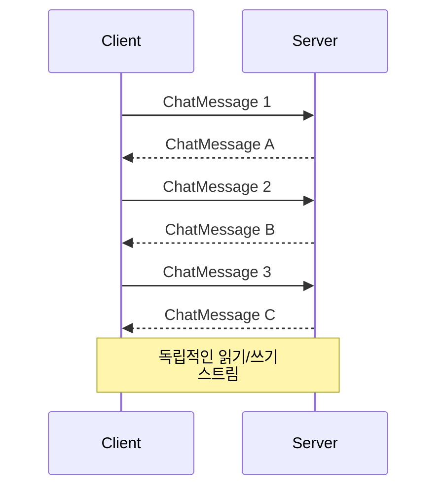
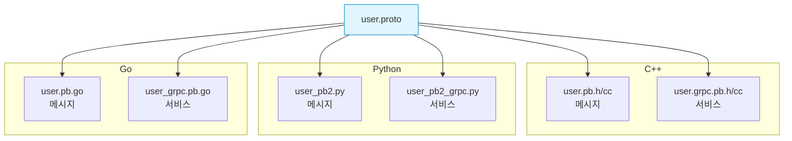
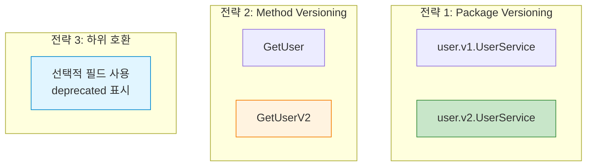

## 들어가며

Protocol Buffers는 데이터 정의뿐만 아니라 **서비스(Service)**도 정의할 수 있습니다. gRPC와 결합하면 강력한 RPC 프레임워크가 됩니다.

## Service 정의

### 기본 구조

```protobuf
syntax = "proto3";

package user.v1;

message GetUserRequest {
  string user_id = 1;
}

message GetUserResponse {
  string user_id = 1;
  string name = 2;
  string email = 3;
}

service UserService {
  rpc GetUser(GetUserRequest) returns (GetUserResponse);
}
```

### Service 아키텍처



## RPC 메소드 타입

gRPC는 4가지 RPC 타입을 지원합니다.



### 1. Unary RPC (단일 요청/응답)

가장 기본적인 RPC 타입입니다.

```protobuf
service UserService {
  // Unary RPC
  rpc GetUser(GetUserRequest) returns (GetUserResponse);
  rpc CreateUser(CreateUserRequest) returns (CreateUserResponse);
  rpc UpdateUser(UpdateUserRequest) returns (UpdateUserResponse);
  rpc DeleteUser(DeleteUserRequest) returns (DeleteUserResponse);
}
```

**C++ 서버 구현**:

```cpp
#include <grpcpp/grpcpp.h>
#include "user.grpc.pb.h"

class UserServiceImpl final : public UserService::Service {
public:
    grpc::Status GetUser(
        grpc::ServerContext* context,
        const GetUserRequest* request,
        GetUserResponse* response) override {

        // 비즈니스 로직
        std::string user_id = request->user_id();

        // DB에서 조회 (예시)
        response->set_user_id(user_id);
        response->set_name("John Doe");
        response->set_email("john@example.com");

        return grpc::Status::OK;
    }
};

int main() {
    std::string server_address("0.0.0.0:50051");
    UserServiceImpl service;

    grpc::ServerBuilder builder;
    builder.AddListeningPort(server_address, grpc::InsecureServerCredentials());
    builder.RegisterService(&service);

    std::unique_ptr<grpc::Server> server(builder.BuildAndStart());
    std::cout << "Server listening on " << server_address << std::endl;

    server->Wait();
    return 0;
}
```

**C++ 클라이언트**:

```cpp
#include <grpcpp/grpcpp.h>
#include "user.grpc.pb.h"

int main() {
    auto channel = grpc::CreateChannel(
        "localhost:50051",
        grpc::InsecureChannelCredentials()
    );

    auto stub = UserService::NewStub(channel);

    GetUserRequest request;
    request.set_user_id("123");

    GetUserResponse response;
    grpc::ClientContext context;

    grpc::Status status = stub->GetUser(&context, request, &response);

    if (status.ok()) {
        std::cout << "User: " << response.name() << std::endl;
        std::cout << "Email: " << response.email() << std::endl;
    } else {
        std::cerr << "RPC failed: " << status.error_message() << std::endl;
    }

    return 0;
}
```

**Python 서버**:

```python
from concurrent import futures
import grpc
import user_pb2
import user_pb2_grpc

class UserServiceServicer(user_pb2_grpc.UserServiceServicer):
    def GetUser(self, request, context):
        # 비즈니스 로직
        user_id = request.user_id

        # DB에서 조회 (예시)
        return user_pb2.GetUserResponse(
            user_id=user_id,
            name="John Doe",
            email="john@example.com"
        )

def serve():
    server = grpc.server(futures.ThreadPoolExecutor(max_workers=10))
    user_pb2_grpc.add_UserServiceServicer_to_server(
        UserServiceServicer(), server
    )
    server.add_insecure_port('[::]:50051')
    server.start()
    print("Server started on port 50051")
    server.wait_for_termination()

if __name__ == '__main__':
    serve()
```

**Python 클라이언트**:

```python
import grpc
import user_pb2
import user_pb2_grpc

def run():
    channel = grpc.insecure_channel('localhost:50051')
    stub = user_pb2_grpc.UserServiceStub(channel)

    request = user_pb2.GetUserRequest(user_id="123")
    response = stub.GetUser(request)

    print(f"User: {response.name}")
    print(f"Email: {response.email}")

if __name__ == '__main__':
    run()
```

**Go 서버**:

```go
package main

import (
    "context"
    "log"
    "net"

    "google.golang.org/grpc"
    pb "path/to/user"
)

type server struct {
    pb.UnimplementedUserServiceServer
}

func (s *server) GetUser(ctx context.Context, req *pb.GetUserRequest) (*pb.GetUserResponse, error) {
    // 비즈니스 로직
    return &pb.GetUserResponse{
        UserId: req.UserId,
        Name:   "John Doe",
        Email:  "john@example.com",
    }, nil
}

func main() {
    lis, err := net.Listen("tcp", ":50051")
    if err != nil {
        log.Fatalf("failed to listen: %v", err)
    }

    s := grpc.NewServer()
    pb.RegisterUserServiceServer(s, &server{})

    log.Println("Server listening on :50051")
    if err := s.Serve(lis); err != nil {
        log.Fatalf("failed to serve: %v", err)
    }
}
```

**Go 클라이언트**:

```go
package main

import (
    "context"
    "log"
    "time"

    "google.golang.org/grpc"
    pb "path/to/user"
)

func main() {
    conn, err := grpc.Dial("localhost:50051", grpc.WithInsecure())
    if err != nil {
        log.Fatalf("did not connect: %v", err)
    }
    defer conn.Close()

    client := pb.NewUserServiceClient(conn)

    ctx, cancel := context.WithTimeout(context.Background(), time.Second)
    defer cancel()

    resp, err := client.GetUser(ctx, &pb.GetUserRequest{
        UserId: "123",
    })
    if err != nil {
        log.Fatalf("could not get user: %v", err)
    }

    log.Printf("User: %s", resp.Name)
    log.Printf("Email: %s", resp.Email)
}
```

### 2. Server Streaming RPC

서버가 여러 응답을 스트리밍합니다.

```protobuf
service LogService {
  // Server Streaming RPC
  rpc StreamLogs(StreamLogsRequest) returns (stream LogEntry);
}

message StreamLogsRequest {
  string service_name = 1;
  int64 start_time = 2;
}

message LogEntry {
  int64 timestamp = 1;
  string level = 2;
  string message = 3;
}
```

**흐름**:



**C++ 서버**:

```cpp
grpc::Status StreamLogs(
    grpc::ServerContext* context,
    const StreamLogsRequest* request,
    grpc::ServerWriter<LogEntry>* writer) override {

    std::string service_name = request->service_name();

    // 로그 스트리밍 (예시: 10개)
    for (int i = 0; i < 10; i++) {
        LogEntry entry;
        entry.set_timestamp(time(nullptr));
        entry.set_level("INFO");
        entry.set_message("Log message " + std::to_string(i));

        // 클라이언트에 전송
        writer->Write(entry);

        std::this_thread::sleep_for(std::chrono::seconds(1));
    }

    return grpc::Status::OK;
}
```

**C++ 클라이언트**:

```cpp
StreamLogsRequest request;
request.set_service_name("auth-service");

grpc::ClientContext context;
auto reader = stub->StreamLogs(&context, request);

LogEntry entry;
while (reader->Read(&entry)) {
    std::cout << "[" << entry.level() << "] "
              << entry.message() << std::endl;
}

grpc::Status status = reader->Finish();
```

**Python 서버**:

```python
def StreamLogs(self, request, context):
    service_name = request.service_name

    # 로그 스트리밍
    for i in range(10):
        yield log_pb2.LogEntry(
            timestamp=int(time.time()),
            level="INFO",
            message=f"Log message {i}"
        )
        time.sleep(1)
```

**Python 클라이언트**:

```python
request = log_pb2.StreamLogsRequest(service_name="auth-service")
responses = stub.StreamLogs(request)

for entry in responses:
    print(f"[{entry.level}] {entry.message}")
```

### 3. Client Streaming RPC

클라이언트가 여러 요청을 스트리밍합니다.

```protobuf
service MetricsService {
  // Client Streaming RPC
  rpc RecordMetrics(stream Metric) returns (MetricsSummary);
}

message Metric {
  string name = 1;
  double value = 2;
  int64 timestamp = 3;
}

message MetricsSummary {
  int32 total_count = 1;
  double average = 2;
  double min = 3;
  double max = 4;
}
```

**흐름**:



**C++ 서버**:

```cpp
grpc::Status RecordMetrics(
    grpc::ServerContext* context,
    grpc::ServerReader<Metric>* reader,
    MetricsSummary* response) override {

    Metric metric;
    int count = 0;
    double sum = 0.0;
    double min_val = DBL_MAX;
    double max_val = -DBL_MAX;

    // 클라이언트로부터 스트림 읽기
    while (reader->Read(&metric)) {
        count++;
        sum += metric.value();
        min_val = std::min(min_val, metric.value());
        max_val = std::max(max_val, metric.value());
    }

    // 요약 생성
    response->set_total_count(count);
    response->set_average(sum / count);
    response->set_min(min_val);
    response->set_max(max_val);

    return grpc::Status::OK;
}
```

**C++ 클라이언트**:

```cpp
grpc::ClientContext context;
MetricsSummary response;
auto writer = stub->RecordMetrics(&context, &response);

// 메트릭 스트리밍
for (int i = 0; i < 100; i++) {
    Metric metric;
    metric.set_name("cpu_usage");
    metric.set_value(rand() % 100);
    metric.set_timestamp(time(nullptr));

    writer->Write(metric);
}

// 스트림 종료 및 응답 받기
writer->WritesDone();
grpc::Status status = writer->Finish();

if (status.ok()) {
    std::cout << "Total: " << response.total_count() << std::endl;
    std::cout << "Average: " << response.average() << std::endl;
}
```

**Python 서버**:

```python
def RecordMetrics(self, request_iterator, context):
    metrics = []

    for metric in request_iterator:
        metrics.append(metric.value)

    return metrics_pb2.MetricsSummary(
        total_count=len(metrics),
        average=sum(metrics) / len(metrics),
        min=min(metrics),
        max=max(metrics)
    )
```

**Python 클라이언트**:

```python
def generate_metrics():
    for i in range(100):
        yield metrics_pb2.Metric(
            name="cpu_usage",
            value=random.uniform(0, 100),
            timestamp=int(time.time())
        )

response = stub.RecordMetrics(generate_metrics())
print(f"Total: {response.total_count}")
print(f"Average: {response.average}")
```

### 4. Bidirectional Streaming RPC

클라이언트와 서버가 양방향으로 스트리밍합니다.

```protobuf
service ChatService {
  // Bidirectional Streaming RPC
  rpc Chat(stream ChatMessage) returns (stream ChatMessage);
}

message ChatMessage {
  string user_id = 1;
  string message = 2;
  int64 timestamp = 3;
}
```

**흐름**:



**C++ 서버**:

```cpp
grpc::Status Chat(
    grpc::ServerContext* context,
    grpc::ServerReaderWriter<ChatMessage, ChatMessage>* stream) override {

    ChatMessage message;

    while (stream->Read(&message)) {
        std::cout << "Received from " << message.user_id()
                  << ": " << message.message() << std::endl;

        // 브로드캐스트 (예시: 에코)
        ChatMessage response;
        response.set_user_id("Server");
        response.set_message("Echo: " + message.message());
        response.set_timestamp(time(nullptr));

        stream->Write(response);
    }

    return grpc::Status::OK;
}
```

**Python 서버**:

```python
def Chat(self, request_iterator, context):
    for message in request_iterator:
        print(f"Received from {message.user_id}: {message.message}")

        # 에코 응답
        yield chat_pb2.ChatMessage(
            user_id="Server",
            message=f"Echo: {message.message}",
            timestamp=int(time.time())
        )
```

**Python 클라이언트**:

```python
def generate_messages():
    messages = ["Hello", "How are you?", "Goodbye"]
    for msg in messages:
        yield chat_pb2.ChatMessage(
            user_id="Alice",
            message=msg,
            timestamp=int(time.time())
        )
        time.sleep(1)

responses = stub.Chat(generate_messages())
for response in responses:
    print(f"{response.user_id}: {response.message}")
```

## RPC 메소드 타입 비교

| 타입 | 요청 | 응답 | 사용 사례 |
|------|------|------|----------|
| **Unary** | 1 | 1 | CRUD 작업, 일반 API |
| **Server Streaming** | 1 | N | 로그 스트리밍, 대용량 결과 |
| **Client Streaming** | N | 1 | 파일 업로드, 배치 처리 |
| **Bidirectional** | N | N | 채팅, 실시간 동기화 |

## gRPC 통합

### 코드 생성

```bash
# gRPC 플러그인 설치
# C++
sudo apt install protobuf-compiler-grpc

# Python
pip install grpcio grpcio-tools

# Go
go install google.golang.org/protobuf/cmd/protoc-gen-go@latest
go install google.golang.org/grpc/cmd/protoc-gen-go-grpc@latest

# 코드 생성
# C++
protoc --cpp_out=. --grpc_out=. --plugin=protoc-gen-grpc=`which grpc_cpp_plugin` user.proto

# Python
python -m grpc_tools.protoc -I. --python_out=. --grpc_python_out=. user.proto

# Go
protoc --go_out=. --go_opt=paths=source_relative \
       --go-grpc_out=. --go-grpc_opt=paths=source_relative \
       user.proto
```

### 생성된 파일



## Service Evolution (서비스 진화)

### 안전한 변경

```protobuf
// Version 1
service UserService {
  rpc GetUser(GetUserRequest) returns (GetUserResponse);
}

// Version 2 - 메소드 추가 (안전)
service UserService {
  rpc GetUser(GetUserRequest) returns (GetUserResponse);
  rpc ListUsers(ListUsersRequest) returns (ListUsersResponse);  // ✅ 추가
}
```

### 메시지 진화

```protobuf
// Version 1
message GetUserRequest {
  string user_id = 1;
}

// Version 2 - 필드 추가 (안전)
message GetUserRequest {
  string user_id = 1;
  repeated string fields = 2;  // ✅ 선택적 필드 추가
  bool include_deleted = 3;
}
```

### 버전 관리 전략



**Package Versioning (권장)**:

```protobuf
// user/v1/user.proto
syntax = "proto3";
package user.v1;

service UserService {
  rpc GetUser(GetUserRequest) returns (GetUserResponse);
}

// user/v2/user.proto
syntax = "proto3";
package user.v2;

service UserService {
  rpc GetUser(GetUserRequest) returns (GetUserResponse);
  rpc ListUsers(ListUsersRequest) returns (ListUsersResponse);
}
```

### 호환성 체크리스트

| 변경 | 하위 호환 | 상위 호환 |
|------|----------|----------|
| 메소드 추가 | ✅ | ✅ |
| 메소드 삭제 | ❌ | ✅ |
| 메소드 이름 변경 | ❌ | ❌ |
| 요청 필드 추가 | ✅ | ✅ |
| 요청 필드 삭제 | ✅ | ❌ |
| 응답 필드 추가 | ✅ | ✅ |
| 응답 필드 삭제 | ❌ | ✅ |

## 실전 예제: CRUD 서비스

```protobuf
syntax = "proto3";

package blog.v1;

import "google/protobuf/timestamp.proto";
import "google/protobuf/empty.proto";

service BlogService {
  // Unary RPCs
  rpc CreatePost(CreatePostRequest) returns (Post);
  rpc GetPost(GetPostRequest) returns (Post);
  rpc UpdatePost(UpdatePostRequest) returns (Post);
  rpc DeletePost(DeletePostRequest) returns (google.protobuf.Empty);

  // Server Streaming
  rpc ListPosts(ListPostsRequest) returns (stream Post);

  // Bidirectional Streaming
  rpc LiveComments(stream Comment) returns (stream Comment);
}

message Post {
  string id = 1;
  string title = 2;
  string content = 3;
  string author = 4;
  google.protobuf.Timestamp created_at = 5;
  repeated string tags = 6;
}

message CreatePostRequest {
  string title = 1;
  string content = 2;
  string author = 3;
  repeated string tags = 4;
}

message GetPostRequest {
  string id = 1;
}

message UpdatePostRequest {
  string id = 1;
  string title = 2;
  string content = 3;
  repeated string tags = 4;
}

message DeletePostRequest {
  string id = 1;
}

message ListPostsRequest {
  int32 page_size = 1;
  string page_token = 2;
  string author = 3;
}

message Comment {
  string post_id = 1;
  string author = 2;
  string text = 3;
  google.protobuf.Timestamp timestamp = 4;
}
```

## 다음 단계

서비스와 RPC 정의를 마스터했습니다! 다음 글에서는:
- **Reflection과 동적 메시지**
- Descriptor API
- Runtime 스키마 검사

---

**시리즈 목차**
1. Protocol Buffers란 무엇인가
2. Protocol Buffers 고급 스키마 설계
3. gRPC와 Protobuf - 고성능 RPC
4. Protobuf 실전 활용 - 마이크로서비스
5. Protobuf 성능 최적화 및 Best Practices
6. Proto3 고급 기능
7. **서비스와 RPC 정의** ← 현재 글
8. Reflection과 동적 메시지 (다음 글)

> 💡 **Quick Tip**: gRPC는 HTTP/2를 사용하므로 멀티플렉싱, 헤더 압축, 서버 푸시를 지원합니다. 단일 TCP 연결로 여러 스트림을 동시에 처리할 수 있습니다!
