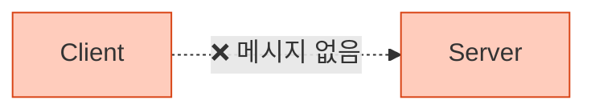
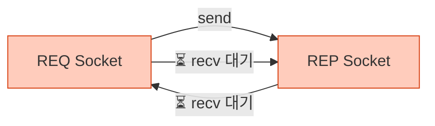
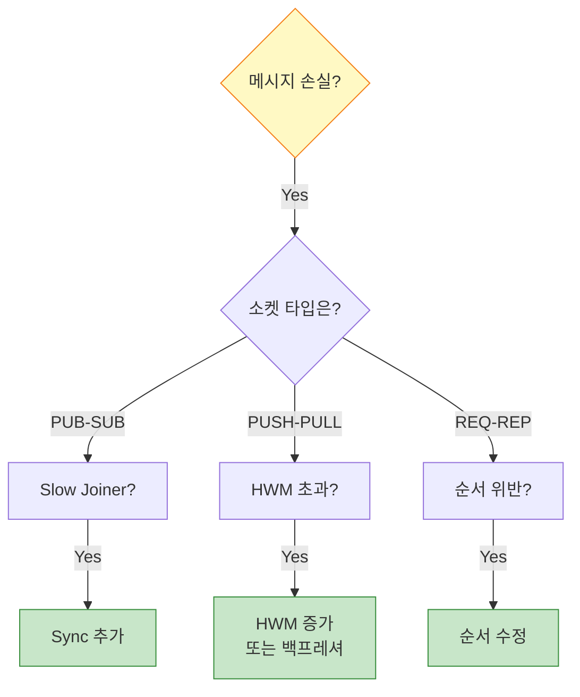

## 들어가며

ZeroMQ는 강력하지만, 잘못 사용하면 **미묘한 버그**가 발생합니다. "메시지가 안 온다", "프로그램이 멈췄다", "성능이 느리다" - 이런 문제들을 **체계적으로 해결**하는 방법을 배워봅시다.

## 일반적인 문제들

### 1. 메시지가 전달되지 않음



**가능한 원인**:
- bind()와 connect() 순서 문제
- 잘못된 소켓 타입 조합
- Slow Joiner 문제 (PUB-SUB)
- HWM (High Water Mark) 초과

#### 해결 방법

**문제 1: bind/connect 순서**

```c
// ❌ 잘못된 방법
void *client = zmq_socket(context, ZMQ_REQ);
zmq_connect(client, "tcp://localhost:5555");  // 서버가 아직 없음!

void *server = zmq_socket(context, ZMQ_REP);
zmq_bind(server, "tcp://*:5555");

zmq_send(client, "Hello", 5, 0);  // 메시지 손실 가능!
```

```c
// ✅ 올바른 방법
void *server = zmq_socket(context, ZMQ_REP);
zmq_bind(server, "tcp://*:5555");  // 먼저 bind

sleep(1);  // 또는 sync 메커니즘

void *client = zmq_socket(context, ZMQ_REQ);
zmq_connect(client, "tcp://localhost:5555");
zmq_send(client, "Hello", 5, 0);  // 안전!
```

**문제 2: Slow Joiner (PUB-SUB)**

```python
# ❌ 문제: Subscriber가 늦게 연결
publisher = context.socket(zmq.PUB)
publisher.bind("tcp://*:5555")

subscriber = context.socket(zmq.SUB)
subscriber.connect("tcp://localhost:5555")
subscriber.subscribe(b"")

publisher.send(b"First message")  # 손실!
```

```python
# ✅ 해결: Sync 메커니즘
# Publisher
sync = context.socket(zmq.REP)
sync.bind("tcp://*:5556")

publisher = context.socket(zmq.PUB)
publisher.bind("tcp://*:5555")

# Subscriber 대기
sync.recv()
sync.send(b"OK")

time.sleep(0.1)  # 추가 대기

publisher.send(b"First message")  # 전달됨!

# Subscriber
subscriber = context.socket(zmq.SUB)
subscriber.connect("tcp://localhost:5555")
subscriber.subscribe(b"")

sync_client = context.socket(zmq.REQ)
sync_client.connect("tcp://localhost:5556")
sync_client.send(b"READY")
sync_client.recv()

message = subscriber.recv()  # 수신 성공!
```

### 2. 프로그램이 멈춤 (Deadlock)



**원인**: REQ-REP 순서 위반

```c
// ❌ 잘못된 순서
// Server
zmq_send(server, "Hello", 5, 0);  // REP는 recv 먼저!
zmq_recv(server, buffer, 256, 0); // Deadlock!

// Client
zmq_recv(client, buffer, 256, 0);  // REQ는 send 먼저!
zmq_send(client, "World", 5, 0);   // Deadlock!
```

```c
// ✅ 올바른 순서
// Server (REP)
zmq_recv(server, buffer, 256, 0);  // 1. recv
zmq_send(server, "Reply", 5, 0);   // 2. send

// Client (REQ)
zmq_send(client, "Request", 7, 0); // 1. send
zmq_recv(client, buffer, 256, 0);  // 2. recv
```

### 3. 메시지 손실

**원인 진단 체크리스트**:



## 디버깅 도구

### 1. tcpdump로 패킷 확인

```bash
# ZeroMQ 트래픽 캡처
sudo tcpdump -i lo -n port 5555 -X

# 출력:
# 23:45:01.123456 IP 127.0.0.1.52341 > 127.0.0.1.5555: Flags [P.], seq 1:6, ack 1, win 502, length 5
# 0x0000:  4500 0039 0000 4000 4006 3cb8 7f00 0001  E..9..@.@.<.....
# 0x0010:  7f00 0001 cc75 15b3 1234 5678 9abc def0  .....u...4Vx....
# 0x0020:  5018 01f6 fe2d 0000 4865 6c6c 6f         P....-..Hello
```

### 2. ZeroMQ 메시지 디버거

```python
# message_debugger.py
import zmq

class MessageDebugger:
    """메시지 흐름 디버깅"""

    def __init__(self, socket, name="Socket"):
        self.socket = socket
        self.name = name
        self.message_count = 0

        # 원본 메서드 래핑
        self._original_send = socket.send
        self._original_recv = socket.recv

        socket.send = self._debug_send
        socket.recv = self._debug_recv

    def _debug_send(self, data, flags=0, **kwargs):
        """Send 디버깅"""
        self.message_count += 1

        print(f"[{self.name}] 📤 Send #{self.message_count}")
        print(f"  Size: {len(data)} bytes")
        print(f"  Data: {data[:100]}")  # 처음 100바이트만
        print(f"  Flags: {flags}")

        return self._original_send(data, flags, **kwargs)

    def _debug_recv(self, flags=0, **kwargs):
        """Recv 디버깅"""
        print(f"[{self.name}] 📥 Recv (waiting...)")

        data = self._original_recv(flags, **kwargs)

        print(f"  Size: {len(data)} bytes")
        print(f"  Data: {data[:100]}")

        return data

# 사용
context = zmq.Context()
socket = context.socket(zmq.REQ)

debugger = MessageDebugger(socket, "Client")

socket.connect("tcp://localhost:5555")
socket.send(b"Hello")
reply = socket.recv()
```

### 3. 소켓 옵션 확인

```c
// 소켓 옵션 디버깅
int rcvhwm, sndhwm, rcvtimeo, sndtimeo;
size_t size = sizeof(int);

zmq_getsockopt(socket, ZMQ_RCVHWM, &rcvhwm, &size);
zmq_getsockopt(socket, ZMQ_SNDHWM, &sndhwm, &size);
zmq_getsockopt(socket, ZMQ_RCVTIMEO, &rcvtimeo, &size);
zmq_getsockopt(socket, ZMQ_SNDTIMEO, &sndtimeo, &size);

printf("Socket Options:\n");
printf("  RCVHWM: %d\n", rcvhwm);
printf("  SNDHWM: %d\n", sndhwm);
printf("  RCVTIMEO: %d ms\n", rcvtimeo);
printf("  SNDTIMEO: %d ms\n", sndtimeo);
```

### 4. Context 통계

```python
# context_stats.py
import zmq

context = zmq.Context()

# 소켓 생성
sockets = []
for i in range(10):
    sock = context.socket(zmq.REQ)
    sockets.append(sock)

# Context 옵션 확인
print(f"IO Threads: {context.get(zmq.IO_THREADS)}")
print(f"Max Sockets: {context.get(zmq.MAX_SOCKETS)}")
print(f"IPV6: {context.get(zmq.IPV6)}")

# 정리
for sock in sockets:
    sock.close()
context.term()
```

## 성능 프로파일링

### 1. 지연 시간 측정

```c
// latency_test.c
#include <zmq.h>
#include <stdio.h>
#include <sys/time.h>

double get_time() {
    struct timeval tv;
    gettimeofday(&tv, NULL);
    return tv.tv_sec + tv.tv_usec / 1000000.0;
}

int main() {
    void *context = zmq_ctx_new();
    void *socket = zmq_socket(context, ZMQ_REQ);
    zmq_connect(socket, "tcp://localhost:5555");

    const int iterations = 10000;
    double start = get_time();

    for (int i = 0; i < iterations; i++) {
        zmq_send(socket, "ping", 4, 0);

        char buffer[10];
        zmq_recv(socket, buffer, 10, 0);
    }

    double end = get_time();
    double elapsed = end - start;

    printf("총 시간: %.3f seconds\n", elapsed);
    printf("평균 지연: %.3f ms\n", (elapsed / iterations) * 1000);
    printf("처리량: %.0f msg/s\n", iterations / elapsed);

    zmq_close(socket);
    zmq_ctx_destroy(context);
    return 0;
}
```

### 2. 처리량 측정

```python
# throughput_test.py
import zmq
import time

def throughput_test(message_size, message_count):
    context = zmq.Context()

    # Sender
    sender = context.socket(zmq.PUSH)
    sender.connect("tcp://localhost:5555")

    # Receiver
    receiver = context.socket(zmq.PULL)
    receiver.bind("tcp://*:5555")

    time.sleep(0.1)

    # 전송
    message = b"X" * message_size

    start = time.time()

    for i in range(message_count):
        sender.send(message)

    # 수신
    for i in range(message_count):
        receiver.recv()

    end = time.time()

    elapsed = end - start
    throughput = message_count / elapsed
    megabits = (throughput * message_size * 8) / 1_000_000

    print(f"메시지 크기: {message_size} bytes")
    print(f"메시지 개수: {message_count}")
    print(f"소요 시간: {elapsed:.3f} s")
    print(f"처리량: {throughput:.0f} msg/s")
    print(f"대역폭: {megabits:.2f} Mbps")

    sender.close()
    receiver.close()
    context.term()

if __name__ == "__main__":
    throughput_test(message_size=100, message_count=100000)
```

### 3. 메모리 프로파일링

```python
# memory_profile.py
import zmq
import tracemalloc

tracemalloc.start()

context = zmq.Context()

# 소켓 생성 및 사용
sockets = []
for i in range(1000):
    sock = context.socket(zmq.REQ)
    sock.connect("tcp://localhost:5555")
    sockets.append(sock)

current, peak = tracemalloc.get_traced_memory()
print(f"현재 메모리: {current / 1024 / 1024:.2f} MB")
print(f"최대 메모리: {peak / 1024 / 1024:.2f} MB")

# 정리
for sock in sockets:
    sock.close()
context.term()

tracemalloc.stop()
```

## 일반적인 안티패턴

### 1. 소켓 재사용 실패

```python
# ❌ 안티패턴: REQ 소켓 재사용 불가
socket.send(b"Request1")
# ... 응답 없음 (서버 죽음)

# 소켓이 망가진 상태!
socket.send(b"Request2")  # 작동 안 함!
```

```python
# ✅ 해결: 소켓 재생성
def safe_request(context, message, max_retries=3):
    for i in range(max_retries):
        socket = context.socket(zmq.REQ)
        socket.setsockopt(zmq.RCVTIMEO, 2500)
        socket.connect("tcp://localhost:5555")

        socket.send(message)

        try:
            reply = socket.recv()
            socket.close()
            return reply
        except zmq.Again:
            print(f"재시도 {i+1}/{max_retries}")
            socket.close()

    raise Exception("Max retries exceeded")
```

### 2. Context 공유 실패

```python
# ❌ 스레드마다 Context 생성 (비효율)
def worker_thread():
    context = zmq.Context()  # 비효율!
    socket = context.socket(zmq.REQ)
    # ...
```

```python
# ✅ Context 공유
global_context = zmq.Context()

def worker_thread():
    socket = global_context.socket(zmq.REQ)  # OK!
    # ...
```

### 3. 소켓 닫기 실패

```python
# ❌ 소켓 닫지 않음 (리소스 누수)
def bad_function():
    socket = context.socket(zmq.REQ)
    socket.connect("tcp://localhost:5555")
    # socket.close() 없음!
```

```python
# ✅ 항상 닫기
def good_function():
    socket = context.socket(zmq.REQ)
    try:
        socket.connect("tcp://localhost:5555")
        # 작업...
    finally:
        socket.close()  # 항상 실행
```

## 디버깅 체크리스트

### 메시지 전달 문제

- [ ] bind()가 connect() 전에 호출되었나?
- [ ] 소켓 타입이 호환되나? (REQ-REP, PUB-SUB, etc.)
- [ ] PUB-SUB에서 Slow Joiner 문제는 없나?
- [ ] HWM 설정이 적절한가?
- [ ] 방화벽이 포트를 막고 있지 않나?

### 성능 문제

- [ ] IO 스레드 수가 충분한가?
- [ ] TCP_NODELAY 옵션을 사용하는가?
- [ ] 메시지를 배치로 보내는가?
- [ ] 불필요한 복사가 있나?

### 안정성 문제

- [ ] 타임아웃이 설정되었나?
- [ ] 에러 처리가 되어 있나?
- [ ] 소켓이 제대로 닫히나?
- [ ] Context가 정리되나?

## 유용한 디버깅 팁

### 1. 로깅 활성화

```python
import logging

logging.basicConfig(level=logging.DEBUG)
logger = logging.getLogger('zeromq')

# ZeroMQ 로깅
zmq.log.setLevel(logging.DEBUG)
```

### 2. Wireshark 필터

```
# ZeroMQ 트래픽만 표시
tcp.port == 5555

# 특정 메시지 패턴
tcp.payload contains "Hello"
```

### 3. strace로 시스템 콜 추적

```bash
# ZeroMQ 프로그램 추적
strace -f -e trace=network,poll ./my_zmq_app

# 출력:
# socket(AF_INET, SOCK_STREAM, IPPROTO_TCP) = 3
# bind(3, {sa_family=AF_INET, sin_port=htons(5555)}, 16) = 0
# poll([{fd=3, events=POLLIN}], 1, -1)  = 1
```

## 다음 단계

디버깅을 마스터했습니다! 다음 글에서는:
- **Multipart 메시지** - Envelope 패턴
- Identity 프레임
- 라우팅 엔벨로프

---

**시리즈 목차**
1-11. (이전 글들)
12. **ZeroMQ 디버깅 - 일반적인 문제와 해결 방법** ← 현재 글
13. Multipart 메시지 (다음 글)

> 💡 **Quick Tip**: 문제가 생기면 먼저 소켓 타입과 send/recv 순서를 확인하세요. 90%의 문제가 여기서 발생합니다!
