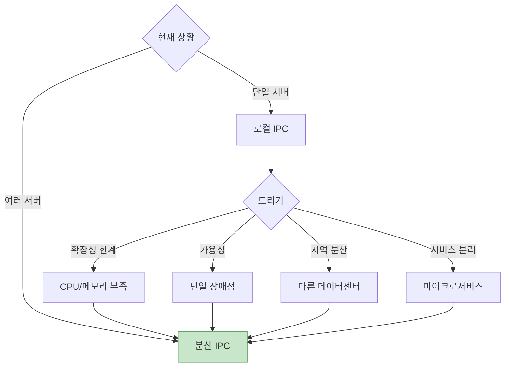
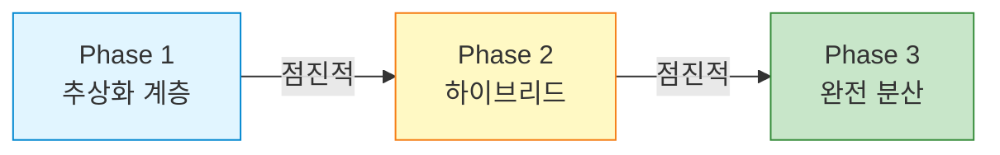
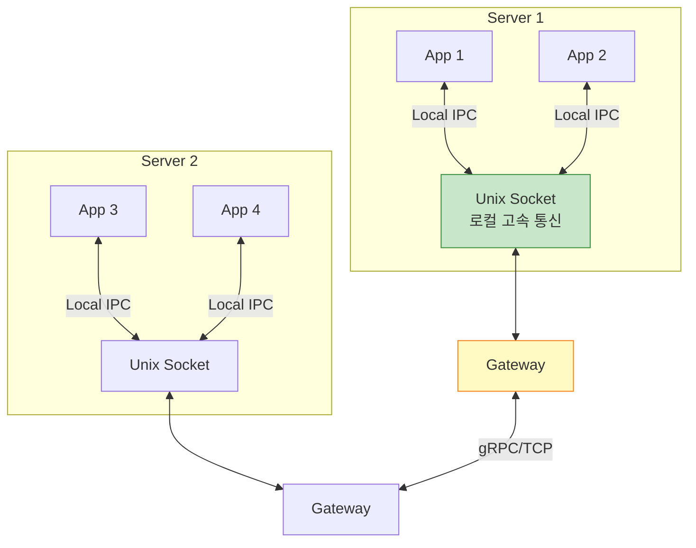
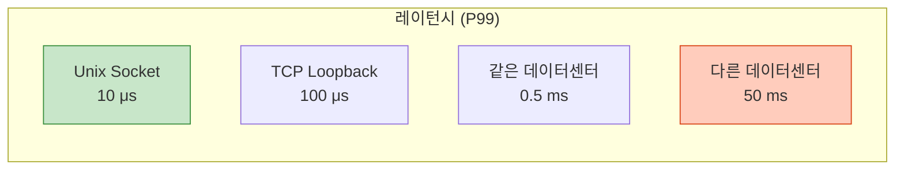
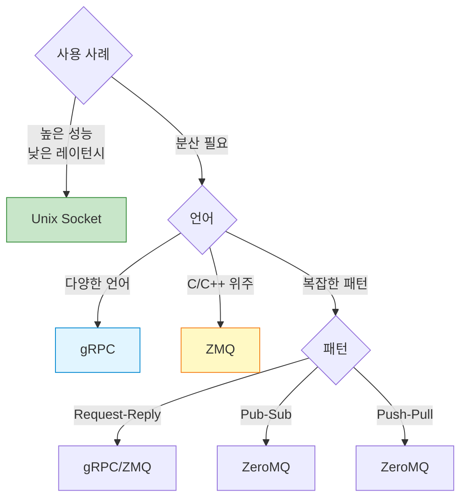

## 들어가며

시스템이 성장하면 **단일 서버**에서 **분산 시스템**으로 전환이 필요합니다. 로컬 IPC를 네트워크 IPC로 마이그레이션하는 전략과 도구를 배웁니다.

## 언제 분산 IPC가 필요한가?

### 전환 시점



### 비교

| 항목 | 로컬 IPC | 네트워크 IPC |
|------|----------|-------------|
| **레이턴시** | 1-10 μs | 0.1-10 ms |
| **대역폭** | 10+ GB/s | 1-10 GB/s |
| **신뢰성** | 매우 높음 | 중간 (네트워크 오류) |
| **복잡도** | 낮음 | 높음 |
| **확장성** | 제한적 | 무한 |
| **장애 격리** | 없음 | 있음 |

## 마이그레이션 전략

### 단계별 접근



### 1단계: 추상화 계층

```c
// ipc_abstraction.h
typedef enum {
    IPC_LOCAL,    // Unix Socket
    IPC_NETWORK   // TCP Socket
} ipc_mode_t;

typedef struct {
    ipc_mode_t mode;
    int fd;
    // 연결 정보...
} ipc_conn_t;

// 통합 API
ipc_conn_t* ipc_connect(const char *address);
int ipc_send(ipc_conn_t *conn, const void *data, size_t len);
int ipc_recv(ipc_conn_t *conn, void *data, size_t len);
void ipc_close(ipc_conn_t *conn);
```

```c
// ipc_abstraction.c
#include <string.h>
#include <sys/socket.h>
#include <sys/un.h>
#include <arpa/inet.h>

ipc_conn_t* ipc_connect(const char *address) {
    ipc_conn_t *conn = malloc(sizeof(ipc_conn_t));

    // "unix:///tmp/socket" or "tcp://host:port"
    if (strncmp(address, "unix://", 7) == 0) {
        conn->mode = IPC_LOCAL;
        conn->fd = socket(AF_UNIX, SOCK_STREAM, 0);

        struct sockaddr_un addr = {0};
        addr.sun_family = AF_UNIX;
        strncpy(addr.sun_path, address + 7, sizeof(addr.sun_path) - 1);

        connect(conn->fd, (struct sockaddr*)&addr, sizeof(addr));

    } else if (strncmp(address, "tcp://", 6) == 0) {
        conn->mode = IPC_NETWORK;
        conn->fd = socket(AF_INET, SOCK_STREAM, 0);

        // host:port 파싱
        char *host_port = strdup(address + 6);
        char *colon = strchr(host_port, ':');
        *colon = '\0';
        char *host = host_port;
        int port = atoi(colon + 1);

        struct sockaddr_in addr = {0};
        addr.sin_family = AF_INET;
        addr.sin_port = htons(port);
        inet_pton(AF_INET, host, &addr.sin_addr);

        connect(conn->fd, (struct sockaddr*)&addr, sizeof(addr));

        free(host_port);
    }

    return conn;
}

int ipc_send(ipc_conn_t *conn, const void *data, size_t len) {
    return send(conn->fd, data, len, 0);
}

int ipc_recv(ipc_conn_t *conn, void *data, size_t len) {
    return recv(conn->fd, data, len, 0);
}

void ipc_close(ipc_conn_t *conn) {
    close(conn->fd);
    free(conn);
}
```

### 사용 예제

```c
// application.c
int main() {
    // 환경 변수나 설정으로 전환 가능
    const char *endpoint = getenv("IPC_ENDPOINT");
    if (!endpoint) {
        endpoint = "unix:///tmp/myapp";  // 기본: 로컬
        // endpoint = "tcp://10.0.0.5:8080";  // 분산
    }

    ipc_conn_t *conn = ipc_connect(endpoint);

    // 동일한 코드로 로컬/네트워크 모두 지원
    char *message = "Hello";
    ipc_send(conn, message, strlen(message));

    char buffer[1024];
    ipc_recv(conn, buffer, sizeof(buffer));

    ipc_close(conn);
    return 0;
}
```

## gRPC - 현대적 분산 IPC

### 개념


### 정의 파일

```protobuf
// calculator.proto
syntax = "proto3";

service Calculator {
    rpc Add (AddRequest) returns (AddResponse);
    rpc StreamData (stream DataRequest) returns (stream DataResponse);
}

message AddRequest {
    int32 a = 1;
    int32 b = 2;
}

message AddResponse {
    int32 result = 1;
}

message DataRequest {
    int32 id = 1;
}

message DataResponse {
    int32 id = 1;
    string data = 2;
}
```

### Python 서버

```python
# grpc_server.py
import grpc
from concurrent import futures
import calculator_pb2
import calculator_pb2_grpc

class CalculatorServicer(calculator_pb2_grpc.CalculatorServicer):
    def Add(self, request, context):
        result = request.a + request.b
        return calculator_pb2.AddResponse(result=result)

    def StreamData(self, request_iterator, context):
        for request in request_iterator:
            yield calculator_pb2.DataResponse(
                id=request.id,
                data=f"Processed {request.id}"
            )

def serve():
    server = grpc.server(futures.ThreadPoolExecutor(max_workers=10))
    calculator_pb2_grpc.add_CalculatorServicer_to_server(
        CalculatorServicer(), server
    )
    server.add_insecure_port('[::]:50051')
    server.start()
    print("gRPC server listening on port 50051")
    server.wait_for_termination()

if __name__ == '__main__':
    serve()
```

### C++ 클라이언트

```cpp
// grpc_client.cpp
#include <grpcpp/grpcpp.h>
#include "calculator.grpc.pb.h"

using grpc::Channel;
using grpc::ClientContext;
using grpc::Status;

class CalculatorClient {
public:
    CalculatorClient(std::shared_ptr<Channel> channel)
        : stub_(Calculator::NewStub(channel)) {}

    int Add(int a, int b) {
        AddRequest request;
        request.set_a(a);
        request.set_b(b);

        AddResponse response;
        ClientContext context;

        Status status = stub_->Add(&context, request, &response);

        if (status.ok()) {
            return response.result();
        } else {
            std::cerr << "RPC failed" << std::endl;
            return -1;
        }
    }

private:
    std::unique_ptr<Calculator::Stub> stub_;
};

int main() {
    CalculatorClient client(
        grpc::CreateChannel("localhost:50051",
                           grpc::InsecureChannelCredentials())
    );

    int result = client.Add(10, 20);
    std::cout << "10 + 20 = " << result << std::endl;

    return 0;
}
```

## ZeroMQ - 메시지 큐 라이브러리

### Request-Reply 패턴

```python
# zmq_server.py
import zmq

context = zmq.Context()
socket = context.socket(zmq.REP)  # Reply
socket.bind("tcp://*:5555")

print("ZeroMQ server listening on port 5555")

while True:
    message = socket.recv_string()
    print(f"Received: {message}")

    response = f"Echo: {message}"
    socket.send_string(response)
```

```c
// zmq_client.c
#include <zmq.h>
#include <string.h>
#include <stdio.h>

int main() {
    void *context = zmq_ctx_new();
    void *socket = zmq_socket(context, ZMQ_REQ);  // Request

    zmq_connect(socket, "tcp://localhost:5555");

    const char *message = "Hello ZeroMQ";
    zmq_send(socket, message, strlen(message), 0);

    char buffer[256];
    int size = zmq_recv(socket, buffer, sizeof(buffer) - 1, 0);
    buffer[size] = '\0';

    printf("Received: %s\n", buffer);

    zmq_close(socket);
    zmq_ctx_destroy(context);

    return 0;
}
```

### Publish-Subscribe 패턴

```python
# zmq_publisher.py
import zmq
import time

context = zmq.Context()
socket = context.socket(zmq.PUB)  # Publisher
socket.bind("tcp://*:5556")

topic = "weather"

while True:
    message = f"{topic} temperature:25"
    socket.send_string(message)
    print(f"Published: {message}")
    time.sleep(1)
```

```python
# zmq_subscriber.py
import zmq

context = zmq.Context()
socket = context.socket(zmq.SUB)  # Subscriber
socket.connect("tcp://localhost:5556")

# 토픽 필터
socket.setsockopt_string(zmq.SUBSCRIBE, "weather")

while True:
    message = socket.recv_string()
    print(f"Received: {message}")
```

## 하이브리드 아키텍처

### 로컬 + 네트워크 혼합



### 구현

```c
// hybrid_gateway.c
// Unix Socket으로 로컬 앱 수신, TCP로 다른 서버 전송

void local_handler() {
    // Unix Socket 서버
    int local_fd = socket(AF_UNIX, SOCK_STREAM, 0);
    // ... bind, listen ...

    while (1) {
        int client_fd = accept(local_fd, NULL, NULL);

        // 로컬 클라이언트로부터 수신
        char buffer[1024];
        read(client_fd, buffer, sizeof(buffer));

        // 다른 서버로 전송 (TCP)
        forward_to_remote(buffer);

        close(client_fd);
    }
}

void forward_to_remote(const char *data) {
    int tcp_fd = socket(AF_INET, SOCK_STREAM, 0);
    // ... connect to remote server ...

    send(tcp_fd, data, strlen(data), 0);

    close(tcp_fd);
}
```

## 성능 고려사항

### 레이턴시 비교



### 최적화 전략

```python
# 1. 연결 풀 사용
import grpc

channel = grpc.insecure_channel(
    'server:50051',
    options=[
        ('grpc.max_receive_message_length', 100 * 1024 * 1024),
        ('grpc.keepalive_time_ms', 10000),
        ('grpc.http2.max_pings_without_data', 0)
    ]
)

# 2. Batch 처리
requests = [req1, req2, req3, ...]
responses = stub.BatchProcess(iter(requests))

# 3. 압축
channel = grpc.insecure_channel(
    'server:50051',
    compression=grpc.Compression.Gzip
)
```

## 에러 처리 및 재시도

### 재시도 정책

```python
# grpc_retry.py
import grpc
from grpc._channel import _InactiveRpcError

def call_with_retry(stub, request, max_retries=3):
    for attempt in range(max_retries):
        try:
            response = stub.SomeMethod(request, timeout=5.0)
            return response

        except grpc.RpcError as e:
            if e.code() == grpc.StatusCode.UNAVAILABLE:
                if attempt < max_retries - 1:
                    time.sleep(2 ** attempt)  # Exponential backoff
                    continue
                else:
                    raise

            elif e.code() == grpc.StatusCode.DEADLINE_EXCEEDED:
                print("Timeout, retrying...")
                continue

            else:
                raise  # 다른 에러는 즉시 전파
```

## 모니터링 및 관찰성

### 메트릭 수집

```python
# monitoring.py
from prometheus_client import Counter, Histogram
import time

# 메트릭 정의
request_count = Counter('ipc_requests_total', 'Total IPC requests')
request_latency = Histogram('ipc_request_latency_seconds', 'IPC request latency')

def monitored_rpc_call(stub, request):
    request_count.inc()

    start = time.time()
    try:
        response = stub.Call(request)
        return response
    finally:
        duration = time.time() - start
        request_latency.observe(duration)
```

## 선택 가이드

### 의사결정 트리



## 다음 단계

분산 IPC를 마스터했습니다! 다음 글에서는:
- **IPC 실전 예제** - Chrome, systemd, PostgreSQL 사례 연구
- 실제 시스템 분석
- 설계 패턴 추출

---

**시리즈 목차**
18. **분산 IPC** ← 현재 글
19. IPC 실전 예제 (다음 글)

> 💡 **Quick Tip**: 로컬 통신은 Unix Socket, 같은 데이터센터는 gRPC, 복잡한 패턴은 ZeroMQ를 사용하세요. 추상화 계층을 만들어 유연하게 전환 가능하도록 설계하세요!
