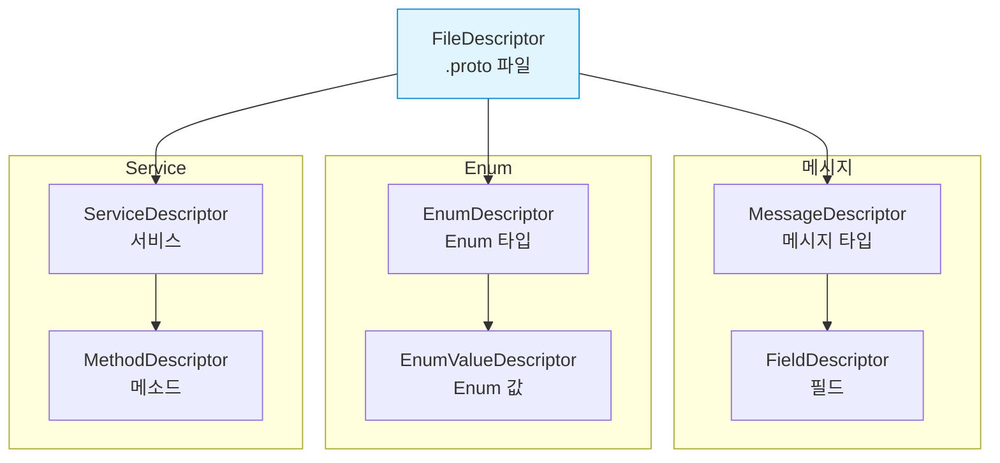
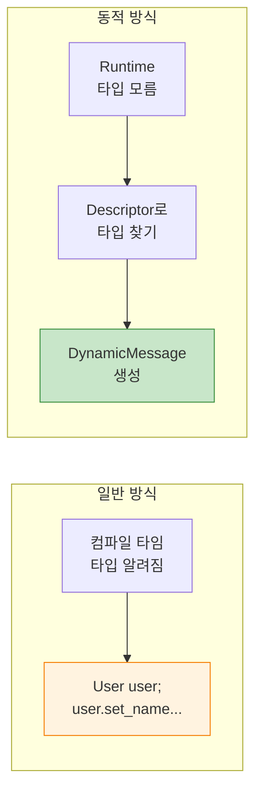

## 들어가며

**Reflection**을 사용하면 컴파일 타임에 타입을 몰라도 runtime에 메시지를 동적으로 조작할 수 있습니다. 범용 도구, 디버거, 프록시 구현에 필수적입니다.

## Descriptor API

### Descriptor 계층 구조



### Descriptor 접근

**C++ 예제**:

```cpp
#include <google/protobuf/descriptor.h>
#include "user.pb.h"
#include <iostream>

void inspectMessage() {
    // Descriptor 가져오기
    const google::protobuf::Descriptor* descriptor = User::descriptor();

    std::cout << "Message: " << descriptor->full_name() << std::endl;
    std::cout << "Field count: " << descriptor->field_count() << std::endl;

    // 필드 순회
    for (int i = 0; i < descriptor->field_count(); i++) {
        const google::protobuf::FieldDescriptor* field = descriptor->field(i);

        std::cout << "\nField " << i << ":" << std::endl;
        std::cout << "  Name: " << field->name() << std::endl;
        std::cout << "  Number: " << field->number() << std::endl;
        std::cout << "  Type: " << field->type_name() << std::endl;
        std::cout << "  C++ Type: " << field->cpp_type_name() << std::endl;
        std::cout << "  Is repeated: " << field->is_repeated() << std::endl;
        std::cout << "  Is required: " << field->is_required() << std::endl;
    }
}
```

**Python 예제**:

```python
from user_pb2 import User

def inspect_message():
    descriptor = User.DESCRIPTOR

    print(f"Message: {descriptor.full_name}")
    print(f"Field count: {len(descriptor.fields)}")

    for field in descriptor.fields:
        print(f"\nField:")
        print(f"  Name: {field.name}")
        print(f"  Number: {field.number}")
        print(f"  Type: {field.type}")
        print(f"  Label: {field.label}")

        if field.message_type:
            print(f"  Message Type: {field.message_type.full_name}")
```

**Go 예제**:

```go
import (
    "fmt"
    "google.golang.org/protobuf/reflect/protoreflect"
    pb "path/to/user"
)

func inspectMessage() {
    message := &pb.User{}
    descriptor := message.ProtoReflect().Descriptor()

    fmt.Printf("Message: %s\n", descriptor.FullName())
    fmt.Printf("Field count: %d\n", descriptor.Fields().Len())

    fields := descriptor.Fields()
    for i := 0; i < fields.Len(); i++ {
        field := fields.Get(i)

        fmt.Printf("\nField:\n")
        fmt.Printf("  Name: %s\n", field.Name())
        fmt.Printf("  Number: %d\n", field.Number())
        fmt.Printf("  Kind: %s\n", field.Kind())
        fmt.Printf("  Cardinality: %s\n", field.Cardinality())
    }
}
```

## Reflection API

### 동적 필드 접근

**C++ Reflection**:

```cpp
#include <google/protobuf/message.h>
#include <google/protobuf/descriptor.h>
#include "user.pb.h"

void dynamicAccess(const google::protobuf::Message& message) {
    const google::protobuf::Descriptor* descriptor = message.GetDescriptor();
    const google::protobuf::Reflection* reflection = message.GetReflection();

    // 모든 필드 순회
    for (int i = 0; i < descriptor->field_count(); i++) {
        const google::protobuf::FieldDescriptor* field = descriptor->field(i);

        std::cout << field->name() << ": ";

        // 타입에 따라 값 읽기
        switch (field->cpp_type()) {
            case google::protobuf::FieldDescriptor::CPPTYPE_INT32:
                std::cout << reflection->GetInt32(message, field);
                break;

            case google::protobuf::FieldDescriptor::CPPTYPE_INT64:
                std::cout << reflection->GetInt64(message, field);
                break;

            case google::protobuf::FieldDescriptor::CPPTYPE_STRING:
                std::cout << reflection->GetString(message, field);
                break;

            case google::protobuf::FieldDescriptor::CPPTYPE_BOOL:
                std::cout << reflection->GetBool(message, field);
                break;

            case google::protobuf::FieldDescriptor::CPPTYPE_DOUBLE:
                std::cout << reflection->GetDouble(message, field);
                break;

            case google::protobuf::FieldDescriptor::CPPTYPE_MESSAGE:
                std::cout << "<message>";
                break;

            default:
                std::cout << "<unknown>";
        }

        std::cout << std::endl;
    }
}

// 사용
User user;
user.set_name("Alice");
user.set_id(123);
user.set_email("alice@example.com");

dynamicAccess(user);
```

**Python Reflection**:

```python
from google.protobuf import text_format
from user_pb2 import User

def dynamic_access(message):
    for field, value in message.ListFields():
        print(f"{field.name}: {value}")

# 사용
user = User()
user.name = "Alice"
user.id = 123
user.email = "alice@example.com"

dynamic_access(user)
```

**Go Reflection**:

```go
import (
    "fmt"
    "google.golang.org/protobuf/reflect/protoreflect"
    pb "path/to/user"
)

func dynamicAccess(message protoreflect.Message) {
    message.Range(func(fd protoreflect.FieldDescriptor, v protoreflect.Value) bool {
        fmt.Printf("%s: %v\n", fd.Name(), v)
        return true
    })
}

// 사용
user := &pb.User{
    Name:  "Alice",
    Id:    123,
    Email: "alice@example.com",
}

dynamicAccess(user.ProtoReflect())
```

### 동적 필드 수정

**C++ 예제**:

```cpp
void dynamicModify(google::protobuf::Message* message) {
    const google::protobuf::Descriptor* descriptor = message->GetDescriptor();
    const google::protobuf::Reflection* reflection = message->GetReflection();

    // 이름으로 필드 찾기
    const google::protobuf::FieldDescriptor* name_field =
        descriptor->FindFieldByName("name");

    if (name_field && name_field->cpp_type() ==
        google::protobuf::FieldDescriptor::CPPTYPE_STRING) {
        reflection->SetString(message, name_field, "Bob");
    }

    // 숫자로 필드 찾기
    const google::protobuf::FieldDescriptor* id_field =
        descriptor->FindFieldByNumber(2);

    if (id_field && id_field->cpp_type() ==
        google::protobuf::FieldDescriptor::CPPTYPE_INT32) {
        reflection->SetInt32(message, id_field, 456);
    }
}
```

**Python 예제**:

```python
def dynamic_modify(message, field_name, value):
    field = message.DESCRIPTOR.fields_by_name.get(field_name)
    if field:
        setattr(message, field_name, value)

user = User()
dynamic_modify(user, "name", "Bob")
dynamic_modify(user, "id", 456)
```

## 동적 메시지 생성

컴파일 타임에 타입을 몰라도 메시지를 생성할 수 있습니다.



### C++ DynamicMessage

```cpp
#include <google/protobuf/dynamic_message.h>
#include <google/protobuf/descriptor.h>
#include <google/protobuf/descriptor.pb.h>
#include <google/protobuf/compiler/importer.h>

class ErrorCollector : public google::protobuf::compiler::MultiFileErrorCollector {
public:
    void AddError(const std::string& filename, int line, int column,
                  const std::string& message) override {
        std::cerr << filename << ":" << line << ":" << column
                  << ": " << message << std::endl;
    }
};

void createDynamicMessage() {
    // .proto 파일을 runtime에 로드
    google::protobuf::compiler::DiskSourceTree source_tree;
    source_tree.MapPath("", ".");

    ErrorCollector error_collector;
    google::protobuf::compiler::Importer importer(&source_tree, &error_collector);

    // .proto 파일 임포트
    const google::protobuf::FileDescriptor* file_descriptor =
        importer.Import("user.proto");

    // 메시지 타입 찾기
    const google::protobuf::Descriptor* descriptor =
        file_descriptor->FindMessageTypeByName("User");

    // DynamicMessage 생성
    google::protobuf::DynamicMessageFactory factory;
    const google::protobuf::Message* prototype =
        factory.GetPrototype(descriptor);
    google::protobuf::Message* message = prototype->New();

    // Reflection으로 필드 설정
    const google::protobuf::Reflection* reflection = message->GetReflection();

    const google::protobuf::FieldDescriptor* name_field =
        descriptor->FindFieldByName("name");
    reflection->SetString(message, name_field, "Alice");

    const google::protobuf::FieldDescriptor* id_field =
        descriptor->FindFieldByName("id");
    reflection->SetInt32(message, id_field, 123);

    // 출력
    std::cout << message->DebugString() << std::endl;

    delete message;
}
```

### Python DynamicMessage

```python
from google.protobuf import descriptor_pb2
from google.protobuf import message_factory
from google.protobuf import text_format

def create_dynamic_message():
    # FileDescriptorProto 생성
    file_descriptor_proto = descriptor_pb2.FileDescriptorProto()
    file_descriptor_proto.name = "dynamic.proto"
    file_descriptor_proto.package = "dynamic"

    # MessageDescriptorProto 생성
    message_descriptor_proto = file_descriptor_proto.message_type.add()
    message_descriptor_proto.name = "Person"

    # 필드 추가
    field = message_descriptor_proto.field.add()
    field.name = "name"
    field.number = 1
    field.type = descriptor_pb2.FieldDescriptorProto.TYPE_STRING
    field.label = descriptor_pb2.FieldDescriptorProto.LABEL_OPTIONAL

    field = message_descriptor_proto.field.add()
    field.name = "age"
    field.number = 2
    field.type = descriptor_pb2.FieldDescriptorProto.TYPE_INT32
    field.label = descriptor_pb2.FieldDescriptorProto.LABEL_OPTIONAL

    # 메시지 클래스 생성
    factory = message_factory.MessageFactory()
    message_class = factory.GetPrototype(
        message_factory.GetMessages([file_descriptor_proto])["dynamic.Person"].DESCRIPTOR
    )

    # 인스턴스 생성
    message = message_class()
    message.name = "Alice"
    message.age = 30

    print(text_format.MessageToString(message))
```

## Runtime 스키마 검사

### 스키마 호환성 검증

**C++ 예제**:

```cpp
#include <google/protobuf/descriptor.h>

bool areCompatible(const google::protobuf::Descriptor* desc1,
                   const google::protobuf::Descriptor* desc2) {
    // 필드 개수 비교
    if (desc1->field_count() > desc2->field_count()) {
        std::cerr << "desc1 has more fields" << std::endl;
        return false;
    }

    // 각 필드 호환성 확인
    for (int i = 0; i < desc1->field_count(); i++) {
        const google::protobuf::FieldDescriptor* field1 = desc1->field(i);
        const google::protobuf::FieldDescriptor* field2 =
            desc2->FindFieldByNumber(field1->number());

        if (!field2) {
            std::cerr << "Field " << field1->name() << " not found in desc2"
                      << std::endl;
            return false;
        }

        // 타입 호환성 확인
        if (field1->type() != field2->type()) {
            std::cerr << "Field " << field1->name() << " type mismatch"
                      << std::endl;
            return false;
        }

        // Label 확인 (repeated, optional)
        if (field1->is_repeated() != field2->is_repeated()) {
            std::cerr << "Field " << field1->name() << " label mismatch"
                      << std::endl;
            return false;
        }
    }

    return true;
}
```

### 필드 변경 감지

```cpp
void detectChanges(const google::protobuf::Message& old_msg,
                   const google::protobuf::Message& new_msg) {
    const google::protobuf::Descriptor* descriptor = old_msg.GetDescriptor();
    const google::protobuf::Reflection* old_refl = old_msg.GetReflection();
    const google::protobuf::Reflection* new_refl = new_msg.GetReflection();

    for (int i = 0; i < descriptor->field_count(); i++) {
        const google::protobuf::FieldDescriptor* field = descriptor->field(i);

        // 값이 변경되었는지 확인
        bool old_has = old_refl->HasField(old_msg, field);
        bool new_has = new_refl->HasField(new_msg, field);

        if (old_has != new_has) {
            std::cout << "Field " << field->name() << " presence changed"
                      << std::endl;
            continue;
        }

        if (!old_has) continue;

        // 타입별 비교
        switch (field->cpp_type()) {
            case google::protobuf::FieldDescriptor::CPPTYPE_STRING: {
                std::string old_val = old_refl->GetString(old_msg, field);
                std::string new_val = new_refl->GetString(new_msg, field);
                if (old_val != new_val) {
                    std::cout << field->name() << ": " << old_val
                              << " -> " << new_val << std::endl;
                }
                break;
            }
            // 다른 타입들도 유사하게 처리
        }
    }
}
```

## 실전 활용 사례

### 1. 범용 Protobuf Viewer

```python
import sys
from google.protobuf import text_format
from google.protobuf import descriptor_pool
from google.protobuf import symbol_database

def view_protobuf(message):
    """범용 Protobuf 뷰어"""
    descriptor = message.DESCRIPTOR

    print(f"Message Type: {descriptor.full_name}")
    print("=" * 50)

    for field in descriptor.fields:
        if not message.HasField(field.name) and not field.label == field.LABEL_REPEATED:
            continue

        value = getattr(message, field.name)

        if field.type == field.TYPE_MESSAGE:
            if field.label == field.LABEL_REPEATED:
                print(f"{field.name}: [")
                for item in value:
                    print(f"  {text_format.MessageToString(item, as_one_line=True)}")
                print("]")
            else:
                print(f"{field.name}:")
                print(text_format.MessageToString(value, indent=2))
        else:
            print(f"{field.name}: {value}")
```

### 2. Protobuf to JSON Converter

```cpp
#include <google/protobuf/util/json_util.h>
#include <google/protobuf/message.h>

std::string protobufToJson(const google::protobuf::Message& message) {
    std::string json_output;
    google::protobuf::util::JsonOptions options;
    options.add_whitespace = true;
    options.always_print_primitive_fields = true;

    google::protobuf::util::MessageToJsonString(
        message, &json_output, options
    );

    return json_output;
}

google::protobuf::Message* jsonToProtobuf(
    const std::string& json,
    const google::protobuf::Descriptor* descriptor) {

    google::protobuf::DynamicMessageFactory factory;
    const google::protobuf::Message* prototype =
        factory.GetPrototype(descriptor);
    google::protobuf::Message* message = prototype->New();

    google::protobuf::util::JsonParseOptions options;
    google::protobuf::util::JsonStringToMessage(json, message, options);

    return message;
}
```

### 3. Protobuf Diff Tool

```python
def diff_messages(msg1, msg2):
    """두 메시지의 차이점 출력"""
    assert type(msg1) == type(msg2), "Different message types"

    descriptor = msg1.DESCRIPTOR
    changes = []

    for field in descriptor.fields:
        val1 = getattr(msg1, field.name)
        val2 = getattr(msg2, field.name)

        if val1 != val2:
            changes.append({
                'field': field.name,
                'old': val1,
                'new': val2
            })

    return changes

# 사용
user1 = User(name="Alice", id=123, email="alice@old.com")
user2 = User(name="Alice", id=123, email="alice@new.com")

changes = diff_messages(user1, user2)
for change in changes:
    print(f"{change['field']}: {change['old']} -> {change['new']}")
```

### 4. Generic gRPC Proxy

```go
import (
    "context"
    "google.golang.org/grpc"
    "google.golang.org/protobuf/reflect/protoreflect"
    "google.golang.org/protobuf/types/dynamicpb"
)

type GenericProxy struct {
    backend grpc.ClientConnInterface
}

func (p *GenericProxy) ProxyCall(
    ctx context.Context,
    method string,
    request protoreflect.Message,
) (protoreflect.Message, error) {
    // 메소드 디스크립터 찾기
    descriptor := request.Descriptor()

    // 응답 메시지 생성
    response := dynamicpb.NewMessage(descriptor)

    // gRPC 호출
    err := p.backend.Invoke(ctx, method, request, response)
    if err != nil {
        return nil, err
    }

    return response, nil
}
```

## Reflection API 비교

| 언어 | Descriptor 접근 | Reflection API | 동적 메시지 |
|------|----------------|----------------|-------------|
| **C++** | `Message::descriptor()` | `Message::GetReflection()` | `DynamicMessage` |
| **Python** | `Message.DESCRIPTOR` | `ListFields()`, `HasField()` | `MessageFactory` |
| **Go** | `ProtoReflect().Descriptor()` | `ProtoReflect()` | `dynamicpb.NewMessage()` |

## 성능 고려사항

```mermaid
graph TB
    subgraph "직접 접근"
        Direct[user.name()<br/>user.set_name...]
        Fast[빠름<br/>컴파일 타임 최적화]
    end

    subgraph "Reflection 접근"
        Refl[GetString/SetString<br/>동적 조회]
        Slow[느림<br/>Runtime 오버헤드]
    end

    Direct --> Fast
    Refl --> Slow

    style Fast fill:#c8e6c9,stroke:#388e3c
    style Slow fill:#ffcdd2,stroke:#c62828
```

**벤치마크 (C++)**:

| 작업 | 직접 접근 | Reflection | 배 차이 |
|------|----------|-----------|---------|
| 필드 읽기 | 1ns | 5ns | 5x |
| 필드 쓰기 | 2ns | 8ns | 4x |
| 메시지 생성 | 50ns | 200ns | 4x |

## 다음 단계

Reflection과 동적 메시지를 마스터했습니다! 다음 글에서는:
- **Extensions와 플러그인**
- 커스텀 코드 생성
- Third-party 생성기

---

**시리즈 목차**
1. Protocol Buffers란 무엇인가
2. Protocol Buffers 고급 스키마 설계
3. gRPC와 Protobuf - 고성능 RPC
4. Protobuf 실전 활용 - 마이크로서비스
5. Protobuf 성능 최적화 및 Best Practices
6. Proto3 고급 기능
7. 서비스와 RPC 정의
8. **Reflection과 동적 메시지** ← 현재 글
9. Extensions와 플러그인 (다음 글)

> 💡 **Quick Tip**: Reflection은 강력하지만 성능 오버헤드가 있습니다. 핫 패스(hot path)에서는 직접 접근을 사용하고, 범용 도구나 디버깅에서만 Reflection을 사용하세요!
