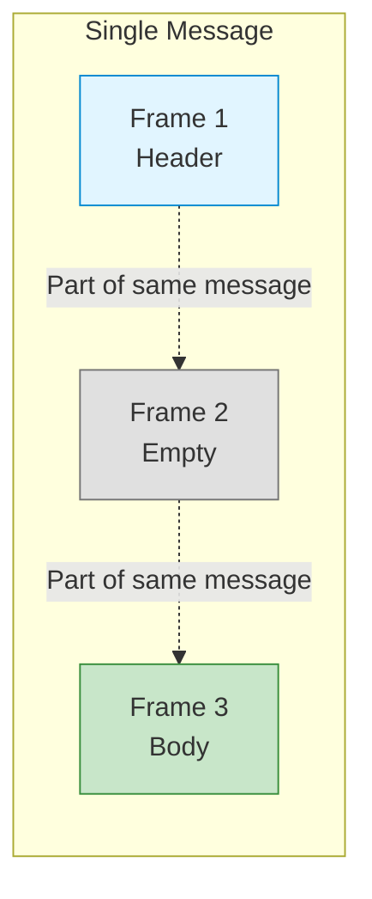
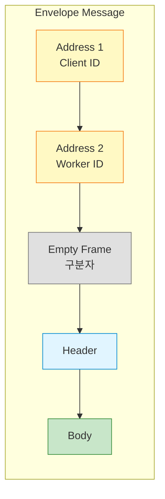
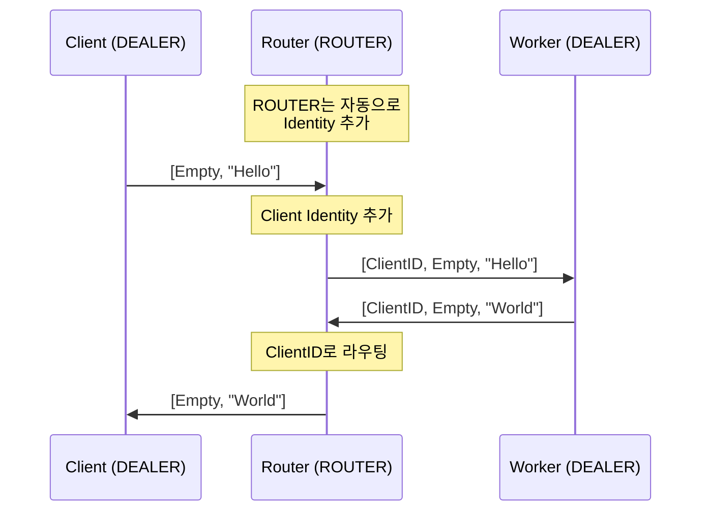

## 들어가며

ZeroMQ의 **Multipart 메시지**는 강력하지만 처음에는 혼란스러울 수 있습니다. **Envelope (봉투) 패턴**을 이해하면, ROUTER/DEALER와 같은 고급 소켓을 마스터할 수 있습니다.

## Multipart 메시지란?

### 개념

**Multipart 메시지**는 여러 **프레임(frame)**으로 구성된 하나의 메시지입니다.



### 특징

- **원자성**: 모든 프레임이 함께 전달되거나 모두 손실
- **구조화**: 헤더와 바디를 분리 가능
- **효율성**: 제로카피 전송 가능

## 기본 사용법

### C에서 Multipart 전송

```c
// multipart_send.c
#include <zmq.h>
#include <string.h>

int main() {
    void *context = zmq_ctx_new();
    void *socket = zmq_socket(context, ZMQ_DEALER);
    zmq_connect(socket, "tcp://localhost:5555");

    // 3개 프레임 전송
    zmq_send(socket, "Header", 6, ZMQ_SNDMORE);  // Frame 1
    zmq_send(socket, "", 0, ZMQ_SNDMORE);         // Frame 2 (구분자)
    zmq_send(socket, "Body Data", 9, 0);          // Frame 3 (마지막)

    zmq_close(socket);
    zmq_ctx_destroy(context);
    return 0;
}
```

### C에서 Multipart 수신

```c
// multipart_recv.c
#include <zmq.h>
#include <stdio.h>

int main() {
    void *context = zmq_ctx_new();
    void *socket = zmq_socket(context, ZMQ_DEALER);
    zmq_bind(socket, "tcp://*:5555");

    while (1) {
        zmq_msg_t msg;
        int more;
        size_t more_size = sizeof(more);

        int part = 0;
        do {
            zmq_msg_init(&msg);
            zmq_msg_recv(&msg, socket, 0);

            printf("Frame %d: %.*s\n",
                   part++,
                   (int)zmq_msg_size(&msg),
                   (char *)zmq_msg_data(&msg));

            zmq_getsockopt(socket, ZMQ_RCVMORE, &more, &more_size);
            zmq_msg_close(&msg);

        } while (more);

        printf("--- Message complete ---\n");
    }

    return 0;
}
```

### Python에서 Multipart

```python
# multipart.py
import zmq

context = zmq.Context()

# 전송
sender = context.socket(zmq.DEALER)
sender.connect("tcp://localhost:5555")

# send_multipart로 간단하게!
sender.send_multipart([
    b"Header",
    b"",          # 구분자
    b"Body Data"
])

# 수신
receiver = context.socket(zmq.DEALER)
receiver.bind("tcp://*:5555")

frames = receiver.recv_multipart()

for i, frame in enumerate(frames):
    print(f"Frame {i}: {frame}")
```

## Envelope 패턴

### 개념

**Envelope**는 메시지를 감싸는 **봉투**입니다. 주소 정보를 포함합니다.



### ROUTER-DEALER 예제



**Client (DEALER)**:

```python
# envelope_client.py
import zmq

context = zmq.Context()
client = context.socket(zmq.DEALER)

# Identity 설정 (선택적)
client.setsockopt(zmq.IDENTITY, b"Client-001")

client.connect("tcp://localhost:5555")

# Request 전송
client.send_multipart([
    b"",           # DEALER는 빈 프레임으로 시작
    b"Hello from client"
])

# Reply 수신
frames = client.recv_multipart()
print(f"Reply: {frames}")

client.close()
context.term()
```

**Router**:

```python
# envelope_router.py
import zmq

context = zmq.Context()

frontend = context.socket(zmq.ROUTER)
frontend.bind("tcp://*:5555")

backend = context.socket(zmq.DEALER)
backend.bind("tcp://*:5556")

# Proxy
zmq.proxy(frontend, backend)

# 또는 수동으로:
while True:
    # Client → Worker
    frames = frontend.recv_multipart()
    # frames = [client_id, empty, data]

    backend.send_multipart(frames)

    # Worker → Client
    frames = backend.recv_multipart()
    # frames = [client_id, empty, reply]

    frontend.send_multipart(frames)
```

**Worker (DEALER)**:

```python
# envelope_worker.py
import zmq

context = zmq.Context()
worker = context.socket(zmq.DEALER)
worker.connect("tcp://localhost:5556")

while True:
    # Request 수신
    frames = worker.recv_multipart()
    # frames = [client_id, empty, request]

    client_id = frames[0]
    request = frames[2]

    print(f"Request from {client_id}: {request}")

    # Reply 전송
    worker.send_multipart([
        client_id,
        b"",
        b"Processed: " + request
    ])
```

## Identity 프레임

### 자동 Identity

ROUTER는 연결된 각 피어에게 **자동으로 Identity**를 부여합니다.

```c
// 자동 Identity (5바이트 랜덤)
// 예: "\x00\x4A\x2F\xB3\x91"
```

### 커스텀 Identity

```c
// 커스텀 Identity 설정
char identity[10] = "Worker-01";
zmq_setsockopt(socket, ZMQ_IDENTITY, identity, strlen(identity));
```

```python
# Python
socket.setsockopt(zmq.IDENTITY, b"Worker-01")
```

### Identity 활용 예제

```python
# identity_routing.py
import zmq
import time

context = zmq.Context()

# Router
router = context.socket(zmq.ROUTER)
router.bind("tcp://*:5555")

# Workers with custom identities
workers = []
for i in range(3):
    worker = context.socket(zmq.REQ)
    identity = f"Worker-{i:02d}".encode()
    worker.setsockopt(zmq.IDENTITY, identity)
    worker.connect("tcp://localhost:5555")
    workers.append(worker)

# Worker 등록 (READY 신호)
for worker in workers:
    worker.send(b"READY")

# Router: Worker 목록 구축
worker_ids = []
for _ in range(3):
    frames = router.recv_multipart()
    worker_id = frames[0]
    worker_ids.append(worker_id)
    print(f"Worker 등록: {worker_id}")

# 특정 Worker에게 작업 전달
target_worker = worker_ids[1]  # Worker-01
router.send_multipart([
    target_worker,
    b"",
    b"Task for Worker-01"
])

# Worker-01이 수신
reply = workers[1].recv()
print(f"Worker-01: {reply}")
```

## 고급 Envelope 패턴

### LRU Queue with Envelope

```python
# lru_envelope.py
import zmq
from collections import deque

context = zmq.Context()

frontend = context.socket(zmq.ROUTER)
frontend.bind("tcp://*:5555")

backend = context.socket(zmq.ROUTER)
backend.bind("tcp://*:5556")

workers = deque()

poller = zmq.Poller()
poller.register(backend, zmq.POLLIN)
poller.register(frontend, zmq.POLLIN)

while True:
    socks = dict(poller.poll())

    # Backend (Worker)
    if backend in socks:
        frames = backend.recv_multipart()
        # [worker_id, empty, client_id, empty, reply]
        # 또는 [worker_id, empty, READY]

        worker_id = frames[0]
        workers.append(worker_id)

        if len(frames) > 2:
            # Reply to client
            client_id = frames[2]
            reply = frames[4:]

            frontend.send_multipart([
                client_id,
                b"",
                *reply
            ])

    # Frontend (Client)
    if frontend in socks and workers:
        frames = frontend.recv_multipart()
        # [client_id, empty, request]

        client_id = frames[0]
        request = frames[2:]

        # LRU Worker 선택
        worker_id = workers.popleft()

        backend.send_multipart([
            worker_id,
            b"",
            client_id,
            b"",
            *request
        ])
```

## Multipart 메시지 구조 패턴

### 1. 기본 REQ-REP

```
[Request Body]

[Reply Body]
```

### 2. DEALER-ROUTER

```
Client → Router:
[Empty, Request]

Router → Worker:
[Client ID, Empty, Request]

Worker → Router:
[Client ID, Empty, Reply]

Router → Client:
[Empty, Reply]
```

### 3. 3-Hop (Client-Proxy-Worker)

```
Client → Proxy:
[Empty, Request]

Proxy → Worker:
[Client ID, Empty, Proxy ID, Empty, Request]

Worker → Proxy:
[Client ID, Empty, Proxy ID, Empty, Reply]

Proxy → Client:
[Empty, Reply]
```

### 4. Majordomo Protocol

```
Client → Broker:
[MDPC01, Service, Request]

Broker → Worker:
[MDPW01, REQUEST, Client, Empty, Request]

Worker → Broker:
[MDPW01, REPLY, Client, Empty, Reply]

Broker → Client:
[MDPC01, Service, Reply]
```

## 실전 활용

### 1. Request Tracking

```python
# request_tracking.py
import zmq
import uuid

context = zmq.Context()
socket = context.socket(zmq.DEALER)
socket.connect("tcp://localhost:5555")

# Request ID 추가
request_id = str(uuid.uuid4()).encode()

socket.send_multipart([
    b"",
    request_id,          # Tracking ID
    b"",
    b"Actual Request"
])

# Reply에서 Request ID 확인
frames = socket.recv_multipart()
received_id = frames[1]

if received_id == request_id:
    print("Request 매칭 성공!")
```

### 2. Priority Headers

```python
# priority_envelope.py
socket.send_multipart([
    b"",
    b"PRIORITY:HIGH",     # 우선순위 헤더
    b"",
    b"Urgent message"
])

# Router에서 우선순위 처리
frames = router.recv_multipart()
priority = frames[2]

if priority == b"PRIORITY:HIGH":
    # 우선 처리
    high_priority_queue.append(frames)
else:
    normal_queue.append(frames)
```

### 3. Metadata 전송

```python
# metadata_envelope.py
import json

metadata = {
    'timestamp': time.time(),
    'client': 'mobile-app',
    'version': '1.2.3'
}

socket.send_multipart([
    b"",
    json.dumps(metadata).encode(),  # Metadata 프레임
    b"",
    b"Actual payload"
])
```

## 디버깅 팁

### Multipart 메시지 시각화

```python
def print_frames(frames, name="Message"):
    """Multipart 메시지 출력"""
    print(f"\n{name}:")
    print("-" * 50)

    for i, frame in enumerate(frames):
        # 바이너리 데이터 표시
        if len(frame) == 0:
            display = "(empty)"
        elif frame[0:1] == b'\x00':
            display = f"(binary: {frame.hex()})"
        else:
            try:
                display = frame.decode('utf-8')
            except:
                display = f"(binary: {frame.hex()})"

        print(f"  Frame {i}: {display} ({len(frame)} bytes)")

    print("-" * 50)

# 사용
frames = socket.recv_multipart()
print_frames(frames, "Received")
```

## 일반적인 실수

### 1. 빈 프레임 누락

```python
# ❌ 잘못된 방법
dealer.send_multipart([
    b"Request"  # DEALER는 빈 프레임으로 시작해야 함!
])

# ✅ 올바른 방법
dealer.send_multipart([
    b"",        # Empty delimiter
    b"Request"
])
```

### 2. 프레임 순서 혼동

```python
# ❌ 잘못된 순서
router.send_multipart([
    b"Body",
    b"",
    client_id
])

# ✅ 올바른 순서
router.send_multipart([
    client_id,  # Address first
    b"",        # Delimiter
    b"Body"
])
```

## 다음 단계

Multipart 메시지를 마스터했습니다! 다음 글에서는:
- **Device 패턴** - Queue, Forwarder, Streamer
- 커스텀 디바이스 구현
- 프록시 패턴 심화

---

**시리즈 목차**
1-12. (이전 글들)
13. **Multipart 메시지 - Envelope 패턴과 라우팅** ← 현재 글
14. Device 패턴 (다음 글)

> 💡 **Quick Tip**: DEALER는 항상 빈 프레임으로 시작! ROUTER는 자동으로 Identity를 추가합니다!
