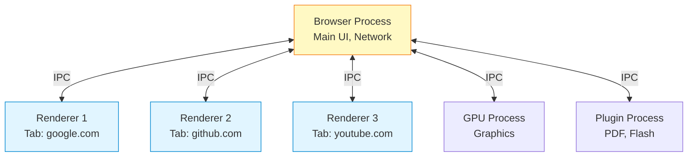
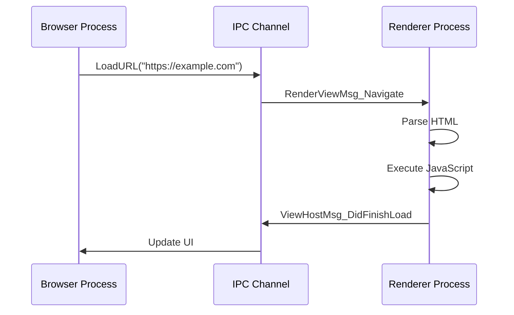
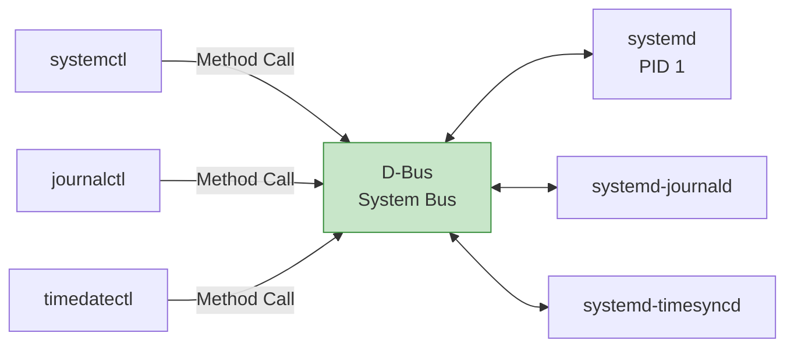
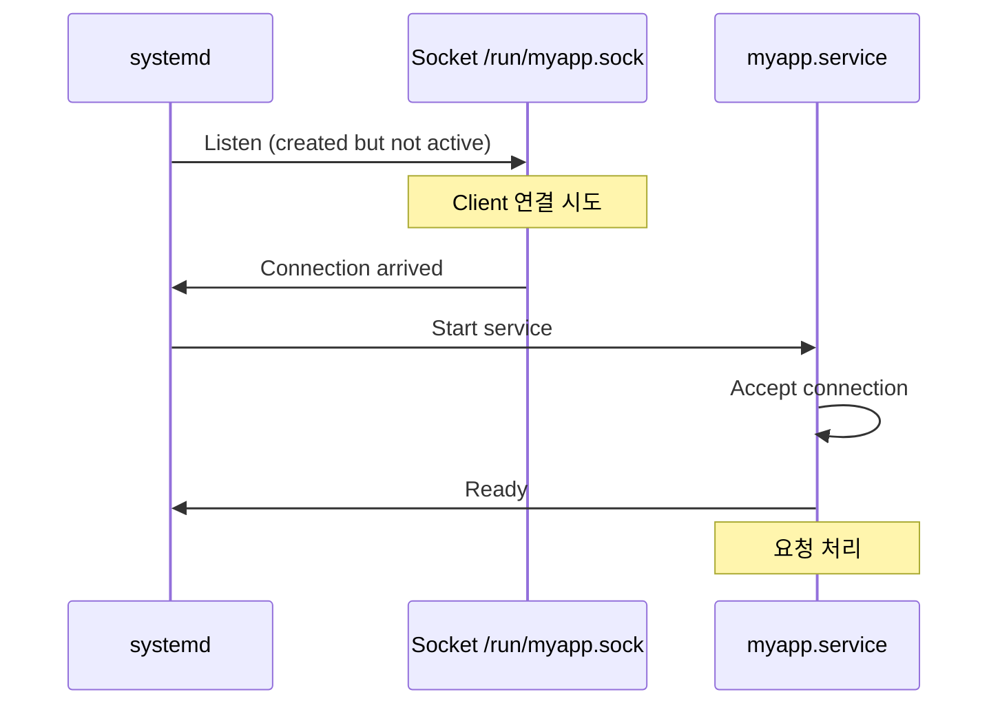
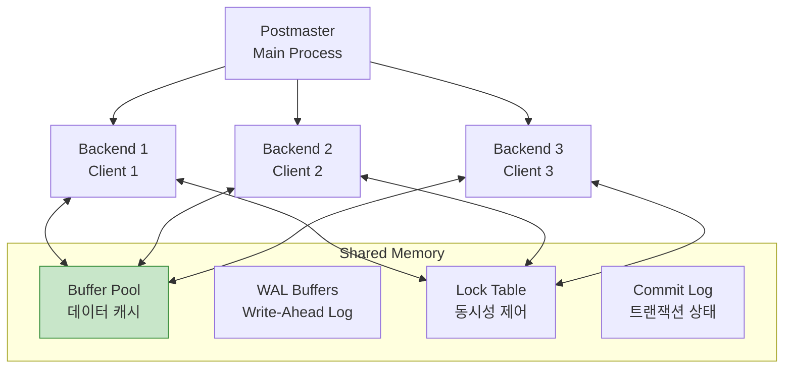
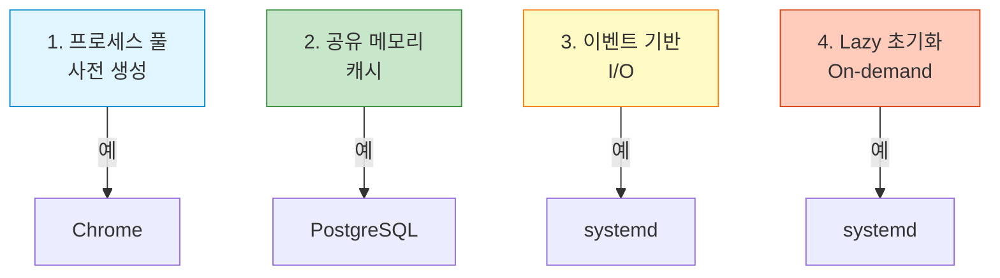

## 들어가며

이론을 넘어 **실전 시스템**을 분석합니다. Chrome, systemd, PostgreSQL이 IPC를 어떻게 활용하는지 배우고, 설계 원칙을 추출합니다.

## Case Study 1: Chrome 브라우저

### 멀티 프로세스 아키텍처



### IPC 메커니즘

Chrome은 **Named Pipe (Windows)** 또는 **Unix Socket (Linux/Mac)**을 사용합니다.

```cpp
// Chromium IPC 간략화
// base/process/launch.h

class ChildProcess {
public:
    ChildProcess() {
        // IPC 채널 생성
        CreateIPCChannel();
    }

    void CreateIPCChannel() {
#if defined(OS_POSIX)
        // Unix Domain Socket
        int fds[2];
        socketpair(AF_UNIX, SOCK_STREAM, 0, fds);
        ipc_fd_ = fds[0];
        child_fd_ = fds[1];
#elif defined(OS_WIN)
        // Named Pipe
        CreateNamedPipe(L"\\\\.\\pipe\\chrome.ipc");
#endif
    }

    void SendMessage(const IPC::Message& msg) {
        // 메시지 직렬화
        std::string serialized = SerializeMessage(msg);

        // 전송
        send(ipc_fd_, serialized.data(), serialized.size(), 0);
    }

private:
    int ipc_fd_;
    int child_fd_;
};
```

### 메시지 라우팅



### 보안 모델

```cpp
// Chrome의 Sandbox 격리
class RendererProcess {
public:
    void InitializeSandbox() {
        // 1. 권한 제한
        DropPrivileges();

        // 2. 시스템 콜 필터링 (seccomp)
        InstallSeccompFilter();

        // 3. 네트워크 접근 차단
        BlockNetworkAccess();
    }

    void RequestNetworkResource(const GURL& url) {
        // Renderer는 직접 네트워크 불가
        // Browser에게 요청
        SendIPCMessage(
            new ResourceMsg_RequestResource(url)
        );
    }
};
```

### 핵심 설계 원칙

1. **프로세스 격리**: 탭 크래시가 전체 브라우저에 영향 없음
2. **최소 권한**: Renderer는 파일/네트워크 접근 불가
3. **비동기 IPC**: UI 블로킹 방지

## Case Study 2: systemd

### D-Bus 기반 통신



### D-Bus 메시지

```bash
# systemctl status nginx를 D-Bus로 직접 호출
dbus-send --system --print-reply \
  --dest=org.freedesktop.systemd1 \
  /org/freedesktop/systemd1/unit/nginx_2eservice \
  org.freedesktop.DBus.Properties.Get \
  string:"org.freedesktop.systemd1.Unit" \
  string:"ActiveState"

# 응답:
# variant       string "active"
```

### Python에서 D-Bus 사용

```python
# systemd_control.py
import dbus

bus = dbus.SystemBus()

systemd = bus.get_object(
    'org.freedesktop.systemd1',
    '/org/freedesktop/systemd1'
)

manager = dbus.Interface(
    systemd,
    'org.freedesktop.systemd1.Manager'
)

# 서비스 시작
job = manager.StartUnit('nginx.service', 'replace')
print(f"Job: {job}")

# 서비스 상태 확인
unit = bus.get_object(
    'org.freedesktop.systemd1',
    '/org/freedesktop/systemd1/unit/nginx_2eservice'
)

properties = dbus.Interface(
    unit,
    'org.freedesktop.DBus.Properties'
)

state = properties.Get('org.freedesktop.systemd1.Unit', 'ActiveState')
print(f"State: {state}")
```

### systemd의 Socket Activation



### 구현 예제

```c
// socket_activated_service.c
#include <systemd/sd-daemon.h>

int main() {
    int n = sd_listen_fds(0);

    if (n > 1) {
        fprintf(stderr, "Too many file descriptors\n");
        return 1;
    } else if (n == 1) {
        // systemd로부터 받은 소켓
        int listen_fd = SD_LISTEN_FDS_START + 0;

        printf("Using socket from systemd (fd: %d)\n", listen_fd);

        while (1) {
            int client_fd = accept(listen_fd, NULL, NULL);
            handle_client(client_fd);
            close(client_fd);
        }
    } else {
        // 일반 모드
        int listen_fd = create_socket();
        // ...
    }

    // systemd에게 준비 완료 알림
    sd_notify(0, "READY=1");

    return 0;
}
```

### systemd unit 파일

```ini
# /etc/systemd/system/myapp.socket
[Unit]
Description=My App Socket

[Socket]
ListenStream=/run/myapp.sock
SocketMode=0660
SocketUser=www-data

[Install]
WantedBy=sockets.target
```

```ini
# /etc/systemd/system/myapp.service
[Unit]
Description=My App Service
Requires=myapp.socket

[Service]
Type=notify
ExecStart=/usr/local/bin/myapp
Restart=on-failure

[Install]
WantedBy=multi-user.target
```

### 핵심 설계 원칙

1. **On-demand 활성화**: 필요할 때만 서비스 시작
2. **선언적 의존성**: Unit 파일로 관계 정의
3. **중앙 집중 관리**: D-Bus를 통한 통합 제어

## Case Study 3: PostgreSQL

### 공유 메모리 아키텍처



### 공유 메모리 초기화

```c
// PostgreSQL 공유 메모리 (간략화)
// src/backend/storage/ipc/shmem.c

typedef struct {
    LWLock *locks;
    int num_locks;
    // ...
} ShmemHeader;

void CreateSharedMemory() {
    size_t size = CalculateSharedMemorySize();

    // System V Shared Memory 사용
    int shmid = shmget(IPC_PRIVATE, size, IPC_CREAT | 0600);
    if (shmid < 0) {
        elog(FATAL, "could not create shared memory");
    }

    void *shared_mem = shmat(shmid, NULL, 0);
    if (shared_mem == (void *) -1) {
        elog(FATAL, "could not attach shared memory");
    }

    // 공유 메모리 초기화
    InitShmemHeader(shared_mem);
    InitBufferPool(shared_mem);
    InitLockTable(shared_mem);

    // 모든 백엔드가 상속
}

size_t CalculateSharedMemorySize() {
    size_t size = 0;

    // Buffer pool (shared_buffers 설정)
    size += BufferPoolSize();  // 기본: 128MB

    // Lock table
    size += LockTableSize();

    // WAL buffers
    size += WALBuffersSize();  // 기본: 16MB

    return size;
}
```

### LWLock (Lightweight Lock)

```c
// PostgreSQL의 경량 락
typedef struct LWLock {
    uint16 tranche;
    pg_atomic_uint32 state;
    proclist_head waiters;
} LWLock;

void LWLockAcquire(LWLock *lock, LWLockMode mode) {
    if (mode == LW_EXCLUSIVE) {
        // 독점 락
        while (!pg_atomic_compare_exchange_u32(&lock->state,
                                               &unlocked,
                                               exclusively_locked)) {
            // Spin or sleep
            if (++spins > MAX_SPINS) {
                AddToWaitQueue(lock);
                PGSemaphoreLock(&MyProc->sem);
            }
        }
    } else {
        // 공유 락 (읽기)
        pg_atomic_fetch_add_u32(&lock->state, 1);
    }
}

void LWLockRelease(LWLock *lock) {
    // 대기 중인 프로세스 깨우기
    if (lock->waiters.head != NULL) {
        WakeupWaiters(lock);
    }

    pg_atomic_exchange_u32(&lock->state, unlocked);
}
```

### Buffer Pool 접근

```c
// 버퍼 풀에서 페이지 읽기
Buffer ReadBuffer(Relation rel, BlockNumber block) {
    // 1. Buffer Pool에서 검색
    BufferDesc *buf = LookupBuffer(rel, block);

    if (buf != NULL) {
        // 캐시 히트
        LWLockAcquire(&buf->content_lock, LW_SHARED);
        return buf->buf_id;
    } else {
        // 캐시 미스: 디스크에서 읽기
        buf = AllocateBuffer();

        LWLockAcquire(&buf->io_in_progress_lock, LW_EXCLUSIVE);

        // 디스크 I/O
        ReadFromDisk(buf, rel, block);

        LWLockRelease(&buf->io_in_progress_lock);
        LWLockAcquire(&buf->content_lock, LW_SHARED);

        return buf->buf_id;
    }
}
```

### 성능 특성


### 설정 튜닝

```sql
-- postgresql.conf
shared_buffers = 256MB           -- Buffer Pool 크기
max_connections = 100            -- 최대 Backend 수
work_mem = 4MB                   -- 정렬/해시용 메모리
maintenance_work_mem = 64MB      -- VACUUM 등

-- 설정 확인
SHOW shared_buffers;
SHOW max_connections;

-- Buffer 사용 통계
SELECT * FROM pg_stat_bgwriter;
```

### 핵심 설계 원칙

1. **공유 메모리**: 모든 백엔드가 버퍼 풀 공유
2. **Copy-on-Write**: fork()로 빠른 백엔드 생성
3. **LWLock**: 경량 락으로 오버헤드 최소화

## Case Study 4: Docker

### containerd IPC

```mermaid
graph TB
    DockerCLI[docker cli]
    Daemon[dockerd<br/>Docker Daemon]
    containerd[containerd]
    runc[runc<br/>Container Runtime]

    DockerCLI -->|gRPC| Daemon
    Daemon -->|gRPC| containerd
    containerd -->|exec| runc

    Socket1[/var/run/docker.sock<br/>Unix Socket]
    Socket2[/run/containerd/containerd.sock<br/>Unix Socket]

    DockerCLI -.->|via| Socket1
    Daemon -.->|via| Socket2

    style Socket1 fill:#c8e6c9,stroke:#388e3c
    style Socket2 fill:#c8e6c9,stroke:#388e3c
```

### Docker CLI 예제

```bash
# Unix Socket으로 Docker API 호출
curl --unix-socket /var/run/docker.sock \
  http://localhost/containers/json

# gRPC를 사용한 containerd API
ctr --address /run/containerd/containerd.sock \
  containers list
```

## 교훈 및 Best Practices

### 설계 원칙

| 원칙 | Chrome | systemd | PostgreSQL |
|------|--------|---------|------------|
| **격리** | ✅ 프로세스 분리 | ✅ 서비스 분리 | ⚠️ 스레드 기반 |
| **확장성** | ✅ 탭별 프로세스 | ✅ On-demand | ✅ Connection pooling |
| **성능** | ⭐⭐⭐⭐ | ⭐⭐⭐ | ⭐⭐⭐⭐⭐ |
| **복잡도** | 높음 | 중간 | 높음 |

### 공통 패턴



## 실전 적용 가이드

### 1. 시작은 간단하게

```
Phase 1: Pipe/Unix Socket
  ↓
Phase 2: Message Queue (구조화 필요 시)
  ↓
Phase 3: Shared Memory (성능 중요 시)
  ↓
Phase 4: 분산 (gRPC/ZeroMQ)
```

### 2. 측정하고 최적화

```python
# 성능 측정 예제
import time

def benchmark_ipc(method, iterations=10000):
    start = time.time()
    for _ in range(iterations):
        method()
    elapsed = time.time() - start

    print(f"{method.__name__}: {elapsed:.3f}s")
    print(f"  Latency: {elapsed/iterations*1e6:.2f} μs")
    print(f"  Throughput: {iterations/elapsed:.0f} ops/s")
```

### 3. 점진적 마이그레이션

```
단일 프로세스
  ↓ (성능 한계)
멀티 프로세스 + Unix Socket
  ↓ (확장성 한계)
멀티 서버 + gRPC
  ↓ (복잡도 증가)
마이크로서비스 + 메시지 큐
```

## 다음 단계

실전 사례를 분석했습니다! 다음 글에서는:
- **IPC Best Practices** - 종합 가이드
- 설계 원칙
- 프로덕션 체크리스트

---

**시리즈 목차**
19. **IPC 실전 예제** ← 현재 글
20. IPC Best Practices (다음 글)

> 💡 **Quick Tip**: Chrome은 보안과 안정성을 위해, PostgreSQL은 성능을 위해, systemd는 관리 편의성을 위해 IPC를 활용합니다. 프로젝트 목표에 맞는 IPC를 선택하세요!
