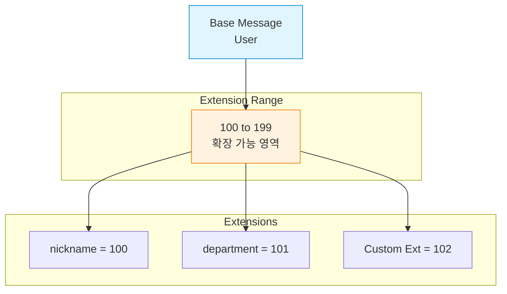
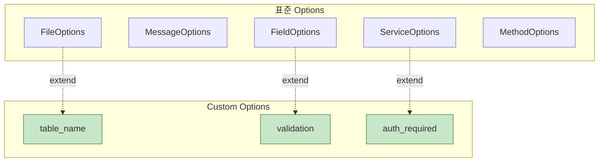
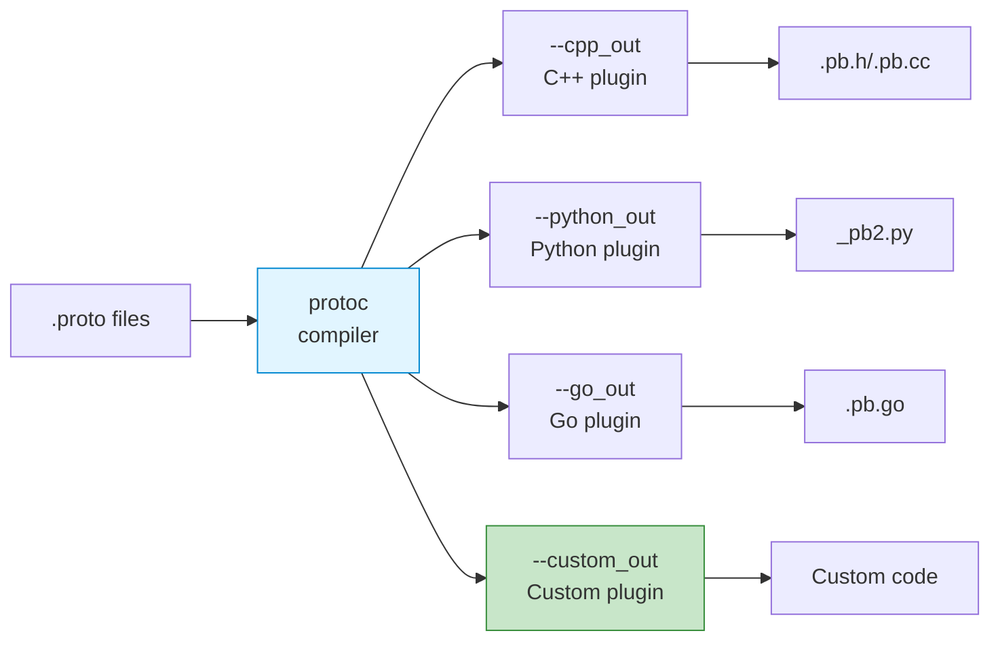
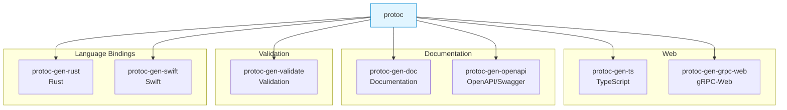

## 들어가며

**Extensions**와 **플러그인**을 사용하면 Protobuf의 기능을 확장할 수 있습니다. 커스텀 코드 생성기를 만들어 자신만의 언어나 프레임워크를 지원할 수 있습니다.

## Extension Fields (Proto2)

**Extensions**는 Proto2에서 메시지를 확장하는 메커니즘입니다. (Proto3에서는 Any 타입 사용 권장)

### Extension 정의

```protobuf
// Proto2 syntax
syntax = "proto2";

message User {
  required string name = 1;
  required int32 id = 2;

  // Extension 범위 선언
  extensions 100 to 199;
}

// 다른 파일에서 확장
extend User {
  optional string nickname = 100;
  optional string department = 101;
}
```

### Extension 계층 구조



### Extension 사용

**C++ 예제**:

```cpp
// user.proto와 user_ext.proto를 모두 include
#include "user.pb.h"
#include "user_ext.pb.h"

int main() {
    User user;
    user.set_name("Alice");
    user.set_id(123);

    // Extension 설정
    user.SetExtension(nickname, "Ali");
    user.SetExtension(department, "Engineering");

    // Extension 읽기
    if (user.HasExtension(nickname)) {
        std::cout << "Nickname: " << user.GetExtension(nickname) << std::endl;
    }

    return 0;
}
```

**Python 예제**:

```python
from user_pb2 import User
from user_ext_pb2 import nickname, department

user = User()
user.name = "Alice"
user.id = 123

# Extension 설정
user.Extensions[nickname] = "Ali"
user.Extensions[department] = "Engineering"

# Extension 읽기
if user.HasExtension(nickname):
    print(f"Nickname: {user.Extensions[nickname]}")
```

### Extension vs Any (Proto3)

| 특징 | Extension (Proto2) | Any (Proto3) |
|------|-------------------|--------------|
| **문법** | `extensions` 키워드 | `google.protobuf.Any` |
| **타입 안정성** | 강함 (컴파일 타임) | 약함 (Runtime) |
| **필드 번호** | 예약 필요 | 불필요 |
| **사용 권장** | Proto2 전용 | Proto3 권장 |

## Custom Options

Custom Options는 메타데이터를 추가하는 강력한 방법입니다.

### Custom Option 아키텍처



### Custom Option 정의

```protobuf
// options.proto
syntax = "proto3";

import "google/protobuf/descriptor.proto";

// File-level options
extend google.protobuf.FileOptions {
  string api_version = 50000;
  bool enable_logging = 50001;
}

// Message-level options
extend google.protobuf.MessageOptions {
  string table_name = 50010;
  bool cache_enabled = 50011;
  int32 cache_ttl = 50012;
}

// Field-level options
extend google.protobuf.FieldOptions {
  string validation_regex = 50020;
  int32 min_length = 50021;
  int32 max_length = 50022;
  bool required = 50023;
  bool sensitive = 50024;
}

// Service-level options
extend google.protobuf.ServiceOptions {
  bool auth_required = 50030;
  string rate_limit = 50031;
}

// Method-level options
extend google.protobuf.MethodOptions {
  bool idempotent = 50040;
  int32 timeout_ms = 50041;
  bool log_request = 50042;
}
```

### Custom Option 사용

```protobuf
// user.proto
syntax = "proto3";

import "options.proto";

option (api_version) = "v1";
option (enable_logging) = true;

message User {
  option (table_name) = "users";
  option (cache_enabled) = true;
  option (cache_ttl) = 3600;

  string email = 1 [
    (validation_regex) = "^[a-zA-Z0-9._%+-]+@[a-zA-Z0-9.-]+\\.[a-zA-Z]{2,}$",
    (required) = true
  ];

  string password = 2 [
    (min_length) = 8,
    (sensitive) = true
  ];

  string username = 3 [
    (min_length) = 3,
    (max_length) = 20,
    (validation_regex) = "^[a-zA-Z0-9_]+$"
  ];
}

service UserService {
  option (auth_required) = true;
  option (rate_limit) = "100/minute";

  rpc GetUser(GetUserRequest) returns (GetUserResponse) {
    option (idempotent) = true;
    option (timeout_ms) = 5000;
  }

  rpc CreateUser(CreateUserRequest) returns (CreateUserResponse) {
    option (log_request) = true;
    option (timeout_ms) = 10000;
  };
}
```

### Custom Option 읽기

**C++ 예제**:

```cpp
#include <google/protobuf/descriptor.h>
#include "user.pb.h"
#include "options.pb.h"

void readCustomOptions() {
    const auto* descriptor = User::descriptor();

    // Message options
    const auto& msg_options = descriptor->options();

    if (msg_options.HasExtension(table_name)) {
        std::cout << "Table: " << msg_options.GetExtension(table_name)
                  << std::endl;
    }

    if (msg_options.HasExtension(cache_enabled)) {
        bool cache = msg_options.GetExtension(cache_enabled);
        int ttl = msg_options.GetExtension(cache_ttl);
        std::cout << "Cache: " << cache << ", TTL: " << ttl << std::endl;
    }

    // Field options
    const auto* email_field = descriptor->FindFieldByName("email");
    const auto& field_options = email_field->options();

    if (field_options.HasExtension(validation_regex)) {
        std::cout << "Email regex: "
                  << field_options.GetExtension(validation_regex)
                  << std::endl;
    }

    if (field_options.HasExtension(required)) {
        std::cout << "Email required: "
                  << field_options.GetExtension(required)
                  << std::endl;
    }
}
```

**Python 예제**:

```python
from user_pb2 import User, DESCRIPTOR
import options_pb2

def read_custom_options():
    descriptor = User.DESCRIPTOR

    # Message options
    options = descriptor.GetOptions()

    if options.HasExtension(options_pb2.table_name):
        print(f"Table: {options.Extensions[options_pb2.table_name]}")

    if options.HasExtension(options_pb2.cache_enabled):
        cache = options.Extensions[options_pb2.cache_enabled]
        ttl = options.Extensions[options_pb2.cache_ttl]
        print(f"Cache: {cache}, TTL: {ttl}")

    # Field options
    email_field = descriptor.fields_by_name['email']
    field_options = email_field.GetOptions()

    if field_options.HasExtension(options_pb2.validation_regex):
        regex = field_options.Extensions[options_pb2.validation_regex]
        print(f"Email regex: {regex}")
```

## Protobuf 플러그인

### 플러그인 아키텍처



### 플러그인 프로토콜

protoc는 stdin으로 `CodeGeneratorRequest`를 전달하고, stdout으로 `CodeGeneratorResponse`를 받습니다.

```protobuf
// google/protobuf/compiler/plugin.proto

message CodeGeneratorRequest {
  repeated string file_to_generate = 1;
  string parameter = 2;
  repeated FileDescriptorProto proto_file = 15;
}

message CodeGeneratorResponse {
  optional string error = 1;

  message File {
    optional string name = 1;
    optional string insertion_point = 2;
    optional string content = 15;
  }

  repeated File file = 15;
}
```

### 커스텀 플러그인 작성 (Python)

```python
#!/usr/bin/env python3
# protoc-gen-myvalidator

import sys
from google.protobuf.compiler import plugin_pb2 as plugin
from google.protobuf.descriptor_pb2 import FieldDescriptorProto
import options_pb2

def generate_validator(request):
    response = plugin.CodeGeneratorResponse()

    for proto_file in request.proto_file:
        # 생성할 파일만 처리
        if proto_file.name not in request.file_to_generate:
            continue

        # 출력 파일 생성
        f = response.file.add()
        f.name = proto_file.name.replace('.proto', '_validator.py')

        # 코드 생성
        code = []
        code.append("# Auto-generated validator")
        code.append("import re")
        code.append("")

        for message in proto_file.message_type:
            code.append(f"def validate_{message.name}(obj):")
            code.append("    errors = []")

            for field in message.field:
                field_options = field.options

                # required 체크
                if field_options.HasExtension(options_pb2.required):
                    if field_options.Extensions[options_pb2.required]:
                        code.append(f"    if not obj.HasField('{field.name}'):")
                        code.append(f"        errors.append('{field.name} is required')")

                # min_length 체크
                if field_options.HasExtension(options_pb2.min_length):
                    min_len = field_options.Extensions[options_pb2.min_length]
                    code.append(f"    if len(obj.{field.name}) < {min_len}:")
                    code.append(f"        errors.append('{field.name} too short')")

                # max_length 체크
                if field_options.HasExtension(options_pb2.max_length):
                    max_len = field_options.Extensions[options_pb2.max_length]
                    code.append(f"    if len(obj.{field.name}) > {max_len}:")
                    code.append(f"        errors.append('{field.name} too long')")

                # regex 체크
                if field_options.HasExtension(options_pb2.validation_regex):
                    regex = field_options.Extensions[options_pb2.validation_regex]
                    code.append(f"    if not re.match(r'{regex}', obj.{field.name}):")
                    code.append(f"        errors.append('{field.name} invalid format')")

            code.append("    return errors")
            code.append("")

        f.content = "\n".join(code)

    return response

def main():
    # stdin에서 request 읽기
    data = sys.stdin.buffer.read()
    request = plugin.CodeGeneratorRequest()
    request.ParseFromString(data)

    # validator 생성
    response = generate_validator(request)

    # stdout으로 response 쓰기
    sys.stdout.buffer.write(response.SerializeToString())

if __name__ == '__main__':
    main()
```

### 플러그인 사용

```bash
# 실행 권한 부여
chmod +x protoc-gen-myvalidator

# PATH에 추가 (또는 --plugin 옵션 사용)
export PATH=$PATH:$(pwd)

# 코드 생성
protoc --myvalidator_out=. user.proto

# 생성된 파일: user_validator.py
```

**생성된 코드 사용**:

```python
from user_pb2 import User
from user_validator import validate_User

user = User()
user.email = "invalid-email"  # 유효하지 않은 이메일
user.password = "short"       # 너무 짧음

errors = validate_User(user)
for error in errors:
    print(f"Error: {error}")

# 출력:
# Error: email invalid format
# Error: password too short
```

### 커스텀 플러그인 작성 (Go)

```go
package main

import (
    "fmt"
    "io/ioutil"
    "os"
    "strings"

    "google.golang.org/protobuf/proto"
    "google.golang.org/protobuf/types/pluginpb"
    "google.golang.org/protobuf/types/descriptorpb"
)

func generateCode(request *pluginpb.CodeGeneratorRequest) *pluginpb.CodeGeneratorResponse {
    response := &pluginpb.CodeGeneratorResponse{}

    for _, file := range request.ProtoFile {
        // 생성할 파일만 처리
        shouldGenerate := false
        for _, name := range request.FileToGenerate {
            if *file.Name == name {
                shouldGenerate = true
                break
            }
        }
        if !shouldGenerate {
            continue
        }

        // 코드 생성
        var code strings.Builder
        code.WriteString("// Auto-generated code\n")
        code.WriteString(fmt.Sprintf("// Source: %s\n\n", *file.Name))
        code.WriteString("package generated\n\n")

        for _, message := range file.MessageType {
            code.WriteString(fmt.Sprintf("// %s validators\n", *message.Name))
            // ... validator 코드 생성
        }

        // 응답 파일 추가
        outputFile := strings.Replace(*file.Name, ".proto", "_generated.go", 1)
        content := code.String()
        response.File = append(response.File, &pluginpb.CodeGeneratorResponse_File{
            Name:    &outputFile,
            Content: &content,
        })
    }

    return response
}

func main() {
    // stdin에서 request 읽기
    data, err := ioutil.ReadAll(os.Stdin)
    if err != nil {
        panic(err)
    }

    request := &pluginpb.CodeGeneratorRequest{}
    if err := proto.Unmarshal(data, request); err != nil {
        panic(err)
    }

    // 코드 생성
    response := generateCode(request)

    // stdout으로 response 쓰기
    data, err = proto.Marshal(response)
    if err != nil {
        panic(err)
    }

    os.Stdout.Write(data)
}
```

## Third-party 생성기

### 인기 Third-party 플러그인



### 1. protoc-gen-validate

강력한 validation 라이브러리입니다.

```protobuf
syntax = "proto3";

import "validate/validate.proto";

message CreateUserRequest {
  string email = 1 [(validate.rules).string = {
    email: true
  }];

  string password = 2 [(validate.rules).string = {
    min_len: 8
    max_len: 128
    pattern: "^[a-zA-Z0-9!@#$%^&*]+$"
  }];

  int32 age = 3 [(validate.rules).int32 = {
    gte: 0
    lte: 150
  }];

  repeated string tags = 4 [(validate.rules).repeated = {
    min_items: 1
    max_items: 10
    unique: true
    items: {
      string: {
        min_len: 1
        max_len: 20
      }
    }
  }];
}
```

**사용**:

```bash
# 설치
go get -d github.com/envoyproxy/protoc-gen-validate

# 코드 생성
protoc \
  --go_out=. --go_opt=paths=source_relative \
  --validate_out="lang=go:." --validate_opt=paths=source_relative \
  user.proto
```

**생성된 validator 사용 (Go)**:

```go
import (
    pb "path/to/user"
)

func validateUser(req *pb.CreateUserRequest) error {
    if err := req.Validate(); err != nil {
        return fmt.Errorf("validation failed: %w", err)
    }
    return nil
}
```

### 2. protoc-gen-doc

문서를 자동 생성합니다.

```bash
# 설치
go install github.com/pseudomuto/protoc-gen-doc/cmd/protoc-gen-doc@latest

# HTML 문서 생성
protoc --doc_out=./docs --doc_opt=html,index.html *.proto

# Markdown 생성
protoc --doc_out=./docs --doc_opt=markdown,docs.md *.proto

# JSON 생성
protoc --doc_out=./docs --doc_opt=json,docs.json *.proto
```

### 3. protoc-gen-grpc-web

브라우저에서 gRPC를 사용할 수 있게 합니다.

```bash
# 설치
npm install -g protoc-gen-grpc-web

# 코드 생성
protoc -I=. user.proto \
  --js_out=import_style=commonjs:. \
  --grpc-web_out=import_style=typescript,mode=grpcwebtext:.
```

**TypeScript에서 사용**:

```typescript
import {UserServiceClient} from './user_grpc_web_pb';
import {GetUserRequest} from './user_pb';

const client = new UserServiceClient('http://localhost:8080');

const request = new GetUserRequest();
request.setUserId('123');

client.getUser(request, {}, (err, response) => {
  if (err) {
    console.error(err);
  } else {
    console.log(response.getName());
  }
});
```

### 4. protoc-gen-openapi

OpenAPI/Swagger 스펙을 생성합니다.

```bash
# 설치
go install github.com/google/gnostic/cmd/protoc-gen-openapi@latest

# OpenAPI 생성
protoc --openapi_out=. user.proto
```

## 플러그인 개발 Best Practices

| 원칙 | 설명 |
|------|------|
| **단일 책임** | 하나의 플러그인은 하나의 기능만 |
| **명확한 옵션** | 플러그인 옵션을 문서화 |
| **에러 처리** | 명확한 에러 메시지 제공 |
| **테스트** | 다양한 .proto 파일로 테스트 |
| **성능** | 대용량 .proto 파일 처리 고려 |

## 실전 예제: ORM 생성기

```python
#!/usr/bin/env python3
# protoc-gen-orm

def generate_orm(request):
    response = plugin.CodeGeneratorResponse()

    for proto_file in request.proto_file:
        if proto_file.name not in request.file_to_generate:
            continue

        f = response.file.add()
        f.name = proto_file.name.replace('.proto', '_orm.py')

        code = []
        code.append("from sqlalchemy import Column, Integer, String, Table")
        code.append("from sqlalchemy.ext.declarative import declarative_base")
        code.append("")
        code.append("Base = declarative_base()")
        code.append("")

        for message in proto_file.message_type:
            # Custom option에서 테이블 이름 읽기
            options = message.options
            table_name = message.name.lower() + "s"
            if options.HasExtension(options_pb2.table_name):
                table_name = options.Extensions[options_pb2.table_name]

            code.append(f"class {message.name}(Base):")
            code.append(f"    __tablename__ = '{table_name}'")
            code.append("")

            for field in message.field:
                field_type = get_sqlalchemy_type(field)
                constraints = get_constraints(field)

                code.append(f"    {field.name} = Column({field_type}{constraints})")

            code.append("")

        f.content = "\n".join(code)

    return response
```

## 다음 단계

Extensions와 플러그인을 마스터했습니다! 다음 글에서는:
- **JSON 변환**
- Proto3 JSON 매핑
- Canonical encoding

---

**시리즈 목차**
1. Protocol Buffers란 무엇인가
2. Protocol Buffers 고급 스키마 설계
3. gRPC와 Protobuf - 고성능 RPC
4. Protobuf 실전 활용 - 마이크로서비스
5. Protobuf 성능 최적화 및 Best Practices
6. Proto3 고급 기능
7. 서비스와 RPC 정의
8. Reflection과 동적 메시지
9. **Extensions와 플러그인** ← 현재 글
10. JSON 변환 (다음 글)

> 💡 **Quick Tip**: 플러그인을 만들 때는 protoc-gen-* 네이밍 규칙을 따르세요. protoc가 PATH에서 자동으로 찾을 수 있습니다!
