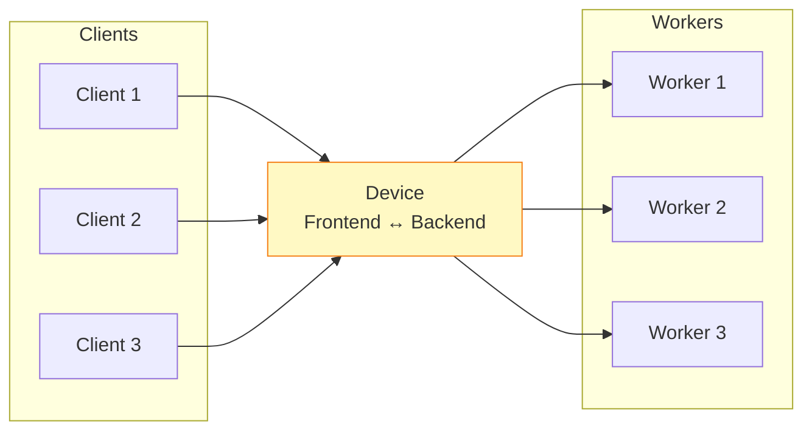
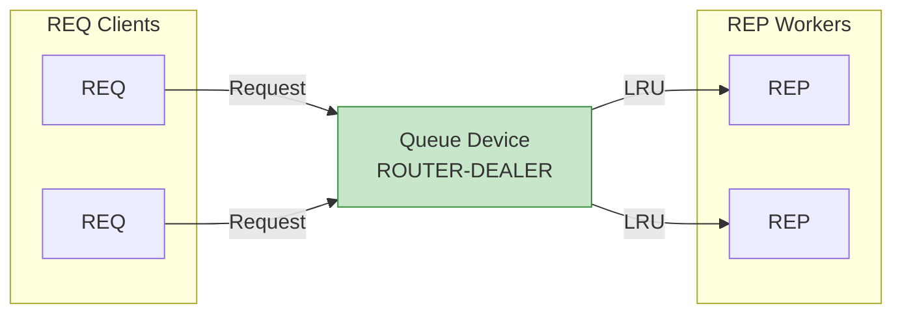
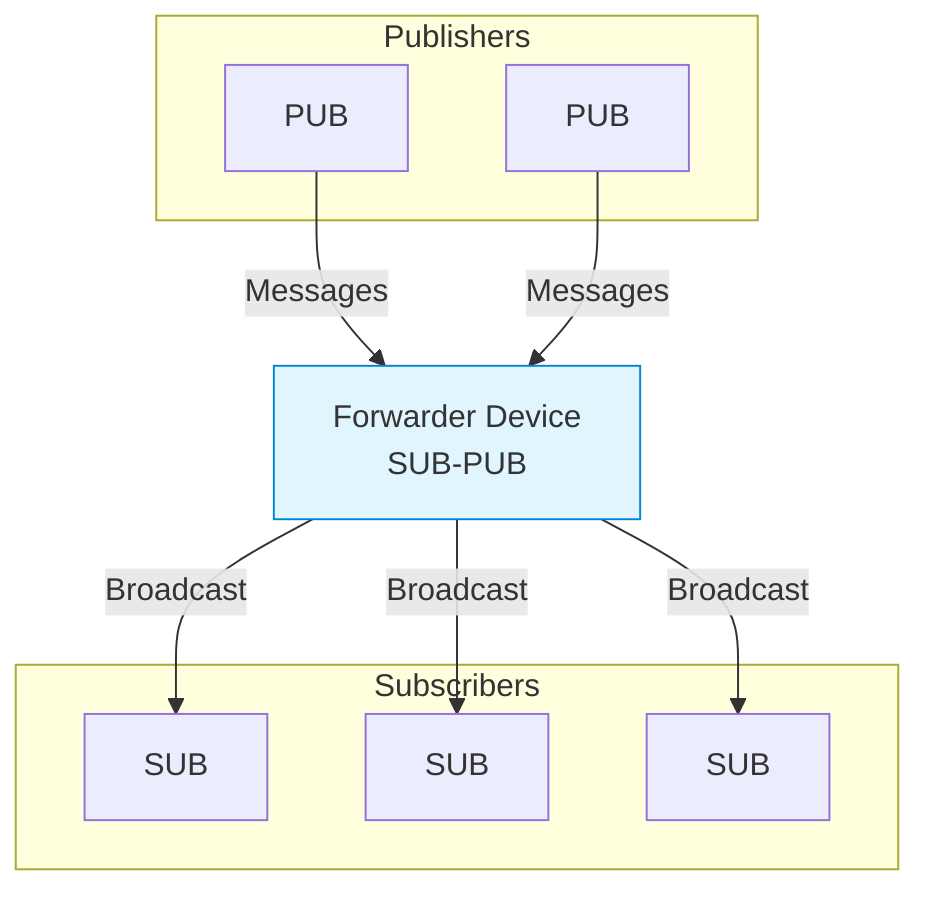
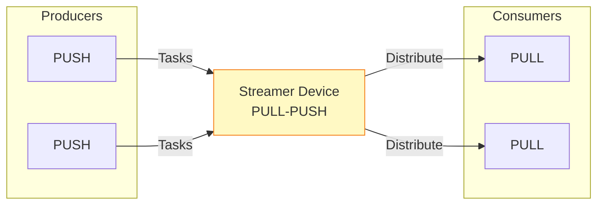
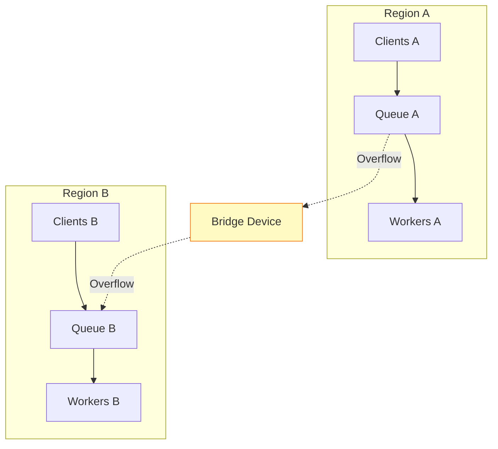

## 들어가며

**Device**는 두 소켓을 연결하는 **중개자(Intermediary)**입니다. ZeroMQ는 3가지 표준 Device를 제공하며, 이를 통해 복잡한 메시징 토폴로지를 쉽게 구축할 수 있습니다.

## Device란?

### 개념

Device는 **두 소켓 간의 프록시**로, 메시지를 양방향으로 전달합니다.



### 핵심 기능

- **메시지 전달**: Frontend ↔ Backend
- **토폴로지 분리**: Client와 Worker 독립적 확장
- **부하 분산**: 자동 로드 밸런싱
- **단일 장애점**: Device가 죽으면 전체 중단

## 3가지 표준 Device

### 1. Queue Device (ROUTER-DEALER)



**용도**: Request-Reply 패턴의 로드 밸런싱

```c
// queue_device.c
#include <zmq.h>
#include <stdio.h>

int main() {
    void *context = zmq_ctx_new();

    // Frontend: ROUTER (for REQ clients)
    void *frontend = zmq_socket(context, ZMQ_ROUTER);
    zmq_bind(frontend, "tcp://*:5555");

    // Backend: DEALER (for REP workers)
    void *backend = zmq_socket(context, ZMQ_DEALER);
    zmq_bind(backend, "tcp://*:5556");

    printf("Queue Device 시작\n");
    printf("  Frontend (clients): tcp://*:5555\n");
    printf("  Backend (workers):  tcp://*:5556\n");

    // Proxy 시작 (blocking)
    zmq_proxy(frontend, backend, NULL);

    zmq_close(frontend);
    zmq_close(backend);
    zmq_ctx_destroy(context);
    return 0;
}
```

```python
# queue_device.py
import zmq

context = zmq.Context()

frontend = context.socket(zmq.ROUTER)
frontend.bind("tcp://*:5555")

backend = context.socket(zmq.DEALER)
backend.bind("tcp://*:5556")

print("Queue Device 시작")

# Simple proxy
zmq.proxy(frontend, backend)

# 또는 zmq.device() (deprecated but still works)
# zmq.device(zmq.QUEUE, frontend, backend)
```

### 2. Forwarder Device (SUB-PUB)



**용도**: 여러 Publisher의 메시지를 수집하여 재배포

```c
// forwarder_device.c
#include <zmq.h>
#include <stdio.h>

int main() {
    void *context = zmq_ctx_new();

    // Frontend: SUB (subscribe from publishers)
    void *frontend = zmq_socket(context, ZMQ_SUB);
    zmq_bind(frontend, "tcp://*:5555");

    // Subscribe to all messages
    zmq_setsockopt(frontend, ZMQ_SUBSCRIBE, "", 0);

    // Backend: PUB (publish to subscribers)
    void *backend = zmq_socket(context, ZMQ_PUB);
    zmq_bind(backend, "tcp://*:5556");

    printf("Forwarder Device 시작\n");
    printf("  Frontend (publishers):  tcp://*:5555\n");
    printf("  Backend (subscribers): tcp://*:5556\n");

    // Proxy
    zmq_proxy(frontend, backend, NULL);

    zmq_close(frontend);
    zmq_close(backend);
    zmq_ctx_destroy(context);
    return 0;
}
```

```python
# forwarder_device.py
import zmq

context = zmq.Context()

frontend = context.socket(zmq.SUB)
frontend.bind("tcp://*:5555")
frontend.subscribe(b"")  # 모든 메시지 구독

backend = context.socket(zmq.PUB)
backend.bind("tcp://*:5556")

print("Forwarder Device 시작")

zmq.proxy(frontend, backend)
```

### 3. Streamer Device (PULL-PUSH)



**용도**: Pipeline 패턴의 병렬 처리

```c
// streamer_device.c
#include <zmq.h>
#include <stdio.h>

int main() {
    void *context = zmq_ctx_new();

    // Frontend: PULL (from producers)
    void *frontend = zmq_socket(context, ZMQ_PULL);
    zmq_bind(frontend, "tcp://*:5555");

    // Backend: PUSH (to consumers)
    void *backend = zmq_socket(context, ZMQ_PUSH);
    zmq_bind(backend, "tcp://*:5556");

    printf("Streamer Device 시작\n");
    printf("  Frontend (producers): tcp://*:5555\n");
    printf("  Backend (consumers):  tcp://*:5556\n");

    // Proxy
    zmq_proxy(frontend, backend, NULL);

    zmq_close(frontend);
    zmq_close(backend);
    zmq_ctx_destroy(context);
    return 0;
}
```

```python
# streamer_device.py
import zmq

context = zmq.Context()

frontend = context.socket(zmq.PULL)
frontend.bind("tcp://*:5555")

backend = context.socket(zmq.PUSH)
backend.bind("tcp://*:5556")

print("Streamer Device 시작")

zmq.proxy(frontend, backend)
```

## Device 비교

| Device | Frontend | Backend | 용도 |
|--------|----------|---------|------|
| **Queue** | ROUTER | DEALER | REQ-REP 로드 밸런싱 |
| **Forwarder** | SUB | PUB | PUB-SUB 메시지 수집/재배포 |
| **Streamer** | PULL | PUSH | Pipeline 작업 분산 |

## 고급 Proxy 패턴

### Capture Socket (3번째 소켓)

모든 메시지를 **모니터링**할 수 있습니다.

```c
// proxy_with_capture.c
#include <zmq.h>
#include <stdio.h>

int main() {
    void *context = zmq_ctx_new();

    void *frontend = zmq_socket(context, ZMQ_ROUTER);
    zmq_bind(frontend, "tcp://*:5555");

    void *backend = zmq_socket(context, ZMQ_DEALER);
    zmq_bind(backend, "tcp://*:5556");

    // Capture socket (PUB)
    void *capture = zmq_socket(context, ZMQ_PUB);
    zmq_bind(capture, "tcp://*:5557");

    printf("Proxy with Capture 시작\n");
    printf("  Frontend: tcp://*:5555\n");
    printf("  Backend:  tcp://*:5556\n");
    printf("  Capture:  tcp://*:5557\n");

    // Proxy with capture
    zmq_proxy(frontend, backend, capture);

    return 0;
}
```

```python
# proxy_with_capture.py
import zmq
import threading

def monitor_thread(capture_address):
    """Capture 메시지 모니터링"""
    context = zmq.Context()
    monitor = context.socket(zmq.SUB)
    monitor.connect(capture_address)
    monitor.subscribe(b"")

    print("Monitor 시작...")

    while True:
        message = monitor.recv_multipart()
        print(f"📊 Captured: {message}")

# Main
context = zmq.Context()

frontend = context.socket(zmq.ROUTER)
frontend.bind("tcp://*:5555")

backend = context.socket(zmq.DEALER)
backend.bind("tcp://*:5556")

capture = context.socket(zmq.PUB)
capture.bind("tcp://*:5557")

# Monitor 스레드 시작
threading.Thread(
    target=monitor_thread,
    args=("tcp://localhost:5557",),
    daemon=True
).start()

print("Proxy 시작")
zmq.proxy(frontend, backend, capture)
```

### 커스텀 Device

**zmq_proxy()**를 사용하지 않고 직접 구현:

```python
# custom_device.py
import zmq
import time

class CustomDevice:
    """커스텀 Device with 통계"""

    def __init__(self):
        self.context = zmq.Context()

        self.frontend = self.context.socket(zmq.ROUTER)
        self.frontend.bind("tcp://*:5555")

        self.backend = self.context.socket(zmq.DEALER)
        self.backend.bind("tcp://*:5556")

        # 통계
        self.message_count = 0
        self.start_time = time.time()

    def run(self):
        """메인 루프"""
        poller = zmq.Poller()
        poller.register(self.frontend, zmq.POLLIN)
        poller.register(self.backend, zmq.POLLIN)

        print("Custom Device 시작")

        while True:
            socks = dict(poller.poll())

            # Frontend → Backend
            if self.frontend in socks:
                frames = self.frontend.recv_multipart()
                self.backend.send_multipart(frames)

                self.message_count += 1
                self._log_message("Frontend → Backend", frames)

            # Backend → Frontend
            if self.backend in socks:
                frames = self.backend.recv_multipart()
                self.frontend.send_multipart(frames)

                self.message_count += 1
                self._log_message("Backend → Frontend", frames)

    def _log_message(self, direction, frames):
        """메시지 로깅"""
        elapsed = time.time() - self.start_time
        rate = self.message_count / elapsed if elapsed > 0 else 0

        print(f"[{direction}] "
              f"Messages: {self.message_count}, "
              f"Rate: {rate:.1f} msg/s, "
              f"Frames: {len(frames)}")

if __name__ == "__main__":
    device = CustomDevice()
    device.run()
```

### 메시지 변환 Device

```python
# transforming_device.py
import zmq
import json

class TransformingDevice:
    """메시지 형식 변환 Device"""

    def __init__(self):
        self.context = zmq.Context()

        # JSON Frontend
        self.frontend = self.context.socket(zmq.ROUTER)
        self.frontend.bind("tcp://*:5555")

        # Binary Backend
        self.backend = self.context.socket(zmq.DEALER)
        self.backend.bind("tcp://*:5556")

    def run(self):
        poller = zmq.Poller()
        poller.register(self.frontend, zmq.POLLIN)
        poller.register(self.backend, zmq.POLLIN)

        print("Transforming Device 시작")

        while True:
            socks = dict(poller.poll())

            if self.frontend in socks:
                frames = self.frontend.recv_multipart()
                # JSON → Binary
                transformed = self._json_to_binary(frames)
                self.backend.send_multipart(transformed)

            if self.backend in socks:
                frames = self.backend.recv_multipart()
                # Binary → JSON
                transformed = self._binary_to_json(frames)
                self.frontend.send_multipart(transformed)

    def _json_to_binary(self, frames):
        """JSON을 Binary로 변환"""
        result = []
        for frame in frames:
            if frame:
                try:
                    data = json.loads(frame)
                    # Binary 인코딩 (예: MessagePack)
                    binary = str(data).encode()
                    result.append(binary)
                except:
                    result.append(frame)
            else:
                result.append(frame)
        return result

    def _binary_to_json(self, frames):
        """Binary를 JSON으로 변환"""
        result = []
        for frame in frames:
            if frame:
                try:
                    # Binary 디코딩
                    data = eval(frame.decode())
                    json_data = json.dumps(data).encode()
                    result.append(json_data)
                except:
                    result.append(frame)
            else:
                result.append(frame)
        return result

if __name__ == "__main__":
    device = TransformingDevice()
    device.run()
```

### 필터링 Device

```python
# filtering_device.py
import zmq
import re

class FilteringDevice:
    """메시지 필터링 Device"""

    def __init__(self, pattern):
        self.context = zmq.Context()
        self.pattern = re.compile(pattern)

        self.frontend = self.context.socket(zmq.ROUTER)
        self.frontend.bind("tcp://*:5555")

        self.backend = self.context.socket(zmq.DEALER)
        self.backend.bind("tcp://*:5556")

        self.filtered_count = 0

    def run(self):
        poller = zmq.Poller()
        poller.register(self.frontend, zmq.POLLIN)
        poller.register(self.backend, zmq.POLLIN)

        print(f"Filtering Device 시작 (pattern: {self.pattern.pattern})")

        while True:
            socks = dict(poller.poll())

            if self.frontend in socks:
                frames = self.frontend.recv_multipart()

                # 필터링
                if self._should_forward(frames):
                    self.backend.send_multipart(frames)
                else:
                    self.filtered_count += 1
                    print(f"⚠️ Filtered message (total: {self.filtered_count})")

            if self.backend in socks:
                frames = self.backend.recv_multipart()
                self.frontend.send_multipart(frames)

    def _should_forward(self, frames):
        """메시지를 전달할지 결정"""
        for frame in frames:
            if self.pattern.search(frame.decode('utf-8', errors='ignore')):
                return True
        return False

if __name__ == "__main__":
    # "urgent" 키워드가 있는 메시지만 전달
    device = FilteringDevice(r'urgent')
    device.run()
```

## 실전 활용

### 1. 지리적 분산



### 2. 로깅 Hub

```python
# logging_hub.py
import zmq

context = zmq.Context()

# Forwarder for logs
frontend = context.socket(zmq.SUB)
frontend.bind("tcp://*:5555")
frontend.subscribe(b"")

backend = context.socket(zmq.PUB)
backend.bind("tcp://*:5556")

# Capture to file
capture = context.socket(zmq.PUB)
capture.bind("ipc:///tmp/logs.ipc")

print("Logging Hub 시작")
zmq.proxy(frontend, backend, capture)
```

### 3. Rate Limiting Device

```python
# rate_limiter.py
import zmq
import time
from collections import deque

class RateLimiter:
    """Rate limiting device"""

    def __init__(self, max_rate=100):
        self.max_rate = max_rate  # msg/s
        self.window = deque(maxlen=max_rate)

        self.context = zmq.Context()
        self.frontend = self.context.socket(zmq.ROUTER)
        self.frontend.bind("tcp://*:5555")

        self.backend = self.context.socket(zmq.DEALER)
        self.backend.bind("tcp://*:5556")

    def run(self):
        poller = zmq.Poller()
        poller.register(self.frontend, zmq.POLLIN)
        poller.register(self.backend, zmq.POLLIN)

        print(f"Rate Limiter 시작 (max: {self.max_rate} msg/s)")

        while True:
            socks = dict(poller.poll(100))

            now = time.time()

            if self.frontend in socks:
                frames = self.frontend.recv_multipart()

                # Rate check
                if self._can_send(now):
                    self.backend.send_multipart(frames)
                    self.window.append(now)
                else:
                    print("⚠️ Rate limit exceeded, dropping message")

            if self.backend in socks:
                frames = self.backend.recv_multipart()
                self.frontend.send_multipart(frames)

    def _can_send(self, now):
        """Rate limit 체크"""
        # 1초 이내 메시지만 카운트
        while self.window and now - self.window[0] > 1.0:
            self.window.popleft()

        return len(self.window) < self.max_rate

if __name__ == "__main__":
    limiter = RateLimiter(max_rate=100)
    limiter.run()
```

## 다음 단계

Device 패턴을 마스터했습니다! 다음 글에서는:
- **프로토콜 설계** - 커스텀 프로토콜
- 프레이밍과 헤더
- 버저닝과 호환성

---

**시리즈 목차**
1-13. (이전 글들)
14. **Device 패턴 - Queue, Forwarder, Streamer** ← 현재 글
15. 프로토콜 설계 (다음 글)

> 💡 **Quick Tip**: Device는 단일 장애점입니다. 프로덕션에서는 Binary Star 패턴으로 HA 구성하세요!
