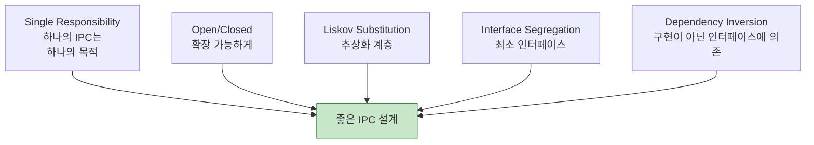
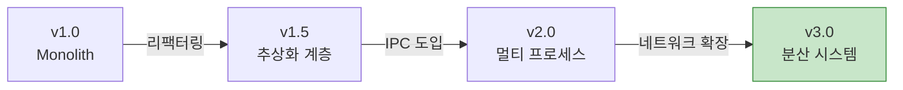
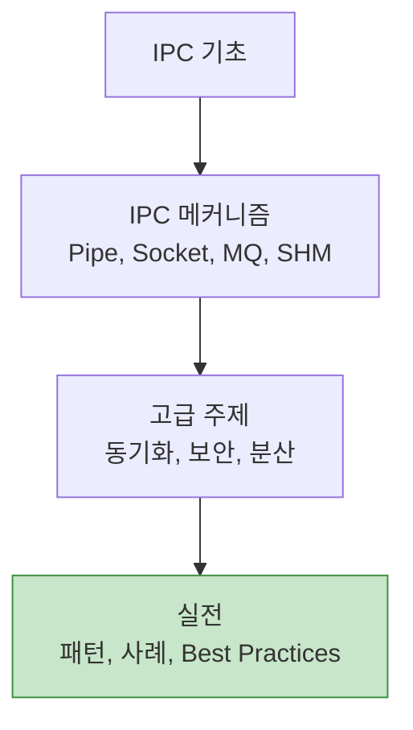

## 들어가며

IPC 시리즈의 **마지막 글**입니다. 지금까지 배운 모든 내용을 **실전 가이드**로 정리합니다.

## 설계 원칙

### SOLID 원칙 적용



### 1. 추상화 계층 (Liskov Substitution)

```c
// ipc_interface.h
typedef struct ipc_ops {
    int (*connect)(const char *address);
    int (*send)(int fd, const void *data, size_t len);
    int (*recv)(int fd, void *data, size_t len);
    void (*close)(int fd);
} ipc_ops_t;

// Unix Socket 구현
ipc_ops_t unix_socket_ops = {
    .connect = unix_connect,
    .send = unix_send,
    .recv = unix_recv,
    .close = unix_close
};

// TCP Socket 구현
ipc_ops_t tcp_socket_ops = {
    .connect = tcp_connect,
    .send = tcp_send,
    .recv = tcp_recv,
    .close = tcp_close
};

// 사용자 코드는 구현 독립적
void send_message(ipc_ops_t *ops, const char *addr, const char *msg) {
    int fd = ops->connect(addr);
    ops->send(fd, msg, strlen(msg));
    ops->close(fd);
}
```

### 2. 최소 권한 원칙

```c
// ❌ 나쁜 예: 모든 권한
int fd = shm_open("/data", O_CREAT | O_RDWR, 0666);  // 위험!

// ✅ 좋은 예: 최소 권한
int fd = shm_open("/data", O_CREAT | O_RDWR, 0600);  // Owner만

// ✅ 더 좋은 예: 읽기 전용이면 읽기 전용으로
int fd = shm_open("/data", O_RDONLY, 0);
```

### 3. Fail-Fast 원칙

```c
// ✅ 모든 시스템 콜 체크
int fd = shm_open("/data", O_CREAT | O_RDWR, 0600);
if (fd == -1) {
    perror("shm_open");
    return -1;  // 즉시 실패
}

void *ptr = mmap(NULL, size, PROT_READ | PROT_WRITE, MAP_SHARED, fd, 0);
if (ptr == MAP_FAILED) {
    perror("mmap");
    close(fd);
    shm_unlink("/data");
    return -1;
}

// ❌ 에러 무시 금지
mmap(...);  // 반환값 체크 안 함 - 나중에 Segfault!
```

## 에러 처리

### 재시도 전략

```c
// retry_policy.h
typedef struct {
    int max_retries;
    int base_delay_ms;
    int max_delay_ms;
    bool exponential_backoff;
} retry_policy_t;

int ipc_send_with_retry(int fd, const void *data, size_t len,
                        retry_policy_t *policy) {
    int delay = policy->base_delay_ms;

    for (int attempt = 0; attempt < policy->max_retries; attempt++) {
        ssize_t sent = send(fd, data, len, 0);

        if (sent == len) {
            return 0;  // 성공
        }

        if (errno == EINTR) {
            // 시그널로 중단됨, 즉시 재시도
            continue;
        }

        if (errno == EAGAIN || errno == EWOULDBLOCK) {
            // 버퍼 가득 찼음, 재시도
            usleep(delay * 1000);

            if (policy->exponential_backoff) {
                delay = (delay * 2 > policy->max_delay_ms) ?
                        policy->max_delay_ms : delay * 2;
            }
            continue;
        }

        // 복구 불가능한 에러
        return -1;
    }

    return -1;  // 재시도 횟수 초과
}
```

### 타임아웃

```c
// 모든 블로킹 작업에 타임아웃 설정
struct timeval timeout;
timeout.tv_sec = 5;
timeout.tv_usec = 0;

setsockopt(fd, SOL_SOCKET, SO_RCVTIMEO, &timeout, sizeof(timeout));
setsockopt(fd, SOL_SOCKET, SO_SNDTIMEO, &timeout, sizeof(timeout));

// 또는 poll/epoll 사용
struct pollfd pfd = {.fd = fd, .events = POLLIN};
int ret = poll(&pfd, 1, 5000);  // 5초 타임아웃

if (ret == 0) {
    // 타임아웃
    handle_timeout();
} else if (ret > 0) {
    // 데이터 있음
    read(fd, buffer, size);
}
```

## 성능 최적화

### 1. 버퍼 크기 튜닝

```c
// 작은 버퍼: 많은 시스템 콜
char buffer[64];
while ((n = read(fd, buffer, sizeof(buffer))) > 0) {
    process(buffer, n);
}

// 큰 버퍼: 적은 시스템 콜
char buffer[64 * 1024];  // 64KB
while ((n = read(fd, buffer, sizeof(buffer))) > 0) {
    process(buffer, n);
}

// 소켓 버퍼 크기 조정
int sndbuf = 256 * 1024;  // 256KB
setsockopt(fd, SOL_SOCKET, SO_SNDBUF, &sndbuf, sizeof(sndbuf));
```

### 2. Batching

```c
// ❌ 하나씩 전송 (느림)
for (int i = 0; i < 1000; i++) {
    send_message(msg[i]);
}

// ✅ 일괄 전송 (빠름)
struct iovec iov[1000];
for (int i = 0; i < 1000; i++) {
    iov[i].iov_base = msg[i];
    iov[i].iov_len = msg_len[i];
}
writev(fd, iov, 1000);  // 한 번에 전송
```

### 3. Zero-Copy

```c
// ❌ 복사 발생
char buffer[1024];
read(fd1, buffer, sizeof(buffer));
write(fd2, buffer, sizeof(buffer));

// ✅ Zero-copy (Linux)
sendfile(fd2, fd1, NULL, size);

// ✅ splice (Pipe 간)
splice(fd1, NULL, fd2, NULL, size, SPLICE_F_MOVE);
```

### 4. 프로파일링

```c
// 성능 측정 매크로
#define PROFILE_START() \
    struct timespec _start, _end; \
    clock_gettime(CLOCK_MONOTONIC, &_start);

#define PROFILE_END(name) \
    clock_gettime(CLOCK_MONOTONIC, &_end); \
    double _elapsed = (_end.tv_sec - _start.tv_sec) + \
                      (_end.tv_nsec - _start.tv_nsec) / 1e9; \
    printf("%s: %.6f seconds\n", name, _elapsed);

// 사용
PROFILE_START();
send_large_data(fd, data, size);
PROFILE_END("send_large_data");
```

## 자원 관리

### RAII 패턴 (C++)

```cpp
// ipc_guard.hpp
class IPCGuard {
public:
    IPCGuard(const char *name) : name_(name) {
        fd_ = shm_open(name, O_CREAT | O_RDWR, 0600);
        if (fd_ == -1) {
            throw std::runtime_error("shm_open failed");
        }
    }

    ~IPCGuard() {
        if (fd_ != -1) {
            close(fd_);
            shm_unlink(name_.c_str());
        }
    }

    // 복사 금지
    IPCGuard(const IPCGuard&) = delete;
    IPCGuard& operator=(const IPCGuard&) = delete;

    int fd() const { return fd_; }

private:
    std::string name_;
    int fd_;
};

// 사용: 스코프 벗어나면 자동 정리
{
    IPCGuard shm("/myshm");
    use_shared_memory(shm.fd());
}  // 자동으로 close(), shm_unlink()
```

### 명시적 정리 (C)

```c
typedef struct {
    int fd;
    void *ptr;
    size_t size;
    char name[256];
    bool valid;
} shm_resource_t;

shm_resource_t* shm_create(const char *name, size_t size) {
    shm_resource_t *res = malloc(sizeof(shm_resource_t));
    if (!res) return NULL;

    res->fd = shm_open(name, O_CREAT | O_RDWR, 0600);
    if (res->fd == -1) {
        free(res);
        return NULL;
    }

    ftruncate(res->fd, size);

    res->ptr = mmap(NULL, size, PROT_READ | PROT_WRITE,
                    MAP_SHARED, res->fd, 0);
    if (res->ptr == MAP_FAILED) {
        close(res->fd);
        shm_unlink(name);
        free(res);
        return NULL;
    }

    strncpy(res->name, name, sizeof(res->name) - 1);
    res->size = size;
    res->valid = true;

    return res;
}

void shm_destroy(shm_resource_t *res) {
    if (!res || !res->valid) return;

    munmap(res->ptr, res->size);
    close(res->fd);
    shm_unlink(res->name);
    res->valid = false;
    free(res);
}
```

## 보안 체크리스트

### 개발 단계

```
✅ 권한
  [ ] IPC 객체는 0600 (owner만)
  [ ] 그룹 공유 필요 시 0660
  [ ] 절대 0666 사용 금지

✅ 검증
  [ ] SCM_CREDENTIALS로 클라이언트 확인
  [ ] UID/GID 화이트리스트
  [ ] 입력 데이터 길이 검증

✅ 격리
  [ ] 네임스페이스 사용 (가능하면)
  [ ] SELinux/AppArmor 정책
  [ ] 최소 권한 원칙

✅ 암호화
  [ ] 민감 데이터는 암호화
  [ ] TLS (네트워크 IPC)
  [ ] 사용 후 메모리 제로화
```

## 프로덕션 체크리스트

### 배포 전

```
✅ 테스트
  [ ] Unit 테스트 (각 IPC 메커니즘)
  [ ] Integration 테스트 (전체 시스템)
  [ ] Stress 테스트 (부하)
  [ ] Chaos 테스트 (장애 주입)

✅ 모니터링
  [ ] 메트릭 수집 (Prometheus)
  [ ] 로깅 (구조화된 로그)
  [ ] 분산 추적 (Jaeger/Zipkin)
  [ ] 알람 설정

✅ 문서화
  [ ] API 문서
  [ ] 아키텍처 다이어그램
  [ ] 장애 복구 절차
  [ ] 성능 튜닝 가이드

✅ 복구
  [ ] 자동 재시작 (systemd)
  [ ] Health check
  [ ] Circuit breaker
  [ ] Rate limiting
```

### 운영 중

```
✅ 관찰
  [ ] 레이턴시 P50/P95/P99
  [ ] 에러율
  [ ] 자원 사용률 (메모리, CPU, FD)
  [ ] 큐 길이

✅ 유지보수
  [ ] IPC 자원 누수 체크
  [ ] 로그 로테이션
  [ ] 성능 프로파일링
  [ ] 보안 업데이트
```

## 디자인 패턴 카탈로그

### 1. Request-Reply

```
사용 시기: 동기 RPC 스타일
추천 IPC: Unix Socket, gRPC
예제: 데이터베이스 쿼리, API 호출
```

### 2. Publish-Subscribe

```
사용 시기: 이벤트 브로드캐스트
추천 IPC: ZeroMQ, Redis Pub/Sub
예제: 로그 수집, 이벤트 알림
```

### 3. Pipeline

```
사용 시기: 데이터 스트림 처리
추천 IPC: Pipe, Unix Socket
예제: 데이터 ETL, 이미지 처리
```

### 4. Work Queue

```
사용 시기: 작업 분산
추천 IPC: Message Queue, Redis
예제: 백그라운드 작업, 배치 처리
```

## 마이그레이션 가이드

### 단계별 전환



### 체크포인트

```
Phase 1 → 2:
  [ ] 모든 I/O를 추상화 계층으로 래핑
  [ ] 테스트 커버리지 80% 이상
  [ ] 벤치마크 기준선 설정

Phase 2 → 3:
  [ ] IPC 메커니즘 선택 (Unix Socket 권장)
  [ ] 프로토콜 정의 (Protobuf/JSON)
  [ ] 카나리 배포

Phase 3 → 4:
  [ ] 네트워크 레이턴시 측정
  [ ] 재시도/타임아웃 정책
  [ ] 서킷 브레이커 구현
```

## 핵심 교훈

### 10가지 황금률

```
1. 측정 후 최적화
   - 추측하지 말고 프로파일링

2. 간단하게 시작
   - Pipe → Unix Socket → gRPC

3. 항상 에러 체크
   - 모든 시스템 콜 반환값 검증

4. 자원은 반드시 정리
   - RAII 패턴 또는 명시적 cleanup

5. 최소 권한
   - 필요한 권한만 부여

6. 재시도 정책
   - Exponential backoff

7. 타임아웃 설정
   - 모든 블로킹 작업에

8. 구조화된 로깅
   - JSON 포맷, 타임스탬프

9. 추상화 계층
   - 구현 교체 가능하게

10. 문서화
    - 코드는 거짓말하지 않음
```

## 도구 모음

### 개발

```bash
# 컴파일 플래그
gcc -Wall -Wextra -Werror -g -O2 \
    -fsanitize=address -fsanitize=undefined

# 정적 분석
cppcheck --enable=all src/
clang-tidy src/*.c

# 포맷팅
clang-format -i src/*.c
```

### 테스트

```bash
# Unit 테스트
make test

# 메모리 누수
valgrind --leak-check=full ./program

# Race condition
valgrind --tool=helgrind ./program

# Coverage
gcov src/*.c
```

### 모니터링

```bash
# 시스템 콜 추적
strace -c ./program

# IPC 자원 확인
ipcs -a
lsof -U

# 성능 프로파일링
perf record ./program
perf report
```

## 참고 자료

### 필독서

```
1. "Unix Network Programming" - Stevens
2. "Advanced Programming in the UNIX Environment" - Stevens
3. "The Linux Programming Interface" - Kerrisk
4. "Designing Data-Intensive Applications" - Kleppmann
```

### 온라인 자료

```
- man pages: man 7 ipc, man 2 mmap, etc.
- Linux kernel documentation
- Chromium IPC design docs
- PostgreSQL internals documentation
```

## 마치며

### 시리즈 요약



### 다음 학습 방향

```
✅ 완료: IPC 마스터

다음 단계:
  1. 분산 시스템 (Raft, Paxos)
  2. 메시지 큐 (Kafka, RabbitMQ)
  3. 서비스 메시 (Istio, Linkerd)
  4. 관찰성 (OpenTelemetry)
```

## 감사합니다!

20편의 IPC 시리즈를 완주하셨습니다! 🎉

이제 여러분은:
- ✅ 7가지 IPC 메커니즘을 이해합니다
- ✅ POSIX와 System V의 차이를 압니다
- ✅ 성능, 보안, 디버깅을 다룰 수 있습니다
- ✅ 실전 시스템을 분석할 수 있습니다
- ✅ 프로덕션 시스템을 구축할 수 있습니다

**Happy Coding!** 🚀

---

**시리즈 전체 목차**
1. IPC란 무엇인가
2. IPC 메커니즘 전체 개요
3. Pipe - 가장 기본적인 IPC
4. Named Pipe (FIFO)
5. Signal - 비동기 이벤트 통신
6. Shared Memory - 공유 메모리
7. Message Queue 심화
8. Semaphore 심화
9. Unix Domain Socket
10. Memory-Mapped Files
11. IPC 메커니즘 성능 비교
12. 동기화 기법
13. POSIX vs System V IPC
14. IPC 보안
15. IPC 디버깅
16. 고급 IPC 패턴
17. 언어 간 IPC
18. 분산 IPC
19. IPC 실전 예제
20. **IPC Best Practices** ← 현재 글 (완결)

> 💡 **Final Tip**: "완벽한 IPC는 없습니다. 프로젝트에 맞는 IPC를 선택하고, 측정하고, 개선하세요. 단순함을 유지하되, 필요할 때 복잡도를 감수하세요. 항상 에러를 체크하고, 자원을 정리하고, 문서화하세요!"
