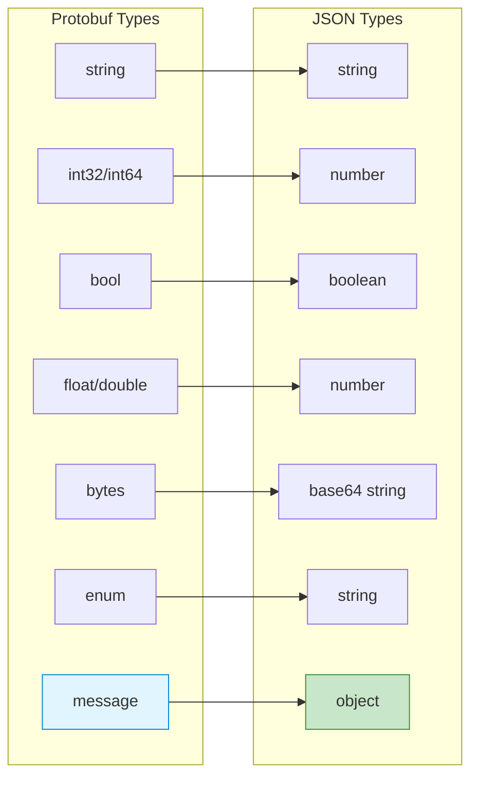
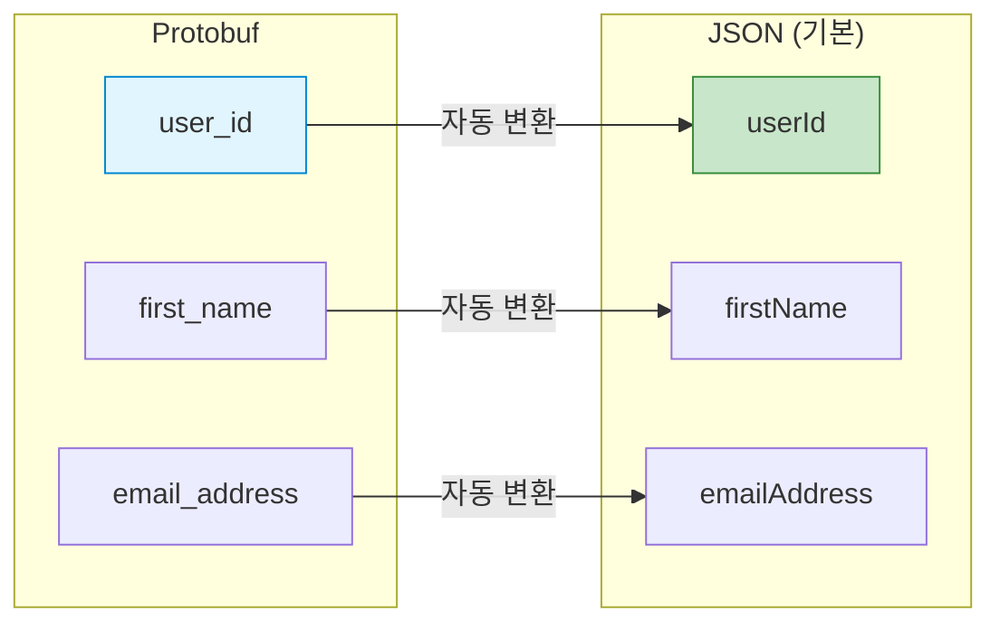
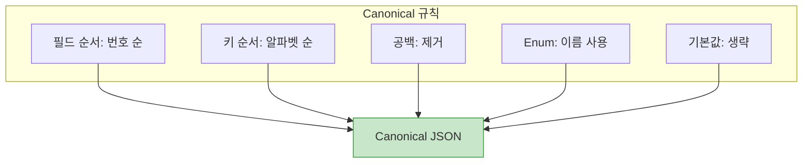
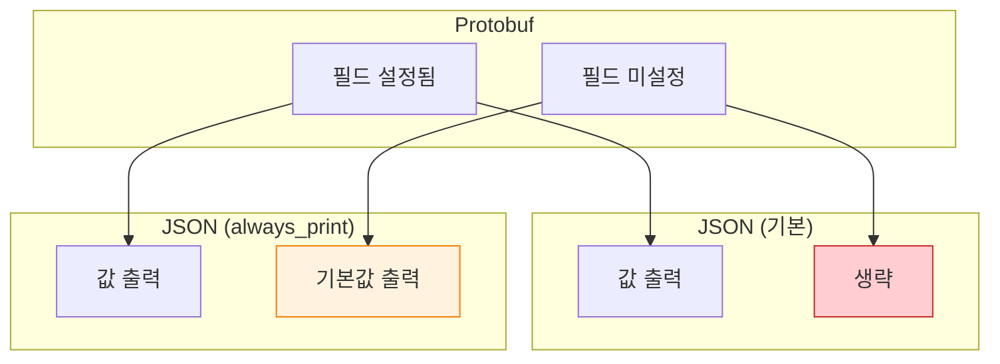
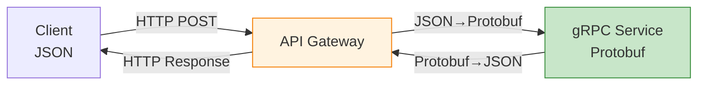

## 들어가며

Protobuf는 바이너리 포맷이지만 **JSON**과의 변환도 지원합니다. REST API와의 통합, 디버깅, 사람이 읽기 쉬운 형식이 필요할 때 유용합니다.

## Proto3 JSON 매핑 규칙

### 기본 매핑



### 타입별 매핑 표

| Proto3 Type | JSON Type | JSON Example | 비고 |
|-------------|-----------|--------------|------|
| **string** | string | "hello" | UTF-8 |
| **int32, int64** | number | 123 | JSON number |
| **uint32, uint64** | number | 123 | JSON number |
| **float, double** | number | 1.23 | NaN, Infinity는 문자열 |
| **bool** | boolean | true | true/false |
| **bytes** | string | "SGVsbG8=" | Base64 인코딩 |
| **enum** | string | "ACTIVE" | Enum 이름 |
| **message** | object | {...} | 중첩 객체 |
| **repeated** | array | [...] | JSON 배열 |
| **map** | object | {...} | JSON 객체 |

### 예제 메시지

```protobuf
syntax = "proto3";

message User {
  string name = 1;
  int32 age = 2;
  bool is_active = 3;
  repeated string tags = 4;
  map<string, string> metadata = 5;

  Address address = 6;

  enum Status {
    STATUS_UNKNOWN = 0;
    STATUS_ACTIVE = 1;
    STATUS_INACTIVE = 2;
  }
  Status status = 7;
}

message Address {
  string street = 1;
  string city = 2;
  int32 zip_code = 3;
}
```

**JSON 표현**:

```json
{
  "name": "Alice",
  "age": 30,
  "isActive": true,
  "tags": ["developer", "go", "protobuf"],
  "metadata": {
    "department": "engineering",
    "level": "senior"
  },
  "address": {
    "street": "123 Main St",
    "city": "San Francisco",
    "zipCode": 94102
  },
  "status": "STATUS_ACTIVE"
}
```

## 필드 이름 변환

### 카멜케이스 변환

Protobuf의 snake_case는 JSON의 camelCase로 자동 변환됩니다.



**변환 규칙**:

```protobuf
message Example {
  string user_id = 1;          // → "userId"
  string first_name = 2;       // → "firstName"
  string email_address = 3;    // → "emailAddress"
  int32 user_count = 4;        // → "userCount"
}
```

### 커스텀 JSON 이름

`json_name` 옵션으로 커스텀 이름을 지정할 수 있습니다.

```protobuf
message Product {
  string product_id = 1 [json_name = "productID"];
  string sku_code = 2 [json_name = "SKU"];
  double unit_price = 3 [json_name = "price"];
}
```

**JSON 출력**:

```json
{
  "productID": "PROD-123",
  "SKU": "SKU-456",
  "price": 29.99
}
```

## JSON 직렬화/역직렬화

### C++ 예제

```cpp
#include <google/protobuf/util/json_util.h>
#include "user.pb.h"
#include <iostream>

using google::protobuf::util::JsonOptions;
using google::protobuf::util::MessageToJsonString;
using google::protobuf::util::JsonStringToMessage;

int main() {
    User user;
    user.set_name("Alice");
    user.set_age(30);
    user.set_is_active(true);
    user.add_tags("developer");
    user.add_tags("go");
    user.set_status(User::STATUS_ACTIVE);

    // Protobuf → JSON
    std::string json_output;
    JsonOptions options;
    options.add_whitespace = true;                    // 들여쓰기
    options.always_print_primitive_fields = true;     // 기본값도 출력
    options.preserve_proto_field_names = false;       // camelCase 사용

    auto status = MessageToJsonString(user, &json_output, options);
    if (status.ok()) {
        std::cout << "JSON:\n" << json_output << std::endl;
    } else {
        std::cerr << "Error: " << status.message() << std::endl;
    }

    // JSON → Protobuf
    User user2;
    status = JsonStringToMessage(json_output, &user2);
    if (status.ok()) {
        std::cout << "Name: " << user2.name() << std::endl;
        std::cout << "Age: " << user2.age() << std::endl;
    }

    return 0;
}
```

### Python 예제

```python
from google.protobuf.json_format import MessageToJson, MessageToDict, Parse
from user_pb2 import User

# Protobuf 객체 생성
user = User()
user.name = "Alice"
user.age = 30
user.is_active = True
user.tags.extend(["developer", "go"])
user.status = User.STATUS_ACTIVE

# Protobuf → JSON (문자열)
json_str = MessageToJson(
    user,
    including_default_value_fields=True,  # 기본값도 포함
    preserving_proto_field_name=False,    # camelCase 사용
    indent=2
)
print("JSON string:")
print(json_str)

# Protobuf → JSON (딕셔너리)
json_dict = MessageToDict(
    user,
    including_default_value_fields=True,
    preserving_proto_field_name=False
)
print("\nJSON dict:")
print(json_dict)

# JSON → Protobuf
user2 = Parse(json_str, User())
print(f"\nParsed name: {user2.name}")
print(f"Parsed age: {user2.age}")
```

### Go 예제

```go
package main

import (
    "fmt"
    "google.golang.org/protobuf/encoding/protojson"
    pb "path/to/user"
)

func main() {
    user := &pb.User{
        Name:     "Alice",
        Age:      30,
        IsActive: true,
        Tags:     []string{"developer", "go"},
        Status:   pb.User_STATUS_ACTIVE,
    }

    // Protobuf → JSON
    marshaler := protojson.MarshalOptions{
        Multiline:       true,   // 들여쓰기
        Indent:          "  ",   // 2칸 들여쓰기
        EmitUnpopulated: true,   // 기본값도 출력
        UseProtoNames:   false,  // camelCase 사용
        UseEnumNumbers:  false,  // Enum 이름 사용
    }

    jsonBytes, err := marshaler.Marshal(user)
    if err != nil {
        panic(err)
    }
    fmt.Println("JSON:")
    fmt.Println(string(jsonBytes))

    // JSON → Protobuf
    user2 := &pb.User{}
    unmarshaler := protojson.UnmarshalOptions{
        DiscardUnknown: false,  // 알 수 없는 필드 에러
    }

    err = unmarshaler.Unmarshal(jsonBytes, user2)
    if err != nil {
        panic(err)
    }
    fmt.Printf("\nParsed name: %s\n", user2.Name)
    fmt.Printf("Parsed age: %d\n", user2.Age)
}
```

## Canonical Encoding

**Canonical encoding**은 동일한 메시지가 항상 동일한 JSON으로 변환되도록 보장합니다.

### 규칙



**예제**:

```json
// Non-canonical (읽기 쉬움)
{
  "name": "Alice",
  "age": 30,
  "isActive": true
}

// Canonical (결정적)
{"age":30,"isActive":true,"name":"Alice"}
```

### Canonical 옵션

**C++**:

```cpp
JsonOptions options;
options.add_whitespace = false;              // 공백 제거
options.always_print_primitive_fields = false;  // 기본값 생략
```

**Python**:

```python
json_str = MessageToJson(
    user,
    including_default_value_fields=False,  # 기본값 생략
    indent=None  # 공백 없음
)
```

**Go**:

```go
marshaler := protojson.MarshalOptions{
    Multiline:       false,  // 한 줄
    EmitUnpopulated: false,  // 기본값 생략
}
```

## 특수 값 처리

### NaN, Infinity

```protobuf
message Stats {
  double value = 1;
  float score = 2;
}
```

```json
{
  "value": "NaN",
  "score": "Infinity",
  "negInfinity": "-Infinity"
}
```

**C++ 예제**:

```cpp
#include <cmath>

Stats stats;
stats.set_value(std::nan(""));
stats.set_score(std::numeric_limits<float>::infinity());

std::string json;
MessageToJsonString(stats, &json, options);
// {"value":"NaN","score":"Infinity"}
```

### Bytes (Base64)

```protobuf
message File {
  string name = 1;
  bytes content = 2;
}
```

```json
{
  "name": "example.txt",
  "content": "SGVsbG8gV29ybGQ="
}
```

**Python 예제**:

```python
import base64

file = File()
file.name = "example.txt"
file.content = b"Hello World"

json_str = MessageToJson(file)
# {"name":"example.txt","content":"SGVsbG8gV29ybGQ="}

# 역변환
file2 = Parse(json_str, File())
print(file2.content.decode('utf-8'))  # "Hello World"
```

### Null vs 기본값



**예제**:

```protobuf
message User {
  string name = 1;
  int32 age = 2;
}
```

```python
user = User()
user.name = "Alice"
# age는 설정하지 않음 (기본값 0)

# 기본 동작 (기본값 생략)
json1 = MessageToJson(user, including_default_value_fields=False)
# {"name":"Alice"}

# 기본값 포함
json2 = MessageToJson(user, including_default_value_fields=True)
# {"name":"Alice","age":0}
```

## Well-known Types JSON 매핑

### Timestamp

```protobuf
import "google/protobuf/timestamp.proto";

message Event {
  string name = 1;
  google.protobuf.Timestamp created_at = 2;
}
```

**JSON**:

```json
{
  "name": "Conference",
  "createdAt": "2025-02-08T10:30:00Z"
}
```

### Duration

```protobuf
import "google/protobuf/duration.proto";

message Task {
  string name = 1;
  google.protobuf.Duration timeout = 2;
}
```

**JSON**:

```json
{
  "name": "Build",
  "timeout": "300s"
}
```

### Any

```protobuf
import "google/protobuf/any.proto";

message Container {
  google.protobuf.Any data = 1;
}
```

**JSON**:

```json
{
  "data": {
    "@type": "type.googleapis.com/User",
    "name": "Alice",
    "age": 30
  }
}
```

### Struct

```protobuf
import "google/protobuf/struct.proto";

message Config {
  string name = 1;
  google.protobuf.Struct settings = 2;
}
```

**JSON**:

```json
{
  "name": "AppConfig",
  "settings": {
    "debug": true,
    "maxConnections": 100,
    "database": {
      "host": "localhost",
      "port": 5432
    }
  }
}
```

### Well-known Types 매핑표

| Well-known Type | JSON 형식 | 예제 |
|----------------|-----------|------|
| **Timestamp** | RFC 3339 문자열 | "2025-02-08T10:30:00Z" |
| **Duration** | 초 + "s" | "300s", "1.5s" |
| **Any** | @type 포함 객체 | {"@type":"...", ...} |
| **Struct** | 일반 JSON 객체 | {...} |
| **Value** | 동적 JSON 값 | 123, "text", true, ... |
| **Empty** | 빈 객체 | {} |
| **Wrappers** | 원시 값 또는 null | 123, null |

## 상호운용성

### REST API 통합



**grpc-gateway 예제**:

```protobuf
syntax = "proto3";

import "google/api/annotations.proto";

service UserService {
  rpc GetUser(GetUserRequest) returns (GetUserResponse) {
    option (google.api.http) = {
      get: "/v1/users/{user_id}"
    };
  }

  rpc CreateUser(CreateUserRequest) returns (CreateUserResponse) {
    option (google.api.http) = {
      post: "/v1/users"
      body: "*"
    };
  }
}
```

### Legacy 시스템 연동

```python
# Legacy JSON API → Protobuf
import requests
from google.protobuf.json_format import Parse
from user_pb2 import User

# Legacy API 호출
response = requests.get("https://legacy-api.com/users/123")
legacy_json = response.json()

# JSON → Protobuf 변환
user = Parse(json.dumps(legacy_json), User())

# gRPC 서비스 호출
grpc_response = grpc_stub.UpdateUser(user)
```

### 필드 매핑 어댑터

```python
def legacy_to_protobuf(legacy_data):
    """Legacy JSON을 Protobuf 형식으로 변환"""
    # 필드 이름 매핑
    mapped = {
        "name": legacy_data.get("fullName"),
        "email": legacy_data.get("emailAddress"),
        "age": legacy_data.get("userAge"),
    }

    # Protobuf 메시지 생성
    user = User()
    for key, value in mapped.items():
        if value is not None:
            setattr(user, key, value)

    return user
```

## JSON 옵션 비교

| 옵션 | C++ | Python | Go | 설명 |
|------|-----|--------|----|----|
| **들여쓰기** | add_whitespace | indent | Multiline | 가독성 향상 |
| **기본값 출력** | always_print_primitive_fields | including_default_value_fields | EmitUnpopulated | 기본값 포함 |
| **필드 이름** | preserve_proto_field_names | preserving_proto_field_name | UseProtoNames | snake_case vs camelCase |
| **Enum 번호** | - | - | UseEnumNumbers | Enum 이름 vs 번호 |
| **알 수 없는 필드** | - | ignore_unknown_fields | DiscardUnknown | 파싱 시 처리 |

## Best Practices

### 1. API 버전 관리

```protobuf
// v1/user.proto
syntax = "proto3";
package api.v1;

message User {
  string id = 1 [json_name = "userID"];
  string name = 2;
}

// v2/user.proto
syntax = "proto3";
package api.v2;

message User {
  string id = 1 [json_name = "userID"];
  string full_name = 2;  // name → full_name
  string email = 3;      // 새 필드
}
```

### 2. 에러 처리

```python
from google.protobuf.json_format import ParseError, Parse
from user_pb2 import User

def safe_parse(json_str):
    try:
        return Parse(json_str, User())
    except ParseError as e:
        print(f"Parse error: {e}")
        return None
```

### 3. 스키마 검증

```go
func validateJSON(jsonData []byte) error {
    user := &pb.User{}
    if err := protojson.Unmarshal(jsonData, user); err != nil {
        return fmt.Errorf("invalid JSON: %w", err)
    }

    // 추가 검증
    if user.Email == "" {
        return errors.New("email is required")
    }

    return nil
}
```

## 다음 단계

JSON 변환을 마스터했습니다! 다음 글에서는:
- **코드 생성 상세**
- protoc 컴파일러
- 언어별 옵션

---

**시리즈 목차**
1. Protocol Buffers란 무엇인가
2. Protocol Buffers 고급 스키마 설계
3. gRPC와 Protobuf - 고성능 RPC
4. Protobuf 실전 활용 - 마이크로서비스
5. Protobuf 성능 최적화 및 Best Practices
6. Proto3 고급 기능
7. 서비스와 RPC 정의
8. Reflection과 동적 메시지
9. Extensions와 플러그인
10. **JSON 변환** ← 현재 글
11. 코드 생성 상세 (다음 글)

> 💡 **Quick Tip**: JSON은 디버깅에 유용하지만 프로덕션에서는 바이너리 Protobuf를 사용하세요. JSON은 3-10배 더 크고 느립니다!
