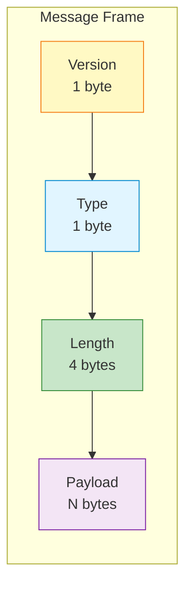

## 들어가며

ZeroMQ는 **전송 계층**만 제공합니다. 애플리케이션 **프로토콜**은 직접 설계해야 합니다. 잘 설계된 프로토콜은 시스템의 **확장성, 유지보수성, 호환성**을 결정합니다.

## 프로토콜 설계 원칙

### 1. 자기 서술적 (Self-Describing)

메시지만 봐도 **무엇인지 알 수 있어야** 합니다.

```python
# ❌ 나쁜 예: 의미 불명
b"1|John|25"

# ✅ 좋은 예: 자기 서술적
b"USER_CREATE|name:John|age:25|version:1.0"
```

### 2. 확장 가능 (Extensible)

새 필드를 추가해도 **하위 호환**되어야 합니다.

```python
# Version 1.0
{"type": "USER", "name": "John"}

# Version 1.1 (새 필드 추가)
{"type": "USER", "name": "John", "email": "john@example.com"}

# Version 1.0 클라이언트도 동작! (email 무시)
```

### 3. 효율적 (Efficient)

불필요한 오버헤드를 줄여야 합니다.

```python
# ❌ 비효율적: 중복된 키
[
    {"user": "John", "action": "login", "time": 123},
    {"user": "Jane", "action": "logout", "time": 456}
]

# ✅ 효율적: 구조 최적화
{
    "schema": ["user", "action", "time"],
    "data": [
        ["John", "login", 123],
        ["Jane", "logout", 456]
    ]
}
```

## 프레이밍 (Framing)

### 기본 프레임 구조



### Python 구현

```python
# protocol.py
import struct
import json
from enum import IntEnum

class MessageType(IntEnum):
    """메시지 타입"""
    REQUEST = 1
    REPLY = 2
    EVENT = 3
    ERROR = 4

class Protocol:
    """커스텀 프로토콜"""

    VERSION = 1

    @staticmethod
    def encode(msg_type, payload):
        """메시지 인코딩"""
        # Payload를 JSON으로 직렬화
        payload_bytes = json.dumps(payload).encode('utf-8')

        # Header: Version (1B) + Type (1B) + Length (4B)
        header = struct.pack('!BBL',
                             Protocol.VERSION,
                             msg_type,
                             len(payload_bytes))

        return header + payload_bytes

    @staticmethod
    def decode(message):
        """메시지 디코딩"""
        if len(message) < 6:
            raise ValueError("Message too short")

        # Header 파싱
        version, msg_type, length = struct.unpack('!BBL', message[:6])

        if version != Protocol.VERSION:
            raise ValueError(f"Unsupported version: {version}")

        # Payload 파싱
        payload_bytes = message[6:6+length]
        payload = json.loads(payload_bytes.decode('utf-8'))

        return {
            'version': version,
            'type': MessageType(msg_type),
            'payload': payload
        }

# 사용 예제
def example():
    # 인코딩
    message = Protocol.encode(
        MessageType.REQUEST,
        {'action': 'get_user', 'id': 123}
    )

    print(f"Encoded: {message.hex()}")

    # 디코딩
    decoded = Protocol.decode(message)
    print(f"Decoded: {decoded}")

if __name__ == "__main__":
    example()
```

### C 구현

```c
// protocol.c
#include <stdio.h>
#include <stdlib.h>
#include <string.h>
#include <arpa/inet.h>

#define PROTOCOL_VERSION 1

typedef enum {
    MSG_REQUEST = 1,
    MSG_REPLY = 2,
    MSG_EVENT = 3,
    MSG_ERROR = 4
} message_type_t;

typedef struct {
    uint8_t version;
    uint8_t type;
    uint32_t length;
} __attribute__((packed)) message_header_t;

// 메시지 인코딩
size_t protocol_encode(uint8_t type, const char *payload,
                       char *buffer, size_t buffer_size) {
    size_t payload_len = strlen(payload);
    size_t total_len = sizeof(message_header_t) + payload_len;

    if (total_len > buffer_size) {
        return 0;  // 버퍼 부족
    }

    message_header_t *header = (message_header_t *)buffer;
    header->version = PROTOCOL_VERSION;
    header->type = type;
    header->length = htonl(payload_len);  // Network byte order

    memcpy(buffer + sizeof(message_header_t), payload, payload_len);

    return total_len;
}

// 메시지 디코딩
int protocol_decode(const char *message, size_t msg_len,
                    uint8_t *type, char *payload, size_t payload_size) {
    if (msg_len < sizeof(message_header_t)) {
        return -1;  // Too short
    }

    message_header_t *header = (message_header_t *)message;

    if (header->version != PROTOCOL_VERSION) {
        return -2;  // Version mismatch
    }

    uint32_t payload_len = ntohl(header->length);

    if (payload_len > payload_size - 1) {
        return -3;  // Payload buffer too small
    }

    *type = header->type;
    memcpy(payload, message + sizeof(message_header_t), payload_len);
    payload[payload_len] = '\0';

    return payload_len;
}

int main() {
    char buffer[1024];
    char payload[512];

    // 인코딩
    size_t len = protocol_encode(MSG_REQUEST,
                                  "{\"action\":\"get_user\"}",
                                  buffer, sizeof(buffer));

    printf("Encoded %zu bytes\n", len);

    // 디코딩
    uint8_t type;
    int payload_len = protocol_decode(buffer, len, &type, payload, sizeof(payload));

    if (payload_len >= 0) {
        printf("Type: %d\n", type);
        printf("Payload: %s\n", payload);
    }

    return 0;
}
```

## 버전 관리

### 버전 협상

```python
# versioning.py

class VersionedProtocol:
    """버전 관리 프로토콜"""

    SUPPORTED_VERSIONS = [1, 2, 3]
    CURRENT_VERSION = 3

    @staticmethod
    def negotiate_version(client_versions):
        """클라이언트와 버전 협상"""
        # 공통 버전 찾기
        common = set(client_versions) & set(VersionedProtocol.SUPPORTED_VERSIONS)

        if not common:
            raise ValueError("No compatible version")

        # 가장 높은 버전 선택
        return max(common)

    @staticmethod
    def encode_v1(data):
        """Version 1 인코딩"""
        return json.dumps(data).encode()

    @staticmethod
    def encode_v2(data):
        """Version 2 인코딩 (압축 추가)"""
        import gzip
        json_data = json.dumps(data).encode()
        return gzip.compress(json_data)

    @staticmethod
    def encode_v3(data):
        """Version 3 인코딩 (MessagePack)"""
        import msgpack
        return msgpack.packb(data)

    @staticmethod
    def encode(version, data):
        """버전별 인코딩"""
        encoders = {
            1: VersionedProtocol.encode_v1,
            2: VersionedProtocol.encode_v2,
            3: VersionedProtocol.encode_v3
        }

        if version not in encoders:
            raise ValueError(f"Unsupported version: {version}")

        return encoders[version](data)

# 사용 예제
def version_negotiation_example():
    # Client가 지원하는 버전
    client_versions = [1, 2]

    # 협상
    version = VersionedProtocol.negotiate_version(client_versions)
    print(f"Negotiated version: {version}")

    # 해당 버전으로 인코딩
    data = {'hello': 'world'}
    encoded = VersionedProtocol.encode(version, data)

    print(f"Encoded with v{version}: {encoded}")
```

### 하위 호환성 유지

```python
# backward_compatibility.py

class Message:
    """하위 호환성 메시지"""

    def __init__(self, data, version=1):
        self.version = version
        self.data = data

    def serialize(self):
        """직렬화 (버전별)"""
        if self.version == 1:
            # v1: 필수 필드만
            return {
                'name': self.data.get('name'),
                'age': self.data.get('age')
            }
        elif self.version == 2:
            # v2: 새 필드 추가
            return {
                'name': self.data.get('name'),
                'age': self.data.get('age'),
                'email': self.data.get('email', '')  # 기본값
            }
        elif self.version == 3:
            # v3: 더 많은 필드
            return {
                'name': self.data.get('name'),
                'age': self.data.get('age'),
                'email': self.data.get('email', ''),
                'phone': self.data.get('phone', ''),
                'address': self.data.get('address', {})
            }

    @staticmethod
    def deserialize(data, version=1):
        """역직렬화 (하위 호환)"""
        # v3 메시지를 v1/v2로 읽기
        if version == 1:
            return {
                'name': data.get('name'),
                'age': data.get('age')
                # 나머지 필드 무시
            }
        elif version == 2:
            return {
                'name': data.get('name'),
                'age': data.get('age'),
                'email': data.get('email', '')
                # phone, address 무시
            }
        else:
            return data  # v3: 모든 필드

# 테스트
v3_data = {
    'name': 'John',
    'age': 30,
    'email': 'john@example.com',
    'phone': '123-456-7890',
    'address': {'city': 'Seoul'}
}

# v3 메시지
msg_v3 = Message(v3_data, version=3)
print(f"v3: {msg_v3.serialize()}")

# v1 클라이언트가 v3 메시지 읽기 (하위 호환)
v1_data = Message.deserialize(v3_data, version=1)
print(f"v1 view: {v1_data}")  # name, age만
```

## 실전 프로토콜 예제

### RPC 프로토콜

```python
# rpc_protocol.py
import uuid
import time

class RPCProtocol:
    """RPC 프로토콜"""

    @staticmethod
    def create_request(method, params):
        """RPC 요청 생성"""
        return {
            'jsonrpc': '2.0',
            'id': str(uuid.uuid4()),
            'method': method,
            'params': params,
            'timestamp': time.time()
        }

    @staticmethod
    def create_response(request_id, result=None, error=None):
        """RPC 응답 생성"""
        response = {
            'jsonrpc': '2.0',
            'id': request_id,
            'timestamp': time.time()
        }

        if error:
            response['error'] = {
                'code': error.get('code', -1),
                'message': error.get('message', 'Unknown error')
            }
        else:
            response['result'] = result

        return response

    @staticmethod
    def validate_request(request):
        """요청 검증"""
        required = ['jsonrpc', 'id', 'method']

        for field in required:
            if field not in request:
                raise ValueError(f"Missing required field: {field}")

        if request['jsonrpc'] != '2.0':
            raise ValueError("Unsupported JSON-RPC version")

        return True

# 사용
request = RPCProtocol.create_request('add', [1, 2])
print(f"Request: {request}")

response = RPCProtocol.create_response(
    request['id'],
    result=3
)
print(f"Response: {response}")
```

### 이벤트 프로토콜

```python
# event_protocol.py

class EventProtocol:
    """이벤트 프로토콜"""

    @staticmethod
    def create_event(event_type, data, priority='normal'):
        """이벤트 생성"""
        return {
            'type': 'EVENT',
            'event_type': event_type,
            'priority': priority,  # low, normal, high, critical
            'data': data,
            'timestamp': time.time(),
            'source': 'app-server-01'
        }

    @staticmethod
    def filter_by_priority(events, min_priority='normal'):
        """우선순위로 필터링"""
        priority_order = {'low': 0, 'normal': 1, 'high': 2, 'critical': 3}
        min_level = priority_order[min_priority]

        return [
            e for e in events
            if priority_order[e['priority']] >= min_level
        ]

# 사용
events = [
    EventProtocol.create_event('user.login', {'user': 'john'}, 'low'),
    EventProtocol.create_event('payment.failed', {'amount': 100}, 'critical'),
    EventProtocol.create_event('file.uploaded', {'file': 'doc.pdf'}, 'normal')
]

# Critical/High 이벤트만
important = EventProtocol.filter_by_priority(events, 'high')
print(f"Important events: {important}")
```

## 프로토콜 문서화

### 스키마 정의

```python
# schema.py
from jsonschema import validate, ValidationError

# 스키마 정의
USER_SCHEMA = {
    "type": "object",
    "properties": {
        "name": {"type": "string", "minLength": 1},
        "age": {"type": "integer", "minimum": 0, "maximum": 150},
        "email": {"type": "string", "format": "email"}
    },
    "required": ["name", "age"]
}

def validate_user(data):
    """사용자 데이터 검증"""
    try:
        validate(instance=data, schema=USER_SCHEMA)
        return True
    except ValidationError as e:
        print(f"Validation error: {e.message}")
        return False

# 테스트
valid_user = {"name": "John", "age": 30, "email": "john@example.com"}
invalid_user = {"name": "", "age": -5}

print(validate_user(valid_user))    # True
print(validate_user(invalid_user))  # False
```

### Protocol Buffers 활용

```protobuf
// message.proto
syntax = "proto3";

message Request {
    string id = 1;
    string method = 2;
    bytes params = 3;
    int64 timestamp = 4;
}

message Response {
    string id = 1;
    oneof result {
        bytes data = 2;
        Error error = 3;
    }
    int64 timestamp = 4;
}

message Error {
    int32 code = 1;
    string message = 2;
}
```

```python
# protobuf_protocol.py
import message_pb2

# Request 생성
request = message_pb2.Request()
request.id = "12345"
request.method = "get_user"
request.params = b'{"id": 123}'
request.timestamp = int(time.time())

# 직렬화 (매우 효율적!)
serialized = request.SerializeToString()
print(f"Size: {len(serialized)} bytes")

# 역직렬화
request2 = message_pb2.Request()
request2.ParseFromString(serialized)
print(f"Method: {request2.method}")
```

## 성능 비교

### 직렬화 형식 비교

| 형식 | 크기 | 속도 | 가독성 | 스키마 |
|------|------|------|--------|--------|
| **JSON** | ⭐⭐ | ⭐⭐ | ⭐⭐⭐ | ❌ |
| **MessagePack** | ⭐⭐⭐ | ⭐⭐⭐ | ⭐ | ❌ |
| **Protocol Buffers** | ⭐⭐⭐⭐ | ⭐⭐⭐⭐ | ⭐ | ✅ |
| **FlatBuffers** | ⭐⭐⭐⭐ | ⭐⭐⭐⭐⭐ | ⭐ | ✅ |
| **Custom Binary** | ⭐⭐⭐⭐⭐ | ⭐⭐⭐⭐⭐ | ❌ | 직접 구현 |

### 벤치마크

```python
# benchmark.py
import time
import json
import msgpack
import pickle

data = {'name': 'John', 'age': 30, 'items': list(range(100))}

def benchmark(name, encode_func, decode_func, iterations=10000):
    # Encoding
    start = time.time()
    for _ in range(iterations):
        encoded = encode_func(data)
    encode_time = time.time() - start

    # Decoding
    start = time.time()
    for _ in range(iterations):
        decoded = decode_func(encoded)
    decode_time = time.time() - start

    print(f"{name}:")
    print(f"  Size: {len(encoded)} bytes")
    print(f"  Encode: {encode_time:.3f}s")
    print(f"  Decode: {decode_time:.3f}s")

# JSON
benchmark("JSON",
          lambda d: json.dumps(d).encode(),
          lambda e: json.loads(e.decode()))

# MessagePack
benchmark("MessagePack",
          msgpack.packb,
          msgpack.unpackb)

# Pickle
benchmark("Pickle",
          pickle.dumps,
          pickle.loads)
```

## 다음 단계

프로토콜 설계를 마스터했습니다! 다음 글에서는:
- **클러스터 패턴** - Clone, Service Discovery
- 분산 로깅
- 클러스터 관리

---

**시리즈 목차**
1-14. (이전 글들)
15. **프로토콜 설계 - 커스텀 프로토콜과 버전 관리** ← 현재 글
16. 클러스터 패턴 (다음 글)

> 💡 **Quick Tip**: 프로토콜은 처음부터 버전 필드를 포함하세요. 나중에 추가하기 어렵습니다!
