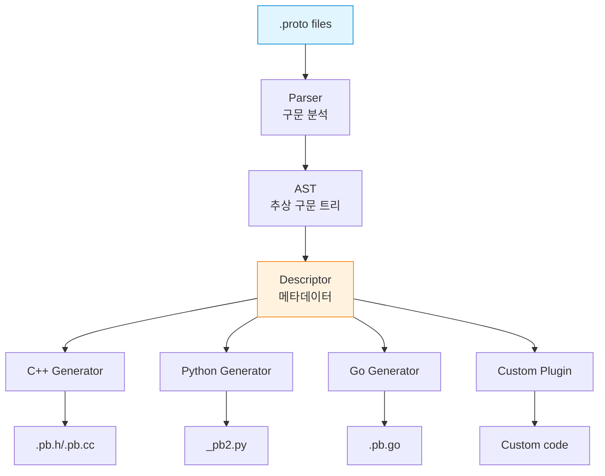
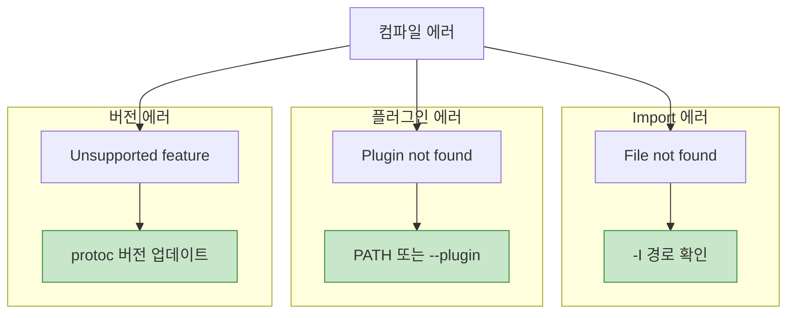

## 들어가며

**protoc**는 .proto 파일을 다양한 언어의 코드로 변환하는 컴파일러입니다. 효율적인 빌드 파이프라인을 구축하려면 protoc의 동작을 이해해야 합니다.

## protoc 아키텍처



## 기본 사용법

### 단일 파일 컴파일

```bash
# C++ 코드 생성
protoc --cpp_out=. user.proto

# Python 코드 생성
protoc --python_out=. user.proto

# Go 코드 생성
protoc --go_out=. user.proto

# 여러 언어 동시 생성
protoc --cpp_out=. --python_out=. --go_out=. user.proto
```

### 디렉토리 구조

```
project/
├── proto/
│   ├── user.proto
│   ├── product.proto
│   └── order.proto
├── generated/
│   ├── cpp/
│   ├── python/
│   └── go/
└── src/
```

**컴파일**:

```bash
# Import path 지정
protoc -I proto \
  --cpp_out=generated/cpp \
  --python_out=generated/python \
  --go_out=generated/go \
  proto/*.proto
```

## protoc 옵션

### Include Path (-I, --proto_path)

```bash
# 단일 경로
protoc -I proto user.proto

# 여러 경로
protoc -I proto -I third_party user.proto

# 절대 경로
protoc -I /usr/local/include -I . user.proto
```

**import 해결 순서**:

```mermaid
graph TB
    Import[import google/protobuf/timestamp.proto]

    Path1[-I /usr/local/include]
    Path2[-I third_party]
    Path3[-I .]

    File1[/usr/local/include/google/protobuf/timestamp.proto]

    Import --> Path1
    Import --> Path2
    Import --> Path3

    Path1 --> File1

    style File1 fill:#c8e6c9,stroke:#388e3c
```

### Descriptor Set 생성

```bash
# FileDescriptorSet 생성
protoc --descriptor_set_out=user.desc \
  --include_imports \
  user.proto

# Source info 포함 (라인 번호 등)
protoc --descriptor_set_out=user.desc \
  --include_source_info \
  --include_imports \
  user.proto
```

**사용 사례**:

```python
from google.protobuf import descriptor_pb2

# Descriptor 파일 읽기
with open('user.desc', 'rb') as f:
    descriptor_set = descriptor_pb2.FileDescriptorSet()
    descriptor_set.ParseFromString(f.read())

# 메시지 정보 출력
for file_desc in descriptor_set.file:
    print(f"File: {file_desc.name}")
    for message in file_desc.message_type:
        print(f"  Message: {message.name}")
```

### 에러 형식

```bash
# GCC 스타일 에러 (기본)
protoc user.proto
# user.proto:5:3: "User" is already defined in "user.proto".

# MSVS 스타일 에러
protoc --error_format=msvs user.proto
# user.proto(5) : error in column 3: "User" is already defined.
```

## 언어별 옵션

### C++ 옵션

```bash
protoc --cpp_out=. \
  --cpp_opt=speed \
  user.proto
```

**C++ 특화 옵션**:

```protobuf
// user.proto
syntax = "proto3";

option optimize_for = SPEED;  // SPEED, CODE_SIZE, LITE_RUNTIME
option cc_enable_arenas = true;  // Arena allocation

message User {
  string name = 1;
  int32 age = 2;
}
```

**최적화 레벨 비교**:

| 옵션 | 크기 | 속도 | 기능 |
|------|------|------|------|
| **SPEED** | 큼 | 빠름 | 모든 기능 |
| **CODE_SIZE** | 작음 | 느림 | 모든 기능 |
| **LITE_RUNTIME** | 매우 작음 | 빠름 | 제한적 (Reflection 없음) |

**컴파일**:

```bash
# SPEED (기본)
protoc --cpp_out=. user.proto
g++ -o app main.cpp user.pb.cc -lprotobuf

# LITE
protoc --cpp_out=. user.proto  # optimize_for = LITE_RUNTIME
g++ -o app main.cpp user.pb.cc -lprotobuf-lite
```

### Python 옵션

```bash
# 기본
protoc --python_out=. user.proto

# pyi stub 파일 생성 (타입 힌팅)
protoc --python_out=. --pyi_out=. user.proto

# mypy 지원
protoc --python_out=. --mypy_out=. user.proto
```

**생성된 파일**:

```
user_pb2.py       # 메시지 클래스
user_pb2.pyi      # 타입 스텁 (IDE 지원)
```

### Go 옵션

```bash
# Go 모듈 경로 지정
protoc --go_out=. \
  --go_opt=paths=source_relative \
  user.proto

# 패키지 경로 지정
protoc --go_out=. \
  --go_opt=module=github.com/example/myproject \
  user.proto
```

**paths 옵션**:

| 옵션 | 동작 | 예제 |
|------|------|------|
| **import** | import path 기반 | github.com/example/proto/user.pb.go |
| **source_relative** | .proto 파일 위치 기반 | ./user.pb.go |

**Go 패키지 지정**:

```protobuf
// user.proto
syntax = "proto3";

option go_package = "github.com/example/myproject/proto/user";

message User {
  string name = 1;
}
```

### gRPC 코드 생성

```bash
# C++ gRPC
protoc --cpp_out=. --grpc_out=. \
  --plugin=protoc-gen-grpc=`which grpc_cpp_plugin` \
  user.proto

# Python gRPC
python -m grpc_tools.protoc -I. \
  --python_out=. \
  --grpc_python_out=. \
  user.proto

# Go gRPC
protoc --go_out=. --go_opt=paths=source_relative \
  --go-grpc_out=. --go-grpc_opt=paths=source_relative \
  user.proto
```

## 고급 패턴

### 1. 다중 출력 디렉토리

```bash
#!/bin/bash
# generate.sh

PROTO_DIR="proto"
OUT_DIR="generated"

# C++
protoc -I $PROTO_DIR \
  --cpp_out=$OUT_DIR/cpp \
  $PROTO_DIR/*.proto

# Python
protoc -I $PROTO_DIR \
  --python_out=$OUT_DIR/python \
  --pyi_out=$OUT_DIR/python \
  $PROTO_DIR/*.proto

# Go
protoc -I $PROTO_DIR \
  --go_out=$OUT_DIR/go \
  --go_opt=paths=source_relative \
  --go-grpc_out=$OUT_DIR/go \
  --go-grpc_opt=paths=source_relative \
  $PROTO_DIR/*.proto

echo "Code generation completed!"
```

### 2. 조건부 생성

```bash
#!/bin/bash

# 변경된 .proto 파일만 컴파일
for proto_file in proto/*.proto; do
    pb_file="generated/cpp/$(basename $proto_file .proto).pb.cc"

    if [ ! -f "$pb_file" ] || [ "$proto_file" -nt "$pb_file" ]; then
        echo "Generating $proto_file"
        protoc -I proto --cpp_out=generated/cpp "$proto_file"
    else
        echo "Skipping $proto_file (up to date)"
    fi
done
```

### 3. 버전 체크

```bash
#!/bin/bash

REQUIRED_VERSION="3.20.0"
CURRENT_VERSION=$(protoc --version | cut -d' ' -f2)

if [ "$(printf '%s\n' "$REQUIRED_VERSION" "$CURRENT_VERSION" | sort -V | head -n1)" != "$REQUIRED_VERSION" ]; then
    echo "Error: protoc version $REQUIRED_VERSION or higher required"
    echo "Current version: $CURRENT_VERSION"
    exit 1
fi

protoc --cpp_out=. *.proto
```

## 빌드 시스템 통합

### CMake 통합

```cmake
# CMakeLists.txt

cmake_minimum_required(VERSION 3.15)
project(MyProject)

# Protobuf 찾기
find_package(Protobuf REQUIRED)

# .proto 파일
set(PROTO_FILES
    proto/user.proto
    proto/product.proto
)

# Protobuf 생성
protobuf_generate_cpp(PROTO_SRCS PROTO_HDRS ${PROTO_FILES})

# 실행 파일
add_executable(myapp
    src/main.cpp
    ${PROTO_SRCS}
)

target_include_directories(myapp PRIVATE
    ${CMAKE_CURRENT_BINARY_DIR}
    ${Protobuf_INCLUDE_DIRS}
)

target_link_libraries(myapp
    ${Protobuf_LIBRARIES}
)
```

**gRPC 포함**:

```cmake
find_package(gRPC REQUIRED)

# Protobuf + gRPC 생성
protobuf_generate_cpp(PROTO_SRCS PROTO_HDRS ${PROTO_FILES})
grpc_generate_cpp(GRPC_SRCS GRPC_HDRS ${PROTO_FILES})

add_executable(myapp
    src/main.cpp
    ${PROTO_SRCS}
    ${GRPC_SRCS}
)

target_link_libraries(myapp
    ${Protobuf_LIBRARIES}
    gRPC::grpc++
)
```

### Bazel 통합

```python
# BUILD

load("@rules_proto//proto:defs.bzl", "proto_library")
load("@rules_cc//cc:defs.bzl", "cc_proto_library")
load("@com_github_grpc_grpc//bazel:cc_grpc_library.bzl", "cc_grpc_library")

# Proto 라이브러리
proto_library(
    name = "user_proto",
    srcs = ["user.proto"],
)

# C++ Protobuf 라이브러리
cc_proto_library(
    name = "user_cc_proto",
    deps = [":user_proto"],
)

# C++ gRPC 라이브러리
cc_grpc_library(
    name = "user_cc_grpc",
    srcs = [":user_proto"],
    grpc_only = True,
    deps = [":user_cc_proto"],
)

# 실행 파일
cc_binary(
    name = "myapp",
    srcs = ["main.cpp"],
    deps = [
        ":user_cc_proto",
        ":user_cc_grpc",
    ],
)
```

### Make 통합

```makefile
# Makefile

PROTO_DIR := proto
CPP_OUT := generated/cpp
PY_OUT := generated/python
GO_OUT := generated/go

PROTO_FILES := $(wildcard $(PROTO_DIR)/*.proto)
CPP_SOURCES := $(patsubst $(PROTO_DIR)/%.proto,$(CPP_OUT)/%.pb.cc,$(PROTO_FILES))

.PHONY: all clean

all: $(CPP_SOURCES)

$(CPP_OUT)/%.pb.cc: $(PROTO_DIR)/%.proto
	@mkdir -p $(CPP_OUT)
	protoc -I $(PROTO_DIR) --cpp_out=$(CPP_OUT) $<

$(PY_OUT)/%_pb2.py: $(PROTO_DIR)/%.proto
	@mkdir -p $(PY_OUT)
	protoc -I $(PROTO_DIR) --python_out=$(PY_OUT) $<

$(GO_OUT)/%.pb.go: $(PROTO_DIR)/%.proto
	@mkdir -p $(GO_OUT)
	protoc -I $(PROTO_DIR) --go_out=$(GO_OUT) --go_opt=paths=source_relative $<

clean:
	rm -rf generated/
```

### Python setup.py 통합

```python
# setup.py

from setuptools import setup, find_packages
from distutils.command.build_py import build_py
import subprocess
import glob

class BuildProto(build_py):
    def run(self):
        # .proto 파일 컴파일
        proto_files = glob.glob('proto/*.proto')
        for proto_file in proto_files:
            subprocess.run([
                'python', '-m', 'grpc_tools.protoc',
                '-I', 'proto',
                '--python_out=.',
                '--grpc_python_out=.',
                proto_file
            ], check=True)

        # 기본 build_py 실행
        build_py.run(self)

setup(
    name='myproject',
    version='1.0.0',
    packages=find_packages(),
    install_requires=[
        'protobuf>=3.20.0',
        'grpcio>=1.50.0',
    ],
    cmdclass={
        'build_py': BuildProto,
    },
)
```

### Go go.mod 통합

```go
// tools.go
// +build tools

package tools

import (
    _ "google.golang.org/protobuf/cmd/protoc-gen-go"
    _ "google.golang.org/grpc/cmd/protoc-gen-go-grpc"
)
```

```bash
# go.mod에 도구 추가
go mod tidy

# 코드 생성 스크립트
# generate.sh
#!/bin/bash

go install google.golang.org/protobuf/cmd/protoc-gen-go@latest
go install google.golang.org/grpc/cmd/protoc-gen-go-grpc@latest

protoc --go_out=. --go_opt=paths=source_relative \
       --go-grpc_out=. --go-grpc_opt=paths=source_relative \
       proto/*.proto
```

**go generate 사용**:

```go
// user.go
package user

//go:generate protoc --go_out=. --go_opt=paths=source_relative proto/user.proto
```

```bash
go generate ./...
```

## 커스텀 템플릿

### protoc 플러그인으로 템플릿 구현

```python
#!/usr/bin/env python3
# protoc-gen-template

from string import Template

# 템플릿 정의
CLASS_TEMPLATE = Template("""
class $class_name {
public:
    $class_name();
    ~$class_name();

    // Getters
$getters

    // Setters
$setters

private:
$fields
};
""")

def generate_class(message):
    getters = []
    setters = []
    fields = []

    for field in message.field:
        field_type = get_cpp_type(field)
        field_name = field.name

        # Getter
        getters.append(f"    {field_type} get_{field_name}() const;")

        # Setter
        setters.append(f"    void set_{field_name}(const {field_type}& value);")

        # Field
        fields.append(f"    {field_type} {field_name}_;")

    return CLASS_TEMPLATE.substitute(
        class_name=message.name,
        getters="\n".join(getters),
        setters="\n".join(setters),
        fields="\n".join(fields)
    )
```

## 성능 최적화

### 병렬 컴파일

```bash
#!/bin/bash

# GNU Parallel 사용
find proto -name '*.proto' | \
    parallel protoc -I proto --cpp_out=generated/cpp {}

# xargs 사용
find proto -name '*.proto' | \
    xargs -P 4 -I {} protoc -I proto --cpp_out=generated/cpp {}
```

### 증분 빌드

```bash
# Ninja 빌드 시스템 사용
# build.ninja

rule protoc
  command = protoc -I proto --cpp_out=generated/cpp $in
  description = Generating $out

build generated/cpp/user.pb.cc: protoc proto/user.proto
build generated/cpp/product.pb.cc: protoc proto/product.proto
```

```bash
ninja
```

## 트러블슈팅

### 일반적인 에러



**디버깅 팁**:

```bash
# 상세 로그
protoc --cpp_out=. user.proto -v

# Dry run (실제 생성하지 않음)
protoc --cpp_out=. user.proto --dry_run

# Descriptor 검사
protoc --descriptor_set_out=- user.proto | protoc --decode_raw
```

## Best Practices

| 원칙 | 설명 |
|------|------|
| **버전 고정** | protoc 버전을 고정하여 일관성 유지 |
| **자동화** | 빌드 시스템에 통합 |
| **검증** | 생성된 코드 테스트 |
| **분리** | 생성 코드를 소스와 분리 |
| **캐싱** | 변경된 파일만 재생성 |

## 다음 단계

코드 생성을 마스터했습니다! 다음 글에서는:
- **Wire Format 이해**
- Varint 인코딩
- 크기 최적화

---

**시리즈 목차**
1. Protocol Buffers란 무엇인가
2. Protocol Buffers 고급 스키마 설계
3. gRPC와 Protobuf - 고성능 RPC
4. Protobuf 실전 활용 - 마이크로서비스
5. Protobuf 성능 최적화 및 Best Practices
6. Proto3 고급 기능
7. 서비스와 RPC 정의
8. Reflection과 동적 메시지
9. Extensions와 플러그인
10. JSON 변환
11. **코드 생성 상세** ← 현재 글
12. Wire Format 이해 (다음 글)

> 💡 **Quick Tip**: CI/CD에서 protoc 버전을 Docker 이미지로 고정하면 "내 컴퓨터에서는 되는데..." 문제를 방지할 수 있습니다!
