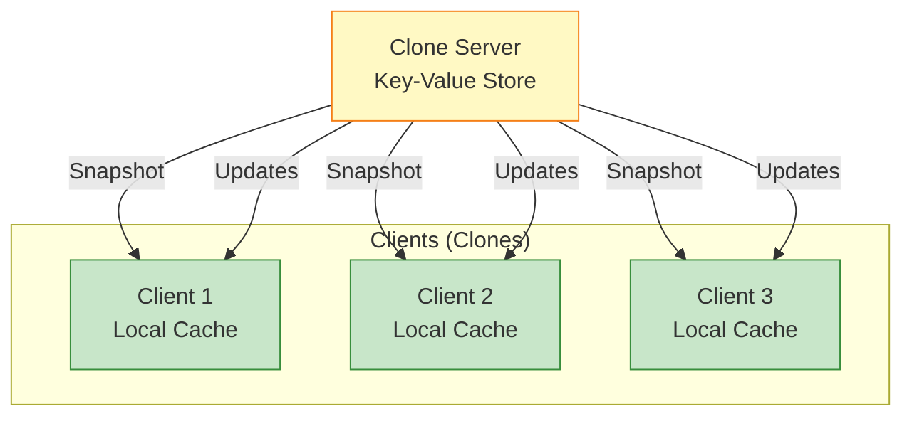
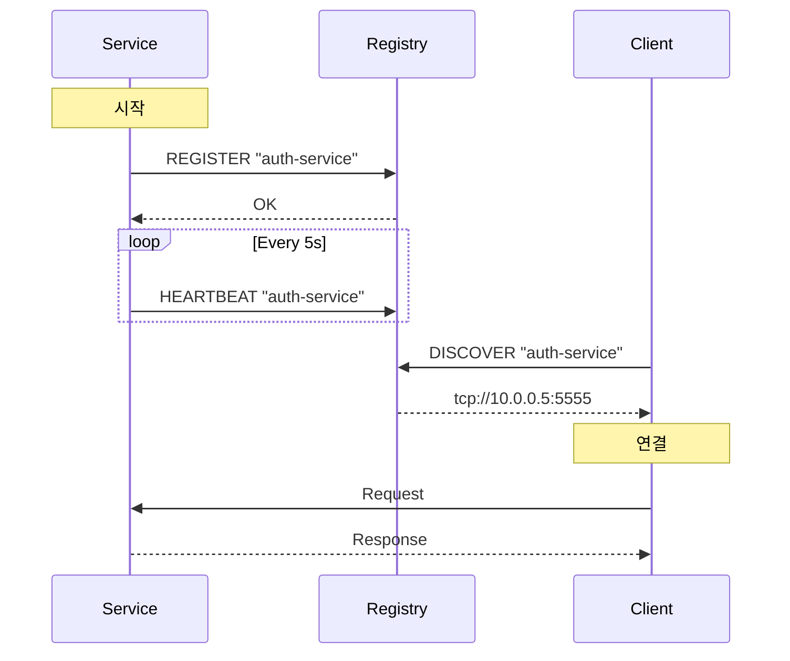

## 들어가며

**클러스터**는 여러 노드가 협력하여 하나의 시스템처럼 동작하는 것입니다. ZeroMQ의 **Clone 패턴**은 상태를 동기화하고, **Service Discovery**는 노드를 자동으로 찾으며, **분산 로깅**은 전체 시스템을 추적합니다.

## Clone 패턴

### 개념

**Clone 패턴**은 **Key-Value 저장소**를 여러 클라이언트에 **복제**합니다.



### 특징

- ✅ **최종 일관성**: 모든 클라이언트가 같은 상태로 수렴
- ✅ **Snapshot + Updates**: 초기 전체 데이터 + 증분 업데이트
- ✅ **낮은 지연**: 로컬 캐시에서 읽기
- ✅ **확장성**: PUB-SUB 기반

### Clone 프로토콜

```python
# clone_protocol.py

class CloneProtocol:
    """Clone 프로토콜"""

    # 메시지 타입
    SNAPSHOT = 1
    UPDATE = 2
    HUGZ = 3  # Heartbeat

    @staticmethod
    def encode_snapshot(kvmap, sequence):
        """Snapshot 메시지"""
        return {
            'type': CloneProtocol.SNAPSHOT,
            'sequence': sequence,
            'data': kvmap
        }

    @staticmethod
    def encode_update(key, value, sequence):
        """Update 메시지"""
        return {
            'type': CloneProtocol.UPDATE,
            'sequence': sequence,
            'key': key,
            'value': value
        }

    @staticmethod
    def encode_heartbeat(sequence):
        """Heartbeat 메시지"""
        return {
            'type': CloneProtocol.HUGZ,
            'sequence': sequence
        }
```

### Clone Server

```python
# clone_server.py
import zmq
import time
import json
from collections import OrderedDict

class CloneServer:
    """Clone Server"""

    def __init__(self):
        self.context = zmq.Context()

        # Snapshot socket (ROUTER)
        self.snapshot = self.context.socket(zmq.ROUTER)
        self.snapshot.bind("tcp://*:5556")

        # Publisher socket (PUB)
        self.publisher = self.context.socket(zmq.PUB)
        self.publisher.bind("tcp://*:5557")

        # Collector socket (PULL) - client updates
        self.collector = self.context.socket(zmq.PULL)
        self.collector.bind("tcp://*:5558")

        # Key-Value store
        self.kvmap = OrderedDict()
        self.sequence = 0

        print("Clone Server 시작")

    def run(self):
        """메인 루프"""
        poller = zmq.Poller()
        poller.register(self.snapshot, zmq.POLLIN)
        poller.register(self.collector, zmq.POLLIN)

        heartbeat_at = time.time() + 1.0

        while True:
            timeout = max(0, int((heartbeat_at - time.time()) * 1000))
            socks = dict(poller.poll(timeout))

            # Snapshot 요청
            if self.snapshot in socks:
                frames = self.snapshot.recv_multipart()
                identity = frames[0]
                request = frames[1]

                if request == b"ICANHAZ?":
                    self._send_snapshot(identity)

            # Client 업데이트
            if self.collector in socks:
                update = self.collector.recv_json()
                self._apply_update(update)

            # Heartbeat
            if time.time() >= heartbeat_at:
                self._send_heartbeat()
                heartbeat_at = time.time() + 1.0

    def _send_snapshot(self, identity):
        """Snapshot 전송"""
        print(f"Sending snapshot to {identity.hex()[:8]}")

        # Snapshot start
        self.snapshot.send_multipart([
            identity,
            b"",
            json.dumps({
                'type': 'KTHXBAI',
                'sequence': self.sequence
            }).encode()
        ])

        # Send all KV pairs
        for key, value in self.kvmap.items():
            self.snapshot.send_multipart([
                identity,
                b"",
                json.dumps({
                    'key': key,
                    'value': value,
                    'sequence': value['sequence']
                }).encode()
            ])

        # Snapshot end
        self.snapshot.send_multipart([
            identity,
            b"",
            json.dumps({
                'type': 'KTHXBAI',
                'sequence': self.sequence
            }).encode()
        ])

    def _apply_update(self, update):
        """업데이트 적용 및 배포"""
        self.sequence += 1

        key = update['key']
        value = {
            'value': update['value'],
            'sequence': self.sequence
        }

        self.kvmap[key] = value

        # PUB로 배포
        self.publisher.send_json({
            'key': key,
            'value': value['value'],
            'sequence': self.sequence
        })

        print(f"Update: {key} = {value['value']} (seq: {self.sequence})")

    def _send_heartbeat(self):
        """Heartbeat 전송"""
        self.publisher.send_json({
            'type': 'HUGZ',
            'sequence': self.sequence
        })

if __name__ == "__main__":
    server = CloneServer()
    server.run()
```

### Clone Client

```python
# clone_client.py
import zmq
import json
from collections import OrderedDict

class CloneClient:
    """Clone Client"""

    def __init__(self, server="tcp://localhost"):
        self.context = zmq.Context()

        # Snapshot socket (DEALER)
        self.snapshot = self.context.socket(zmq.DEALER)
        self.snapshot.connect(f"{server}:5556")

        # Subscriber socket (SUB)
        self.subscriber = self.context.socket(zmq.SUB)
        self.subscriber.connect(f"{server}:5557")
        self.subscriber.subscribe(b"")

        # Publisher socket (PUSH)
        self.publisher = self.context.socket(zmq.PUSH)
        self.publisher.connect(f"{server}:5558")

        # Local cache
        self.kvmap = OrderedDict()
        self.sequence = 0

        print("Clone Client 시작")

    def start(self):
        """Snapshot 요청"""
        # Request snapshot
        self.snapshot.send(b"ICANHAZ?")

        # Receive snapshot
        while True:
            data = json.loads(self.snapshot.recv())

            if data.get('type') == 'KTHXBAI':
                self.sequence = data['sequence']
                print(f"Snapshot complete (sequence: {self.sequence})")
                break

            # Apply to cache
            key = data['key']
            self.kvmap[key] = data['value']

    def run(self):
        """메인 루프 (updates 수신)"""
        poller = zmq.Poller()
        poller.register(self.subscriber, zmq.POLLIN)

        while True:
            socks = dict(poller.poll(1000))

            if self.subscriber in socks:
                update = self.subscriber.recv_json()

                if update.get('type') == 'HUGZ':
                    # Heartbeat
                    continue

                # Apply update
                if update['sequence'] > self.sequence:
                    self.sequence = update['sequence']
                    self.kvmap[update['key']] = update['value']

                    print(f"Update: {update['key']} = {update['value']}")

    def set(self, key, value):
        """값 설정 (서버로 전송)"""
        self.publisher.send_json({
            'key': key,
            'value': value
        })

    def get(self, key):
        """값 조회 (로컬 캐시)"""
        return self.kvmap.get(key)

# 사용
if __name__ == "__main__":
    client = CloneClient()
    client.start()

    # Set value
    client.set("name", "John")

    # Get value (from cache)
    print(f"name = {client.get('name')}")

    # Receive updates
    client.run()
```

## Service Discovery

### 개념

**Service Discovery**는 서비스를 **자동으로 찾고 등록**합니다.



### Registry Server

```python
# service_registry.py
import zmq
import time
from collections import defaultdict

class ServiceRegistry:
    """서비스 레지스트리"""

    def __init__(self):
        self.context = zmq.Context()

        # Registry socket (ROUTER)
        self.socket = self.context.socket(zmq.ROUTER)
        self.socket.bind("tcp://*:5555")

        # Services: {service_name: {endpoint, last_seen}}
        self.services = defaultdict(dict)

        self.heartbeat_timeout = 10.0  # 10초

        print("Service Registry 시작")

    def run(self):
        """메인 루프"""
        poller = zmq.Poller()
        poller.register(self.socket, zmq.POLLIN)

        while True:
            socks = dict(poller.poll(1000))

            if self.socket in socks:
                frames = self.socket.recv_multipart()
                identity = frames[0]
                message = json.loads(frames[2])

                self._handle_message(identity, message)

            # 타임아웃된 서비스 제거
            self._cleanup_services()

    def _handle_message(self, identity, message):
        """메시지 처리"""
        msg_type = message.get('type')

        if msg_type == 'REGISTER':
            self._register_service(identity, message)

        elif msg_type == 'HEARTBEAT':
            self._heartbeat_service(message)

        elif msg_type == 'DISCOVER':
            self._discover_service(identity, message)

        elif msg_type == 'UNREGISTER':
            self._unregister_service(message)

    def _register_service(self, identity, message):
        """서비스 등록"""
        service = message['service']
        endpoint = message['endpoint']

        self.services[service] = {
            'endpoint': endpoint,
            'last_seen': time.time()
        }

        print(f"✅ Registered: {service} at {endpoint}")

        self.socket.send_multipart([
            identity,
            b"",
            json.dumps({'status': 'OK'}).encode()
        ])

    def _heartbeat_service(self, message):
        """Heartbeat 수신"""
        service = message['service']

        if service in self.services:
            self.services[service]['last_seen'] = time.time()

    def _discover_service(self, identity, message):
        """서비스 검색"""
        service = message['service']

        if service in self.services:
            endpoint = self.services[service]['endpoint']

            self.socket.send_multipart([
                identity,
                b"",
                json.dumps({
                    'status': 'FOUND',
                    'endpoint': endpoint
                }).encode()
            ])

            print(f"🔍 Discovered: {service} -> {endpoint}")
        else:
            self.socket.send_multipart([
                identity,
                b"",
                json.dumps({'status': 'NOT_FOUND'}).encode()
            ])

    def _unregister_service(self, message):
        """서비스 등록 해제"""
        service = message['service']

        if service in self.services:
            del self.services[service]
            print(f"❌ Unregistered: {service}")

    def _cleanup_services(self):
        """타임아웃된 서비스 제거"""
        now = time.time()
        expired = [
            name for name, info in self.services.items()
            if now - info['last_seen'] > self.heartbeat_timeout
        ]

        for service in expired:
            del self.services[service]
            print(f"⏰ Timeout: {service}")

if __name__ == "__main__":
    registry = ServiceRegistry()
    registry.run()
```

### Service Client

```python
# service_client.py
import zmq
import json
import threading
import time

class ServiceClient:
    """서비스 클라이언트"""

    def __init__(self, service_name, endpoint,
                 registry="tcp://localhost:5555"):
        self.service_name = service_name
        self.endpoint = endpoint
        self.registry_address = registry

        self.context = zmq.Context()
        self.registry = self.context.socket(zmq.DEALER)
        self.registry.connect(registry)

        # Heartbeat 스레드
        self.running = True
        self.heartbeat_thread = threading.Thread(target=self._heartbeat_loop)
        self.heartbeat_thread.daemon = True

    def register(self):
        """서비스 등록"""
        self.registry.send_json({
            'type': 'REGISTER',
            'service': self.service_name,
            'endpoint': self.endpoint
        })

        response = self.registry.recv_json()

        if response['status'] == 'OK':
            print(f"✅ Registered: {self.service_name}")
            self.heartbeat_thread.start()
        else:
            print(f"❌ Registration failed")

    def _heartbeat_loop(self):
        """Heartbeat 전송"""
        while self.running:
            time.sleep(5)

            self.registry.send_json({
                'type': 'HEARTBEAT',
                'service': self.service_name
            })

    def discover(self, service):
        """서비스 검색"""
        self.registry.send_json({
            'type': 'DISCOVER',
            'service': service
        })

        response = self.registry.recv_json()

        if response['status'] == 'FOUND':
            return response['endpoint']
        else:
            return None

    def unregister(self):
        """등록 해제"""
        self.running = False

        self.registry.send_json({
            'type': 'UNREGISTER',
            'service': self.service_name
        })

        print(f"❌ Unregistered: {self.service_name}")

# 사용
if __name__ == "__main__":
    client = ServiceClient("auth-service", "tcp://10.0.0.5:5555")
    client.register()

    # Discover another service
    db_endpoint = client.discover("db-service")
    print(f"DB Service: {db_endpoint}")

    time.sleep(30)
    client.unregister()
```

## 분산 로깅

### Log Collector

```python
# log_collector.py
import zmq
import json
import time
from datetime import datetime

class LogCollector:
    """분산 로그 수집기"""

    def __init__(self):
        self.context = zmq.Context()

        # Log receiver (PULL)
        self.receiver = self.context.socket(zmq.PULL)
        self.receiver.bind("tcp://*:5559")

        # Log publisher (PUB)
        self.publisher = self.context.socket(zmq.PUB)
        self.publisher.bind("tcp://*:5560")

        print("Log Collector 시작")

    def run(self):
        """로그 수집 및 배포"""
        while True:
            log = self.receiver.recv_json()

            # 타임스탬프 추가
            log['collected_at'] = time.time()

            # 출력
            self._print_log(log)

            # 재배포
            self.publisher.send_json(log)

            # 파일에 저장 (선택적)
            # self._save_log(log)

    def _print_log(self, log):
        """로그 출력"""
        timestamp = datetime.fromtimestamp(log['timestamp'])
        level = log['level']
        source = log['source']
        message = log['message']

        color = {
            'DEBUG': '\033[36m',    # Cyan
            'INFO': '\033[32m',     # Green
            'WARNING': '\033[33m',  # Yellow
            'ERROR': '\033[31m',    # Red
            'CRITICAL': '\033[35m'  # Magenta
        }.get(level, '')

        reset = '\033[0m'

        print(f"{color}[{timestamp}] [{level}] {source}: {message}{reset}")

    def _save_log(self, log):
        """로그 파일 저장"""
        date = datetime.fromtimestamp(log['timestamp']).strftime('%Y-%m-%d')
        filename = f"logs/{date}.log"

        with open(filename, 'a') as f:
            f.write(json.dumps(log) + '\n')

if __name__ == "__main__":
    collector = LogCollector()
    collector.run()
```

### Logger Client

```python
# distributed_logger.py
import zmq
import json
import time
import socket

class DistributedLogger:
    """분산 로거"""

    def __init__(self, source_name, collector="tcp://localhost:5559"):
        self.source_name = source_name
        self.hostname = socket.gethostname()

        self.context = zmq.Context()
        self.sender = self.context.socket(zmq.PUSH)
        self.sender.connect(collector)

    def log(self, level, message, **kwargs):
        """로그 전송"""
        log_entry = {
            'timestamp': time.time(),
            'level': level,
            'source': self.source_name,
            'hostname': self.hostname,
            'message': message,
            **kwargs
        }

        self.sender.send_json(log_entry)

    def debug(self, message, **kwargs):
        self.log('DEBUG', message, **kwargs)

    def info(self, message, **kwargs):
        self.log('INFO', message, **kwargs)

    def warning(self, message, **kwargs):
        self.log('WARNING', message, **kwargs)

    def error(self, message, **kwargs):
        self.log('ERROR', message, **kwargs)

    def critical(self, message, **kwargs):
        self.log('CRITICAL', message, **kwargs)

# 사용
logger = DistributedLogger("web-server-01")

logger.info("Server started")
logger.warning("High memory usage", memory_percent=85)
logger.error("Database connection failed", db="postgres")
```

## 다음 단계

클러스터 패턴을 마스터했습니다! 다음 글에서는:
- **언어 바인딩** - Python, Node.js, Go
- 크로스 언어 통신
- 바인딩별 특징

---

**시리즈 목차**
1-15. (이전 글들)
16. **클러스터 패턴 - Clone, Service Discovery, 분산 로깅** ← 현재 글
17. 언어 바인딩 (다음 글)

> 💡 **Quick Tip**: Service Discovery는 클라우드 환경에서 필수! 동적으로 확장/축소되는 서비스를 자동으로 찾습니다!
