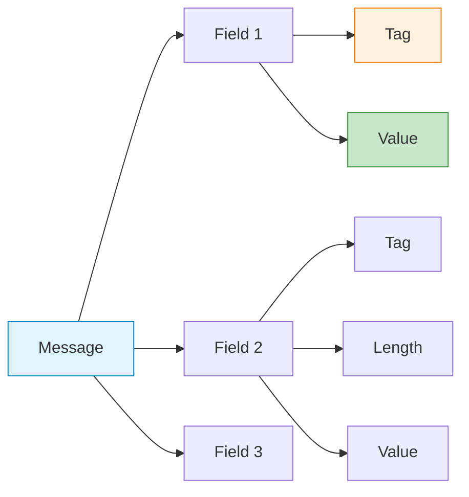
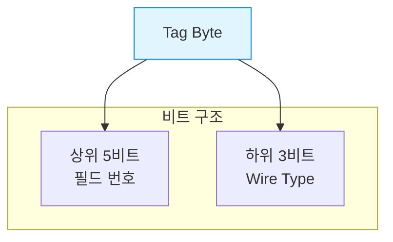
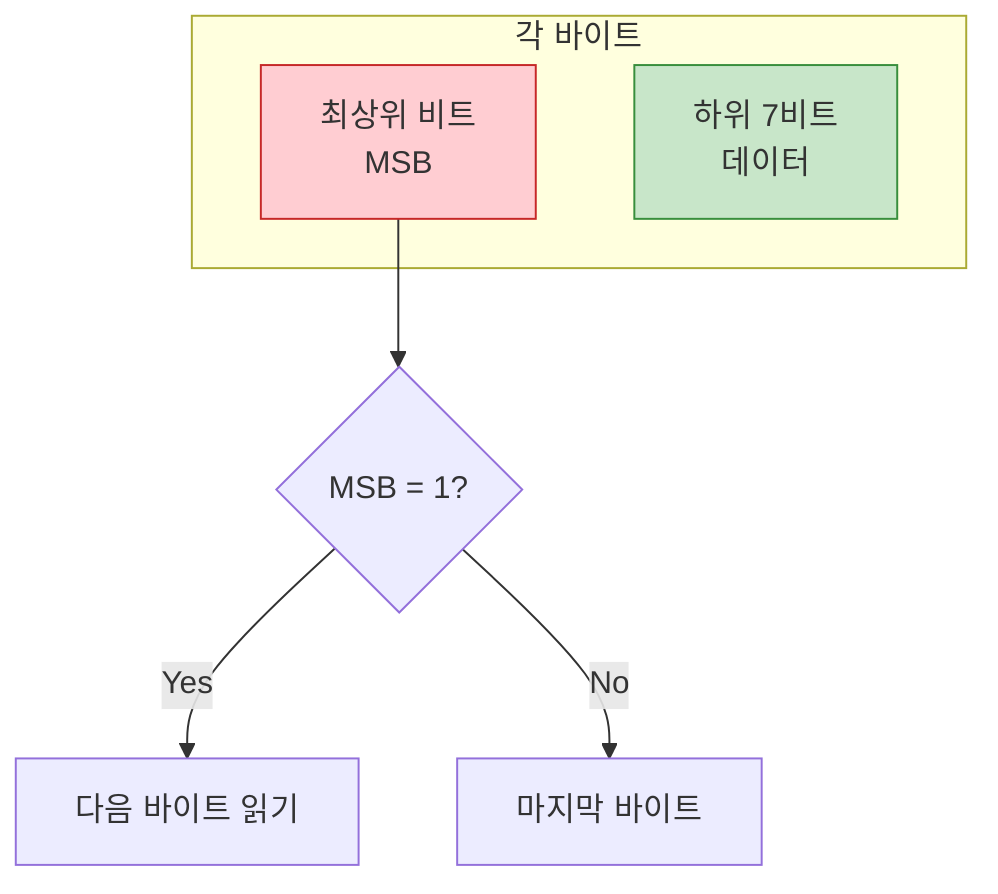
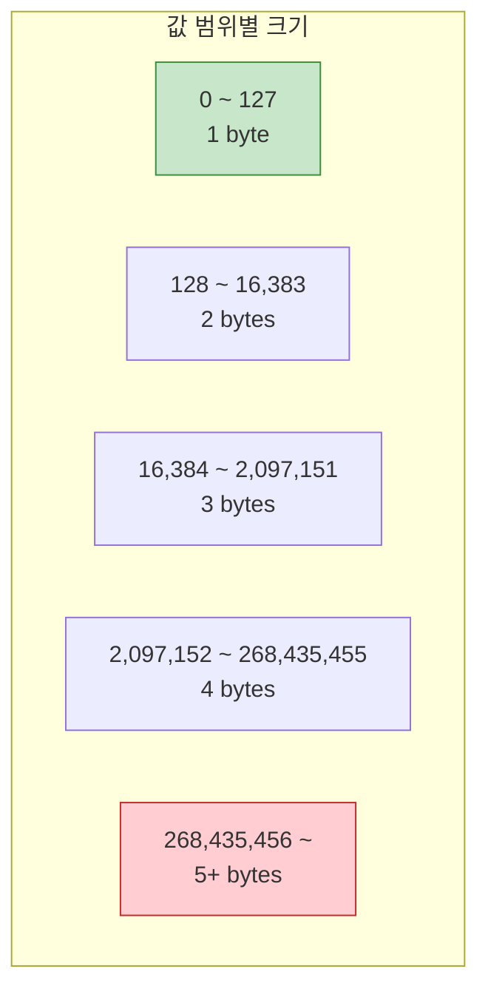
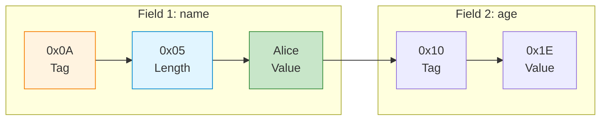
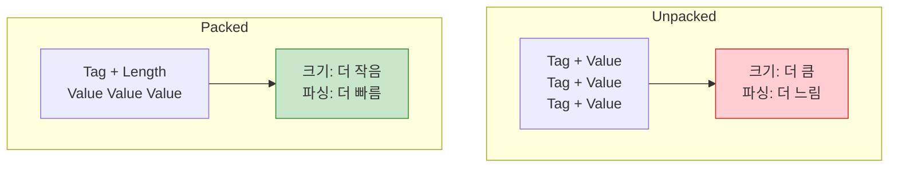
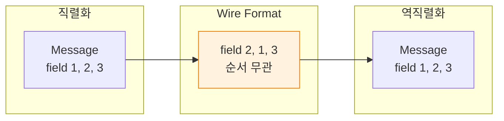

## 들어가며

Protobuf의 효율성은 **Wire Format**에서 나옵니다. 바이너리 인코딩 원리를 이해하면 메시지 크기를 최적화하고 성능을 극대화할 수 있습니다.

## Wire Format 기본

### 구조 개요



**Wire Format = Tag + Value (+ Length)**

### Tag 구조

Tag는 **필드 번호**와 **Wire Type**을 인코딩합니다.

```
Tag = (field_number << 3) | wire_type
```



### Wire Type 종류

| Wire Type | 값 | 사용 타입 | 인코딩 |
|-----------|---|----------|--------|
| **VARINT** | 0 | int32, int64, uint32, uint64, sint32, sint64, bool, enum | Varint |
| **I64** | 1 | fixed64, sfixed64, double | 8 bytes |
| **LEN** | 2 | string, bytes, embedded messages, repeated packed | Length-delimited |
| **SGROUP** | 3 | group start (deprecated) | - |
| **EGROUP** | 4 | group end (deprecated) | - |
| **I32** | 5 | fixed32, sfixed32, float | 4 bytes |

## Varint 인코딩

**Varint**는 가변 길이 정수 인코딩입니다.

### Varint 원리



**규칙**:
- MSB = 1: 계속 읽기
- MSB = 0: 마지막 바이트
- Little-endian (하위 바이트 먼저)

### Varint 예제

**숫자 1 인코딩**:

```
값: 1
이진: 0000 0001
Varint: 0000 0001
        ^
        MSB=0 (마지막 바이트)

결과: 1 byte (0x01)
```

**숫자 300 인코딩**:

```
값: 300
이진: 0000 0001 0010 1100

1. 7비트씩 분할 (역순):
   010 1100 | 000 0010

2. MSB 추가:
   1010 1100 | 0000 0010
   ^           ^
   MSB=1       MSB=0

결과: 2 bytes (0xAC 0x02)
```

**검증**:

```python
# 디코딩
byte1 = 0xAC  # 1010 1100
byte2 = 0x02  # 0000 0010

value = (byte1 & 0x7F) | ((byte2 & 0x7F) << 7)
      = 0x2C | (0x02 << 7)
      = 44 | 256
      = 300
```

### Varint 크기



**Python 구현**:

```python
def encode_varint(value):
    """값을 Varint로 인코딩"""
    result = []
    while True:
        byte = value & 0x7F
        value >>= 7
        if value != 0:
            byte |= 0x80  # MSB 설정
        result.append(byte)
        if value == 0:
            break
    return bytes(result)

def decode_varint(data):
    """Varint 디코딩"""
    result = 0
    shift = 0
    for byte in data:
        result |= (byte & 0x7F) << shift
        if (byte & 0x80) == 0:
            break
        shift += 7
    return result

# 테스트
print(encode_varint(1).hex())    # 01
print(encode_varint(300).hex())  # ac02
print(decode_varint(bytes([0xAC, 0x02])))  # 300
```

### ZigZag 인코딩 (부호 있는 정수)

**문제**: 음수는 Varint로 비효율적

```
-1 (int32):
  Two's complement: 0xFFFFFFFF
  Varint: 5 bytes (최악!)
```

**해결**: ZigZag 인코딩

```
ZigZag(n) = (n << 1) ^ (n >> 31)  # int32
ZigZag(n) = (n << 1) ^ (n >> 63)  # int64
```

**매핑**:

| 원본 | ZigZag | Varint 크기 |
|------|--------|-------------|
| 0 | 0 | 1 byte |
| -1 | 1 | 1 byte |
| 1 | 2 | 1 byte |
| -2 | 3 | 1 byte |
| 2 | 4 | 1 byte |
| -64 | 127 | 1 byte |

```python
def zigzag_encode(n):
    """부호 있는 정수를 ZigZag 인코딩"""
    return (n << 1) ^ (n >> 31)  # int32

def zigzag_decode(n):
    """ZigZag 디코딩"""
    return (n >> 1) ^ (-(n & 1))

# 테스트
print(zigzag_encode(0))   # 0
print(zigzag_encode(-1))  # 1
print(zigzag_encode(1))   # 2
print(zigzag_encode(-2))  # 3
print(zigzag_decode(1))   # -1
```

## 필드 인코딩

### 기본 메시지 예제

```protobuf
message User {
  string name = 1;
  int32 age = 2;
}
```

**인코딩**:

```python
user = User()
user.name = "Alice"
user.age = 30
```

**Wire Format (16진수)**:

```
0A 05 41 6C 69 63 65  0A: tag (field 1, LEN)
                      05: length (5 bytes)
                      41 6C 69 63 65: "Alice" (UTF-8)

10 1E                 10: tag (field 2, VARINT)
                      1E: value (30)
```

**바이트별 분석**:



**Tag 계산**:

```python
# Field 1: name (string, LEN)
tag1 = (1 << 3) | 2
     = 8 | 2
     = 10 (0x0A)

# Field 2: age (int32, VARINT)
tag2 = (2 << 3) | 0
     = 16 | 0
     = 16 (0x10)
```

### 타입별 인코딩

**int32/int64 (VARINT)**:

```protobuf
message Example {
  int32 value = 1;
}
```

```
value = 150

Wire Format:
08 96 01    08: tag (field 1, VARINT)
            96 01: varint(150)
```

**fixed32/fixed64**:

```protobuf
message Example {
  fixed32 value = 1;
}
```

```
value = 150

Wire Format:
0D 96 00 00 00    0D: tag (field 1, I32)
                  96 00 00 00: 150 (little-endian)
```

**string/bytes (LEN)**:

```protobuf
message Example {
  string text = 1;
  bytes data = 2;
}
```

```
text = "Hi"
data = [0x01, 0x02, 0x03]

Wire Format:
0A 02 48 69          0A: tag (field 1, LEN)
                     02: length
                     48 69: "Hi"

12 03 01 02 03       12: tag (field 2, LEN)
                     03: length
                     01 02 03: data
```

**embedded message**:

```protobuf
message Address {
  string city = 1;
}

message User {
  Address address = 1;
}
```

```
address.city = "Seoul"

Wire Format:
0A 07              0A: tag (field 1, LEN)
  07: length (7 bytes)
  0A 05 53 65 6F 75 6C
    0A: tag (Address.field 1, LEN)
    05: length
    53 65 6F 75 6C: "Seoul"
```

## Repeated와 Packed

### Unpacked (기본)

```protobuf
message Example {
  repeated int32 values = 1;
}
```

```
values = [1, 2, 3]

Wire Format (unpacked):
08 01    tag + value
08 02    tag + value
08 03    tag + value

총: 6 bytes
```

### Packed

```protobuf
message Example {
  repeated int32 values = 1 [packed = true];  // Proto3 기본값
}
```

```
values = [1, 2, 3]

Wire Format (packed):
0A 03 01 02 03    0A: tag (field 1, LEN)
                  03: length (3 bytes)
                  01 02 03: values

총: 5 bytes
```

**성능 비교**:



## 크기 최적화

### 1. 필드 번호 최적화

```protobuf
message User {
  // 자주 사용하는 필드: 1-15 (1 byte tag)
  string name = 1;
  int32 age = 2;
  string email = 3;

  // 덜 사용하는 필드: 16+ (2+ bytes tag)
  string bio = 16;
  string website = 17;
}
```

**Tag 크기**:

| 필드 번호 | Tag 크기 |
|----------|---------|
| 1-15 | 1 byte |
| 16-2047 | 2 bytes |
| 2048-262143 | 3 bytes |

### 2. 타입 선택

```protobuf
message Stats {
  // ❌ 비효율적 (음수 아닌데 int32 사용)
  int32 count = 1;  // 큰 양수는 5 bytes

  // ✅ 효율적
  uint32 count = 2;  // 1-4 bytes

  // ❌ 비효율적 (양수 더 많은데 int32)
  int32 delta = 3;  // -1 = 5 bytes

  // ✅ 효율적
  sint32 delta = 4;  // -1 = 1 byte (ZigZag)

  // ❌ 비효율적 (항상 4 bytes)
  fixed32 id = 5;

  // ✅ 효율적 (작은 값 많으면)
  uint32 id = 6;  // 1-4 bytes
}
```

**타입별 크기 비교**:

| 값 | int32 | uint32 | sint32 | fixed32 |
|----|-------|--------|--------|---------|
| 0 | 1 | 1 | 1 | 4 |
| 1 | 1 | 1 | 1 | 4 |
| -1 | 5 | N/A | 1 | N/A |
| 127 | 1 | 1 | 2 | 4 |
| 128 | 2 | 2 | 2 | 4 |
| 2^28 | 5 | 5 | 5 | 4 |

### 3. String vs Bytes

```protobuf
message Data {
  string text = 1;    // UTF-8 검증
  bytes binary = 2;   // 검증 없음
}
```

- `string`: UTF-8 검증 오버헤드
- `bytes`: 바이너리 데이터에 더 효율적

### 4. Repeated Packing

```protobuf
message Metrics {
  // Proto3에서 자동으로 packed
  repeated int32 values = 1;

  // Proto2에서는 명시적 지정
  repeated int32 values = 1 [packed = true];
}
```

## 실전 예제: 크기 분석

```protobuf
message Product {
  uint32 id = 1;           // 1-4 bytes tag + 1-5 bytes value
  string name = 2;         // 1 byte tag + length + UTF-8
  double price = 3;        // 1 byte tag + 8 bytes
  repeated string tags = 4;  // tag + length per item
}
```

**인스턴스**:

```python
product = Product()
product.id = 123              # tag(1) + varint(1) = 2 bytes
product.name = "Laptop"       # tag(1) + len(1) + 6 = 8 bytes
product.price = 999.99        # tag(1) + 8 = 9 bytes
product.tags.extend(["tech", "portable"])
                              # tag(1) + len(1) + 4 = 6 bytes (tech)
                              # tag(1) + len(1) + 8 = 10 bytes (portable)

# 총: 2 + 8 + 9 + 6 + 10 = 35 bytes
```

**vs JSON**:

```json
{
  "id": 123,
  "name": "Laptop",
  "price": 999.99,
  "tags": ["tech", "portable"]
}
```

JSON: ~80 bytes (공백 포함)

**절감률**: 56%

## Wire Format 파싱

### Python 예제

```python
import struct

def parse_wire_format(data):
    """Wire Format 파싱"""
    offset = 0

    while offset < len(data):
        # Tag 읽기
        tag, offset = decode_varint_from(data, offset)
        field_number = tag >> 3
        wire_type = tag & 0x07

        print(f"Field {field_number}, Wire Type {wire_type}")

        if wire_type == 0:  # VARINT
            value, offset = decode_varint_from(data, offset)
            print(f"  Value: {value}")

        elif wire_type == 1:  # I64
            value = struct.unpack('<d', data[offset:offset+8])[0]
            offset += 8
            print(f"  Value: {value}")

        elif wire_type == 2:  # LEN
            length, offset = decode_varint_from(data, offset)
            value = data[offset:offset+length]
            offset += length
            try:
                print(f"  Value: {value.decode('utf-8')}")
            except:
                print(f"  Value: {value.hex()}")

        elif wire_type == 5:  # I32
            value = struct.unpack('<f', data[offset:offset+4])[0]
            offset += 4
            print(f"  Value: {value}")

def decode_varint_from(data, offset):
    """특정 오프셋부터 Varint 디코딩"""
    result = 0
    shift = 0
    while offset < len(data):
        byte = data[offset]
        offset += 1
        result |= (byte & 0x7F) << shift
        if (byte & 0x80) == 0:
            break
        shift += 7
    return result, offset

# 사용
from user_pb2 import User

user = User()
user.name = "Alice"
user.age = 30

data = user.SerializeToString()
print(f"Wire Format: {data.hex()}")
parse_wire_format(data)
```

## 필드 순서

**중요**: Wire Format은 필드 순서를 보장하지 않습니다!



- 파서는 필드 번호로 식별
- 필드 순서는 의미 없음
- Unknown 필드는 건너뜀

## Best Practices

| 원칙 | 이유 |
|------|------|
| **작은 필드 번호 사용** | 자주 쓰는 필드는 1-15 |
| **올바른 타입 선택** | sint32 vs int32, uint32 |
| **Packed 사용** | Repeated 숫자 필드 |
| **String 최소화** | UTF-8 검증 오버헤드 |
| **필드 재사용 금지** | Reserved 사용 |

## 다음 단계

Wire Format을 마스터했습니다! 다음 글에서는:
- **하위 호환성**
- 안전한 스키마 변경
- 마이그레이션 전략

---

**시리즈 목차**
1. Protocol Buffers란 무엇인가
2. Protocol Buffers 고급 스키마 설계
3. gRPC와 Protobuf - 고성능 RPC
4. Protobuf 실전 활용 - 마이크로서비스
5. Protobuf 성능 최적화 및 Best Practices
6. Proto3 고급 기능
7. 서비스와 RPC 정의
8. Reflection과 동적 메시지
9. Extensions와 플러그인
10. JSON 변환
11. 코드 생성 상세
12. **Wire Format 이해** ← 현재 글
13. 하위 호환성 (다음 글)

> 💡 **Quick Tip**: 작은 양수가 많다면 uint32, 음수와 양수가 섞여있다면 sint32를 사용하세요. int32는 음수에 5 bytes를 사용합니다!
