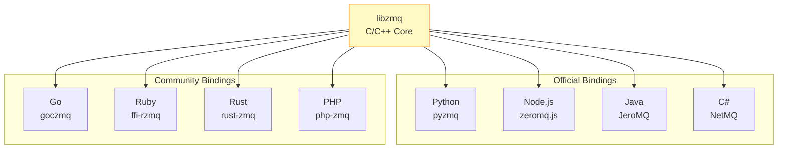
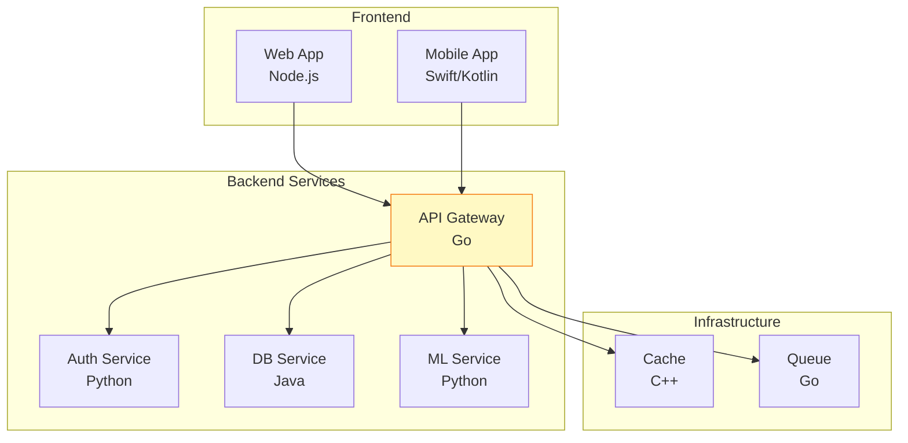

## 들어가며

ZeroMQ의 진정한 힘은 **40+ 언어 지원**입니다. Python으로 작성한 클라이언트가 Go 서버와 통신하고, Node.js가 C++ Worker와 협력합니다. **언어 장벽이 없는** 세계입니다.

## 지원 언어

### 주요 언어 바인딩



## Python (pyzmq)

### 설치

```bash
pip install pyzmq
```

### 기본 사용법

```python
# python_server.py
import zmq

context = zmq.Context()
socket = context.socket(zmq.REP)
socket.bind("tcp://*:5555")

print("Python Server 시작")

while True:
    message = socket.recv_string()
    print(f"수신: {message}")

    socket.send_string(f"Python says: {message}")
```

### 고급 기능

```python
# python_advanced.py
import zmq
import json

context = zmq.Context()

# 비동기 수신 (타임아웃)
socket = context.socket(zmq.REQ)
socket.setsockopt(zmq.RCVTIMEO, 2000)  # 2초
socket.connect("tcp://localhost:5555")

try:
    socket.send_string("Hello")
    reply = socket.recv_string()
    print(f"응답: {reply}")
except zmq.Again:
    print("타임아웃!")

# Multipart 메시지
socket = context.socket(zmq.DEALER)
socket.send_multipart([
    b"",
    b"Header",
    json.dumps({"key": "value"}).encode()
])

# Poller로 여러 소켓 모니터링
poller = zmq.Poller()
poller.register(socket1, zmq.POLLIN)
poller.register(socket2, zmq.POLLIN)

socks = dict(poller.poll(timeout=1000))

if socket1 in socks:
    message = socket1.recv()
    print(f"Socket1: {message}")

if socket2 in socks:
    message = socket2.recv()
    print(f"Socket2: {message}")
```

### asyncio 통합

```python
# python_asyncio.py
import zmq
import zmq.asyncio
import asyncio

async def async_server():
    context = zmq.asyncio.Context()
    socket = context.socket(zmq.REP)
    socket.bind("tcp://*:5555")

    print("Async Server 시작")

    while True:
        message = await socket.recv_string()
        print(f"수신: {message}")

        await asyncio.sleep(1)  # 비동기 처리

        await socket.send_string(f"Async reply: {message}")

asyncio.run(async_server())
```

## Node.js (zeromq.js)

### 설치

```bash
npm install zeromq
```

### 기본 사용법

```javascript
// nodejs_server.js
const zmq = require("zeromq");

async function run() {
  const sock = new zmq.Reply();

  await sock.bind("tcp://*:5556");
  console.log("Node.js Server 시작");

  for await (const [msg] of sock) {
    console.log(`수신: ${msg.toString()}`);
    await sock.send(`Node.js says: ${msg}`);
  }
}

run();
```

### 고급 기능

```javascript
// nodejs_advanced.js
const zmq = require("zeromq");

async function advancedClient() {
  const sock = new zmq.Request();

  // 옵션 설정
  sock.sendTimeout = 2000; // 2초
  sock.receiveTimeout = 2000;

  await sock.connect("tcp://localhost:5555");

  // 비동기 요청-응답
  await sock.send("Hello from Node.js");

  try {
    const [msg] = await sock.receive();
    console.log(`응답: ${msg.toString()}`);
  } catch (err) {
    console.log("타임아웃!");
  }

  sock.close();
}

// Dealer-Router
async function dealerExample() {
  const dealer = new zmq.Dealer();
  await dealer.connect("tcp://localhost:5555");

  // Multipart 메시지
  await dealer.send([
    Buffer.from(""),
    Buffer.from("Header"),
    Buffer.from(JSON.stringify({ key: "value" }))
  ]);

  const frames = await dealer.receive();
  console.log(`Frames: ${frames.length}`);

  dealer.close();
}

advancedClient();
```

### TypeScript 지원

```typescript
// nodejs_typescript.ts
import * as zmq from "zeromq";

interface Message {
  type: string;
  data: any;
}

async function typedServer(): Promise<void> {
  const sock: zmq.Reply = new zmq.Reply();

  await sock.bind("tcp://*:5556");
  console.log("TypeScript Server 시작");

  for await (const [msgBuffer] of sock) {
    const message: Message = JSON.parse(msgBuffer.toString());

    console.log(`Type: ${message.type}, Data: ${message.data}`);

    const reply: Message = {
      type: "REPLY",
      data: `Processed ${message.data}`
    };

    await sock.send(JSON.stringify(reply));
  }
}

typedServer();
```

## Go (goczmq)

### 설치

```bash
go get github.com/zeromq/goczmq
```

### 기본 사용법

```go
// go_server.go
package main

import (
    "fmt"
    "github.com/zeromq/goczmq"
)

func main() {
    // REP 소켓 생성
    rep, err := goczmq.NewRep("tcp://*:5557")
    if err != nil {
        panic(err)
    }
    defer rep.Destroy()

    fmt.Println("Go Server 시작")

    for {
        // 메시지 수신
        msg, err := rep.RecvMessage()
        if err != nil {
            fmt.Println("Error:", err)
            continue
        }

        fmt.Printf("수신: %s\n", string(msg[0]))

        // 응답 전송
        reply := []byte(fmt.Sprintf("Go says: %s", string(msg[0])))
        err = rep.SendMessage([][]byte{reply})
        if err != nil {
            fmt.Println("Error:", err)
        }
    }
}
```

### 고급 기능

```go
// go_advanced.go
package main

import (
    "fmt"
    "time"
    "github.com/zeromq/goczmq"
)

func main() {
    // DEALER 소켓
    dealer, _ := goczmq.NewDealer("tcp://localhost:5555")
    defer dealer.Destroy()

    // 타임아웃 설정
    dealer.SetRcvtimeo(2000) // 2초

    // Multipart 메시지 전송
    frames := [][]byte{
        []byte(""),
        []byte("Header"),
        []byte(`{"key": "value"}`),
    }

    err := dealer.SendMessage(frames)
    if err != nil {
        fmt.Println("Send error:", err)
        return
    }

    // 수신
    reply, err := dealer.RecvMessage()
    if err != nil {
        fmt.Println("Timeout or error:", err)
        return
    }

    fmt.Printf("Reply: %s\n", string(reply[0]))
}

// Poller 사용
func pollerExample() {
    sock1, _ := goczmq.NewReq("tcp://localhost:5555")
    sock2, _ := goczmq.NewReq("tcp://localhost:5556")
    defer sock1.Destroy()
    defer sock2.Destroy()

    // Poller 생성
    poller, _ := goczmq.NewPoller(sock1, sock2)
    defer poller.Destroy()

    // Poll
    sock := poller.Wait(1000) // 1초
    switch sock {
    case sock1:
        msg, _ := sock1.RecvMessage()
        fmt.Printf("Sock1: %s\n", string(msg[0]))
    case sock2:
        msg, _ := sock2.RecvMessage()
        fmt.Printf("Sock2: %s\n", string(msg[0]))
    default:
        fmt.Println("Timeout")
    }
}
```

### Goroutine과 함께

```go
// go_concurrent.go
package main

import (
    "fmt"
    "sync"
    "github.com/zeromq/goczmq"
)

func worker(id int, wg *sync.WaitGroup) {
    defer wg.Done()

    // 각 Worker는 독립적인 소켓
    req, _ := goczmq.NewReq("tcp://localhost:5555")
    defer req.Destroy()

    // 요청 전송
    msg := []byte(fmt.Sprintf("Worker %d", id))
    req.SendMessage([][]byte{msg})

    // 응답 수신
    reply, _ := req.RecvMessage()
    fmt.Printf("Worker %d: %s\n", id, string(reply[0]))
}

func main() {
    var wg sync.WaitGroup

    // 10개 Worker 동시 실행
    for i := 0; i < 10; i++ {
        wg.Add(1)
        go worker(i, &wg)
    }

    wg.Wait()
}
```

## 크로스 언어 통신

### 예제: Python Client → Go Server

**Go Server**:

```go
// go_server.go
package main

import (
    "fmt"
    "github.com/zeromq/goczmq"
)

func main() {
    rep, _ := goczmq.NewRep("tcp://*:5555")
    defer rep.Destroy()

    fmt.Println("Go Server listening on :5555")

    for {
        msg, _ := rep.RecvMessage()
        fmt.Printf("Received from client: %s\n", string(msg[0]))

        reply := []byte(fmt.Sprintf("Go processed: %s", string(msg[0])))
        rep.SendMessage([][]byte{reply})
    }
}
```

**Python Client**:

```python
# python_client.py
import zmq

context = zmq.Context()
socket = context.socket(zmq.REQ)
socket.connect("tcp://localhost:5555")

for i in range(5):
    message = f"Python request {i}"
    print(f"Sending: {message}")

    socket.send_string(message)
    reply = socket.recv_string()

    print(f"Reply: {reply}")
```

### 예제: Node.js Publisher → Python Subscriber

**Node.js Publisher**:

```javascript
// nodejs_pub.js
const zmq = require("zeromq");

async function publish() {
  const sock = new zmq.Publisher();
  await sock.bind("tcp://*:5556");

  console.log("Node.js Publisher started");

  for (let i = 0; i < 100; i++) {
    const topic = i % 2 === 0 ? "even" : "odd";
    const message = `${topic} ${i}`;

    await sock.send(message);
    console.log(`Published: ${message}`);

    await new Promise(resolve => setTimeout(resolve, 1000));
  }
}

publish();
```

**Python Subscriber**:

```python
# python_sub.py
import zmq

context = zmq.Context()
socket = context.socket(zmq.SUB)
socket.connect("tcp://localhost:5556")
socket.subscribe(b"even")  # Only even numbers

print("Python Subscriber (filtering 'even')")

while True:
    message = socket.recv_string()
    print(f"Received: {message}")
```

## 프로토콜 표준화

### JSON 통신

```python
# python_json.py
import zmq
import json

context = zmq.Context()
socket = context.socket(zmq.REQ)
socket.connect("tcp://localhost:5555")

# JSON 요청
request = {
    "method": "get_user",
    "params": {"id": 123}
}

socket.send_json(request)
reply = socket.recv_json()

print(f"Reply: {reply}")
```

```javascript
// nodejs_json.js
const zmq = require("zeromq");

async function jsonServer() {
  const sock = new zmq.Reply();
  await sock.bind("tcp://*:5555");

  for await (const [msgBuffer] of sock) {
    const request = JSON.parse(msgBuffer.toString());

    console.log(`Method: ${request.method}`);

    const reply = {
      result: { name: "John", age: 30 },
      error: null
    };

    await sock.send(JSON.stringify(reply));
  }
}

jsonServer();
```

### MessagePack 통신

```python
# python_msgpack.py
import zmq
import msgpack

context = zmq.Context()
socket = context.socket(zmq.REQ)
socket.connect("tcp://localhost:5555")

# MessagePack 인코딩
data = {"method": "get_user", "params": {"id": 123}}
packed = msgpack.packb(data)

socket.send(packed)
reply_packed = socket.recv()

reply = msgpack.unpackb(reply_packed)
print(f"Reply: {reply}")
```

```go
// go_msgpack.go
package main

import (
    "fmt"
    "github.com/zeromq/goczmq"
    "github.com/vmihailenco/msgpack/v5"
)

type Request struct {
    Method string                 `msgpack:"method"`
    Params map[string]interface{} `msgpack:"params"`
}

type Reply struct {
    Result interface{} `msgpack:"result"`
    Error  string      `msgpack:"error"`
}

func main() {
    rep, _ := goczmq.NewRep("tcp://*:5555")
    defer rep.Destroy()

    for {
        msg, _ := rep.RecvMessage()

        // Unpack
        var request Request
        msgpack.Unmarshal(msg[0], &request)

        fmt.Printf("Method: %s\n", request.Method)

        // Process and reply
        reply := Reply{
            Result: map[string]interface{}{"name": "John", "age": 30},
            Error:  "",
        }

        packed, _ := msgpack.Marshal(reply)
        rep.SendMessage([][]byte{packed})
    }
}
```

## 언어별 특징 비교

| 언어 | 바인딩 | 성능 | 비동기 | 타입 안전성 | 생태계 |
|------|--------|------|--------|-------------|--------|
| **C/C++** | libzmq (네이티브) | ⭐⭐⭐⭐⭐ | Manual | ⭐⭐ | ⭐⭐⭐ |
| **Python** | pyzmq | ⭐⭐⭐ | asyncio | ⭐⭐ | ⭐⭐⭐⭐⭐ |
| **Node.js** | zeromq.js | ⭐⭐⭐⭐ | Native | ⭐⭐⭐ | ⭐⭐⭐⭐ |
| **Go** | goczmq | ⭐⭐⭐⭐ | Goroutine | ⭐⭐⭐⭐ | ⭐⭐⭐ |
| **Java** | JeroMQ | ⭐⭐⭐ | Java NIO | ⭐⭐⭐⭐⭐ | ⭐⭐⭐ |
| **C#** | NetMQ | ⭐⭐⭐ | async/await | ⭐⭐⭐⭐⭐ | ⭐⭐⭐ |

## 실전 폴리글랏 아키텍처



## 다음 단계

언어 바인딩을 마스터했습니다! 다음 글에서는:
- **ZeroMQ vs 대안 기술** - RabbitMQ, Kafka, NATS
- 비교 분석
- 의사결정 가이드

---

**시리즈 목차**
1-16. (이전 글들)
17. **언어 바인딩 - Python, Node.js, Go 크로스 언어 통신** ← 현재 글
18. ZeroMQ vs 대안 기술 (다음 글)

> 💡 **Quick Tip**: 크로스 언어 통신시 JSON이나 MessagePack 같은 표준 직렬화 포맷을 사용하세요!
