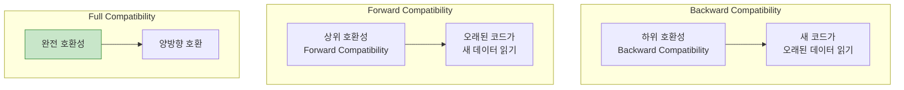
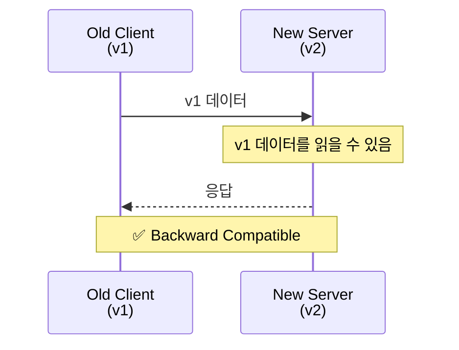
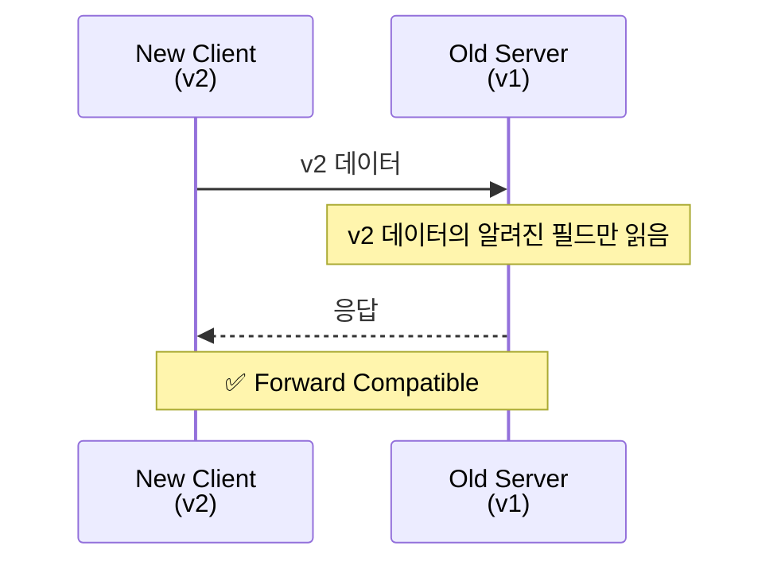
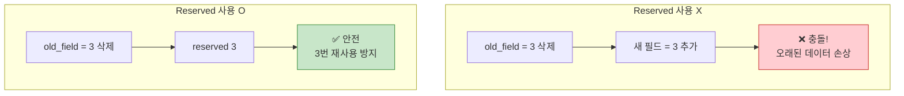
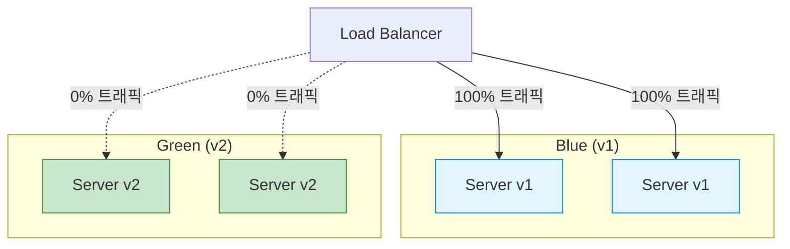
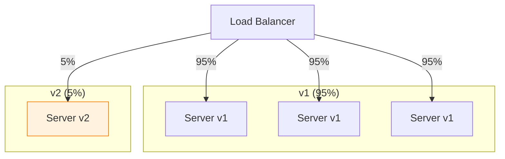
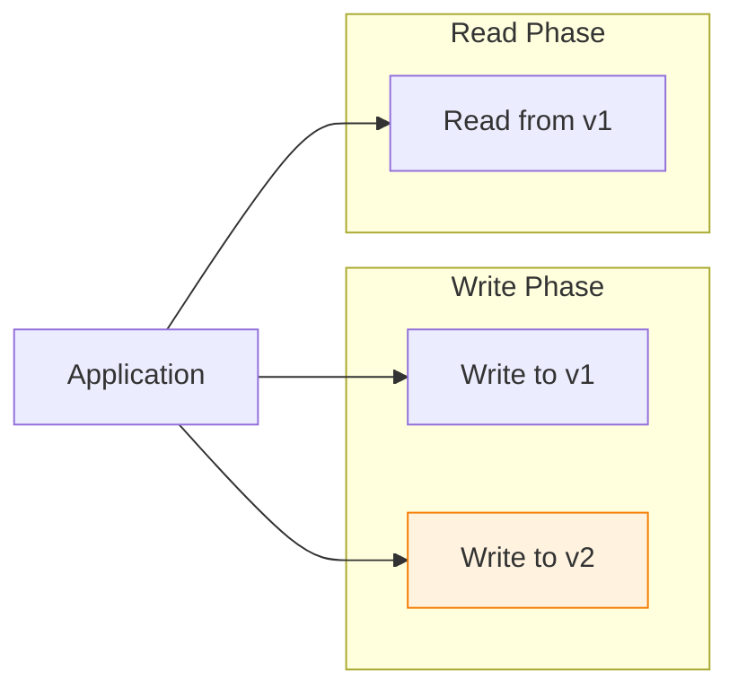

## 들어가며

**스키마 진화(Schema Evolution)**는 Protobuf의 핵심 기능입니다. 기존 시스템을 중단하지 않고 스키마를 변경할 수 있는 능력이 마이크로서비스 환경에서 필수적입니다.

## 호환성 종류



### Backward Compatibility (하위 호환성)

새 코드가 오래된 데이터를 읽을 수 있음



### Forward Compatibility (상위 호환성)

오래된 코드가 새 데이터를 읽을 수 있음



## 안전한 스키마 변경

### ✅ 안전한 변경

#### 1. 필드 추가

```protobuf
// Version 1
message User {
  string name = 1;
  int32 age = 2;
}

// Version 2 - 필드 추가 (안전)
message User {
  string name = 1;
  int32 age = 2;
  string email = 3;        // ✅ 새 필드
  repeated string tags = 4; // ✅ 새 필드
}
```

**동작**:

```python
# v1 코드가 v2 데이터 읽기
user_v2 = User()  # v2 메시지
user_v2.name = "Alice"
user_v2.age = 30
user_v2.email = "alice@example.com"  # v1에 없는 필드

data = user_v2.SerializeToString()

# v1 코드로 파싱
user_v1 = User()  # v1 정의
user_v1.ParseFromString(data)

print(user_v1.name)  # "Alice"
print(user_v1.age)   # 30
# user_v1.email은 무시됨 (unknown field)
```

#### 2. 필드 삭제 (Reserved 사용)

```protobuf
// Version 1
message User {
  string name = 1;
  int32 age = 2;
  string old_field = 3;  // 삭제할 필드
}

// Version 2 - 필드 삭제 (안전)
message User {
  reserved 3;              // ✅ 필드 번호 예약
  reserved "old_field";    // ✅ 필드 이름 예약

  string name = 1;
  int32 age = 2;
  // old_field 제거됨
}
```

**Reserved의 중요성**:



#### 3. Enum 값 추가

```protobuf
// Version 1
enum Status {
  STATUS_UNKNOWN = 0;
  STATUS_ACTIVE = 1;
  STATUS_INACTIVE = 2;
}

// Version 2 - Enum 값 추가 (안전)
enum Status {
  STATUS_UNKNOWN = 0;
  STATUS_ACTIVE = 1;
  STATUS_INACTIVE = 2;
  STATUS_PENDING = 3;   // ✅ 새 값
  STATUS_ARCHIVED = 4;  // ✅ 새 값
}
```

**동작**:

```python
# v2 코드가 STATUS_PENDING 설정
user_v2.status = Status.STATUS_PENDING

data = user_v2.SerializeToString()

# v1 코드로 파싱
user_v1.ParseFromString(data)
print(user_v1.status)  # 3 (v1은 이름을 모르지만 값은 보존)
```

#### 4. Oneof 필드 추가

```protobuf
// Version 1
message Payment {
  string amount = 1;
}

// Version 2 - Oneof 추가 (안전)
message Payment {
  string amount = 1;

  oneof method {
    string credit_card = 2;
    string paypal = 3;
    string bank_transfer = 4;
  }
}
```

### ❌ 위험한 변경

#### 1. 필드 번호 변경

```protobuf
// Version 1
message User {
  string name = 1;
  int32 age = 2;
}

// Version 2 - ❌ 필드 번호 변경 (절대 금지!)
message User {
  string name = 2;  // ❌ 1 → 2로 변경
  int32 age = 1;    // ❌ 2 → 1로 변경
}
```

**결과**: 데이터 손상!

```python
# v1 코드
user_v1.name = "Alice"
user_v1.age = 30
data = user_v1.SerializeToString()

# v2 코드로 파싱
user_v2.ParseFromString(data)
print(user_v2.name)  # 30 (!)
print(user_v2.age)   # "Alice" (!)
```

#### 2. 필드 타입 변경 (대부분 위험)

```protobuf
// Version 1
message User {
  int32 age = 1;
}

// Version 2 - ❌ 타입 변경 (위험!)
message User {
  string age = 1;  // ❌ int32 → string
}
```

**호환 가능한 타입 변경**:

| 원본 → 대상 | 호환성 | 비고 |
|------------|--------|------|
| int32 → int64 | ✅ | 안전 (작은 → 큰) |
| uint32 → uint64 | ✅ | 안전 |
| int32 → uint32 | ⚠️ | 음수 문제 |
| fixed32 → sfixed32 | ❌ | 위험 |
| string → bytes | ⚠️ | UTF-8 검증 차이 |
| bytes → string | ❌ | UTF-8 검증 실패 가능 |

#### 3. Required/Optional 변경 (Proto2)

```protobuf
// Version 1 (Proto2)
message User {
  required string name = 1;
}

// Version 2 - ❌ Required → Optional 변경 (위험)
message User {
  optional string name = 1;  // ❌ 파싱 실패 가능
}
```

**Proto3에서는 문제 없음** (모든 필드가 optional)

#### 4. Oneof에서 필드 이동

```protobuf
// Version 1
message Payment {
  oneof method {
    string credit_card = 1;
    string paypal = 2;
  }
}

// Version 2 - ❌ Oneof 외부로 이동 (위험)
message Payment {
  string credit_card = 1;  // ❌ Oneof 외부로
  oneof method {
    string paypal = 2;
  }
}
```

## 호환성 매트릭스

### 필드 변경

| 변경 | Backward | Forward | 권장 |
|------|----------|---------|------|
| 필드 추가 | ✅ | ✅ | ✅ |
| 필드 삭제 (reserved) | ✅ | ✅ | ✅ |
| 필드 번호 변경 | ❌ | ❌ | ❌ |
| 필드 이름 변경 | ✅ | ✅ | ✅ (번호만 중요) |
| 필드 타입 변경 | ⚠️ | ⚠️ | ⚠️ (제한적) |

### Enum 변경

| 변경 | Backward | Forward | 권장 |
|------|----------|---------|------|
| Enum 값 추가 | ✅ | ✅ | ✅ |
| Enum 값 삭제 (reserved) | ✅ | ⚠️ | ⚠️ |
| Enum 값 번호 변경 | ❌ | ❌ | ❌ |
| Enum 값 이름 변경 | ✅ | ✅ | ✅ |

### 메시지 변경

| 변경 | Backward | Forward | 권장 |
|------|----------|---------|------|
| 메시지 추가 | ✅ | ✅ | ✅ |
| 메시지 삭제 | ⚠️ | ⚠️ | ⚠️ |
| 메시지 이름 변경 | ✅ | ✅ | ✅ (패키지 내) |
| 메시지 중첩 변경 | ⚠️ | ⚠️ | ⚠️ |

## 버전 관리 전략

### 1. Package Versioning

```protobuf
// api/v1/user.proto
syntax = "proto3";
package api.v1;

message User {
  string name = 1;
  int32 age = 2;
}

service UserService {
  rpc GetUser(GetUserRequest) returns (GetUserResponse);
}
```

```protobuf
// api/v2/user.proto
syntax = "proto3";
package api.v2;

message User {
  string name = 1;
  int32 age = 2;
  string email = 3;  // 새 필드
}

service UserService {
  rpc GetUser(GetUserRequest) returns (GetUserResponse);
  rpc ListUsers(ListUsersRequest) returns (ListUsersResponse);  // 새 메소드
}
```

**장점**:
- 명확한 버전 구분
- 여러 버전 동시 지원 가능
- 점진적 마이그레이션

**단점**:
- 코드 중복
- 유지보수 부담

### 2. In-place Evolution

```protobuf
// user.proto
syntax = "proto3";

message User {
  string name = 1;
  int32 age = 2;

  // 2024-01-15: 이메일 필드 추가
  string email = 3;

  // 2024-02-01: 태그 필드 추가
  repeated string tags = 4;

  // 2023-12-01: 제거됨
  reserved 5;
  reserved "old_phone";
}
```

**장점**:
- 단일 스키마 파일
- 간단한 관리

**단점**:
- Breaking change 위험
- 롤백 어려움

### 3. Feature Flags

```protobuf
message User {
  string name = 1;
  int32 age = 2;

  // Feature flag로 제어
  string email = 3;  // FF: enable_email_field

  // 실험적 기능
  ExperimentalFeatures experimental = 100;
}

message ExperimentalFeatures {
  string new_feature = 1;
}
```

## 마이그레이션 패턴

### 1. Blue-Green Deployment



**단계**:

1. v2 배포 (트래픽 0%)
2. 검증 및 테스트
3. 트래픽 점진적 전환
4. v1 제거

### 2. Canary Deployment



**단계**:

1. v2를 소량 트래픽으로 배포
2. 모니터링 및 검증
3. 점진적으로 증가 (5% → 25% → 50% → 100%)
4. v1 제거

### 3. Dual Write



**단계**:

1. 애플리케이션이 v1, v2 모두에 쓰기
2. v1에서 읽기
3. v2 데이터 검증
4. v2에서 읽기로 전환
5. v1 제거

### 4. Schema Registry

```python
# Schema Registry 예제

class SchemaRegistry:
    def __init__(self):
        self.schemas = {}

    def register(self, schema_id, descriptor):
        """스키마 등록"""
        self.schemas[schema_id] = descriptor

    def get(self, schema_id):
        """스키마 조회"""
        return self.schemas.get(schema_id)

    def is_compatible(self, old_schema_id, new_schema_id):
        """호환성 검사"""
        old = self.schemas[old_schema_id]
        new = self.schemas[new_schema_id]

        # 필드 번호 충돌 검사
        old_fields = {f.number for f in old.fields}
        new_fields = {f.number for f in new.fields}

        # 새 필드만 있거나, 동일한 필드만
        return new_fields.issubset(old_fields) or old_fields.issubset(new_fields)

# 사용
registry = SchemaRegistry()
registry.register("user.v1", User_v1.DESCRIPTOR)
registry.register("user.v2", User_v2.DESCRIPTOR)

if registry.is_compatible("user.v1", "user.v2"):
    print("호환 가능")
```

## 실전 시나리오

### 시나리오 1: 필드 이름 변경

```protobuf
// Before
message User {
  string user_name = 1;
}

// After - 필드 이름 변경 원함
// ❌ 직접 변경하면 안됨 (API 깨짐)
// ✅ Deprecated + 새 필드 추가

message User {
  string user_name = 1 [deprecated = true];
  string name = 2;  // 새 필드
}
```

**마이그레이션 코드**:

```python
def migrate_user(old_user):
    """v1 → v2 마이그레이션"""
    new_user = User()

    # 오래된 필드가 있으면 새 필드로 복사
    if old_user.HasField("user_name"):
        new_user.name = old_user.user_name

    # 새 필드 우선
    if old_user.HasField("name"):
        new_user.name = old_user.name

    return new_user
```

### 시나리오 2: Required → Optional (Proto2)

```protobuf
// Version 1 (Proto2)
message User {
  required string name = 1;
  required string email = 2;
}

// Version 2 - email을 optional로
// ❌ 직접 변경 불가
// ✅ 새 메시지 버전 생성

message UserV2 {
  required string name = 1;
  optional string email = 2;  // Optional로 변경
}

// 또는 Proto3 사용 (모두 optional)
```

### 시나리오 3: 타입 확장

```protobuf
// Version 1
message User {
  int32 age = 1;  // 0-127만 사용 중
}

// Version 2 - 더 큰 범위 필요
// ✅ int32 → int64 변경 가능 (안전)

message User {
  int64 age = 1;  // int32 → int64 OK
}
```

**검증**:

```python
# v1 데이터
user_v1 = User()
user_v1.age = 30  # int32
data = user_v1.SerializeToString()

# v2 코드로 파싱
user_v2 = User()  # age는 int64
user_v2.ParseFromString(data)
print(user_v2.age)  # 30 ✅
```

## 호환성 테스트

### 자동화 테스트

```python
import unittest
from user_v1_pb2 import User as UserV1
from user_v2_pb2 import User as UserV2

class CompatibilityTest(unittest.TestCase):
    def test_backward_compatibility(self):
        """새 코드가 오래된 데이터 읽기"""
        # v1 데이터 생성
        user_v1 = UserV1()
        user_v1.name = "Alice"
        user_v1.age = 30
        data = user_v1.SerializeToString()

        # v2 코드로 파싱
        user_v2 = UserV2()
        user_v2.ParseFromString(data)

        self.assertEqual(user_v2.name, "Alice")
        self.assertEqual(user_v2.age, 30)

    def test_forward_compatibility(self):
        """오래된 코드가 새 데이터 읽기"""
        # v2 데이터 생성
        user_v2 = UserV2()
        user_v2.name = "Bob"
        user_v2.age = 25
        user_v2.email = "bob@example.com"  # v1에 없는 필드
        data = user_v2.SerializeToString()

        # v1 코드로 파싱
        user_v1 = UserV1()
        user_v1.ParseFromString(data)

        self.assertEqual(user_v1.name, "Bob")
        self.assertEqual(user_v1.age, 25)
        # email은 무시됨

if __name__ == '__main__':
    unittest.main()
```

## Best Practices

| 원칙 | 설명 |
|------|------|
| **필드 번호 절대 변경 금지** | Wire Format 깨짐 |
| **Reserved 적극 사용** | 삭제된 필드 보호 |
| **타입 변경 최소화** | 호환 가능한 것만 |
| **Deprecated 활용** | 점진적 제거 |
| **버전 관리** | Package versioning |
| **테스트 자동화** | 호환성 회귀 방지 |
| **문서화** | 변경 이력 기록 |

## 다음 단계

하위 호환성을 마스터했습니다! 다음 글에서는:
- **gRPC 스트리밍 심화**
- 스트리밍 패턴
- 플로우 제어

---

**시리즈 목차**
1. Protocol Buffers란 무엇인가
2. Protocol Buffers 고급 스키마 설계
3. gRPC와 Protobuf - 고성능 RPC
4. Protobuf 실전 활용 - 마이크로서비스
5. Protobuf 성능 최적화 및 Best Practices
6. Proto3 고급 기능
7. 서비스와 RPC 정의
8. Reflection과 동적 메시지
9. Extensions와 플러그인
10. JSON 변환
11. 코드 생성 상세
12. Wire Format 이해
13. **하위 호환성** ← 현재 글
14. gRPC 스트리밍 심화 (다음 글)

> 💡 **Quick Tip**: 필드를 삭제할 때는 항상 `reserved`를 사용하세요. 미래의 개발자가 같은 번호를 재사용하는 것을 방지합니다!
