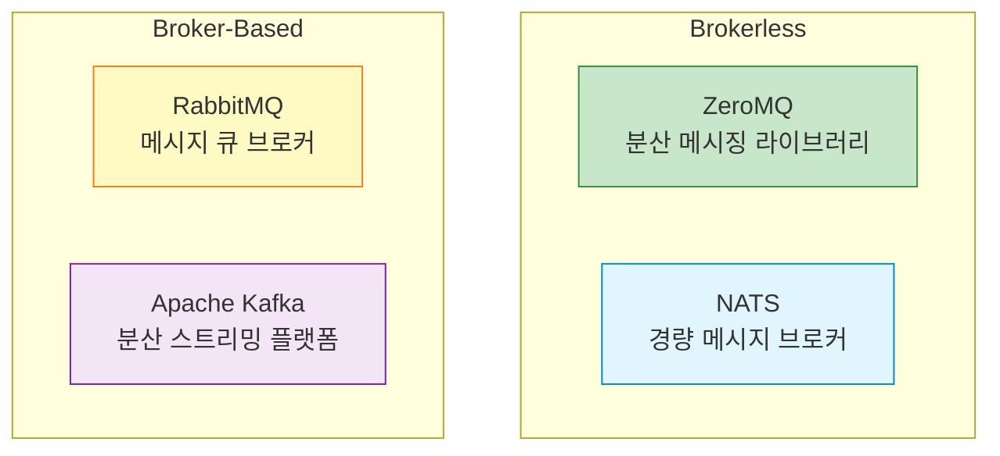
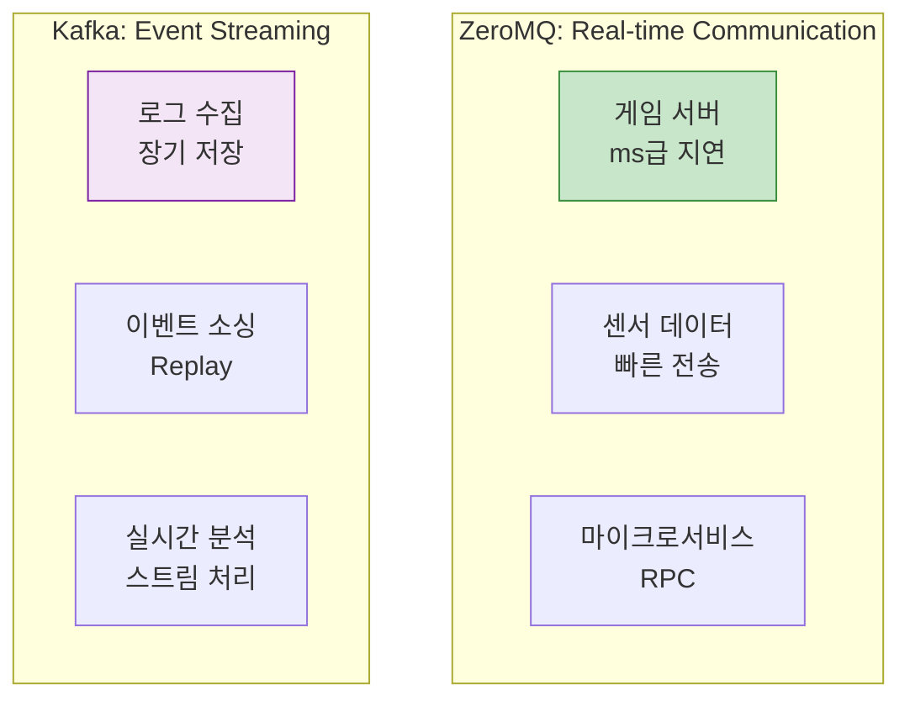
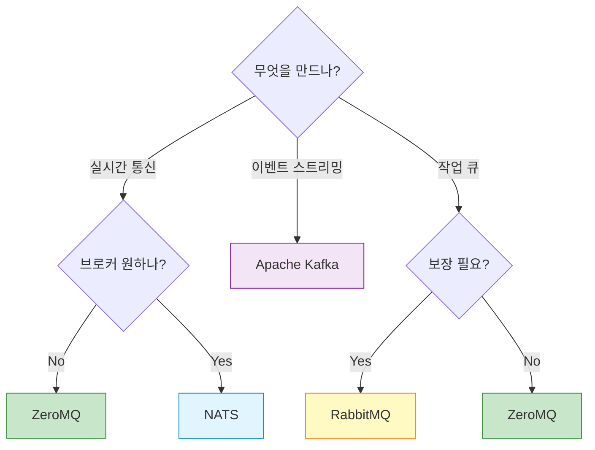
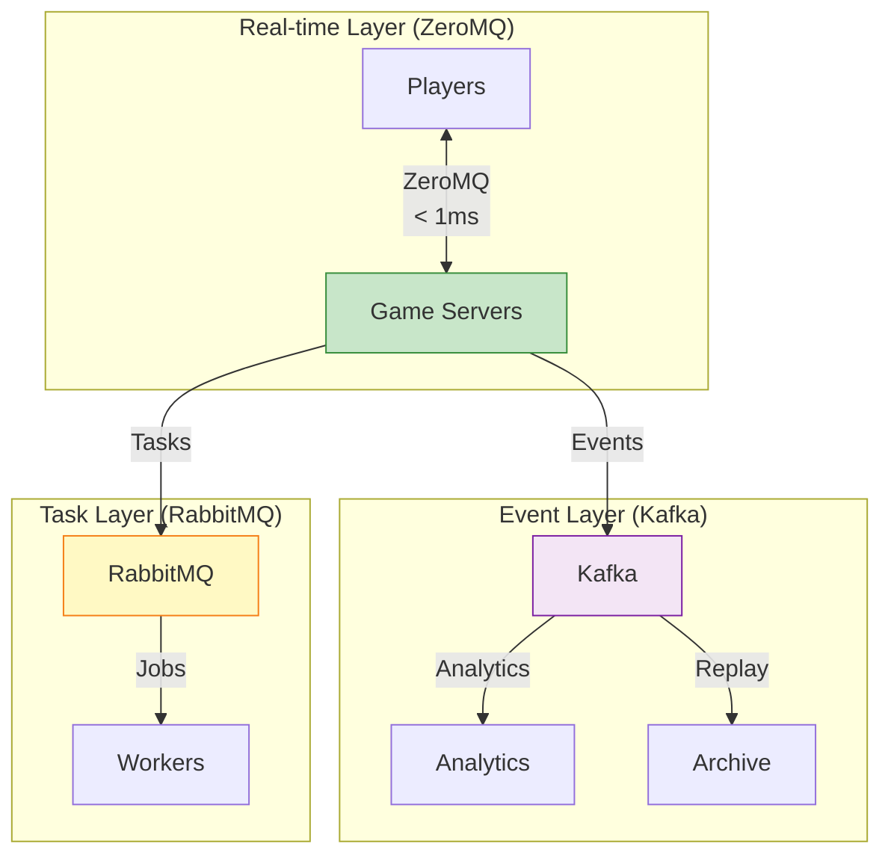

## 들어가며

"어떤 메시징 시스템을 써야 할까?" - 가장 자주 받는 질문입니다. **ZeroMQ, RabbitMQ, Kafka, NATS**는 각각 다른 문제를 해결합니다. 올바른 선택이 시스템의 성패를 결정합니다.

## 4가지 메시징 시스템 개요



## 상세 비교

### 1. ZeroMQ vs RabbitMQ

#### ZeroMQ

**장점**:
- ✅ **제로 브로커**: 중간 서버 없음 → 단순한 배포
- ✅ **매우 빠름**: 100만 msg/s 이상
- ✅ **유연성**: 다양한 패턴 조합 가능
- ✅ **가벼움**: 라이브러리만 추가

**단점**:
- ❌ **영구 저장 없음**: 메모리만
- ❌ **보장 없음**: Best-effort 전달
- ❌ **직접 구현**: 신뢰성 패턴을 직접 코딩
- ❌ **모니터링 어려움**: 중앙 집중식 관리 없음

#### RabbitMQ

**장점**:
- ✅ **보장**: At-least-once 전달
- ✅ **영구 저장**: 디스크 저장 가능
- ✅ **관리 UI**: 웹 대시보드
- ✅ **플러그인 생태계**: 풍부한 확장

**단점**:
- ❌ **브로커 필요**: 추가 인프라
- ❌ **단일 장애점**: 브로커가 SPOF
- ❌ **상대적으로 느림**: ~50k msg/s
- ❌ **복잡한 설정**: 클러스터링 필요

#### 코드 비교

**ZeroMQ**:

```python
# zeromq_pub.py
import zmq

context = zmq.Context()
pub = context.socket(zmq.PUB)
pub.bind("tcp://*:5555")  # No broker!

pub.send_string("Hello")
```

**RabbitMQ**:

```python
# rabbitmq_pub.py
import pika

# 브로커 연결
connection = pika.BlockingConnection(
    pika.ConnectionParameters('localhost')
)
channel = connection.channel()

# Exchange 선언
channel.exchange_declare(exchange='logs', exchange_type='fanout')

channel.basic_publish(exchange='logs', routing_key='', body='Hello')
```

### 2. ZeroMQ vs Kafka

#### Kafka

**장점**:
- ✅ **스트림 처리**: 로그 기반 아키텍처
- ✅ **영구 저장**: 디스크에 장기 보관
- ✅ **Replay 가능**: 과거 메시지 재처리
- ✅ **대용량**: TB급 데이터 처리
- ✅ **Exactly-once**: 정확히 한 번 처리

**단점**:
- ❌ **무거움**: Zookeeper + Kafka 필요
- ❌ **복잡함**: 설정과 운영 어려움
- ❌ **지연**: 수십~수백 ms
- ❌ **오버킬**: 간단한 용도에는 과함

#### 사용 사례 비교



### 3. ZeroMQ vs NATS

#### NATS

**장점**:
- ✅ **경량**: Go로 작성, 작은 바이너리
- ✅ **빠름**: ZeroMQ와 유사한 성능
- ✅ **At-most-once**: 보장 수준 선택 가능
- ✅ **서비스 디스커버리**: 내장

**단점**:
- ❌ **브로커 필요**: 중앙 서버 필요
- ❌ **제한적 패턴**: PUB-SUB, REQ-REP 위주
- ❌ **영구 저장 제한**: NATS Streaming 필요

#### 성능 비교

| 메트릭 | ZeroMQ | NATS | RabbitMQ | Kafka |
|--------|--------|------|----------|-------|
| **처리량** | 1M+ msg/s | 800k msg/s | 50k msg/s | 100k msg/s |
| **지연** | < 1ms | < 1ms | 5-10ms | 10-100ms |
| **메모리** | 10MB | 30MB | 200MB | 500MB+ |
| **CPU** | 낮음 | 낮음 | 중간 | 높음 |

## 의사결정 매트릭스

### 선택 기준



### 상세 결정 테이블

| 요구사항 | 추천 | 이유 |
|----------|------|------|
| **실시간 게임** | ZeroMQ | 최저 지연, 브로커리스 |
| **IoT 센서** | NATS | 경량, 빠름, 관리 쉬움 |
| **엔터프라이즈 메시징** | RabbitMQ | 보장, 영구 저장, 관리 UI |
| **로그 수집** | Kafka | 대용량, 장기 저장, 분석 |
| **마이크로서비스** | ZeroMQ/NATS | 빠른 RPC, 서비스 디스커버리 |
| **이벤트 소싱** | Kafka | Replay, 순서 보장 |
| **금융 거래** | RabbitMQ/Kafka | 강력한 보장, 감사 |

## 실전 비교 예제

### 동일 기능 구현

**요구사항**: Publisher → 3 Subscribers

#### ZeroMQ

```python
# zmq_publisher.py
import zmq
import time

context = zmq.Context()
pub = context.socket(zmq.PUB)
pub.bind("tcp://*:5555")

for i in range(100):
    pub.send_string(f"Message {i}")
    time.sleep(0.1)
```

**특징**:
- 코드 줄 수: 9줄
- 외부 의존성: 없음
- 배포: 바이너리만

#### RabbitMQ

```python
# rabbitmq_publisher.py
import pika
import time

connection = pika.BlockingConnection(
    pika.ConnectionParameters('localhost')
)
channel = connection.channel()

channel.exchange_declare(exchange='messages', exchange_type='fanout')

for i in range(100):
    channel.basic_publish(
        exchange='messages',
        routing_key='',
        body=f'Message {i}'
    )
    time.sleep(0.1)

connection.close()
```

**특징**:
- 코드 줄 수: 16줄
- 외부 의존성: RabbitMQ 서버
- 배포: 서버 + 클라이언트

#### Kafka

```python
# kafka_producer.py
from kafka import KafkaProducer
import time

producer = KafkaProducer(
    bootstrap_servers=['localhost:9092'],
    value_serializer=lambda v: v.encode('utf-8')
)

for i in range(100):
    producer.send('messages', f'Message {i}')
    time.sleep(0.1)

producer.close()
```

**특징**:
- 코드 줄 수: 12줄
- 외부 의존성: Kafka + Zookeeper
- 배포: 복잡한 클러스터

### 성능 벤치마크

```python
# benchmark.py
import time

def benchmark(publish_func, subscribe_func, count=10000):
    # Subscriber 시작
    subscriber_started = threading.Event()
    received_count = [0]

    def subscriber():
        subscriber_started.set()
        for _ in range(count):
            subscribe_func()
            received_count[0] += 1

    thread = threading.Thread(target=subscriber)
    thread.start()

    subscriber_started.wait()
    time.sleep(0.1)  # 준비 대기

    # Publisher 시작
    start = time.time()

    for i in range(count):
        publish_func(f"Message {i}")

    thread.join()
    elapsed = time.time() - start

    return {
        'count': count,
        'elapsed': elapsed,
        'rate': count / elapsed,
        'latency_avg': (elapsed / count) * 1000
    }

# 결과 (참고용)
# ZeroMQ:    ~500k msg/s, 0.002ms
# NATS:      ~400k msg/s, 0.0025ms
# RabbitMQ:  ~20k msg/s, 0.05ms
# Kafka:     ~50k msg/s, 0.02ms
```

## 하이브리드 아키텍처

### 여러 기술 함께 사용



**전략**:
1. **실시간 통신**: ZeroMQ (게임 플레이)
2. **이벤트 저장**: Kafka (분석, 감사)
3. **백그라운드 작업**: RabbitMQ (이메일, 알림)

## 마이그레이션 가이드

### RabbitMQ → ZeroMQ

**언제?**
- 높은 지연에 불만
- 브로커 운영 부담
- 단순한 패턴만 사용

**주의사항**:
- ❌ 메시지 영구 저장 불가
- ❌ 보장 수준 낮아짐
- ✅ 성능 10배 향상
- ✅ 인프라 단순화

### ZeroMQ → Kafka

**언제?**
- 이벤트 Replay 필요
- 장기 저장 필요
- 스트림 처리 필요

**주의사항**:
- ❌ 지연 증가 (ms → 10ms+)
- ❌ 복잡한 운영
- ✅ 강력한 보장
- ✅ 분석 가능

## 기술 선택 체크리스트

### ZeroMQ를 선택하라 (만약...)

- [ ] 브로커를 운영하고 싶지 않다
- [ ] ms 이하 지연이 필요하다
- [ ] 메시지 손실이 허용된다
- [ ] 복잡한 패턴이 필요하다
- [ ] 프로그래밍 언어가 다양하다

### RabbitMQ를 선택하라 (만약...)

- [ ] 메시지 보장이 필수다
- [ ] 관리 UI가 필요하다
- [ ] 표준 프로토콜(AMQP)이 필요하다
- [ ] 플러그인 생태계가 필요하다
- [ ] 운영 팀이 있다

### Kafka를 선택하라 (만약...)

- [ ] 이벤트 스트리밍이다
- [ ] TB급 데이터를 처리한다
- [ ] Replay가 필요하다
- [ ] 실시간 분석이 필요하다
- [ ] Exactly-once가 필요하다

### NATS를 선택하라 (만약...)

- [ ] 경량 브로커가 필요하다
- [ ] IoT/Edge가 대상이다
- [ ] Go 생태계를 사용한다
- [ ] 서비스 디스커버리가 필요하다
- [ ] 클라우드 네이티브다

## 다음 단계

비교 분석을 마스터했습니다! 다음 글에서는:
- **프로덕션 배포** - 실전 배포 전략
- Docker 컨테이너화
- Kubernetes 통합

---

**시리즈 목차**
1-17. (이전 글들)
18. **ZeroMQ vs 대안 기술 - RabbitMQ, Kafka, NATS 비교 분석** ← 현재 글
19. 프로덕션 배포 (다음 글)

> 💡 **Quick Tip**: 한 기술이 모든 문제를 해결하지 않습니다. 하이브리드 아키텍처를 고려하세요!
