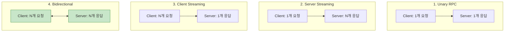
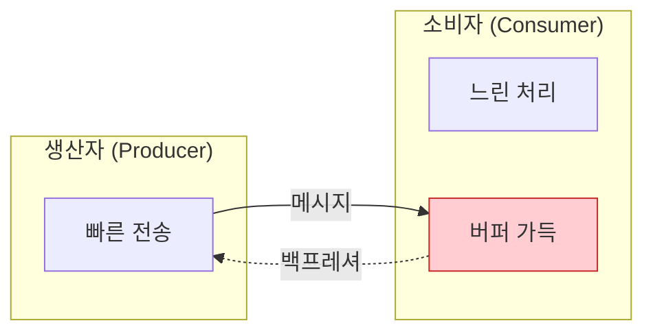

## 들어가며

**gRPC 스트리밍**은 실시간 통신, 대용량 데이터 전송, 양방향 통신에 필수적입니다. 스트리밍 패턴과 플로우 제어를 마스터하여 효율적인 시스템을 구축할 수 있습니다.

## 스트리밍 타입 복습



## Server Streaming 패턴

### 1. 로그 스트리밍

```protobuf
syntax = "proto3";

import "google/protobuf/timestamp.proto";

service LogService {
  rpc StreamLogs(StreamLogsRequest) returns (stream LogEntry);
}

message StreamLogsRequest {
  string service_name = 1;
  google.protobuf.Timestamp start_time = 2;
  LogLevel min_level = 3;
}

message LogEntry {
  google.protobuf.Timestamp timestamp = 1;
  LogLevel level = 2;
  string message = 3;
  map<string, string> metadata = 4;
}

enum LogLevel {
  LOG_LEVEL_UNKNOWN = 0;
  LOG_LEVEL_DEBUG = 1;
  LOG_LEVEL_INFO = 2;
  LOG_LEVEL_WARN = 3;
  LOG_LEVEL_ERROR = 4;
}
```

**서버 구현 (Python)**:

```python
import grpc
import time
from concurrent import futures
from log_pb2 import LogEntry, LogLevel
from log_pb2_grpc import LogServiceServicer

class LogServiceImpl(LogServiceServicer):
    def StreamLogs(self, request, context):
        """로그를 스트리밍"""
        service_name = request.service_name
        min_level = request.min_level

        # 실시간 로그 스트리밍 (예시)
        while not context.is_active():
            # 로그 소스에서 읽기 (예: 파일, DB, 큐)
            log = self.fetch_next_log(service_name)

            if log and log.level >= min_level:
                yield LogEntry(
                    timestamp=log.timestamp,
                    level=log.level,
                    message=log.message,
                    metadata=log.metadata
                )

            time.sleep(0.1)  # 폴링 간격

    def fetch_next_log(self, service_name):
        # 실제 로그 소스에서 읽기
        pass
```

**클라이언트 (Python)**:

```python
import grpc
from log_pb2 import StreamLogsRequest, LogLevel
from log_pb2_grpc import LogServiceStub

def stream_logs():
    channel = grpc.insecure_channel('localhost:50051')
    stub = LogServiceStub(channel)

    request = StreamLogsRequest(
        service_name='auth-service',
        min_level=LogLevel.LOG_LEVEL_INFO
    )

    try:
        for log in stub.StreamLogs(request):
            print(f"[{log.timestamp}] {log.level}: {log.message}")
    except grpc.RpcError as e:
        print(f"Error: {e.code()} - {e.details()}")

stream_logs()
```

### 2. 대용량 파일 다운로드

```protobuf
service FileService {
  rpc DownloadFile(DownloadRequest) returns (stream FileChunk);
}

message DownloadRequest {
  string file_path = 1;
  int32 chunk_size = 2;  // bytes
}

message FileChunk {
  bytes data = 1;
  int64 offset = 2;
  int64 total_size = 3;
}
```

**서버 구현 (Go)**:

```go
type FileServiceServer struct {
    pb.UnimplementedFileServiceServer
}

func (s *FileServiceServer) DownloadFile(
    req *pb.DownloadRequest,
    stream pb.FileService_DownloadFileServer) error {

    filePath := req.FilePath
    chunkSize := req.ChunkSize
    if chunkSize == 0 {
        chunkSize = 1024 * 64 // 64KB 기본값
    }

    // 파일 열기
    file, err := os.Open(filePath)
    if err != nil {
        return status.Errorf(codes.NotFound, "file not found: %v", err)
    }
    defer file.Close()

    // 파일 크기 확인
    stat, _ := file.Stat()
    totalSize := stat.Size()

    // 청크로 전송
    buffer := make([]byte, chunkSize)
    var offset int64 = 0

    for {
        n, err := file.Read(buffer)
        if err == io.EOF {
            break
        }
        if err != nil {
            return status.Errorf(codes.Internal, "read error: %v", err)
        }

        chunk := &pb.FileChunk{
            Data:      buffer[:n],
            Offset:    offset,
            TotalSize: totalSize,
        }

        if err := stream.Send(chunk); err != nil {
            return err
        }

        offset += int64(n)
    }

    return nil
}
```

**클라이언트 (Go)**:

```go
func downloadFile(client pb.FileServiceClient, remotePath, localPath string) error {
    stream, err := client.DownloadFile(context.Background(), &pb.DownloadRequest{
        FilePath:  remotePath,
        ChunkSize: 1024 * 64, // 64KB
    })
    if err != nil {
        return err
    }

    // 로컬 파일 생성
    file, err := os.Create(localPath)
    if err != nil {
        return err
    }
    defer file.Close()

    var received int64
    var totalSize int64

    for {
        chunk, err := stream.Recv()
        if err == io.EOF {
            break
        }
        if err != nil {
            return err
        }

        totalSize = chunk.TotalSize
        received += int64(len(chunk.Data))

        // 파일에 쓰기
        if _, err := file.Write(chunk.Data); err != nil {
            return err
        }

        // 진행률 표시
        progress := float64(received) / float64(totalSize) * 100
        fmt.Printf("\rProgress: %.2f%%", progress)
    }

    fmt.Println("\nDownload completed!")
    return nil
}
```

### 3. 실시간 알림

```protobuf
service NotificationService {
  rpc Subscribe(SubscribeRequest) returns (stream Notification);
}

message SubscribeRequest {
  string user_id = 1;
  repeated string topics = 2;
}

message Notification {
  string id = 1;
  string type = 2;
  string title = 3;
  string message = 4;
  google.protobuf.Timestamp timestamp = 5;
}
```

## Client Streaming 패턴

### 1. 파일 업로드

```protobuf
service FileService {
  rpc UploadFile(stream FileChunk) returns (UploadResponse);
}

message FileChunk {
  bytes data = 1;
  string filename = 2;
}

message UploadResponse {
  string file_id = 1;
  int64 size = 2;
  string checksum = 3;
}
```

**클라이언트 (Python)**:

```python
def upload_file(stub, file_path):
    """파일을 청크로 업로드"""

    def chunk_generator():
        filename = os.path.basename(file_path)
        with open(file_path, 'rb') as f:
            while True:
                chunk = f.read(1024 * 64)  # 64KB
                if not chunk:
                    break
                yield FileChunk(data=chunk, filename=filename)

    # 스트리밍 업로드
    response = stub.UploadFile(chunk_generator())
    print(f"File uploaded: {response.file_id}")
    print(f"Size: {response.size} bytes")
    print(f"Checksum: {response.checksum}")

upload_file(stub, "large_file.bin")
```

**서버 (Python)**:

```python
class FileServiceImpl(FileServiceServicer):
    def UploadFile(self, request_iterator, context):
        """청크를 받아서 파일 저장"""
        filename = None
        total_size = 0
        hasher = hashlib.sha256()

        # 임시 파일 생성
        with tempfile.NamedTemporaryFile(delete=False) as temp_file:
            for chunk in request_iterator:
                if filename is None:
                    filename = chunk.filename

                # 파일에 쓰기
                temp_file.write(chunk.data)
                total_size += len(chunk.data)
                hasher.update(chunk.data)

            temp_path = temp_file.name

        # 최종 파일로 이동
        file_id = str(uuid.uuid4())
        final_path = f"uploads/{file_id}_{filename}"
        os.rename(temp_path, final_path)

        return UploadResponse(
            file_id=file_id,
            size=total_size,
            checksum=hasher.hexdigest()
        )
```

### 2. 메트릭 수집

```protobuf
service MetricsService {
  rpc RecordMetrics(stream MetricData) returns (MetricsSummary);
}

message MetricData {
  string name = 1;
  double value = 2;
  google.protobuf.Timestamp timestamp = 3;
  map<string, string> tags = 4;
}

message MetricsSummary {
  int32 count = 1;
  double average = 2;
  double min = 3;
  double max = 4;
  double sum = 5;
}
```

**클라이언트 (Go)**:

```go
func recordMetrics(client pb.MetricsServiceClient) error {
    stream, err := client.RecordMetrics(context.Background())
    if err != nil {
        return err
    }

    // 메트릭 스트리밍
    for i := 0; i < 1000; i++ {
        metric := &pb.MetricData{
            Name:      "cpu_usage",
            Value:     rand.Float64() * 100,
            Timestamp: timestamppb.Now(),
            Tags: map[string]string{
                "host": "server-1",
                "env":  "production",
            },
        }

        if err := stream.Send(metric); err != nil {
            return err
        }

        time.Sleep(100 * time.Millisecond)
    }

    // 스트림 종료 및 결과 받기
    summary, err := stream.CloseAndRecv()
    if err != nil {
        return err
    }

    fmt.Printf("Metrics Summary:\n")
    fmt.Printf("  Count: %d\n", summary.Count)
    fmt.Printf("  Average: %.2f\n", summary.Average)
    fmt.Printf("  Min: %.2f\n", summary.Min)
    fmt.Printf("  Max: %.2f\n", summary.Max)

    return nil
}
```

## Bidirectional Streaming 패턴

### 1. 채팅 서비스

```protobuf
service ChatService {
  rpc Chat(stream ChatMessage) returns (stream ChatMessage);
}

message ChatMessage {
  string user_id = 1;
  string room_id = 2;
  string message = 3;
  google.protobuf.Timestamp timestamp = 4;
}
```

**서버 (Python)**:

```python
class ChatServiceImpl(ChatServiceServicer):
    def __init__(self):
        self.rooms = {}  # room_id -> set of streams

    def Chat(self, request_iterator, context):
        """양방향 채팅"""
        user_id = None
        room_id = None
        stream_queue = queue.Queue()

        def send_messages():
            """클라이언트로 메시지 전송"""
            while context.is_active():
                try:
                    msg = stream_queue.get(timeout=1)
                    yield msg
                except queue.Empty:
                    continue

        # 백그라운드에서 전송 시작
        send_thread = threading.Thread(target=lambda: None)

        try:
            for message in request_iterator:
                if user_id is None:
                    user_id = message.user_id
                    room_id = message.room_id

                    # 룸에 참가
                    if room_id not in self.rooms:
                        self.rooms[room_id] = set()
                    self.rooms[room_id].add(stream_queue)

                # 같은 룸의 다른 사용자에게 브로드캐스트
                for other_queue in self.rooms[room_id]:
                    if other_queue != stream_queue:
                        other_queue.put(message)

        finally:
            # 룸에서 제거
            if room_id and room_id in self.rooms:
                self.rooms[room_id].discard(stream_queue)

        return send_messages()
```

**클라이언트 (Python)**:

```python
def chat_client(stub, user_id, room_id):
    """채팅 클라이언트"""

    def message_generator():
        """사용자 입력을 메시지로 변환"""
        while True:
            text = input("> ")
            if text.lower() == 'quit':
                break
            yield ChatMessage(
                user_id=user_id,
                room_id=room_id,
                message=text,
                timestamp=Timestamp()
            )

    # 양방향 스트림
    responses = stub.Chat(message_generator())

    # 수신 스레드
    def receive_messages():
        for msg in responses:
            print(f"\n{msg.user_id}: {msg.message}\n> ", end='')

    receive_thread = threading.Thread(target=receive_messages)
    receive_thread.start()
    receive_thread.join()
```

### 2. 실시간 협업 편집

```protobuf
service CollaborativeEditService {
  rpc Edit(stream EditOperation) returns (stream EditOperation);
}

message EditOperation {
  string document_id = 1;
  string user_id = 2;
  int32 position = 3;
  OperationType type = 4;
  string content = 5;
  int32 version = 6;
}

enum OperationType {
  OPERATION_TYPE_UNKNOWN = 0;
  OPERATION_TYPE_INSERT = 1;
  OPERATION_TYPE_DELETE = 2;
  OPERATION_TYPE_UPDATE = 3;
}
```

### 3. 게임 서버 (실시간 상태 동기화)

```protobuf
service GameService {
  rpc PlayGame(stream PlayerAction) returns (stream GameState);
}

message PlayerAction {
  string player_id = 1;
  ActionType action = 2;
  float x = 3;
  float y = 4;
}

message GameState {
  repeated Player players = 1;
  repeated GameObject objects = 2;
  int32 tick = 3;
}

message Player {
  string id = 1;
  float x = 2;
  float y = 3;
  int32 health = 4;
}
```

## 플로우 제어와 백프레셔

### 백프레셔 개념



### gRPC 플로우 제어

gRPC는 HTTP/2의 플로우 제어를 사용합니다:

1. **Window-based**: 수신 윈도우 크기 제어
2. **Per-stream**: 각 스트림마다 독립적
3. **Automatic**: 자동으로 관리

**Python 예제** (명시적 제어):

```python
class SlowConsumerService(ServiceServicer):
    def StreamData(self, request, context):
        """천천히 처리하는 서비스"""
        for i in range(1000):
            # 느린 처리 시뮬레이션
            time.sleep(0.1)

            # 백프레셔 확인
            if context.is_active():
                yield Data(value=i)
            else:
                break  # 클라이언트 연결 끊김
```

### 클라이언트 백프레셔 처리

```go
func streamWithBackpressure(client pb.ServiceClient) error {
    stream, err := client.StreamData(context.Background(), &pb.Request{})
    if err != nil {
        return err
    }

    // 처리 속도 제한
    limiter := rate.NewLimiter(rate.Limit(10), 1) // 초당 10개

    for {
        // Rate limiting
        if err := limiter.Wait(context.Background()); err != nil {
            return err
        }

        data, err := stream.Recv()
        if err == io.EOF {
            break
        }
        if err != nil {
            return err
        }

        // 천천히 처리
        processData(data)
    }

    return nil
}
```

## 스트리밍 패턴 비교

| 패턴 | 사용 사례 | 장점 | 주의사항 |
|------|----------|------|---------|
| **Server Streaming** | 로그, 알림, 파일 다운로드 | 단방향, 간단 | 클라이언트 상태 관리 |
| **Client Streaming** | 파일 업로드, 메트릭 수집 | 효율적 업로드 | 서버 메모리 관리 |
| **Bidirectional** | 채팅, 협업, 게임 | 실시간 양방향 | 복잡도 높음 |

## 에러 처리

### 스트림 에러

```python
def stream_with_error_handling(stub):
    """에러 처리가 있는 스트리밍"""
    try:
        for data in stub.StreamData(request):
            try:
                process(data)
            except Exception as e:
                logging.error(f"Processing error: {e}")
                # 계속 진행할지 결정
                continue

    except grpc.RpcError as e:
        if e.code() == grpc.StatusCode.CANCELLED:
            logging.info("Stream cancelled by client")
        elif e.code() == grpc.StatusCode.DEADLINE_EXCEEDED:
            logging.error("Stream timeout")
        else:
            logging.error(f"Stream error: {e.details()}")
```

### 재연결 로직

```go
func streamWithRetry(client pb.ServiceClient) error {
    maxRetries := 3
    backoff := time.Second

    for retry := 0; retry < maxRetries; retry++ {
        stream, err := client.StreamData(context.Background(), &pb.Request{})
        if err != nil {
            time.Sleep(backoff)
            backoff *= 2
            continue
        }

        for {
            data, err := stream.Recv()
            if err == io.EOF {
                return nil // 정상 종료
            }
            if err != nil {
                log.Printf("Stream error: %v, retrying...", err)
                break // 재연결
            }

            processData(data)
        }
    }

    return errors.New("max retries exceeded")
}
```

## 성능 최적화

### 1. 청크 크기 조정

```python
# 작은 청크 (낮은 latency, 높은 overhead)
chunk_size = 1024  # 1KB

# 큰 청크 (높은 throughput, 높은 latency)
chunk_size = 1024 * 1024  # 1MB

# 균형잡힌 크기
chunk_size = 64 * 1024  # 64KB (권장)
```

### 2. 버퍼링

```go
stream, _ := client.StreamData(context.Background())

// 버퍼 채널로 비동기 처리
buffer := make(chan *pb.Data, 100)

go func() {
    for data := range buffer {
        process(data)
    }
}()

for {
    data, err := stream.Recv()
    if err != nil {
        break
    }
    buffer <- data
}
close(buffer)
```

### 3. 압축 사용

```python
# 서버
server = grpc.server(
    futures.ThreadPoolExecutor(max_workers=10),
    compression=grpc.Compression.Gzip  # 압축 활성화
)

# 클라이언트
stub.StreamData(
    request,
    compression=grpc.Compression.Gzip
)
```

## 다음 단계

gRPC 스트리밍을 마스터했습니다! 다음 글에서는:
- **gRPC 인터셉터**
- 인증/인가
- 로깅/모니터링

---

**시리즈 목차**
13. 하위 호환성
14. **gRPC 스트리밍 심화** ← 현재 글
15. gRPC 인터셉터 (다음 글)

> 💡 **Quick Tip**: Bidirectional 스트리밍은 독립적인 읽기/쓰기 스트림입니다. 클라이언트가 보내기를 끝내도 서버는 계속 보낼 수 있습니다!
