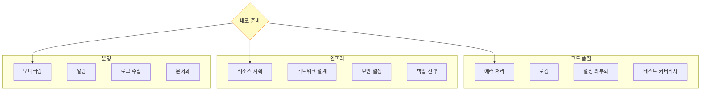

## 들어가며

개발 환경에서 잘 동작하는 것과 **프로덕션에서 안정적으로 운영**하는 것은 다릅니다. ZeroMQ 애플리케이션을 **Docker로 컨테이너화**하고, **Kubernetes에 배포**하며, **모니터링**을 구축하는 실전 가이드입니다.

## 프로덕션 체크리스트

### 배포 전 확인사항



### 필수 구성요소

- ✅ **에러 처리**: 모든 예외 catch
- ✅ **타임아웃**: 무한 대기 방지
- ✅ **재연결 로직**: 네트워크 끊김 대응
- ✅ **헬스 체크**: 활성 상태 확인
- ✅ **Graceful Shutdown**: 안전한 종료
- ✅ **설정 관리**: 환경변수 사용
- ✅ **로깅**: 구조화된 로그
- ✅ **메트릭**: Prometheus 통합

## Docker 컨테이너화

### Dockerfile

**Python 애플리케이션**:

```dockerfile
# Dockerfile
FROM python:3.11-slim

# ZeroMQ 라이브러리 설치
RUN apt-get update && \
    apt-get install -y libzmq3-dev && \
    rm -rf /var/lib/apt/lists/*

# Python 의존성
COPY requirements.txt /app/
WORKDIR /app
RUN pip install --no-cache-dir -r requirements.txt

# 애플리케이션 복사
COPY . /app/

# 헬스체크
HEALTHCHECK --interval=30s --timeout=3s --retries=3 \
    CMD python healthcheck.py || exit 1

# 비특권 사용자
RUN useradd -m appuser && chown -R appuser:appuser /app
USER appuser

# 포트 노출
EXPOSE 5555

CMD ["python", "server.py"]
```

**Go 애플리케이션**:

```dockerfile
# Dockerfile.go
# Build stage
FROM golang:1.21-alpine AS builder

RUN apk add --no-cache git zeromq-dev gcc musl-dev

WORKDIR /build
COPY go.mod go.sum ./
RUN go mod download

COPY . .
RUN go build -o server .

# Runtime stage
FROM alpine:latest

RUN apk add --no-cache zeromq

COPY --from=builder /build/server /app/server

WORKDIR /app

EXPOSE 5555

CMD ["./server"]
```

### docker-compose.yml

```yaml
# docker-compose.yml
version: '3.8'

services:
  # ZeroMQ Broker
  broker:
    build: ./broker
    container_name: zmq-broker
    ports:
      - "5555:5555"
      - "5556:5556"
    environment:
      - LOG_LEVEL=INFO
      - FRONTEND_PORT=5555
      - BACKEND_PORT=5556
    volumes:
      - ./config:/app/config:ro
    networks:
      - zmq-network
    restart: unless-stopped
    healthcheck:
      test: ["CMD", "python", "healthcheck.py"]
      interval: 30s
      timeout: 10s
      retries: 3

  # Workers (scaling)
  worker:
    build: ./worker
    environment:
      - BROKER_ADDRESS=tcp://broker:5556
      - WORKER_ID=${WORKER_ID}
    networks:
      - zmq-network
    depends_on:
      - broker
    restart: unless-stopped
    deploy:
      replicas: 3

  # Prometheus (모니터링)
  prometheus:
    image: prom/prometheus:latest
    ports:
      - "9090:9090"
    volumes:
      - ./prometheus.yml:/etc/prometheus/prometheus.yml:ro
      - prometheus-data:/prometheus
    networks:
      - zmq-network

  # Grafana (대시보드)
  grafana:
    image: grafana/grafana:latest
    ports:
      - "3000:3000"
    environment:
      - GF_SECURITY_ADMIN_PASSWORD=admin
    volumes:
      - grafana-data:/var/lib/grafana
    networks:
      - zmq-network
    depends_on:
      - prometheus

networks:
  zmq-network:
    driver: bridge

volumes:
  prometheus-data:
  grafana-data:
```

### 헬스체크 구현

```python
# healthcheck.py
import zmq
import sys

def check_health():
    """ZeroMQ 서버 헬스체크"""
    try:
        context = zmq.Context()
        socket = context.socket(zmq.REQ)
        socket.setsockopt(zmq.RCVTIMEO, 3000)  # 3초 타임아웃
        socket.connect("tcp://localhost:5555")

        # Ping 전송
        socket.send(b"PING")
        reply = socket.recv()

        if reply == b"PONG":
            print("Healthy")
            return 0
        else:
            print("Unhealthy: Invalid response")
            return 1

    except zmq.Again:
        print("Unhealthy: Timeout")
        return 1
    except Exception as e:
        print(f"Unhealthy: {e}")
        return 1
    finally:
        socket.close()
        context.term()

if __name__ == "__main__":
    sys.exit(check_health())
```

## Kubernetes 배포

### Deployment

```yaml
# deployment.yaml
apiVersion: apps/v1
kind: Deployment
metadata:
  name: zeromq-broker
  labels:
    app: zeromq-broker
spec:
  replicas: 2
  selector:
    matchLabels:
      app: zeromq-broker
  template:
    metadata:
      labels:
        app: zeromq-broker
      annotations:
        prometheus.io/scrape: "true"
        prometheus.io/port: "9090"
    spec:
      containers:
      - name: broker
        image: myregistry/zeromq-broker:1.0.0
        ports:
        - containerPort: 5555
          name: frontend
        - containerPort: 5556
          name: backend
        - containerPort: 9090
          name: metrics
        env:
        - name: LOG_LEVEL
          value: "INFO"
        - name: FRONTEND_PORT
          value: "5555"
        - name: BACKEND_PORT
          value: "5556"
        resources:
          requests:
            cpu: 100m
            memory: 128Mi
          limits:
            cpu: 500m
            memory: 512Mi
        livenessProbe:
          exec:
            command:
            - python
            - healthcheck.py
          initialDelaySeconds: 10
          periodSeconds: 30
        readinessProbe:
          exec:
            command:
            - python
            - healthcheck.py
          initialDelaySeconds: 5
          periodSeconds: 10
        volumeMounts:
        - name: config
          mountPath: /app/config
          readOnly: true
      volumes:
      - name: config
        configMap:
          name: zeromq-config
---
apiVersion: apps/v1
kind: Deployment
metadata:
  name: zeromq-worker
spec:
  replicas: 5
  selector:
    matchLabels:
      app: zeromq-worker
  template:
    metadata:
      labels:
        app: zeromq-worker
    spec:
      containers:
      - name: worker
        image: myregistry/zeromq-worker:1.0.0
        env:
        - name: BROKER_ADDRESS
          value: "tcp://zeromq-broker-service:5556"
        resources:
          requests:
            cpu: 50m
            memory: 64Mi
          limits:
            cpu: 200m
            memory: 256Mi
```

### Service

```yaml
# service.yaml
apiVersion: v1
kind: Service
metadata:
  name: zeromq-broker-service
spec:
  selector:
    app: zeromq-broker
  ports:
  - name: frontend
    port: 5555
    targetPort: 5555
  - name: backend
    port: 5556
    targetPort: 5556
  - name: metrics
    port: 9090
    targetPort: 9090
  type: LoadBalancer
---
apiVersion: v1
kind: Service
metadata:
  name: zeromq-broker-headless
spec:
  selector:
    app: zeromq-broker
  clusterIP: None
  ports:
  - name: frontend
    port: 5555
  - name: backend
    port: 5556
```

### ConfigMap

```yaml
# configmap.yaml
apiVersion: v1
kind: ConfigMap
metadata:
  name: zeromq-config
data:
  broker.conf: |
    frontend_port = 5555
    backend_port = 5556
    log_level = INFO
    heartbeat_interval = 2.5
    heartbeat_liveness = 3

  worker.conf: |
    broker_address = tcp://zeromq-broker-service:5556
    worker_timeout = 5.0
    retry_attempts = 3
```

### HPA (Auto Scaling)

```yaml
# hpa.yaml
apiVersion: autoscaling/v2
kind: HorizontalPodAutoscaler
metadata:
  name: zeromq-worker-hpa
spec:
  scaleTargetRef:
    apiVersion: apps/v1
    kind: Deployment
    name: zeromq-worker
  minReplicas: 3
  maxReplicas: 20
  metrics:
  - type: Resource
    resource:
      name: cpu
      target:
        type: Utilization
        averageUtilization: 70
  - type: Pods
    pods:
      metric:
        name: zeromq_queue_length
      target:
        type: AverageValue
        averageValue: "100"
```

## 설정 관리

### 환경변수 기반

```python
# config.py
import os

class Config:
    """환경변수 기반 설정"""

    # ZeroMQ 설정
    FRONTEND_ADDRESS = os.getenv('FRONTEND_ADDRESS', 'tcp://*:5555')
    BACKEND_ADDRESS = os.getenv('BACKEND_ADDRESS', 'tcp://*:5556')

    # 타임아웃
    RCVTIMEO = int(os.getenv('RCVTIMEO', '5000'))
    SNDTIMEO = int(os.getenv('SNDTIMEO', '5000'))

    # Heartbeat
    HEARTBEAT_INTERVAL = float(os.getenv('HEARTBEAT_INTERVAL', '2.5'))
    HEARTBEAT_LIVENESS = int(os.getenv('HEARTBEAT_LIVENESS', '3'))

    # 로깅
    LOG_LEVEL = os.getenv('LOG_LEVEL', 'INFO')

    # 메트릭
    METRICS_PORT = int(os.getenv('METRICS_PORT', '9090'))

# 사용
config = Config()
socket.setsockopt(zmq.RCVTIMEO, config.RCVTIMEO)
```

### Secrets 관리

```yaml
# secret.yaml
apiVersion: v1
kind: Secret
metadata:
  name: zeromq-secrets
type: Opaque
data:
  # base64 인코딩
  curve-public-key: <base64-encoded-key>
  curve-secret-key: <base64-encoded-key>
```

```python
# 사용
import os
import base64

public_key = base64.b64decode(os.getenv('CURVE_PUBLIC_KEY'))
secret_key = base64.b64decode(os.getenv('CURVE_SECRET_KEY'))

socket.curve_publickey = public_key
socket.curve_secretkey = secret_key
```

## 로깅 전략

### 구조화된 로깅

```python
# structured_logging.py
import logging
import json
from datetime import datetime

class StructuredFormatter(logging.Formatter):
    """JSON 로깅"""

    def format(self, record):
        log_data = {
            'timestamp': datetime.utcnow().isoformat(),
            'level': record.levelname,
            'logger': record.name,
            'message': record.getMessage(),
            'module': record.module,
            'function': record.funcName,
            'line': record.lineno
        }

        # 추가 필드
        if hasattr(record, 'extra'):
            log_data.update(record.extra)

        return json.dumps(log_data)

# 설정
logger = logging.getLogger('zeromq')
handler = logging.StreamHandler()
handler.setFormatter(StructuredFormatter())
logger.addHandler(handler)
logger.setLevel(logging.INFO)

# 사용
logger.info("Server started", extra={
    'frontend': 'tcp://*:5555',
    'backend': 'tcp://*:5556'
})
```

### ELK Stack 통합

```yaml
# filebeat.yml
filebeat.inputs:
- type: container
  paths:
    - '/var/lib/docker/containers/*/*.log'
  processors:
    - decode_json_fields:
        fields: ["message"]
        target: ""
        overwrite_keys: true

output.elasticsearch:
  hosts: ["elasticsearch:9200"]
  index: "zeromq-%{+yyyy.MM.dd}"
```

## 모니터링 및 메트릭

### Prometheus 메트릭

```python
# metrics.py
from prometheus_client import Counter, Gauge, Histogram, start_http_server

# 메트릭 정의
messages_sent = Counter(
    'zeromq_messages_sent_total',
    'Total messages sent'
)

messages_received = Counter(
    'zeromq_messages_received_total',
    'Total messages received'
)

active_connections = Gauge(
    'zeromq_active_connections',
    'Current active connections'
)

message_latency = Histogram(
    'zeromq_message_latency_seconds',
    'Message processing latency'
)

queue_length = Gauge(
    'zeromq_queue_length',
    'Current queue length'
)

# Exporter 시작
start_http_server(9090)

# 사용
messages_sent.inc()
active_connections.set(len(workers))

with message_latency.time():
    process_message(msg)
```

### Grafana 대시보드

```json
{
  "dashboard": {
    "title": "ZeroMQ Monitoring",
    "panels": [
      {
        "title": "Message Rate",
        "targets": [
          {
            "expr": "rate(zeromq_messages_received_total[1m])"
          }
        ]
      },
      {
        "title": "Queue Length",
        "targets": [
          {
            "expr": "zeromq_queue_length"
          }
        ]
      },
      {
        "title": "Latency (P95)",
        "targets": [
          {
            "expr": "histogram_quantile(0.95, zeromq_message_latency_seconds)"
          }
        ]
      }
    ]
  }
}
```

## 보안 설정

### CURVE 암호화

```python
# secure_server.py
import zmq
import zmq.auth
from zmq.auth.thread import ThreadAuthenticator

# 인증 시작
ctx = zmq.Context()
auth = ThreadAuthenticator(ctx)
auth.start()
auth.configure_curve(domain='*', location=zmq.auth.CURVE_ALLOW_ANY)

# 서버 소켓
server = ctx.socket(zmq.REP)

# CURVE 설정
server_public, server_secret = zmq.curve_keypair()
server.curve_secretkey = server_secret
server.curve_publickey = server_public
server.curve_server = True

server.bind('tcp://*:5555')

# 사용
while True:
    msg = server.recv()
    server.send(b"Secure reply")
```

## 배포 전략

### Blue-Green 배포

```yaml
# blue-deployment.yaml
apiVersion: apps/v1
kind: Deployment
metadata:
  name: zeromq-broker-blue
  labels:
    app: zeromq-broker
    version: blue
spec:
  replicas: 3
  selector:
    matchLabels:
      app: zeromq-broker
      version: blue
  # ...

---
# green-deployment.yaml
apiVersion: apps/v1
kind: Deployment
metadata:
  name: zeromq-broker-green
  labels:
    app: zeromq-broker
    version: green
spec:
  replicas: 3
  selector:
    matchLabels:
      app: zeromq-broker
      version: green
  # ...

---
# service.yaml (트래픽 전환)
apiVersion: v1
kind: Service
metadata:
  name: zeromq-broker
spec:
  selector:
    app: zeromq-broker
    version: green  # blue → green 전환
```

## 다음 단계

프로덕션 배포를 마스터했습니다! 다음 글에서는:
- **케이스 스터디** - 실제 프로덕션 사례
- 아키텍처 패턴
- 성능 결과

---

**시리즈 목차**
1-18. (이전 글들)
19. **프로덕션 배포 - Docker, Kubernetes, 모니터링** ← 현재 글
20. 케이스 스터디 (다음 글)

> 💡 **Quick Tip**: 프로덕션 배포 전 반드시 헬스체크, 로깅, 모니터링을 구축하세요!
