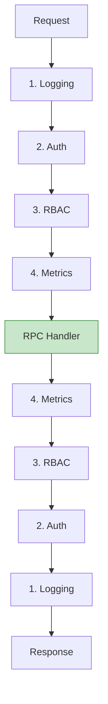

```mermaid
graph LR
    Client[Client] --> CI1[Client Interceptor 1]
    CI1 --> CI2[Client Interceptor 2]
    CI2 --> Network[Network]

    Network --> SI1[Server Interceptor 1]
    SI1 --> SI2[Server Interceptor 2]
    SI2 --> Handler[RPC Handler]

    Handler --> SI2_Out[Server Interceptor 2]
    SI2_Out --> SI1_Out[Server Interceptor 1]
    SI1_Out --> Network_Out[Network]

    Network_Out --> CI2_Out[Client Interceptor 2]
    CI2_Out --> CI1_Out[Client Interceptor 1]
    CI1_Out --> Client_Out[Client]

    style CI1 fill:#e1f5ff,stroke:#0288d1
    style SI1 fill:#c8e6c9,stroke:#388e3c
```

## 들어가며

**인터셉터(Interceptor)**는 gRPC의 미들웨어로, 횡단 관심사(Cross-cutting concerns)를 RPC 호출에 주입할 수 있습니다. 인증, 로깅, 메트릭, 에러 처리를 중앙화할 수 있습니다.

## 인터셉터 개념



### 인터셉터 타입

| 타입 | 위치 | 용도 |
|------|------|------|
| **Unary Interceptor** | Client/Server | 단일 요청/응답 |
| **Stream Interceptor** | Client/Server | 스트리밍 RPC |

## Server Interceptor

### Unary Server Interceptor

```python
import grpc
import time
import logging

def logging_interceptor(request, context, handler):
    """로깅 인터셉터"""
    method = context._rpc_event.call_details.method
    start_time = time.time()

    logging.info(f"[Server] {method} - Request received")

    try:
        # RPC 핸들러 호출
        response = handler(request, context)

        duration = time.time() - start_time
        logging.info(f"[Server] {method} - Success ({duration:.3f}s)")

        return response

    except Exception as e:
        duration = time.time() - start_time
        logging.error(f"[Server] {method} - Error: {e} ({duration:.3f}s)")
        raise

# 서버에 등록
server = grpc.server(
    futures.ThreadPoolExecutor(max_workers=10),
    interceptors=[logging_interceptor]
)
```

**Go 구현**:

```go
type LoggingInterceptor struct{}

func (i *LoggingInterceptor) Unary() grpc.UnaryServerInterceptor {
    return func(
        ctx context.Context,
        req interface{},
        info *grpc.UnaryServerInfo,
        handler grpc.UnaryHandler,
    ) (interface{}, error) {
        start := time.Now()
        method := info.FullMethod

        log.Printf("[Server] %s - Request received", method)

        // RPC 핸들러 호출
        resp, err := handler(ctx, req)

        duration := time.Since(start)
        if err != nil {
            log.Printf("[Server] %s - Error: %v (%.3fs)", method, err, duration.Seconds())
        } else {
            log.Printf("[Server] %s - Success (%.3fs)", method, duration.Seconds())
        }

        return resp, err
    }
}

// 서버에 등록
server := grpc.NewServer(
    grpc.UnaryInterceptor((&LoggingInterceptor{}).Unary()),
)
```

### Stream Server Interceptor

```go
func StreamLoggingInterceptor(
    srv interface{},
    ss grpc.ServerStream,
    info *grpc.StreamServerInfo,
    handler grpc.StreamHandler,
) error {
    start := time.Now()
    method := info.FullMethod

    log.Printf("[Server Stream] %s - Stream started", method)

    // Wrapped stream으로 메시지 추적
    wrapped := &wrappedServerStream{
        ServerStream: ss,
        method:       method,
        messageCount: 0,
    }

    err := handler(srv, wrapped)

    duration := time.Since(start)
    log.Printf("[Server Stream] %s - Stream ended: %d messages (%.3fs)",
        method, wrapped.messageCount, duration.Seconds())

    return err
}

type wrappedServerStream struct {
    grpc.ServerStream
    method       string
    messageCount int
}

func (w *wrappedServerStream) SendMsg(m interface{}) error {
    w.messageCount++
    return w.ServerStream.SendMsg(m)
}

// 서버에 등록
server := grpc.NewServer(
    grpc.StreamInterceptor(StreamLoggingInterceptor),
)
```

## Client Interceptor

### Unary Client Interceptor

```python
def retry_interceptor(max_retries=3):
    """재시도 인터셉터"""
    def interceptor(client_call_details, request_iterator, request_streaming,
                    response_streaming):
        retries = 0

        while retries < max_retries:
            try:
                # RPC 호출
                response = yield client_call_details, request_iterator

                # 성공
                return response

            except grpc.RpcError as e:
                retries += 1

                if e.code() in [grpc.StatusCode.UNAVAILABLE,
                               grpc.StatusCode.DEADLINE_EXCEEDED]:
                    if retries < max_retries:
                        time.sleep(2 ** retries)  # Exponential backoff
                        continue

                # 재시도 불가능한 에러
                raise

    return interceptor

# 클라이언트에 등록
channel = grpc.insecure_channel('localhost:50051')
channel = grpc.intercept_channel(channel, retry_interceptor())
stub = UserServiceStub(channel)
```

**Go 구현**:

```go
type RetryInterceptor struct {
    maxRetries int
}

func (i *RetryInterceptor) Unary() grpc.UnaryClientInterceptor {
    return func(
        ctx context.Context,
        method string,
        req, reply interface{},
        cc *grpc.ClientConn,
        invoker grpc.UnaryInvoker,
        opts ...grpc.CallOption,
    ) error {
        var err error

        for attempt := 0; attempt < i.maxRetries; attempt++ {
            err = invoker(ctx, method, req, reply, cc, opts...)

            if err == nil {
                return nil
            }

            // 재시도 가능한 에러인지 확인
            if st, ok := status.FromError(err); ok {
                if st.Code() == codes.Unavailable ||
                   st.Code() == codes.DeadlineExceeded {
                    backoff := time.Duration(1<<uint(attempt)) * time.Second
                    time.Sleep(backoff)
                    continue
                }
            }

            // 재시도 불가능
            return err
        }

        return err
    }
}

// 클라이언트에 등록
conn, _ := grpc.Dial("localhost:50051",
    grpc.WithInsecure(),
    grpc.WithUnaryInterceptor((&RetryInterceptor{maxRetries: 3}).Unary()),
)
```

### Stream Client Interceptor

```go
func StreamMetricsInterceptor(
    ctx context.Context,
    desc *grpc.StreamDesc,
    cc *grpc.ClientConn,
    method string,
    streamer grpc.Streamer,
    opts ...grpc.CallOption,
) (grpc.ClientStream, error) {
    start := time.Now()

    stream, err := streamer(ctx, desc, cc, method, opts...)
    if err != nil {
        return nil, err
    }

    return &wrappedClientStream{
        ClientStream: stream,
        method:       method,
        startTime:    start,
        sentCount:    0,
        recvCount:    0,
    }, nil
}

type wrappedClientStream struct {
    grpc.ClientStream
    method    string
    startTime time.Time
    sentCount int
    recvCount int
}

func (w *wrappedClientStream) SendMsg(m interface{}) error {
    w.sentCount++
    return w.ClientStream.SendMsg(m)
}

func (w *wrappedClientStream) RecvMsg(m interface{}) error {
    err := w.ClientStream.RecvMsg(m)
    if err == nil {
        w.recvCount++
    } else if err == io.EOF {
        duration := time.Since(w.startTime)
        log.Printf("[Client Stream] %s - Completed: sent=%d, recv=%d (%.3fs)",
            w.method, w.sentCount, w.recvCount, duration.Seconds())
    }
    return err
}
```

## 인증/인가 인터셉터

### JWT 인증 (Server)

```go
import (
    "github.com/golang-jwt/jwt/v4"
)

type AuthInterceptor struct {
    jwtSecret []byte
}

func (a *AuthInterceptor) Unary() grpc.UnaryServerInterceptor {
    return func(
        ctx context.Context,
        req interface{},
        info *grpc.UnaryServerInfo,
        handler grpc.UnaryHandler,
    ) (interface{}, error) {
        // Public 메소드는 인증 생략
        if isPublicMethod(info.FullMethod) {
            return handler(ctx, req)
        }

        // Metadata에서 토큰 추출
        md, ok := metadata.FromIncomingContext(ctx)
        if !ok {
            return nil, status.Error(codes.Unauthenticated, "metadata not found")
        }

        tokens := md.Get("authorization")
        if len(tokens) == 0 {
            return nil, status.Error(codes.Unauthenticated, "token not found")
        }

        tokenString := tokens[0]

        // JWT 검증
        claims, err := a.validateToken(tokenString)
        if err != nil {
            return nil, status.Error(codes.Unauthenticated, "invalid token")
        }

        // Context에 사용자 정보 추가
        ctx = context.WithValue(ctx, "user_id", claims["user_id"])
        ctx = context.WithValue(ctx, "role", claims["role"])

        return handler(ctx, req)
    }
}

func (a *AuthInterceptor) validateToken(tokenString string) (jwt.MapClaims, error) {
    token, err := jwt.Parse(tokenString, func(token *jwt.Token) (interface{}, error) {
        return a.jwtSecret, nil
    })

    if err != nil || !token.Valid {
        return nil, err
    }

    claims, ok := token.Claims.(jwt.MapClaims)
    if !ok {
        return nil, errors.New("invalid claims")
    }

    return claims, nil
}

func isPublicMethod(method string) bool {
    publicMethods := []string{
        "/api.AuthService/Login",
        "/api.AuthService/Register",
    }

    for _, pm := range publicMethods {
        if method == pm {
            return true
        }
    }
    return false
}
```

### JWT 인증 (Client)

```go
type TokenInterceptor struct {
    token string
}

func (t *TokenInterceptor) Unary() grpc.UnaryClientInterceptor {
    return func(
        ctx context.Context,
        method string,
        req, reply interface{},
        cc *grpc.ClientConn,
        invoker grpc.UnaryInvoker,
        opts ...grpc.CallOption,
    ) error {
        // Metadata에 토큰 추가
        ctx = metadata.AppendToOutgoingContext(ctx, "authorization", t.token)
        return invoker(ctx, method, req, reply, cc, opts...)
    }
}

// 사용
token := "eyJhbGciOiJIUzI1NiIsInR5cCI6IkpXVCJ9..."
conn, _ := grpc.Dial("localhost:50051",
    grpc.WithInsecure(),
    grpc.WithUnaryInterceptor((&TokenInterceptor{token: token}).Unary()),
)
```

### 권한 확인

```go
type RBACInterceptor struct {
    permissions map[string][]string  // method -> required roles
}

func (r *RBACInterceptor) Unary() grpc.UnaryServerInterceptor {
    return func(
        ctx context.Context,
        req interface{},
        info *grpc.UnaryServerInfo,
        handler grpc.UnaryHandler,
    ) (interface{}, error) {
        method := info.FullMethod

        // 필요한 권한 확인
        requiredRoles, exists := r.permissions[method]
        if !exists {
            return handler(ctx, req)  // 권한 불필요
        }

        // Context에서 사용자 역할 추출
        role, ok := ctx.Value("role").(string)
        if !ok {
            return nil, status.Error(codes.PermissionDenied, "role not found")
        }

        // 권한 확인
        if !contains(requiredRoles, role) {
            return nil, status.Errorf(codes.PermissionDenied,
                "user role '%s' is not authorized for this method", role)
        }

        return handler(ctx, req)
    }
}

func contains(slice []string, item string) bool {
    for _, s := range slice {
        if s == item {
            return true
        }
    }
    return false
}

// 사용
rbac := &RBACInterceptor{
    permissions: map[string][]string{
        "/api.UserService/DeleteUser": {"admin"},
        "/api.UserService/UpdateUser": {"admin", "moderator"},
        "/api.UserService/GetUser":    {"admin", "moderator", "user"},
    },
}

server := grpc.NewServer(
    grpc.UnaryInterceptor(rbac.Unary()),
)
```

## 로깅/모니터링 인터셉터

### 구조화된 로깅

```go
import (
    "go.uber.org/zap"
)

type ZapInterceptor struct {
    logger *zap.Logger
}

func (z *ZapInterceptor) Unary() grpc.UnaryServerInterceptor {
    return func(
        ctx context.Context,
        req interface{},
        info *grpc.UnaryServerInfo,
        handler grpc.UnaryHandler,
    ) (interface{}, error) {
        start := time.Now()

        // Request ID 생성
        requestID := uuid.New().String()
        ctx = context.WithValue(ctx, "request_id", requestID)

        // 요청 로깅
        z.logger.Info("gRPC request",
            zap.String("request_id", requestID),
            zap.String("method", info.FullMethod),
            zap.Any("request", req),
        )

        // RPC 호출
        resp, err := handler(ctx, req)

        duration := time.Since(start)

        if err != nil {
            // 에러 로깅
            z.logger.Error("gRPC error",
                zap.String("request_id", requestID),
                zap.String("method", info.FullMethod),
                zap.Duration("duration", duration),
                zap.Error(err),
            )
        } else {
            // 성공 로깅
            z.logger.Info("gRPC response",
                zap.String("request_id", requestID),
                zap.String("method", info.FullMethod),
                zap.Duration("duration", duration),
            )
        }

        return resp, err
    }
}
```

### Prometheus 메트릭

```go
import (
    "github.com/prometheus/client_golang/prometheus"
)

var (
    grpcRequestsTotal = prometheus.NewCounterVec(
        prometheus.CounterOpts{
            Name: "grpc_requests_total",
            Help: "Total number of gRPC requests",
        },
        []string{"method", "status"},
    )

    grpcRequestDuration = prometheus.NewHistogramVec(
        prometheus.HistogramOpts{
            Name:    "grpc_request_duration_seconds",
            Help:    "Duration of gRPC requests",
            Buckets: prometheus.DefBuckets,
        },
        []string{"method"},
    )
)

func init() {
    prometheus.MustRegister(grpcRequestsTotal)
    prometheus.MustRegister(grpcRequestDuration)
}

type MetricsInterceptor struct{}

func (m *MetricsInterceptor) Unary() grpc.UnaryServerInterceptor {
    return func(
        ctx context.Context,
        req interface{},
        info *grpc.UnaryServerInfo,
        handler grpc.UnaryHandler,
    ) (interface{}, error) {
        start := time.Now()
        method := info.FullMethod

        resp, err := handler(ctx, req)

        duration := time.Since(start)
        status := "success"
        if err != nil {
            status = "error"
        }

        // 메트릭 업데이트
        grpcRequestsTotal.WithLabelValues(method, status).Inc()
        grpcRequestDuration.WithLabelValues(method).Observe(duration.Seconds())

        return resp, err
    }
}
```

## 인터셉터 체이닝

### 여러 인터셉터 조합

```go
func ChainUnaryServer(interceptors ...grpc.UnaryServerInterceptor) grpc.UnaryServerInterceptor {
    return func(
        ctx context.Context,
        req interface{},
        info *grpc.UnaryServerInfo,
        handler grpc.UnaryHandler,
    ) (interface{}, error) {
        // 역순으로 체인 구성
        chain := handler
        for i := len(interceptors) - 1; i >= 0; i-- {
            interceptor := interceptors[i]
            next := chain
            chain = func(ctx context.Context, req interface{}) (interface{}, error) {
                return interceptor(ctx, req, info, next)
            }
        }
        return chain(ctx, req)
    }
}

// 사용
server := grpc.NewServer(
    grpc.UnaryInterceptor(
        ChainUnaryServer(
            (&LoggingInterceptor{}).Unary(),
            (&AuthInterceptor{jwtSecret: []byte("secret")}).Unary(),
            (&RBACInterceptor{permissions: permissions}).Unary(),
            (&MetricsInterceptor{}).Unary(),
        ),
    ),
)
```

**실행 순서**:



## 실전 패턴

### 1. 요청/응답 덤프

```python
def dump_interceptor(request, context, handler):
    """디버깅용 덤프 인터셉터"""
    method = context._rpc_event.call_details.method

    # 요청 덤프
    print(f"[Request] {method}")
    print(f"  {request}")

    response = handler(request, context)

    # 응답 덤프
    print(f"[Response] {method}")
    print(f"  {response}")

    return response
```

### 2. Rate Limiting

```go
import (
    "golang.org/x/time/rate"
)

type RateLimiterInterceptor struct {
    limiter *rate.Limiter
}

func (r *RateLimiterInterceptor) Unary() grpc.UnaryServerInterceptor {
    return func(
        ctx context.Context,
        req interface{},
        info *grpc.UnaryServerInfo,
        handler grpc.UnaryHandler,
    ) (interface{}, error) {
        if !r.limiter.Allow() {
            return nil, status.Error(codes.ResourceExhausted, "rate limit exceeded")
        }

        return handler(ctx, req)
    }
}

// 사용 (초당 100 요청)
limiter := rate.NewLimiter(rate.Limit(100), 10)
server := grpc.NewServer(
    grpc.UnaryInterceptor((&RateLimiterInterceptor{limiter: limiter}).Unary()),
)
```

### 3. Context 전파

```go
type ContextPropagationInterceptor struct{}

func (c *ContextPropagationInterceptor) Unary() grpc.UnaryClientInterceptor {
    return func(
        ctx context.Context,
        method string,
        req, reply interface{},
        cc *grpc.ClientConn,
        invoker grpc.UnaryInvoker,
        opts ...grpc.CallOption,
    ) error {
        // Context 값을 Metadata로 전파
        if requestID, ok := ctx.Value("request_id").(string); ok {
            ctx = metadata.AppendToOutgoingContext(ctx, "x-request-id", requestID)
        }

        if traceID, ok := ctx.Value("trace_id").(string); ok {
            ctx = metadata.AppendToOutgoingContext(ctx, "x-trace-id", traceID)
        }

        return invoker(ctx, method, req, reply, cc, opts...)
    }
}
```

## Best Practices

| 원칙 | 설명 |
|------|------|
| **순서 중요** | 인증 → 권한 → 로직 순서 |
| **에러 처리** | 명확한 에러 코드 반환 |
| **성능 고려** | 오버헤드 최소화 |
| **재사용** | 공통 인터셉터 라이브러리화 |
| **로깅 레벨** | 민감한 데이터 로깅 주의 |

## 다음 단계

gRPC 인터셉터를 마스터했습니다! 다음 글에서는:
- **gRPC 에러 처리**
- Status codes
- 재시도 전략

---

**시리즈 목차**
14. gRPC 스트리밍 심화
15. **gRPC 인터셉터** ← 현재 글
16. gRPC 에러 처리 (다음 글)

> 💡 **Quick Tip**: 인터셉터 체인의 순서가 중요합니다. 인증은 항상 첫 번째, 로깅은 마지막에 배치하세요!
