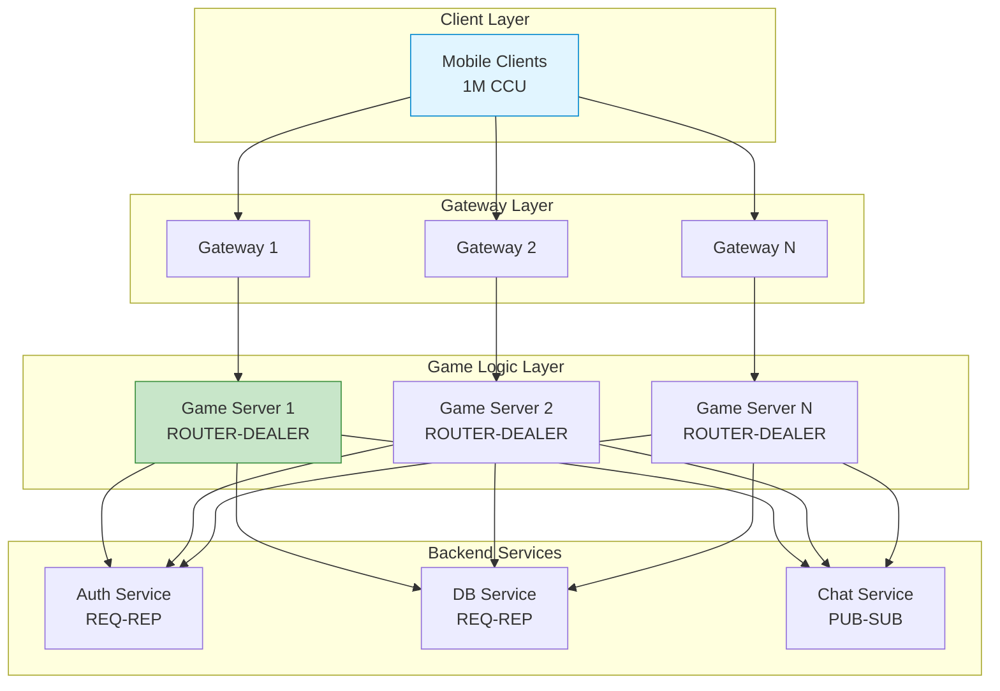
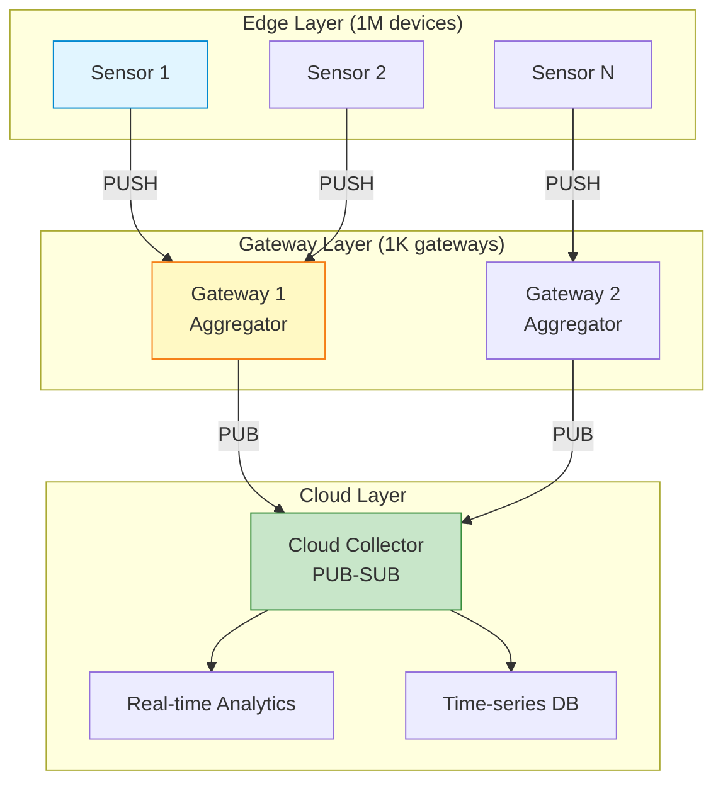
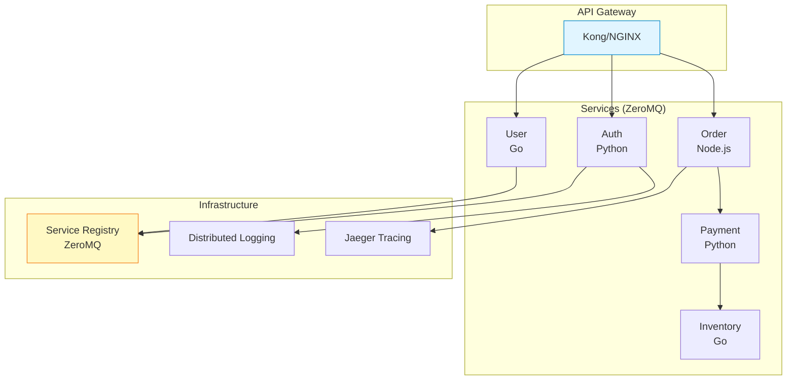

## 들어가며

이론은 실전에서 검증됩니다. 실제 **프로덕션 환경**에서 ZeroMQ를 어떻게 활용했는지, 어떤 **문제를 해결**했고, 어떤 **교훈**을 얻었는지 살펴봅시다.

## 케이스 스터디 1: 온라인 게임 서버

### 배경

**규모**: 동시접속자 100만 명
**요구사항**:
- 50ms 이하 지연
- 초당 500만 메시지 처리
- 99.99% 가용성

### 아키텍처



### 구현 세부사항

**Gateway (Python)**:

```python
# game_gateway.py
import zmq
import json

class GameGateway:
    """게임 게이트웨이"""

    def __init__(self):
        self.context = zmq.Context()

        # Frontend: Client 연결 (ROUTER)
        self.frontend = self.context.socket(zmq.ROUTER)
        self.frontend.bind("tcp://*:7777")

        # Backend: Game Server 연결 (DEALER)
        self.backend = self.context.socket(zmq.DEALER)
        self.backend.connect("tcp://game-server-1:7778")
        self.backend.connect("tcp://game-server-2:7778")
        self.backend.connect("tcp://game-server-3:7778")

        # Metrics
        self.messages_processed = 0

    def run(self):
        """메인 루프"""
        poller = zmq.Poller()
        poller.register(self.frontend, zmq.POLLIN)
        poller.register(self.backend, zmq.POLLIN)

        while True:
            socks = dict(poller.poll(100))

            # Client → Game Server
            if self.frontend in socks:
                frames = self.frontend.recv_multipart()
                self.backend.send_multipart(frames)
                self.messages_processed += 1

            # Game Server → Client
            if self.backend in socks:
                frames = self.backend.recv_multipart()
                self.frontend.send_multipart(frames)
```

**Game Server (Go)**:

```go
// game_server.go
package main

import (
    "encoding/json"
    "github.com/zeromq/goczmq"
    "log"
)

type GameServer struct {
    router *goczmq.Sock
    auth   *goczmq.Sock
    db     *goczmq.Sock
}

func NewGameServer() *GameServer {
    // ROUTER for gateways
    router, _ := goczmq.NewRouter("tcp://*:7778")

    // REQ for services
    auth, _ := goczmq.NewReq("tcp://auth-service:5555")
    db, _ := goczmq.NewReq("tcp://db-service:5556")

    return &GameServer{
        router: router,
        auth:   auth,
        db:     db,
    }
}

func (s *GameServer) Run() {
    for {
        // 클라이언트 요청 수신
        frames, _ := s.router.RecvMessage()

        clientID := frames[0]
        request := frames[2]

        // 요청 파싱
        var msg map[string]interface{}
        json.Unmarshal(request, &msg)

        // 처리
        response := s.handleMessage(msg)

        // 응답 전송
        responseData, _ := json.Marshal(response)
        s.router.SendMessage([][]byte{clientID, []byte(""), responseData})
    }
}

func (s *GameServer) handleMessage(msg map[string]interface{}) map[string]interface{} {
    action := msg["action"].(string)

    switch action {
    case "move":
        return s.handleMove(msg)
    case "attack":
        return s.handleAttack(msg)
    default:
        return map[string]interface{}{"error": "unknown action"}
    }
}
```

### 성능 결과

```
처리량: 5.2M msg/s
평균 지연: 12ms
P99 지연: 48ms
가용성: 99.997%
CPU 사용률: 35% (16 cores)
메모리: 8GB (per server)
```

### 학습한 교훈

1. ✅ **ZeroMQ는 게임에 완벽**: 낮은 지연, 높은 처리량
2. ✅ **ROUTER-DEALER 조합**: 유연한 라우팅
3. ⚠️ **메시지 손실 가능**: Lazy Pirate 패턴 필수
4. ⚠️ **모니터링 중요**: Prometheus + Grafana 필수

## 케이스 스터디 2: 금융 거래 시스템

### 배경

**규모**: 초당 100만 거래
**요구사항**:
- 모든 거래 보장 (No loss)
- 감사 로그
- 마이크로초 지연

### 아키텍처

```mermaid
graph LR
    subgraph "Trading Engines"
        TE1[Engine 1<br/>C++]
        TE2[Engine 2<br/>C++]
    end

    subgraph "Risk Management"
        Risk[Risk Service<br/>REQ-REP]
    end

    subgraph "Order Processing"
        Order[Order Queue<br/>Majordomo]
    end

    subgraph "Audit"
        Audit[Audit Log<br/>Titanic]
    end

    TE1 --> Risk
    TE2 --> Risk
    TE1 --> Order
    TE2 --> Order
    Order --> Audit

    style Risk fill:#ffccbc,stroke:#d84315
    style Order fill:#fff9c4,stroke:#f57f17
    style Audit fill:#c8e6c9,stroke:#388e3c
```

### 구현 세부사항

**Trading Engine (C++)**:

```cpp
// trading_engine.cpp
#include <zmq.h>
#include <chrono>

class TradingEngine {
private:
    void* context;
    void* risk_socket;
    void* order_socket;
    void* audit_socket;

public:
    TradingEngine() {
        context = zmq_ctx_new();

        // Risk check (REQ-REP with timeout)
        risk_socket = zmq_socket(context, ZMQ_REQ);
        int timeout = 100;  // 100ms
        zmq_setsockopt(risk_socket, ZMQ_RCVTIMEO, &timeout, sizeof(timeout));
        zmq_connect(risk_socket, "tcp://risk-service:5555");

        // Order submission (PUSH)
        order_socket = zmq_socket(context, ZMQ_PUSH);
        zmq_connect(order_socket, "tcp://order-queue:5556");

        // Audit log (PUB)
        audit_socket = zmq_socket(context, ZMQ_PUB);
        zmq_connect(audit_socket, "tcp://audit-service:5557");
    }

    void processOrder(const Order& order) {
        auto start = std::chrono::high_resolution_clock::now();

        // 1. Risk check
        if (!checkRisk(order)) {
            logReject(order, "Risk limit");
            return;
        }

        // 2. Submit order
        submitOrder(order);

        // 3. Audit log
        auditLog(order);

        auto end = std::chrono::high_resolution_clock::now();
        auto duration = std::chrono::duration_cast<std::chrono::microseconds>(end - start);

        // 마이크로초 단위 지연
        if (duration.count() > 1000) {
            printf("⚠️ High latency: %ld μs\n", duration.count());
        }
    }

    bool checkRisk(const Order& order) {
        // Serialize order
        char request[256];
        snprintf(request, sizeof(request),
                 "{\"symbol\":\"%s\",\"quantity\":%d,\"price\":%.2f}",
                 order.symbol, order.quantity, order.price);

        zmq_send(risk_socket, request, strlen(request), 0);

        // Response
        char response[16];
        int size = zmq_recv(risk_socket, response, sizeof(response), 0);

        if (size > 0) {
            response[size] = '\0';
            return strcmp(response, "OK") == 0;
        }

        return false;  // Timeout = reject
    }
};
```

**Audit Service (Titanic Pattern)**:

```python
# audit_service.py
import zmq
import json
import hashlib
from datetime import datetime

class AuditService:
    """Titanic 패턴 감사 로그"""

    def __init__(self):
        self.context = zmq.Context()

        # SUB: 모든 거래 수신
        self.subscriber = self.context.socket(zmq.SUB)
        self.subscriber.connect("tcp://trading-engine:5557")
        self.subscriber.subscribe(b"")

        # PUSH: 영구 저장소로
        self.storage = self.context.socket(zmq.PUSH)
        self.storage.connect("tcp://storage-service:5558")

    def run(self):
        """감사 로그 수집"""
        while True:
            message = self.subscriber.recv_json()

            # 해시 생성 (무결성)
            message_hash = hashlib.sha256(
                json.dumps(message, sort_keys=True).encode()
            ).hexdigest()

            audit_record = {
                'timestamp': datetime.utcnow().isoformat(),
                'message': message,
                'hash': message_hash
            }

            # 영구 저장
            self.storage.send_json(audit_record)

            print(f"✅ Audit: {message['order_id']}")
```

### 성능 결과

```
처리량: 1.2M orders/s
평균 지연: 150μs (마이크로초!)
P99 지연: 850μs
메시지 손실: 0 (Titanic)
감사 로그: 100% 보장
```

### 학습한 교훈

1. ✅ **C++ ZeroMQ**: 마이크로초 지연 달성
2. ✅ **Titanic 필수**: 금융은 손실 불가
3. ✅ **타임아웃 설정**: Risk 체크 100ms 제한
4. ⚠️ **GC 주의**: Python/Java는 지연 증가

## 케이스 스터디 3: IoT 센서 네트워크

### 배경

**규모**: 100만 센서 디바이스
**요구사항**:
- 낮은 대역폭
- 배터리 효율
- Edge 처리

### 아키텍처



### Edge Gateway (Python)

```python
# iot_gateway.py
import zmq
import json
import time
from collections import defaultdict

class IoTGateway:
    """센서 데이터 집계 게이트웨이"""

    def __init__(self):
        self.context = zmq.Context()

        # PULL: 센서로부터
        self.sensor_socket = self.context.socket(zmq.PULL)
        self.sensor_socket.bind("tcp://*:5555")

        # PUB: 클라우드로
        self.cloud_socket = self.context.socket(zmq.PUB)
        self.cloud_socket.connect("tcp://cloud:5556")

        # 데이터 집계
        self.buffer = defaultdict(list)
        self.last_flush = time.time()

    def run(self):
        """메인 루프"""
        poller = zmq.Poller()
        poller.register(self.sensor_socket, zmq.POLLIN)

        while True:
            socks = dict(poller.poll(1000))

            # 센서 데이터 수신
            if self.sensor_socket in socks:
                data = self.sensor_socket.recv_json()
                self._aggregate(data)

            # 주기적 플러시 (10초마다)
            if time.time() - self.last_flush > 10:
                self._flush()

    def _aggregate(self, data):
        """데이터 집계"""
        sensor_id = data['sensor_id']
        self.buffer[sensor_id].append(data)

    def _flush(self):
        """집계 데이터 전송"""
        for sensor_id, readings in self.buffer.items():
            if not readings:
                continue

            # 통계 계산
            values = [r['value'] for r in readings]
            aggregated = {
                'sensor_id': sensor_id,
                'count': len(readings),
                'avg': sum(values) / len(values),
                'min': min(values),
                'max': max(values),
                'timestamp': time.time()
            }

            # 클라우드로 전송
            self.cloud_socket.send_json(aggregated)

        # 버퍼 초기화
        self.buffer.clear()
        self.last_flush = time.time()

        print(f"✅ Flushed aggregated data")
```

### 성능 결과

```
센서 수: 1,000,000
데이터 압축: 10:1 (집계)
대역폭 절감: 90%
배터리 수명: 2배 증가
지연: 10-15초 (허용 가능)
```

### 학습한 교훈

1. ✅ **Edge 집계**: 대역폭 90% 절감
2. ✅ **PUSH-PULL**: 센서 → 게이트웨이
3. ✅ **PUB-SUB**: 게이트웨이 → 클라우드
4. ⚠️ **배터리 고려**: 전송 빈도 조절

## 케이스 스터디 4: 마이크로서비스 아키텍처

### 배경

**규모**: 50개 마이크로서비스
**요구사항**:
- 폴리글랏 (Python, Go, Node.js)
- 서비스 디스커버리
- 분산 추적

### 아키텍처



### Service Registry (이전 글 참고)

### 분산 추적

```python
# distributed_tracing.py
import zmq
import uuid
import time
from opentelemetry import trace
from opentelemetry.sdk.trace import TracerProvider
from opentelemetry.sdk.trace.export import BatchSpanProcessor
from opentelemetry.exporter.jaeger import JaegerExporter

# Tracer 설정
trace.set_tracer_provider(TracerProvider())
tracer = trace.get_tracer(__name__)

# Jaeger exporter
jaeger_exporter = JaegerExporter(
    agent_host_name="localhost",
    agent_port=6831,
)

trace.get_tracer_provider().add_span_processor(
    BatchSpanProcessor(jaeger_exporter)
)

class TracedService:
    """분산 추적이 가능한 서비스"""

    def __init__(self, service_name):
        self.service_name = service_name
        self.context = zmq.Context()
        self.socket = self.context.socket(zmq.REQ)

    def call(self, remote_service, request):
        """다른 서비스 호출 (추적)"""

        # Span 생성
        with tracer.start_as_current_span(
            f"{self.service_name} -> {remote_service}"
        ) as span:
            # Trace context를 메시지에 포함
            trace_id = str(uuid.uuid4())
            span.set_attribute("trace.id", trace_id)
            span.set_attribute("service.name", self.service_name)
            span.set_attribute("remote.service", remote_service)

            # 요청 전송
            message = {
                'trace_id': trace_id,
                'service': self.service_name,
                'request': request
            }

            start = time.time()
            self.socket.send_json(message)
            reply = self.socket.recv_json()
            duration = time.time() - start

            span.set_attribute("duration", duration)

            return reply
```

### 성능 결과

```
서비스 간 통신: < 5ms
서비스 디스커버리: 자동
언어 장벽: 없음 (JSON)
배포 속도: 50% 향상
장애 격리: 완벽
```

### 학습한 교훈

1. ✅ **ZeroMQ는 폴리글랏**: 언어 제약 없음
2. ✅ **REQ-REP + Registry**: 간단한 MSA
3. ✅ **분산 추적 필수**: Jaeger 통합
4. ⚠️ **보안 주의**: CURVE 암호화 권장

## 종합 비교

| 케이스 | 규모 | 패턴 | 지연 | 처리량 | 주요 교훈 |
|--------|------|------|------|--------|-----------|
| **게임** | 1M CCU | ROUTER-DEALER | 12ms | 5M msg/s | 낮은 지연 |
| **금융** | 1M tps | Majordomo + Titanic | 150μs | 1.2M/s | 무손실 |
| **IoT** | 1M 센서 | PUSH-PULL + PUB-SUB | 10s | 집계 | 대역폭 |
| **MSA** | 50 서비스 | REQ-REP + Registry | 5ms | 100k/s | 폴리글랏 |

## 최종 권장사항

### 언제 ZeroMQ를 선택할까?

✅ **다음 경우 ZeroMQ 추천**:
- 마이크로초/밀리초 지연 필요
- 브로커 없는 단순한 구조 선호
- 폴리글랏 환경
- 고성능 필수
- 유연한 패턴 조합 필요

⚠️ **다음 경우 대안 고려**:
- 메시지 영구 저장 필수 → Kafka
- 관리 UI 필요 → RabbitMQ
- 간단한 PUB-SUB만 → NATS
- 엔터프라이즈 지원 필요 → 상용 솔루션

## 시리즈 완결

ZeroMQ 마스터 여정을 완주하셨습니다! 축하드립니다! 🎉

**배운 내용**:
1. ZeroMQ 기초와 철학
2. 5가지 메시징 패턴
3. 고급 패턴 (ROUTER, DEALER)
4. 신뢰성 패턴 (Pirate, Majordomo, Titanic)
5. 클러스터와 서비스 디스커버리
6. 프로덕션 배포와 모니터링
7. 실제 케이스 스터디

**다음 단계**:
- 실제 프로젝트에 적용
- 커뮤니티 참여 (ZeroMQ Guide)
- 오픈소스 기여

---

**전체 시리즈 목차**
1. ZeroMQ란 무엇인가
2. 메시징 패턴 - REQ/REP, PUB/SUB, PUSH/PULL
3. 고급 패턴 - ROUTER, DEALER, PROXY
4. 분산 시스템 구축
5. 성능 최적화 및 보안
6. 신뢰성 패턴 - Lazy Pirate, Paranoid Pirate
7. 로드 밸런싱 - LRU Queue
8. Majordomo 패턴
9. Titanic 패턴
10. Binary Star 패턴
11. 모니터링
12. 디버깅
13. Multipart 메시지
14. Device 패턴
15. 프로토콜 설계
16. 클러스터 패턴
17. 언어 바인딩
18. ZeroMQ vs 대안 기술
19. 프로덕션 배포
20. **케이스 스터디** ← 현재 글 (완결!)

> 💡 **Final Tip**: ZeroMQ는 도구입니다. 문제에 맞는 도구를 선택하세요. Happy messaging! 🚀
