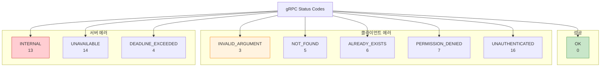
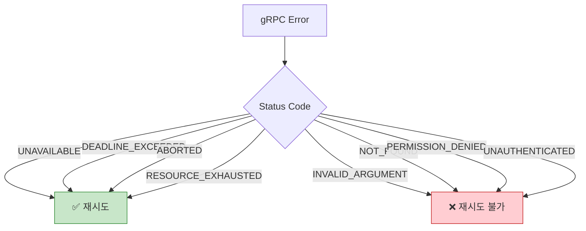
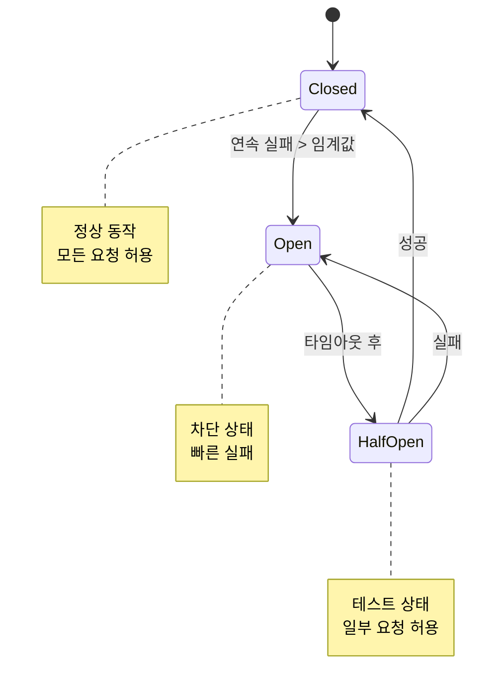

## 들어가며

효과적인 **에러 처리**는 견고한 분산 시스템의 핵심입니다. gRPC의 Status Codes, 에러 세부 정보, 재시도 전략을 마스터하여 안정적인 시스템을 구축할 수 있습니다.

## gRPC Status Codes

### 표준 Status Codes



### 전체 Status Codes 목록

| Code | 번호 | HTTP | 의미 | 재시도 |
|------|------|------|------|--------|
| **OK** | 0 | 200 | 성공 | - |
| **CANCELLED** | 1 | 499 | 클라이언트가 취소 | ❌ |
| **UNKNOWN** | 2 | 500 | 알 수 없는 에러 | ❌ |
| **INVALID_ARGUMENT** | 3 | 400 | 잘못된 인자 | ❌ |
| **DEADLINE_EXCEEDED** | 4 | 504 | 타임아웃 | ✅ |
| **NOT_FOUND** | 5 | 404 | 리소스 없음 | ❌ |
| **ALREADY_EXISTS** | 6 | 409 | 이미 존재 | ❌ |
| **PERMISSION_DENIED** | 7 | 403 | 권한 없음 | ❌ |
| **RESOURCE_EXHAUSTED** | 8 | 429 | 리소스 고갈 | ✅ |
| **FAILED_PRECONDITION** | 9 | 400 | 전제 조건 실패 | ❌ |
| **ABORTED** | 10 | 409 | 작업 중단 | ✅ |
| **OUT_OF_RANGE** | 11 | 400 | 범위 초과 | ❌ |
| **UNIMPLEMENTED** | 12 | 501 | 미구현 | ❌ |
| **INTERNAL** | 13 | 500 | 내부 에러 | ❌ |
| **UNAVAILABLE** | 14 | 503 | 서비스 불가 | ✅ |
| **DATA_LOSS** | 15 | 500 | 데이터 손실 | ❌ |
| **UNAUTHENTICATED** | 16 | 401 | 인증 필요 | ❌ |

## 에러 생성

### Python

```python
import grpc
from user_pb2 import GetUserRequest, GetUserResponse

def GetUser(self, request, context):
    user_id = request.user_id

    # NOT_FOUND 에러
    if not user_exists(user_id):
        context.set_code(grpc.StatusCode.NOT_FOUND)
        context.set_details(f'User {user_id} not found')
        return GetUserResponse()

    # PERMISSION_DENIED 에러
    if not has_permission(context, user_id):
        context.abort(
            grpc.StatusCode.PERMISSION_DENIED,
            'You do not have permission to access this user'
        )

    # INVALID_ARGUMENT 에러
    if len(user_id) == 0:
        context.abort(
            grpc.StatusCode.INVALID_ARGUMENT,
            'user_id cannot be empty'
        )

    # 성공
    user = get_user(user_id)
    return GetUserResponse(
        user_id=user.id,
        name=user.name,
        email=user.email
    )
```

### Go

```go
import (
    "google.golang.org/grpc/codes"
    "google.golang.org/grpc/status"
)

func (s *UserServiceServer) GetUser(
    ctx context.Context,
    req *pb.GetUserRequest) (*pb.GetUserResponse, error) {

    userID := req.UserId

    // INVALID_ARGUMENT
    if userID == "" {
        return nil, status.Error(codes.InvalidArgument, "user_id cannot be empty")
    }

    user, err := s.db.GetUser(userID)

    // NOT_FOUND
    if err == sql.ErrNoRows {
        return nil, status.Errorf(codes.NotFound, "user %s not found", userID)
    }

    // INTERNAL
    if err != nil {
        return nil, status.Errorf(codes.Internal, "database error: %v", err)
    }

    // 권한 확인
    if !hasPermission(ctx, userID) {
        return nil, status.Error(codes.PermissionDenied,
            "you do not have permission to access this user")
    }

    return &pb.GetUserResponse{
        UserId: user.ID,
        Name:   user.Name,
        Email:  user.Email,
    }, nil
}
```

### C++

```cpp
#include <grpcpp/grpcpp.h>

grpc::Status GetUser(grpc::ServerContext* context,
                     const GetUserRequest* request,
                     GetUserResponse* response) {
    std::string user_id = request->user_id();

    // INVALID_ARGUMENT
    if (user_id.empty()) {
        return grpc::Status(
            grpc::StatusCode::INVALID_ARGUMENT,
            "user_id cannot be empty"
        );
    }

    User user;
    if (!db->GetUser(user_id, &user)) {
        // NOT_FOUND
        return grpc::Status(
            grpc::StatusCode::NOT_FOUND,
            "user " + user_id + " not found"
        );
    }

    response->set_user_id(user.id());
    response->set_name(user.name());
    response->set_email(user.email());

    return grpc::Status::OK;
}
```

## 에러 세부 정보

### Rich Error Model

Google의 표준 에러 모델을 사용하여 더 많은 정보를 전달할 수 있습니다.

```protobuf
syntax = "proto3";

import "google/rpc/status.proto";
import "google/rpc/error_details.proto";

service UserService {
  rpc GetUser(GetUserRequest) returns (GetUserResponse);
}
```

**Go 예제** (에러 세부 정보 포함):

```go
import (
    "google.golang.org/genproto/googleapis/rpc/errdetails"
    "google.golang.org/grpc/status"
)

func (s *UserServiceServer) CreateUser(
    ctx context.Context,
    req *pb.CreateUserRequest) (*pb.CreateUserResponse, error) {

    // 유효성 검사
    violations := validateCreateUserRequest(req)
    if len(violations) > 0 {
        // BadRequest 에러 세부 정보
        br := &errdetails.BadRequest{}
        for _, violation := range violations {
            br.FieldViolations = append(br.FieldViolations,
                &errdetails.BadRequest_FieldViolation{
                    Field:       violation.Field,
                    Description: violation.Description,
                })
        }

        st := status.New(codes.InvalidArgument, "invalid request")
        st, _ = st.WithDetails(br)
        return nil, st.Err()
    }

    // 중복 확인
    if userExists(req.Email) {
        // PreconditionFailure 에러 세부 정보
        pf := &errdetails.PreconditionFailure{}
        pf.Violations = append(pf.Violations,
            &errdetails.PreconditionFailure_Violation{
                Type:        "EMAIL_ALREADY_EXISTS",
                Subject:     req.Email,
                Description: "A user with this email already exists",
            })

        st := status.New(codes.AlreadyExists, "user already exists")
        st, _ = st.WithDetails(pf)
        return nil, st.Err()
    }

    // 사용자 생성
    user, err := s.db.CreateUser(req)
    if err != nil {
        return nil, status.Errorf(codes.Internal, "failed to create user: %v", err)
    }

    return &pb.CreateUserResponse{UserId: user.ID}, nil
}

type Violation struct {
    Field       string
    Description string
}

func validateCreateUserRequest(req *pb.CreateUserRequest) []Violation {
    var violations []Violation

    if req.Email == "" {
        violations = append(violations, Violation{
            Field:       "email",
            Description: "email is required",
        })
    } else if !isValidEmail(req.Email) {
        violations = append(violations, Violation{
            Field:       "email",
            Description: "email format is invalid",
        })
    }

    if len(req.Password) < 8 {
        violations = append(violations, Violation{
            Field:       "password",
            Description: "password must be at least 8 characters",
        })
    }

    return violations
}
```

**클라이언트에서 에러 세부 정보 읽기**:

```go
func handleCreateUser(client pb.UserServiceClient) {
    resp, err := client.CreateUser(context.Background(), &pb.CreateUserRequest{
        Email:    "invalid-email",
        Password: "short",
    })

    if err != nil {
        // Status 추출
        st, ok := status.FromError(err)
        if !ok {
            log.Fatal("not a gRPC error")
        }

        fmt.Printf("Code: %s\n", st.Code())
        fmt.Printf("Message: %s\n", st.Message())

        // 에러 세부 정보 추출
        for _, detail := range st.Details() {
            switch t := detail.(type) {
            case *errdetails.BadRequest:
                fmt.Println("BadRequest:")
                for _, violation := range t.FieldViolations {
                    fmt.Printf("  %s: %s\n", violation.Field, violation.Description)
                }

            case *errdetails.PreconditionFailure:
                fmt.Println("PreconditionFailure:")
                for _, violation := range t.Violations {
                    fmt.Printf("  %s: %s (%s)\n",
                        violation.Type, violation.Description, violation.Subject)
                }
            }
        }
    }
}

// 출력:
// Code: InvalidArgument
// Message: invalid request
// BadRequest:
//   email: email format is invalid
//   password: password must be at least 8 characters
```

### 표준 에러 세부 정보 타입

| 타입 | 사용 사례 |
|------|----------|
| **BadRequest** | 필드 검증 에러 |
| **PreconditionFailure** | 전제 조건 실패 |
| **QuotaFailure** | 할당량 초과 |
| **ErrorInfo** | 일반 에러 정보 |
| **RetryInfo** | 재시도 권장 시간 |
| **DebugInfo** | 디버그 정보 |
| **RequestInfo** | 요청 ID |
| **ResourceInfo** | 리소스 정보 |
| **Help** | 도움말 링크 |
| **LocalizedMessage** | 현지화된 메시지 |

## 재시도 전략

### 재시도 가능 여부 판단



### Exponential Backoff

```go
import (
    "math"
    "time"
)

type RetryConfig struct {
    MaxRetries     int
    InitialBackoff time.Duration
    MaxBackoff     time.Duration
    Multiplier     float64
}

func RetryWithBackoff(
    config RetryConfig,
    fn func() error,
) error {
    var err error

    for attempt := 0; attempt < config.MaxRetries; attempt++ {
        err = fn()

        if err == nil {
            return nil
        }

        // 재시도 불가능한 에러인지 확인
        if !isRetryable(err) {
            return err
        }

        // Backoff 계산
        backoff := float64(config.InitialBackoff) *
            math.Pow(config.Multiplier, float64(attempt))
        backoff = math.Min(backoff, float64(config.MaxBackoff))

        // Jitter 추가 (20%)
        jitter := backoff * 0.2 * rand.Float64()
        backoff += jitter

        log.Printf("Attempt %d failed, retrying in %.2fs...", attempt+1, backoff)
        time.Sleep(time.Duration(backoff))
    }

    return fmt.Errorf("max retries exceeded: %w", err)
}

func isRetryable(err error) bool {
    st, ok := status.FromError(err)
    if !ok {
        return false
    }

    switch st.Code() {
    case codes.Unavailable,
         codes.DeadlineExceeded,
         codes.Aborted,
         codes.ResourceExhausted:
        return true
    default:
        return false
    }
}

// 사용
err := RetryWithBackoff(
    RetryConfig{
        MaxRetries:     5,
        InitialBackoff: 1 * time.Second,
        MaxBackoff:     30 * time.Second,
        Multiplier:     2.0,
    },
    func() error {
        _, err := client.GetUser(ctx, &pb.GetUserRequest{UserId: "123"})
        return err
    },
)
```

### Retry Policy (gRPC 내장)

```go
import (
    "google.golang.org/grpc"
    "google.golang.org/grpc/codes"
)

// Service Config에서 재시도 정책 정의
retryPolicy := `{
    "methodConfig": [{
        "name": [{"service": "user.UserService"}],
        "retryPolicy": {
            "maxAttempts": 5,
            "initialBackoff": "0.1s",
            "maxBackoff": "10s",
            "backoffMultiplier": 2.0,
            "retryableStatusCodes": ["UNAVAILABLE", "DEADLINE_EXCEEDED"]
        }
    }]
}`

conn, err := grpc.Dial(
    "localhost:50051",
    grpc.WithInsecure(),
    grpc.WithDefaultServiceConfig(retryPolicy),
)
```

## Circuit Breaker

### Circuit Breaker 패턴



### Go 구현

```go
import (
    "sync"
    "time"
)

type CircuitBreaker struct {
    mu            sync.Mutex
    state         State
    failureCount  int
    successCount  int
    lastFailTime  time.Time

    maxFailures   int
    resetTimeout  time.Duration
    halfOpenMax   int
}

type State int

const (
    StateClosed State = iota
    StateOpen
    StateHalfOpen
)

func NewCircuitBreaker(maxFailures int, resetTimeout time.Duration) *CircuitBreaker {
    return &CircuitBreaker{
        state:        StateClosed,
        maxFailures:  maxFailures,
        resetTimeout: resetTimeout,
        halfOpenMax:  3,
    }
}

func (cb *CircuitBreaker) Call(fn func() error) error {
    cb.mu.Lock()

    // 상태 확인 및 전환
    if cb.state == StateOpen {
        if time.Since(cb.lastFailTime) > cb.resetTimeout {
            cb.state = StateHalfOpen
            cb.successCount = 0
        } else {
            cb.mu.Unlock()
            return errors.New("circuit breaker is open")
        }
    }

    cb.mu.Unlock()

    // 함수 실행
    err := fn()

    cb.mu.Lock()
    defer cb.mu.Unlock()

    if err != nil {
        cb.onFailure()
        return err
    }

    cb.onSuccess()
    return nil
}

func (cb *CircuitBreaker) onSuccess() {
    if cb.state == StateHalfOpen {
        cb.successCount++
        if cb.successCount >= cb.halfOpenMax {
            cb.state = StateClosed
            cb.failureCount = 0
        }
    } else {
        cb.failureCount = 0
    }
}

func (cb *CircuitBreaker) onFailure() {
    cb.failureCount++
    cb.lastFailTime = time.Now()

    if cb.state == StateHalfOpen {
        cb.state = StateOpen
    } else if cb.failureCount >= cb.maxFailures {
        cb.state = StateOpen
    }
}

// 사용
cb := NewCircuitBreaker(5, 60*time.Second)

err := cb.Call(func() error {
    _, err := client.GetUser(ctx, &pb.GetUserRequest{UserId: "123"})
    return err
})

if err != nil {
    log.Printf("Circuit breaker: %v", err)
}
```

## Timeout 관리

### Context Deadline

```go
func callWithTimeout(client pb.UserServiceClient, userID string) error {
    // 5초 타임아웃
    ctx, cancel := context.WithTimeout(context.Background(), 5*time.Second)
    defer cancel()

    resp, err := client.GetUser(ctx, &pb.GetUserRequest{UserId: userID})

    if err != nil {
        st, ok := status.FromError(err)
        if ok && st.Code() == codes.DeadlineExceeded {
            return fmt.Errorf("request timeout: %w", err)
        }
        return err
    }

    log.Printf("User: %s", resp.Name)
    return nil
}
```

### 서버 측 Timeout

```go
func (s *UserServiceServer) GetUser(
    ctx context.Context,
    req *pb.GetUserRequest) (*pb.GetUserResponse, error) {

    // Deadline 확인
    deadline, ok := ctx.Deadline()
    if ok {
        remaining := time.Until(deadline)
        log.Printf("Remaining time: %v", remaining)

        if remaining < 100*time.Millisecond {
            return nil, status.Error(codes.DeadlineExceeded,
                "insufficient time to complete request")
        }
    }

    // 오래 걸리는 작업
    user, err := s.db.GetUser(req.UserId)
    if err != nil {
        return nil, err
    }

    return &pb.GetUserResponse{
        UserId: user.ID,
        Name:   user.Name,
    }, nil
}
```

## 에러 처리 Best Practices

### 1. 구체적인 Status Code 사용

```go
// ❌ 나쁨
return nil, status.Error(codes.Internal, "error")

// ✅ 좋음
if err == sql.ErrNoRows {
    return nil, status.Errorf(codes.NotFound, "user %s not found", userID)
}
if err == ErrInvalidEmail {
    return nil, status.Error(codes.InvalidArgument, "invalid email format")
}
return nil, status.Errorf(codes.Internal, "database error: %v", err)
```

### 2. 민감한 정보 노출 방지

```go
// ❌ 나쁨 - SQL 쿼리 노출
return nil, status.Errorf(codes.Internal,
    "query failed: SELECT * FROM users WHERE password='%s'", password)

// ✅ 좋음 - 일반적인 메시지
return nil, status.Error(codes.Internal, "database error occurred")
```

### 3. 구조화된 로깅

```go
func (s *UserServiceServer) GetUser(
    ctx context.Context,
    req *pb.GetUserRequest) (*pb.GetUserResponse, error) {

    user, err := s.db.GetUser(req.UserId)

    if err != nil {
        // 내부 로깅 (상세)
        log.WithFields(log.Fields{
            "user_id": req.UserId,
            "error":   err.Error(),
            "stack":   debug.Stack(),
        }).Error("Failed to get user")

        // 클라이언트 에러 (일반적)
        return nil, status.Error(codes.Internal, "failed to retrieve user")
    }

    return &pb.GetUserResponse{UserId: user.ID, Name: user.Name}, nil
}
```

## 다음 단계

gRPC 에러 처리를 마스터했습니다! 다음 글에서는:
- **Protobuf vs 대안**
- JSON, Thrift, Avro 비교
- 선택 가이드

---

**시리즈 목차**
15. gRPC 인터셉터
16. **gRPC 에러 처리** ← 현재 글
17. Protobuf vs 대안 (다음 글)

> 💡 **Quick Tip**: INTERNAL 에러는 최후의 수단입니다. 가능한 구체적인 Status Code (NOT_FOUND, INVALID_ARGUMENT 등)를 사용하세요!
