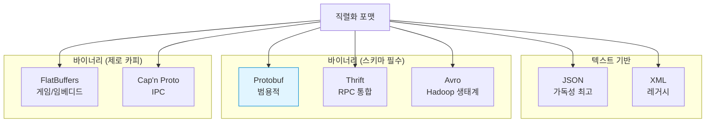
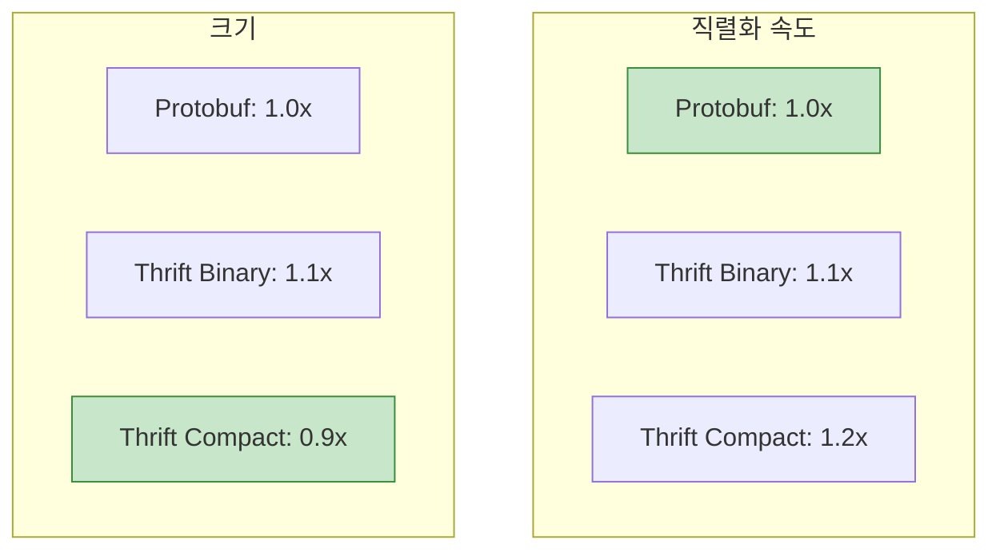
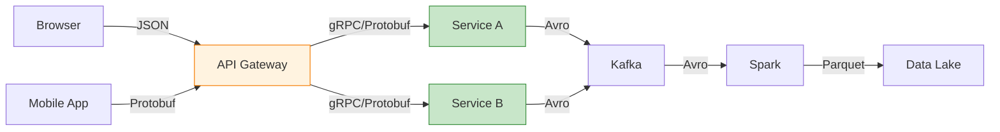

## 들어가며

직렬화 포맷 선택은 시스템 아키텍처의 중요한 결정입니다. **Protobuf, JSON, Thrift, Avro, FlatBuffers** 각각의 장단점을 이해하고 상황에 맞는 최적의 선택을 할 수 있습니다.

## 직렬화 포맷 개요



## Protobuf vs JSON

### 특징 비교

| 특징 | Protobuf | JSON |
|------|----------|------|
| **포맷** | 바이너리 | 텍스트 |
| **가독성** | ❌ (도구 필요) | ✅ (사람이 읽기 쉬움) |
| **크기** | 작음 (1x) | 큼 (3-10x) |
| **속도** | 빠름 (1x) | 느림 (2-5x) |
| **스키마** | 필수 (.proto) | 선택적 (JSON Schema) |
| **타입 안정성** | ✅ 강함 | ❌ 약함 |
| **하위 호환성** | ✅ 내장 | ❌ 수동 관리 |
| **브라우저 지원** | ⚠️ (변환 필요) | ✅ 네이티브 |
| **디버깅** | ⚠️ (도구 필요) | ✅ 쉬움 |

### 성능 벤치마크

```python
import json
import time
from user_pb2 import User

# 테스트 데이터
users = []
for i in range(10000):
    users.append({
        "id": i,
        "name": f"User{i}",
        "email": f"user{i}@example.com",
        "age": 30 + (i % 40),
    })

# JSON 직렬화
start = time.time()
json_data = json.dumps(users)
json_time = time.time() - start
json_size = len(json_data)

# Protobuf 직렬화
start = time.time()
user_list = UserList()
for u in users:
    user = user_list.users.add()
    user.id = u["id"]
    user.name = u["name"]
    user.email = u["email"]
    user.age = u["age"]
pb_data = user_list.SerializeToString()
pb_time = time.time() - start
pb_size = len(pb_data)

print(f"JSON: {json_size:,} bytes, {json_time:.3f}s")
print(f"Protobuf: {pb_size:,} bytes, {pb_time:.3f}s")
print(f"Size reduction: {(1 - pb_size/json_size)*100:.1f}%")
print(f"Speed improvement: {json_time/pb_time:.1f}x")
```

**결과 예시**:

```
JSON: 890,000 bytes, 0.123s
Protobuf: 320,000 bytes, 0.045s
Size reduction: 64.0%
Speed improvement: 2.7x
```

### 사용 사례

**JSON 선택 시**:
- ✅ REST API (브라우저 클라이언트)
- ✅ 빠른 프로토타이핑
- ✅ 사람이 읽어야 하는 설정 파일
- ✅ 외부 시스템과의 통합 (표준)

**Protobuf 선택 시**:
- ✅ 마이크로서비스 간 통신 (gRPC)
- ✅ 모바일 앱 (대역폭 절약)
- ✅ 고성능 시스템
- ✅ 장기 데이터 저장 (스키마 진화)

### 코드 예제

**JSON**:

```javascript
// JavaScript (브라우저)
const user = {
    id: 123,
    name: "Alice",
    email: "alice@example.com"
};

// 직렬화
const json = JSON.stringify(user);
fetch('/api/users', {
    method: 'POST',
    headers: {'Content-Type': 'application/json'},
    body: json
});

// 역직렬화
const response = await fetch('/api/users/123');
const user = await response.json();
console.log(user.name);
```

**Protobuf**:

```go
// Go (gRPC)
user := &pb.User{
    Id:    123,
    Name:  "Alice",
    Email: "alice@example.com",
}

// gRPC 호출 (자동 직렬화)
resp, err := client.CreateUser(ctx, user)
```

## Protobuf vs Apache Thrift

### 특징 비교

| 특징 | Protobuf | Apache Thrift |
|------|----------|---------------|
| **개발사** | Google | Facebook → Apache |
| **언어 지원** | 40+ | 20+ |
| **RPC** | gRPC (별도) | 내장 |
| **포맷** | 바이너리 | 바이너리 + JSON |
| **스키마** | .proto | .thrift |
| **타입** | 풍부 | 유사 |
| **성능** | 빠름 | 유사 |
| **커뮤니티** | 매우 큼 | 중간 |
| **학습 곡선** | 낮음 | 중간 |

### 스키마 비교

**Protobuf**:

```protobuf
syntax = "proto3";

message User {
  int32 id = 1;
  string name = 2;
  string email = 3;
  repeated string tags = 4;
}

service UserService {
  rpc GetUser(GetUserRequest) returns (GetUserResponse);
}
```

**Thrift**:

```thrift
namespace java com.example

struct User {
  1: i32 id,
  2: string name,
  3: string email,
  4: list<string> tags
}

service UserService {
  User getUser(1: i32 userId)
}
```

### 성능 비교



### 선택 가이드

**Protobuf 선택 시**:
- ✅ Google 생태계 (Cloud, Kubernetes)
- ✅ gRPC 사용
- ✅ 큰 커뮤니티 필요
- ✅ 표준화된 도구

**Thrift 선택 시**:
- ✅ RPC 프레임워크 통합 (별도 설치 불필요)
- ✅ 다양한 프로토콜 (Binary, Compact, JSON)
- ✅ Facebook 생태계
- ✅ 간단한 서버 구현

## Protobuf vs Apache Avro

### 특징 비교

| 특징 | Protobuf | Apache Avro |
|------|----------|-------------|
| **개발사** | Google | Apache (Hadoop) |
| **주요 용도** | RPC, API | 데이터 저장/전송 |
| **스키마 위치** | 코드에 컴파일 | 데이터와 함께 저장 |
| **스키마 진화** | 필드 번호 기반 | 이름 기반 |
| **타입 시스템** | 정적 | 동적 |
| **코드 생성** | 필수 | 선택적 |
| **JSON 지원** | 변환 | 네이티브 |
| **Hadoop 통합** | ❌ | ✅ 최적화 |

### 스키마 비교

**Protobuf**:

```protobuf
message User {
  string name = 1;
  int32 age = 2;
  string email = 3;
}
```

**Avro (JSON 스키마)**:

```json
{
  "type": "record",
  "name": "User",
  "fields": [
    {"name": "name", "type": "string"},
    {"name": "age", "type": "int"},
    {"name": "email", "type": "string"}
  ]
}
```

### 스키마 진화 차이

**Protobuf** (필드 번호 기반):

```protobuf
// v1
message User {
  string name = 1;
}

// v2
message User {
  string full_name = 1;  // 이름 변경해도 번호가 같으면 OK
  string email = 2;      // 새 필드 추가
}
```

**Avro** (이름 기반):

```json
// v1
{
  "type": "record",
  "name": "User",
  "fields": [
    {"name": "name", "type": "string"}
  ]
}

// v2 (aliases로 호환성 유지)
{
  "type": "record",
  "name": "User",
  "fields": [
    {
      "name": "full_name",
      "type": "string",
      "aliases": ["name"]
    },
    {
      "name": "email",
      "type": "string",
      "default": ""
    }
  ]
}
```

### 선택 가이드

**Protobuf 선택 시**:
- ✅ RPC/API 통신
- ✅ 정적 타입 선호
- ✅ 코드 생성 기반
- ✅ gRPC 사용

**Avro 선택 시**:
- ✅ Hadoop/Spark 데이터 저장
- ✅ 동적 스키마 필요
- ✅ 스키마 레지스트리 (Kafka)
- ✅ 스키마와 데이터 함께 저장

## Protobuf vs FlatBuffers

### 특징 비교

| 특징 | Protobuf | FlatBuffers |
|------|----------|-------------|
| **개발사** | Google | Google (게임팀) |
| **파싱** | 전체 역직렬화 | 제로 카피 |
| **메모리 접근** | 객체 생성 | 직접 접근 |
| **수정** | ✅ 가능 | ❌ 불가 (읽기 전용) |
| **크기** | 작음 | 약간 큼 |
| **속도** | 빠름 | 매우 빠름 (읽기) |
| **사용 난이도** | 쉬움 | 중간 |
| **주요 용도** | RPC, API | 게임, 임베디드 |

### 제로 카피 개념


### 스키마 비교

**Protobuf**:

```protobuf
message Monster {
  string name = 1;
  int32 hp = 2;
  int32 attack = 3;
  repeated Weapon weapons = 4;
}

message Weapon {
  string name = 1;
  int32 damage = 2;
}
```

**FlatBuffers**:

```fbs
table Monster {
  name:string;
  hp:int;
  attack:int;
  weapons:[Weapon];
}

table Weapon {
  name:string;
  damage:int;
}

root_type Monster;
```

### 성능 비교 (C++)

```cpp
// Protobuf
Monster monster;
monster.set_name("Dragon");
monster.set_hp(1000);

std::string data = monster.SerializeAsString();

// 역직렬화 (객체 생성 + 메모리 복사)
Monster parsed;
parsed.ParseFromString(data);
std::cout << parsed.name() << std::endl;

// FlatBuffers
flatbuffers::FlatBufferBuilder builder;

auto name = builder.CreateString("Dragon");
auto monster = CreateMonster(builder, name, 1000, 50);
builder.Finish(monster);

uint8_t* data = builder.GetBufferPointer();

// 제로 카피 접근 (역직렬화 없음!)
auto parsed = GetMonster(data);
std::cout << parsed->name()->c_str() << std::endl;  // 직접 접근
```

### 벤치마크

| 작업 | Protobuf | FlatBuffers |
|------|----------|-------------|
| **쓰기** | 1.0x | 0.8x (약간 느림) |
| **읽기** | 1.0x | 10-100x (매우 빠름) |
| **크기** | 1.0x | 1.2x (약간 큼) |
| **메모리** | 높음 | 낮음 |

### 선택 가이드

**Protobuf 선택 시**:
- ✅ RPC/API (gRPC)
- ✅ 데이터 수정 필요
- ✅ 범용적 사용
- ✅ 간단한 API

**FlatBuffers 선택 시**:
- ✅ 게임 (초저지연)
- ✅ 임베디드 시스템
- ✅ 대용량 읽기 전용 데이터
- ✅ 메모리 제약적 환경

## 종합 비교표

| 특징 | Protobuf | JSON | Thrift | Avro | FlatBuffers |
|------|----------|------|--------|------|-------------|
| **크기** | ⭐⭐⭐⭐ | ⭐⭐ | ⭐⭐⭐⭐ | ⭐⭐⭐⭐ | ⭐⭐⭐ |
| **속도 (쓰기)** | ⭐⭐⭐⭐ | ⭐⭐ | ⭐⭐⭐⭐ | ⭐⭐⭐ | ⭐⭐⭐ |
| **속도 (읽기)** | ⭐⭐⭐⭐ | ⭐⭐ | ⭐⭐⭐⭐ | ⭐⭐⭐ | ⭐⭐⭐⭐⭐ |
| **가독성** | ⭐⭐ | ⭐⭐⭐⭐⭐ | ⭐⭐ | ⭐⭐ | ⭐ |
| **브라우저** | ⭐⭐ | ⭐⭐⭐⭐⭐ | ⭐⭐ | ⭐⭐ | ⭐⭐ |
| **스키마 진화** | ⭐⭐⭐⭐⭐ | ⭐⭐ | ⭐⭐⭐⭐ | ⭐⭐⭐⭐⭐ | ⭐⭐⭐⭐ |
| **RPC 지원** | ⭐⭐⭐⭐⭐ | ⭐⭐ | ⭐⭐⭐⭐⭐ | ⭐⭐ | ⭐⭐ |
| **타입 안정성** | ⭐⭐⭐⭐⭐ | ⭐⭐ | ⭐⭐⭐⭐⭐ | ⭐⭐⭐⭐ | ⭐⭐⭐⭐⭐ |
| **학습 곡선** | ⭐⭐⭐⭐ | ⭐⭐⭐⭐⭐ | ⭐⭐⭐ | ⭐⭐⭐ | ⭐⭐ |
| **커뮤니티** | ⭐⭐⭐⭐⭐ | ⭐⭐⭐⭐⭐ | ⭐⭐⭐ | ⭐⭐⭐⭐ | ⭐⭐⭐ |

## 선택 플로우차트

```mermaid
graph TB
    Start[직렬화 포맷 선택]

    Start --> Q1{브라우저<br/>클라이언트?}
    Q1 -->|Yes| JSON_Choice[JSON]
    Q1 -->|No| Q2{초저지연<br/>필요?}

    Q2 -->|Yes| Q3{읽기 전용?}
    Q3 -->|Yes| FB[FlatBuffers]
    Q3 -->|No| Protobuf_Game[Protobuf]

    Q2 -->|No| Q4{RPC<br/>프레임워크?}
    Q4 -->|gRPC| Protobuf_gRPC[Protobuf]
    Q4 -->|Thrift| Thrift_Choice[Thrift]
    Q4 -->|No| Q5{Hadoop<br/>생태계?}

    Q5 -->|Yes| Avro_Choice[Avro]
    Q5 -->|No| Protobuf_Default[Protobuf<br/>(범용)]

    style JSON_Choice fill:#fff3e0,stroke:#f57c00
    style FB fill:#e1bee7,stroke:#8e24aa
    style Protobuf_gRPC fill:#c8e6c9,stroke:#388e3c
    style Protobuf_Default fill:#c8e6c9,stroke:#388e3c
```

## 실전 조합

### 마이크로서비스 아키텍처



### 게임 서버

```
Client (FlatBuffers) ← 실시간 게임 상태
    ↓
Game Server (FlatBuffers) ← 초저지연
    ↓
Backend (Protobuf/gRPC) ← 게임 로직, 인증
    ↓
Database ← 영구 저장
```

## 다음 단계

직렬화 포맷 비교를 마스터했습니다! 다음 글에서는:
- **Protobuf 테스팅**
- Unit 테스트
- Mock 서비스

---

**시리즈 목차**
16. gRPC 에러 처리
17. **Protobuf vs 대안** ← 현재 글
18. Protobuf 테스팅 (다음 글)

> 💡 **Quick Tip**: 대부분의 경우 Protobuf + gRPC가 좋은 선택입니다. 브라우저 클라이언트는 JSON, Hadoop 데이터는 Avro, 초저지연 게임은 FlatBuffers를 고려하세요!
