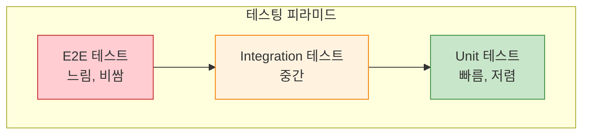
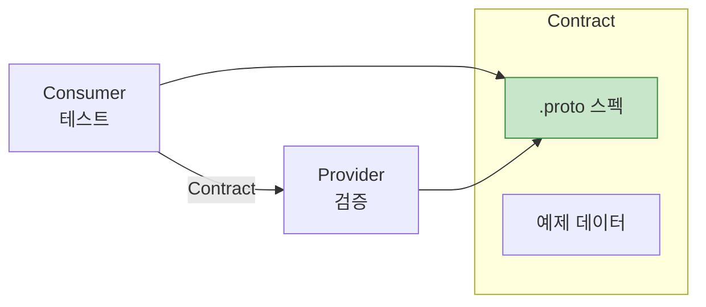

## 들어가며

견고한 시스템은 **철저한 테스팅**에서 시작됩니다. Protobuf와 gRPC 서비스의 Unit 테스트, Mock, Integration 테스트, Contract 테스트 전략을 마스터합니다.

## 테스팅 피라미드



## Unit 테스트

### Protobuf 메시지 테스트

**Python 예제**:

```python
import unittest
from user_pb2 import User

class UserMessageTest(unittest.TestCase):
    def test_user_creation(self):
        """User 메시지 생성 테스트"""
        user = User()
        user.id = 123
        user.name = "Alice"
        user.email = "alice@example.com"

        self.assertEqual(user.id, 123)
        self.assertEqual(user.name, "Alice")
        self.assertEqual(user.email, "alice@example.com")

    def test_user_serialization(self):
        """직렬화/역직렬화 테스트"""
        user = User()
        user.id = 456
        user.name = "Bob"
        user.email = "bob@example.com"

        # 직렬화
        data = user.SerializeToString()
        self.assertGreater(len(data), 0)

        # 역직렬화
        user2 = User()
        user2.ParseFromString(data)

        self.assertEqual(user2.id, user.id)
        self.assertEqual(user2.name, user.name)
        self.assertEqual(user2.email, user.email)

    def test_repeated_fields(self):
        """Repeated 필드 테스트"""
        user = User()
        user.tags.extend(["admin", "developer"])

        self.assertEqual(len(user.tags), 2)
        self.assertIn("admin", user.tags)
        self.assertIn("developer", user.tags)

    def test_default_values(self):
        """기본값 테스트"""
        user = User()

        self.assertEqual(user.id, 0)
        self.assertEqual(user.name, "")
        self.assertEqual(len(user.tags), 0)

if __name__ == '__main__':
    unittest.main()
```

**Go 예제**:

```go
import (
    "testing"
    "github.com/stretchr/testify/assert"
    pb "path/to/user"
)

func TestUserMessage(t *testing.T) {
    t.Run("Creation", func(t *testing.T) {
        user := &pb.User{
            Id:    123,
            Name:  "Alice",
            Email: "alice@example.com",
        }

        assert.Equal(t, int32(123), user.Id)
        assert.Equal(t, "Alice", user.Name)
        assert.Equal(t, "alice@example.com", user.Email)
    })

    t.Run("Serialization", func(t *testing.T) {
        user := &pb.User{
            Id:    456,
            Name:  "Bob",
            Email: "bob@example.com",
        }

        // 직렬화
        data, err := proto.Marshal(user)
        assert.NoError(t, err)
        assert.NotEmpty(t, data)

        // 역직렬화
        user2 := &pb.User{}
        err = proto.Unmarshal(data, user2)
        assert.NoError(t, err)

        assert.Equal(t, user.Id, user2.Id)
        assert.Equal(t, user.Name, user2.Name)
        assert.Equal(t, user.Email, user2.Email)
    })

    t.Run("RepeatedFields", func(t *testing.T) {
        user := &pb.User{
            Tags: []string{"admin", "developer"},
        }

        assert.Len(t, user.Tags, 2)
        assert.Contains(t, user.Tags, "admin")
        assert.Contains(t, user.Tags, "developer")
    })
}
```

### gRPC 서비스 Unit 테스트

**Go 서버 테스트**:

```go
import (
    "context"
    "testing"
    "github.com/stretchr/testify/assert"
    "google.golang.org/grpc/codes"
    "google.golang.org/grpc/status"
    pb "path/to/user"
)

type mockDB struct {
    users map[string]*pb.User
}

func (m *mockDB) GetUser(id string) (*pb.User, error) {
    user, exists := m.users[id]
    if !exists {
        return nil, ErrUserNotFound
    }
    return user, nil
}

func TestUserService_GetUser(t *testing.T) {
    // Mock DB 준비
    db := &mockDB{
        users: map[string]*pb.User{
            "123": {Id: "123", Name: "Alice", Email: "alice@example.com"},
        },
    }

    service := &UserServiceServer{db: db}

    t.Run("Success", func(t *testing.T) {
        req := &pb.GetUserRequest{UserId: "123"}
        resp, err := service.GetUser(context.Background(), req)

        assert.NoError(t, err)
        assert.NotNil(t, resp)
        assert.Equal(t, "123", resp.UserId)
        assert.Equal(t, "Alice", resp.Name)
    })

    t.Run("NotFound", func(t *testing.T) {
        req := &pb.GetUserRequest{UserId: "999"}
        resp, err := service.GetUser(context.Background(), req)

        assert.Error(t, err)
        assert.Nil(t, resp)

        st, ok := status.FromError(err)
        assert.True(t, ok)
        assert.Equal(t, codes.NotFound, st.Code())
    })

    t.Run("InvalidArgument", func(t *testing.T) {
        req := &pb.GetUserRequest{UserId: ""}
        resp, err := service.GetUser(context.Background(), req)

        assert.Error(t, err)
        assert.Nil(t, resp)

        st, ok := status.FromError(err)
        assert.True(t, ok)
        assert.Equal(t, codes.InvalidArgument, st.Code())
    })
}
```

## Mock 서비스

### gomock을 사용한 Mock (Go)

```bash
# gomock 설치
go install github.com/golang/mock/mockgen@latest

# Mock 생성
mockgen -source=user_grpc.pb.go -destination=mock/user_mock.go -package=mock
```

**생성된 Mock 사용**:

```go
import (
    "context"
    "testing"
    "github.com/golang/mock/gomock"
    "github.com/stretchr/testify/assert"
    "path/to/mock"
    pb "path/to/user"
)

func TestClientLogic(t *testing.T) {
    ctrl := gomock.NewController(t)
    defer ctrl.Finish()

    // Mock 클라이언트 생성
    mockClient := mock.NewMockUserServiceClient(ctrl)

    // 예상 동작 설정
    mockClient.EXPECT().
        GetUser(gomock.Any(), &pb.GetUserRequest{UserId: "123"}).
        Return(&pb.GetUserResponse{
            UserId: "123",
            Name:   "Alice",
            Email:  "alice@example.com",
        }, nil)

    // 테스트할 로직
    resp, err := mockClient.GetUser(context.Background(),
        &pb.GetUserRequest{UserId: "123"})

    assert.NoError(t, err)
    assert.Equal(t, "Alice", resp.Name)
}

func TestClientError(t *testing.T) {
    ctrl := gomock.NewController(t)
    defer ctrl.Finish()

    mockClient := mock.NewMockUserServiceClient(ctrl)

    // 에러 시뮬레이션
    mockClient.EXPECT().
        GetUser(gomock.Any(), gomock.Any()).
        Return(nil, status.Error(codes.NotFound, "user not found"))

    resp, err := mockClient.GetUser(context.Background(),
        &pb.GetUserRequest{UserId: "999"})

    assert.Error(t, err)
    assert.Nil(t, resp)
}
```

### Python Mock (unittest.mock)

```python
import unittest
from unittest.mock import MagicMock, patch
import grpc
from user_pb2 import GetUserRequest, GetUserResponse
from user_pb2_grpc import UserServiceStub

class TestUserClient(unittest.TestCase):
    def setUp(self):
        # Mock 채널과 스텁 생성
        self.channel = MagicMock()
        self.stub = UserServiceStub(self.channel)

    @patch.object(UserServiceStub, 'GetUser')
    def test_get_user_success(self, mock_get_user):
        """성공 케이스 테스트"""
        # Mock 응답 설정
        mock_get_user.return_value = GetUserResponse(
            user_id="123",
            name="Alice",
            email="alice@example.com"
        )

        # 테스트
        request = GetUserRequest(user_id="123")
        response = self.stub.GetUser(request)

        self.assertEqual(response.user_id, "123")
        self.assertEqual(response.name, "Alice")
        mock_get_user.assert_called_once_with(request)

    @patch.object(UserServiceStub, 'GetUser')
    def test_get_user_not_found(self, mock_get_user):
        """NOT_FOUND 에러 테스트"""
        # Mock 에러 설정
        mock_get_user.side_effect = grpc.RpcError()
        mock_get_user.side_effect.code = lambda: grpc.StatusCode.NOT_FOUND

        with self.assertRaises(grpc.RpcError):
            self.stub.GetUser(GetUserRequest(user_id="999"))
```

### In-Memory 테스트 서버

**Go 예제**:

```go
import (
    "context"
    "net"
    "testing"
    "google.golang.org/grpc"
    "google.golang.org/grpc/test/bufconn"
    pb "path/to/user"
)

const bufSize = 1024 * 1024

func setupTestServer() (*grpc.Server, *bufconn.Listener) {
    lis := bufconn.Listen(bufSize)
    server := grpc.NewServer()

    // 실제 서비스 등록
    pb.RegisterUserServiceServer(server, &UserServiceServer{
        db: &mockDB{
            users: map[string]*pb.User{
                "123": {Id: "123", Name: "Alice"},
            },
        },
    })

    go func() {
        if err := server.Serve(lis); err != nil {
            panic(err)
        }
    }()

    return server, lis
}

func TestUserService_Integration(t *testing.T) {
    server, lis := setupTestServer()
    defer server.Stop()

    // 클라이언트 연결
    ctx := context.Background()
    conn, err := grpc.DialContext(ctx, "bufnet",
        grpc.WithContextDialer(func(ctx context.Context, s string) (net.Conn, error) {
            return lis.Dial()
        }),
        grpc.WithInsecure(),
    )
    assert.NoError(t, err)
    defer conn.Close()

    client := pb.NewUserServiceClient(conn)

    // 테스트
    resp, err := client.GetUser(ctx, &pb.GetUserRequest{UserId: "123"})
    assert.NoError(t, err)
    assert.Equal(t, "Alice", resp.Name)
}
```

## Integration 테스트

### Docker Compose 환경

```yaml
# docker-compose.test.yml
version: '3.8'

services:
  postgres:
    image: postgres:14
    environment:
      POSTGRES_DB: testdb
      POSTGRES_USER: test
      POSTGRES_PASSWORD: test
    ports:
      - "5432:5432"

  grpc-server:
    build: .
    environment:
      DB_HOST: postgres
      DB_PORT: 5432
    depends_on:
      - postgres
    ports:
      - "50051:50051"
```

**Integration 테스트**:

```go
func TestIntegration_UserFlow(t *testing.T) {
    if testing.Short() {
        t.Skip("skipping integration test")
    }

    // Docker Compose 시작 (테스트 전)
    // docker-compose -f docker-compose.test.yml up -d

    // gRPC 클라이언트 연결
    conn, err := grpc.Dial("localhost:50051", grpc.WithInsecure())
    require.NoError(t, err)
    defer conn.Close()

    client := pb.NewUserServiceClient(conn)
    ctx := context.Background()

    // 1. 사용자 생성
    createResp, err := client.CreateUser(ctx, &pb.CreateUserRequest{
        Name:  "Alice",
        Email: "alice@example.com",
    })
    require.NoError(t, err)
    assert.NotEmpty(t, createResp.UserId)

    userID := createResp.UserId

    // 2. 사용자 조회
    getResp, err := client.GetUser(ctx, &pb.GetUserRequest{UserId: userID})
    require.NoError(t, err)
    assert.Equal(t, "Alice", getResp.Name)

    // 3. 사용자 업데이트
    updateResp, err := client.UpdateUser(ctx, &pb.UpdateUserRequest{
        UserId: userID,
        Name:   "Alice Smith",
    })
    require.NoError(t, err)
    assert.Equal(t, "Alice Smith", updateResp.Name)

    // 4. 사용자 삭제
    _, err = client.DeleteUser(ctx, &pb.DeleteUserRequest{UserId: userID})
    require.NoError(t, err)

    // 5. 삭제 확인
    _, err = client.GetUser(ctx, &pb.GetUserRequest{UserId: userID})
    assert.Error(t, err)

    st, ok := status.FromError(err)
    assert.True(t, ok)
    assert.Equal(t, codes.NotFound, st.Code())
}
```

### Testcontainers 사용

```go
import (
    "github.com/testcontainers/testcontainers-go"
    "github.com/testcontainers/testcontainers-go/wait"
)

func setupPostgresContainer(t *testing.T) (string, func()) {
    ctx := context.Background()

    req := testcontainers.ContainerRequest{
        Image:        "postgres:14",
        ExposedPorts: []string{"5432/tcp"},
        Env: map[string]string{
            "POSTGRES_DB":       "testdb",
            "POSTGRES_USER":     "test",
            "POSTGRES_PASSWORD": "test",
        },
        WaitingFor: wait.ForLog("database system is ready to accept connections"),
    }

    container, err := testcontainers.GenericContainer(ctx,
        testcontainers.GenericContainerRequest{
            ContainerRequest: req,
            Started:          true,
        })
    require.NoError(t, err)

    host, _ := container.Host(ctx)
    port, _ := container.MappedPort(ctx, "5432")

    dsn := fmt.Sprintf("host=%s port=%s user=test password=test dbname=testdb sslmode=disable",
        host, port.Port())

    cleanup := func() {
        container.Terminate(ctx)
    }

    return dsn, cleanup
}

func TestWithPostgres(t *testing.T) {
    dsn, cleanup := setupPostgresContainer(t)
    defer cleanup()

    // DB 연결 및 테스트
    db, err := sql.Open("postgres", dsn)
    require.NoError(t, err)
    defer db.Close()

    // 테스트 실행
    // ...
}
```

## Contract 테스팅

### Consumer-Driven Contracts



### Pact 사용 (개념적)

```python
# consumer_test.py (소비자)
from pact import Consumer, Provider

pact = Consumer('UserClient').has_pact_with(Provider('UserService'))

# Contract 정의
(pact
    .given('user 123 exists')
    .upon_receiving('a request for user 123')
    .with_request('GET', '/users/123')
    .will_respond_with(200, body={
        'id': '123',
        'name': 'Alice',
        'email': 'alice@example.com'
    }))

with pact:
    # 클라이언트 테스트
    user = user_client.get_user('123')
    assert user['name'] == 'Alice'

# provider_test.py (제공자)
from pact import Verifier

verifier = Verifier(provider='UserService')
verifier.verify_pacts('./pacts/userclient-userservice.json',
                      provider_base_url='http://localhost:50051')
```

### 스키마 검증

```go
func TestProtoSchemaCompatibility(t *testing.T) {
    // v1 메시지
    userV1 := &v1.User{
        Id:   123,
        Name: "Alice",
    }

    data, _ := proto.Marshal(userV1)

    // v2로 파싱 (하위 호환성 테스트)
    userV2 := &v2.User{}
    err := proto.Unmarshal(data, userV2)

    assert.NoError(t, err)
    assert.Equal(t, int32(123), userV2.Id)
    assert.Equal(t, "Alice", userV2.Name)

    // v2 메시지
    userV2New := &v2.User{
        Id:    456,
        Name:  "Bob",
        Email: "bob@example.com", // v2에 추가된 필드
    }

    data, _ = proto.Marshal(userV2New)

    // v1으로 파싱 (상위 호환성 테스트)
    userV1New := &v1.User{}
    err = proto.Unmarshal(data, userV1New)

    assert.NoError(t, err)
    assert.Equal(t, int32(456), userV1New.Id)
    assert.Equal(t, "Bob", userV1New.Name)
    // email은 무시됨
}
```

## 테스트 유틸리티

### 비교 헬퍼

```go
import (
    "github.com/google/go-cmp/cmp"
    "google.golang.org/protobuf/testing/protocmp"
)

func TestMessageComparison(t *testing.T) {
    user1 := &pb.User{
        Id:    123,
        Name:  "Alice",
        Email: "alice@example.com",
    }

    user2 := &pb.User{
        Id:    123,
        Name:  "Alice",
        Email: "alice@example.com",
    }

    // Protobuf 메시지 비교
    if diff := cmp.Diff(user1, user2, protocmp.Transform()); diff != "" {
        t.Errorf("users mismatch (-want +got):\n%s", diff)
    }
}
```

### 테스트 데이터 생성

```python
def create_test_user(id="123", name="Alice", email=None):
    """테스트용 User 생성"""
    user = User()
    user.id = id
    user.name = name
    if email:
        user.email = email
    return user

def create_test_users(count=10):
    """다수의 테스트 사용자 생성"""
    return [
        create_test_user(
            id=str(i),
            name=f"User{i}",
            email=f"user{i}@example.com"
        )
        for i in range(count)
    ]
```

## 테스트 Coverage

```bash
# Go
go test -cover ./...
go test -coverprofile=coverage.out ./...
go tool cover -html=coverage.out

# Python
pytest --cov=. --cov-report=html

# C++
g++ -fprofile-arcs -ftest-coverage test.cpp
gcov test.cpp
lcov --capture --directory . --output-file coverage.info
genhtml coverage.info --output-directory out
```

## Best Practices

| 원칙 | 설명 |
|------|------|
| **Fast Feedback** | Unit 테스트 먼저, Integration은 필요시 |
| **테스트 격리** | 각 테스트는 독립적 |
| **Mock 활용** | 외부 의존성 제거 |
| **Contract 테스트** | 스키마 호환성 검증 |
| **CI/CD 통합** | 자동화된 테스트 실행 |
| **테스트 데이터** | 실제와 유사한 데이터 |

## 다음 단계

Protobuf 테스팅을 마스터했습니다! 다음 글에서는:
- **Protobuf 도구 생태계**
- buf, grpcurl, Evans
- BloomRPC

---

**시리즈 목차**
17. Protobuf vs 대안
18. **Protobuf 테스팅** ← 현재 글
19. Protobuf 도구 생태계 (다음 글)

> 💡 **Quick Tip**: Mock은 Unit 테스트에서, 실제 서버는 Integration 테스트에서 사용하세요. 테스트 피라미드를 따르면 빠르고 신뢰할 수 있는 테스트를 만들 수 있습니다!
