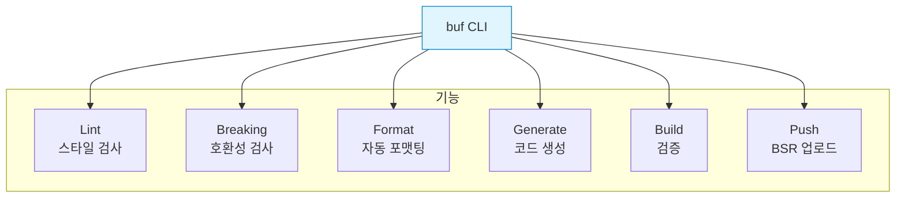

## 들어가며

**도구 생태계**는 개발 생산성을 크게 향상시킵니다. Protobuf와 gRPC의 필수 도구들을 마스터하여 효율적인 워크플로우를 구축할 수 있습니다.

## buf - 현대적인 Protobuf 도구

### buf란?

**buf**는 Protobuf 워크플로우를 개선하는 올인원 도구입니다.



### 설치

```bash
# macOS
brew install bufbuild/buf/buf

# Linux
curl -sSL "https://github.com/bufbuild/buf/releases/latest/download/buf-$(uname -s)-$(uname -m)" \
  -o /usr/local/bin/buf
chmod +x /usr/local/bin/buf

# 검증
buf --version
```

### buf.yaml 설정

```yaml
# buf.yaml
version: v1

name: buf.build/myorg/myrepo

deps:
  - buf.build/googleapis/googleapis

lint:
  use:
    - DEFAULT
  except:
    - PACKAGE_VERSION_SUFFIX
  enum_zero_value_suffix: _UNSPECIFIED
  rpc_allow_same_request_response: false
  rpc_allow_google_protobuf_empty_requests: true
  rpc_allow_google_protobuf_empty_responses: true

breaking:
  use:
    - FILE
```

### Lint (스타일 검사)

```bash
# Lint 실행
buf lint

# 특정 카테고리만
buf lint --config '{"version":"v1","lint":{"use":["MINIMAL"]}}'

# 에러 예시
user.proto:5:1: Package name "user" should be suffixed with a correctly formed version, such as "user.v1".
user.proto:10:3: Field name "UserID" should be lower_snake_case, such as "user_id".
user.proto:15:3: Enum zero value name "STATUS_UNKNOWN" should be suffixed with "_UNSPECIFIED".
```

**Lint 카테고리**:

| 카테고리 | 설명 |
|---------|------|
| **DEFAULT** | 권장 규칙 (Google 스타일 가이드) |
| **MINIMAL** | 최소 규칙 |
| **BASIC** | 기본 규칙 |
| **COMMENTS** | 주석 규칙 |
| **UNARY_RPC** | Unary RPC 규칙 |

### Breaking Changes 검사

```bash
# 현재 브랜치와 main 비교
buf breaking --against '.git#branch=main'

# 특정 커밋과 비교
buf breaking --against '.git#commit=abc123'

# 로컬 디렉토리와 비교
buf breaking --against ../old-protos

# 에러 예시
user.proto:10:3: Field "1" on message "User" changed name from "id" to "user_id".
user.proto:15:3: Field "3" on message "User" changed type from "string" to "int32".
user.proto:20:1: Message "OldMessage" was deleted.
```

**Breaking Change 카테고리**:

| 카테고리 | 검사 항목 |
|---------|----------|
| **FILE** | 파일 레벨 변경 (패키지 이름 등) |
| **PACKAGE** | 패키지 레벨 변경 |
| **WIRE** | Wire 호환성 (필드 번호, 타입) |
| **WIRE_JSON** | Wire + JSON 호환성 |

### Format (자동 포맷팅)

```bash
# 포맷 검사
buf format -d

# 포맷 적용
buf format -w

# 특정 파일만
buf format -w user.proto
```

### Code Generation

**buf.gen.yaml**:

```yaml
# buf.gen.yaml
version: v1

managed:
  enabled: true
  go_package_prefix:
    default: github.com/myorg/myrepo/gen/go

plugins:
  # Go
  - plugin: buf.build/protocolbuffers/go
    out: gen/go
    opt:
      - paths=source_relative

  # Go gRPC
  - plugin: buf.build/grpc/go
    out: gen/go
    opt:
      - paths=source_relative

  # Python
  - plugin: buf.build/protocolbuffers/python
    out: gen/python

  # TypeScript
  - plugin: buf.build/bufbuild/es
    out: gen/ts
    opt:
      - target=ts

  # Validation
  - plugin: buf.build/bufbuild/validate-go
    out: gen/go
    opt:
      - paths=source_relative
```

**실행**:

```bash
buf generate
```

### BSR (Buf Schema Registry)

```bash
# 로그인
buf registry login

# 푸시
buf push

# Pull
buf export buf.build/myorg/myrepo -o ./protos
```

## grpcurl - gRPC의 curl

### 설치

```bash
# macOS
brew install grpcurl

# Go
go install github.com/fullstorydev/grpcurl/cmd/grpcurl@latest
```

### 기본 사용법

```bash
# 서비스 목록
grpcurl -plaintext localhost:50051 list

# 출력:
# grpc.reflection.v1alpha.ServerReflection
# user.v1.UserService

# 메소드 목록
grpcurl -plaintext localhost:50051 list user.v1.UserService

# 출력:
# user.v1.UserService.CreateUser
# user.v1.UserService.GetUser
# user.v1.UserService.UpdateUser
# user.v1.UserService.DeleteUser

# 메소드 상세
grpcurl -plaintext localhost:50051 describe user.v1.UserService.GetUser

# 출력:
# user.v1.UserService.GetUser is a method:
# rpc GetUser ( .user.v1.GetUserRequest ) returns ( .user.v1.GetUserResponse );
```

### RPC 호출

```bash
# 간단한 호출
grpcurl -plaintext \
  -d '{"user_id": "123"}' \
  localhost:50051 \
  user.v1.UserService/GetUser

# 출력 (JSON):
{
  "userId": "123",
  "name": "Alice",
  "email": "alice@example.com"
}

# 파일에서 입력
grpcurl -plaintext \
  -d @ \
  localhost:50051 \
  user.v1.UserService/CreateUser < request.json

# 헤더 추가
grpcurl -plaintext \
  -H "authorization: Bearer TOKEN" \
  -d '{"user_id": "123"}' \
  localhost:50051 \
  user.v1.UserService/GetUser

# TLS
grpcurl \
  -cacert ca.crt \
  -cert client.crt \
  -key client.key \
  example.com:443 \
  user.v1.UserService/GetUser
```

### Reflection 없이 사용

```bash
# .proto 파일 직접 사용
grpcurl -plaintext \
  -import-path ./proto \
  -proto user.proto \
  -d '{"user_id": "123"}' \
  localhost:50051 \
  user.v1.UserService/GetUser
```

### 스트리밍

```bash
# Server Streaming
grpcurl -plaintext \
  -d '{"service_name": "auth"}' \
  localhost:50051 \
  log.v1.LogService/StreamLogs

# Client Streaming (파일에서)
grpcurl -plaintext \
  -d @ \
  localhost:50051 \
  file.v1.FileService/UploadFile < chunks.json

# Bidirectional
grpcurl -plaintext \
  -d @ \
  localhost:50051 \
  chat.v1.ChatService/Chat
```

## Evans - 대화형 gRPC 클라이언트

### 설치

```bash
# macOS
brew install evans

# Go
go install github.com/ktr0731/evans@latest
```

### 대화형 모드

```bash
# Evans 시작
evans -p 50051 -r repl

# 또는 Reflection 없이
evans -p 50051 -r repl --proto user.proto
```

**대화형 세션**:

```bash
evans> show package
+-------------+
|   PACKAGE   |
+-------------+
| user.v1     |
+-------------+

evans> package user.v1

evans> show service
+--------------+--------------+--------------+---------------+
|   SERVICE    |     RPC      | REQUEST TYPE | RESPONSE TYPE |
+--------------+--------------+--------------+---------------+
| UserService  | GetUser      | GetUserReq   | GetUserResp   |
| UserService  | CreateUser   | CreateUserReq| CreateUserResp|
+--------------+--------------+--------------+---------------+

evans> service UserService

user.v1.UserService> call GetUser
user_id (TYPE_STRING) => 123
{
  "userId": "123",
  "name": "Alice",
  "email": "alice@example.com"
}

user.v1.UserService> header authorization=Bearer TOKEN

user.v1.UserService> call GetUser
user_id (TYPE_STRING) => 123
{
  "userId": "123",
  "name": "Alice"
}

user.v1.UserService> exit
```

### CLI 모드

```bash
# 직접 호출
evans --host localhost --port 50051 \
  --package user.v1 \
  --service UserService \
  --call GetUser \
  --json

# JSON 입력
echo '{"user_id":"123"}' | evans cli call user.v1.UserService.GetUser
```

## BloomRPC - GUI 클라이언트

### 특징

- 🖥️ Electron 기반 데스크톱 앱
- 📁 .proto 파일 임포트
- 🎨 직관적인 UI
- 📋 요청/응답 히스토리
- 💾 Environment 관리

### 사용법

```bash
# 설치
# https://github.com/bloomrpc/bloomrpc/releases

# 1. .proto 파일 임포트
# 2. 서버 주소 설정 (localhost:50051)
# 3. 메소드 선택
# 4. 요청 JSON 작성
# 5. "Play" 버튼 클릭
```

**스크린샷 구조**:

```
┌──────────────────────────────────────┐
│ File  Edit  View  Help               │
├──────────┬───────────────────────────┤
│ Services │ Request                   │
│          │ {                         │
│ UserSvc  │   "user_id": "123"        │
│ ├─GetUser│ }                         │
│ ├─Create │                           │
│ └─Update │ [Play Button]             │
│          │                           │
│          ├───────────────────────────┤
│          │ Response                  │
│          │ {                         │
│          │   "name": "Alice",        │
│          │   "email": "alice@..."    │
│          │ }                         │
└──────────┴───────────────────────────┘
```

## 기타 유용한 도구

### 1. protoc-gen-doc (문서 생성)

```bash
# 설치
go install github.com/pseudomuto/protoc-gen-doc/cmd/protoc-gen-doc@latest

# HTML 문서 생성
protoc --doc_out=./docs --doc_opt=html,index.html *.proto

# Markdown
protoc --doc_out=./docs --doc_opt=markdown,docs.md *.proto
```

### 2. protoc-gen-validate (검증)

```protobuf
syntax = "proto3";

import "validate/validate.proto";

message CreateUserRequest {
  string email = 1 [(validate.rules).string.email = true];

  string password = 2 [(validate.rules).string = {
    min_len: 8
    max_len: 128
  }];

  int32 age = 3 [(validate.rules).int32 = {
    gte: 0
    lte: 150
  }];
}
```

```bash
# 코드 생성
protoc \
  --go_out=. \
  --validate_out="lang=go:." \
  user.proto
```

### 3. prototool (deprecated, buf 사용 권장)

```bash
# Lint
prototool lint

# Format
prototool format -w

# Breaking
prototool break check --git-branch main
```

### 4. ghz (gRPC 벤치마크)

```bash
# 설치
go install github.com/bojand/ghz/cmd/ghz@latest

# 벤치마크
ghz --insecure \
  --proto user.proto \
  --call user.v1.UserService/GetUser \
  -d '{"user_id":"123"}' \
  -n 10000 \
  -c 50 \
  localhost:50051

# 출력:
Summary:
  Count:        10000
  Total:        2.45 s
  Slowest:      45.21 ms
  Fastest:      0.52 ms
  Average:      11.84 ms
  Requests/sec: 4081.63

Response time histogram:
  0.520 [1]     |
  5.009 [3421]  |∎∎∎∎∎∎∎∎∎∎∎∎∎∎∎∎∎∎∎∎
  9.498 [2134]  |∎∎∎∎∎∎∎∎∎∎∎∎
  13.987 [1876] |∎∎∎∎∎∎∎∎∎∎∎
```

### 5. protolint

```bash
# 설치
go install github.com/yoheimuta/protolint/cmd/protolint@latest

# Lint
protolint lint .

# 설정 (.protolint.yaml)
lint:
  rules:
    no_default: true
    add:
      - ENUM_FIELD_NAMES_UPPER_SNAKE_CASE
      - MESSAGE_NAMES_UPPER_CAMEL_CASE
      - RPC_NAMES_UPPER_CAMEL_CASE
```

## 도구 비교

| 도구 | 용도 | 장점 | 단점 |
|------|------|------|------|
| **buf** | Lint, Breaking, Generate | 올인원, 빠름, 현대적 | - |
| **grpcurl** | CLI 테스트 | 간편, curl과 유사 | GUI 없음 |
| **Evans** | 대화형 CLI | 탐색하기 좋음 | GUI 없음 |
| **BloomRPC** | GUI 테스트 | 직관적, 시각적 | Electron (무거움) |
| **ghz** | 벤치마크 | 성능 측정 | 특화됨 |

## 워크플로우 예시

### 개발 워크플로우

```bash
# 1. .proto 파일 작성
vim user.proto

# 2. Lint
buf lint

# 3. Format
buf format -w

# 4. Breaking 체크
buf breaking --against '.git#branch=main'

# 5. 코드 생성
buf generate

# 6. 테스트
grpcurl -plaintext -d '{"user_id":"123"}' localhost:50051 \
  user.v1.UserService/GetUser

# 7. Push to BSR
buf push

# 8. 문서 생성
protoc --doc_out=./docs --doc_opt=html,index.html *.proto
```

### CI/CD 통합

```yaml
# .github/workflows/proto.yml
name: Proto CI

on: [push, pull_request]

jobs:
  lint:
    runs-on: ubuntu-latest
    steps:
      - uses: actions/checkout@v3

      - name: Setup buf
        uses: bufbuild/buf-setup-action@v1

      - name: Lint
        run: buf lint

      - name: Breaking
        if: github.event_name == 'pull_request'
        run: buf breaking --against '.git#branch=${{ github.base_ref }}'

      - name: Generate
        run: buf generate

      - name: Push to BSR
        if: github.ref == 'refs/heads/main'
        run: buf push
        env:
          BUF_TOKEN: ${{ secrets.BUF_TOKEN }}
```

## VS Code 확장

```json
// .vscode/extensions.json
{
  "recommendations": [
    "bufbuild.vscode-buf",           // buf 통합
    "zxh404.vscode-proto3",          // Protobuf 문법
    "pbkit.vscode-pbkit"             // Protobuf 도구
  ]
}

// .vscode/settings.json
{
  "protoc": {
    "path": "/usr/local/bin/protoc",
    "options": [
      "--proto_path=${workspaceRoot}/proto"
    ]
  },
  "buf.lintOnSave": true,
  "buf.formatOnSave": true
}
```

## 다음 단계

Protobuf 도구 생태계를 마스터했습니다! 다음 글에서는:
- **엔터프라이즈 패턴**
- API Gateway 통합
- Service Mesh
- 프로덕션 체크리스트

---

**시리즈 목차**
18. Protobuf 테스팅
19. **Protobuf 도구 생태계** ← 현재 글
20. 엔터프라이즈 패턴 (다음 글)

> 💡 **Quick Tip**: buf는 반드시 사용하세요! Lint와 Breaking 체크를 자동화하면 스키마 품질이 크게 향상되고 호환성 문제를 사전에 방지할 수 있습니다!
