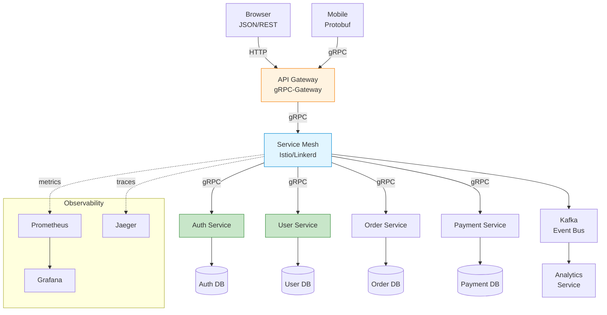
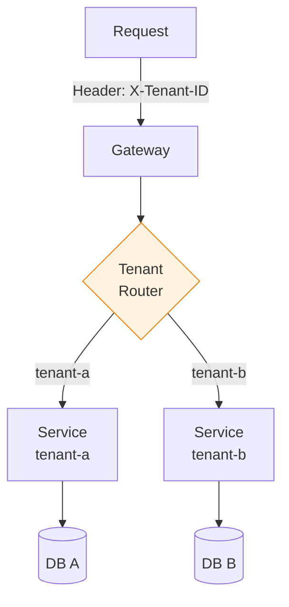

## 들어가며

**엔터프라이즈 환경**에서는 단순한 RPC 이상이 필요합니다. API Gateway 통합, Service Mesh, Multi-tenancy, 보안, 모니터링 등 프로덕션급 시스템을 구축하는 패턴을 마스터합니다.

## 아키텍처 패턴

### 마이크로서비스 아키텍처



## API Gateway with Protobuf

### gRPC-Gateway

**HTTP/JSON ↔ gRPC 브리지**

```protobuf
syntax = "proto3";

package api.v1;

import "google/api/annotations.proto";

service UserService {
  // HTTP GET /v1/users/{user_id}
  rpc GetUser(GetUserRequest) returns (GetUserResponse) {
    option (google.api.http) = {
      get: "/v1/users/{user_id}"
    };
  }

  // HTTP POST /v1/users
  rpc CreateUser(CreateUserRequest) returns (CreateUserResponse) {
    option (google.api.http) = {
      post: "/v1/users"
      body: "*"
    };
  }

  // HTTP PUT /v1/users/{user_id}
  rpc UpdateUser(UpdateUserRequest) returns (UpdateUserResponse) {
    option (google.api.http) = {
      put: "/v1/users/{user_id}"
      body: "*"
    };
  }

  // HTTP DELETE /v1/users/{user_id}
  rpc DeleteUser(DeleteUserRequest) returns (google.protobuf.Empty) {
    option (google.api.http) = {
      delete: "/v1/users/{user_id}"
    };
  }

  // HTTP GET /v1/users?page_size=10&page_token=abc
  rpc ListUsers(ListUsersRequest) returns (ListUsersResponse) {
    option (google.api.http) = {
      get: "/v1/users"
    };
  }
}

message GetUserRequest {
  string user_id = 1;
}

message GetUserResponse {
  User user = 1;
}

message CreateUserRequest {
  string name = 1;
  string email = 2;
}

message UpdateUserRequest {
  string user_id = 1;
  string name = 2;
  string email = 3;
}

message ListUsersRequest {
  int32 page_size = 1;
  string page_token = 2;
}

message ListUsersResponse {
  repeated User users = 1;
  string next_page_token = 2;
}

message User {
  string user_id = 1;
  string name = 2;
  string email = 3;
}
```

**Gateway 서버**:

```go
import (
    "context"
    "net/http"
    "github.com/grpc-ecosystem/grpc-gateway/v2/runtime"
    "google.golang.org/grpc"
    pb "path/to/api/v1"
)

func runGateway(grpcAddress string) error {
    ctx := context.Background()
    ctx, cancel := context.WithCancel(ctx)
    defer cancel()

    // gRPC 연결
    conn, err := grpc.DialContext(
        ctx,
        grpcAddress,
        grpc.WithInsecure(),
    )
    if err != nil {
        return err
    }
    defer conn.Close()

    // Gateway Mux 생성
    mux := runtime.NewServeMux(
        runtime.WithMarshalerOption(runtime.MIMEWildcard, &runtime.JSONPb{
            MarshalOptions: protojson.MarshalOptions{
                UseProtoNames:   false, // camelCase
                EmitUnpopulated: true,  // 기본값 포함
            },
        }),
    )

    // 서비스 등록
    err = pb.RegisterUserServiceHandler(ctx, mux, conn)
    if err != nil {
        return err
    }

    // HTTP 서버 시작
    return http.ListenAndServe(":8080", mux)
}
```

**사용 예시**:

```bash
# REST API로 호출 (JSON)
curl http://localhost:8080/v1/users/123

# 응답:
{
  "userId": "123",
  "name": "Alice",
  "email": "alice@example.com"
}

# POST
curl -X POST http://localhost:8080/v1/users \
  -H "Content-Type: application/json" \
  -d '{"name":"Bob","email":"bob@example.com"}'
```

### Envoy Proxy

**고성능 L7 프록시**

```yaml
# envoy.yaml
admin:
  address:
    socket_address:
      address: 0.0.0.0
      port_value: 9901

static_resources:
  listeners:
    - name: listener_0
      address:
        socket_address:
          address: 0.0.0.0
          port_value: 8080
      filter_chains:
        - filters:
            - name: envoy.filters.network.http_connection_manager
              typed_config:
                "@type": type.googleapis.com/envoy.extensions.filters.network.http_connection_manager.v3.HttpConnectionManager
                codec_type: AUTO
                stat_prefix: ingress_http
                route_config:
                  name: local_route
                  virtual_hosts:
                    - name: backend
                      domains: ["*"]
                      routes:
                        - match:
                            prefix: "/"
                          route:
                            cluster: grpc_backend
                http_filters:
                  - name: envoy.filters.http.grpc_web
                    typed_config:
                      "@type": type.googleapis.com/envoy.extensions.filters.http.grpc_web.v3.GrpcWeb
                  - name: envoy.filters.http.router
                    typed_config:
                      "@type": type.googleapis.com/envoy.extensions.filters.http.router.v3.Router

  clusters:
    - name: grpc_backend
      connect_timeout: 0.25s
      type: LOGICAL_DNS
      lb_policy: ROUND_ROBIN
      http2_protocol_options: {}
      load_assignment:
        cluster_name: grpc_backend
        endpoints:
          - lb_endpoints:
              - endpoint:
                  address:
                    socket_address:
                      address: grpc-service
                      port_value: 50051
```

## Service Mesh Integration

### Istio 통합

**VirtualService 정의**:

```yaml
# user-service-vs.yaml
apiVersion: networking.istio.io/v1beta1
kind: VirtualService
metadata:
  name: user-service
spec:
  hosts:
    - user-service
  http:
    - match:
        - headers:
            x-api-version:
              exact: v2
      route:
        - destination:
            host: user-service
            subset: v2
    - route:
        - destination:
            host: user-service
            subset: v1
```

**DestinationRule**:

```yaml
apiVersion: networking.istio.io/v1beta1
kind: DestinationRule
metadata:
  name: user-service
spec:
  host: user-service
  trafficPolicy:
    connectionPool:
      tcp:
        maxConnections: 100
      http:
        http1MaxPendingRequests: 50
        http2MaxRequests: 100
    loadBalancer:
      simple: LEAST_REQUEST
    outlierDetection:
      consecutiveErrors: 5
      interval: 30s
      baseEjectionTime: 30s
  subsets:
    - name: v1
      labels:
        version: v1
    - name: v2
      labels:
        version: v2
```

### mTLS (상호 TLS)

```yaml
apiVersion: security.istio.io/v1beta1
kind: PeerAuthentication
metadata:
  name: default
spec:
  mtls:
    mode: STRICT
```

**gRPC 서버** (Istio가 자동 처리):

```go
// Istio가 자동으로 mTLS 처리
server := grpc.NewServer()
pb.RegisterUserServiceServer(server, &userService{})
```

### Linkerd 통합

```yaml
# deployment.yaml
apiVersion: apps/v1
kind: Deployment
metadata:
  name: user-service
  annotations:
    linkerd.io/inject: enabled  # Linkerd 자동 주입
spec:
  replicas: 3
  template:
    spec:
      containers:
        - name: user-service
          image: user-service:v1
          ports:
            - containerPort: 50051
              name: grpc
```

## Multi-tenancy

### 테넌트 격리 패턴



### 테넌트 인터셉터

```go
type TenantInterceptor struct {
    tenantExtractor func(context.Context) (string, error)
}

func (t *TenantInterceptor) Unary() grpc.UnaryServerInterceptor {
    return func(
        ctx context.Context,
        req interface{},
        info *grpc.UnaryServerInfo,
        handler grpc.UnaryHandler,
    ) (interface{}, error) {
        // Metadata에서 tenant ID 추출
        tenantID, err := t.extractTenantID(ctx)
        if err != nil {
            return nil, status.Error(codes.Unauthenticated, "tenant ID not found")
        }

        // Context에 tenant 정보 추가
        ctx = context.WithValue(ctx, "tenant_id", tenantID)

        // 테넌트별 리소스 제한 확인
        if err := t.checkQuota(tenantID); err != nil {
            return nil, status.Error(codes.ResourceExhausted, "quota exceeded")
        }

        return handler(ctx, req)
    }
}

func (t *TenantInterceptor) extractTenantID(ctx context.Context) (string, error) {
    md, ok := metadata.FromIncomingContext(ctx)
    if !ok {
        return "", errors.New("metadata not found")
    }

    tenantIDs := md.Get("x-tenant-id")
    if len(tenantIDs) == 0 {
        return "", errors.New("tenant ID not found")
    }

    return tenantIDs[0], nil
}
```

### 데이터베이스 분리

```go
type TenantDBManager struct {
    connections map[string]*sql.DB
}

func (m *TenantDBManager) GetDB(ctx context.Context) (*sql.DB, error) {
    tenantID := ctx.Value("tenant_id").(string)

    db, exists := m.connections[tenantID]
    if !exists {
        return nil, errors.New("tenant not found")
    }

    return db, nil
}

// 사용
func (s *UserService) GetUser(ctx context.Context, req *pb.GetUserRequest) (*pb.GetUserResponse, error) {
    db, err := s.dbManager.GetDB(ctx)
    if err != nil {
        return nil, err
    }

    // 테넌트별 DB 쿼리
    user, err := db.Query("SELECT * FROM users WHERE id = ?", req.UserId)
    // ...
}
```

## 보안 패턴

### TLS 설정

```go
import (
    "crypto/tls"
    "crypto/x509"
    "google.golang.org/grpc/credentials"
)

// 서버 TLS
func createServerTLSCredentials(certFile, keyFile, caFile string) (credentials.TransportCredentials, error) {
    cert, err := tls.LoadX509KeyPair(certFile, keyFile)
    if err != nil {
        return nil, err
    }

    ca, err := os.ReadFile(caFile)
    if err != nil {
        return nil, err
    }

    certPool := x509.NewCertPool()
    certPool.AppendCertsFromPEM(ca)

    config := &tls.Config{
        Certificates: []tls.Certificate{cert},
        ClientAuth:   tls.RequireAndVerifyClientCert,
        ClientCAs:    certPool,
    }

    return credentials.NewTLS(config), nil
}

// 서버 시작
creds, _ := createServerTLSCredentials("server.crt", "server.key", "ca.crt")
server := grpc.NewServer(grpc.Creds(creds))
```

### OAuth2/JWT 인증

```protobuf
syntax = "proto3";

service AuthService {
  rpc Login(LoginRequest) returns (LoginResponse);
  rpc RefreshToken(RefreshTokenRequest) returns (RefreshTokenResponse);
}

message LoginRequest {
  string email = 1;
  string password = 2;
}

message LoginResponse {
  string access_token = 1;
  string refresh_token = 2;
  int64 expires_in = 3;
}
```

## 모니터링 및 Observability

### Prometheus 메트릭

```go
import (
    "github.com/prometheus/client_golang/prometheus"
    "github.com/prometheus/client_golang/prometheus/promauto"
)

var (
    grpcRequestsTotal = promauto.NewCounterVec(
        prometheus.CounterOpts{
            Name: "grpc_requests_total",
            Help: "Total gRPC requests",
        },
        []string{"service", "method", "status"},
    )

    grpcRequestDuration = promauto.NewHistogramVec(
        prometheus.HistogramOpts{
            Name:    "grpc_request_duration_seconds",
            Help:    "gRPC request duration",
            Buckets: prometheus.DefBuckets,
        },
        []string{"service", "method"},
    )
)

// 인터셉터에서 메트릭 수집
func MetricsInterceptor(/*...*/) {
    start := time.Now()
    resp, err := handler(ctx, req)
    duration := time.Since(start)

    status := "success"
    if err != nil {
        status = "error"
    }

    grpcRequestsTotal.WithLabelValues(service, method, status).Inc()
    grpcRequestDuration.WithLabelValues(service, method).Observe(duration.Seconds())

    return resp, err
}
```

### OpenTelemetry 통합

```go
import (
    "go.opentelemetry.io/contrib/instrumentation/google.golang.org/grpc/otelgrpc"
    "go.opentelemetry.io/otel"
)

// 서버
server := grpc.NewServer(
    grpc.StatsHandler(otelgrpc.NewServerHandler()),
)

// 클라이언트
conn, _ := grpc.Dial(
    "localhost:50051",
    grpc.WithStatsHandler(otelgrpc.NewClientHandler()),
)
```

### 로깅 표준화

```go
import (
    "go.uber.org/zap"
)

type StructuredLogger struct {
    logger *zap.Logger
}

func (l *StructuredLogger) LogRPC(ctx context.Context, method string, req, resp interface{}, err error) {
    fields := []zap.Field{
        zap.String("method", method),
        zap.String("request_id", getRequestID(ctx)),
        zap.String("tenant_id", getTenantID(ctx)),
    }

    if err != nil {
        fields = append(fields, zap.Error(err))
        l.logger.Error("gRPC call failed", fields...)
    } else {
        l.logger.Info("gRPC call succeeded", fields...)
    }
}
```

## Rate Limiting

### Token Bucket 알고리즘

```go
import (
    "golang.org/x/time/rate"
)

type RateLimiter struct {
    limiters map[string]*rate.Limiter
    mu       sync.RWMutex
}

func (rl *RateLimiter) GetLimiter(key string) *rate.Limiter {
    rl.mu.RLock()
    limiter, exists := rl.limiters[key]
    rl.mu.RUnlock()

    if !exists {
        rl.mu.Lock()
        limiter = rate.NewLimiter(rate.Limit(100), 10) // 초당 100 요청
        rl.limiters[key] = limiter
        rl.mu.Unlock()
    }

    return limiter
}

// 인터셉터
func (rl *RateLimiter) Unary() grpc.UnaryServerInterceptor {
    return func(/*...*/) (interface{}, error) {
        tenantID := ctx.Value("tenant_id").(string)
        limiter := rl.GetLimiter(tenantID)

        if !limiter.Allow() {
            return nil, status.Error(codes.ResourceExhausted, "rate limit exceeded")
        }

        return handler(ctx, req)
    }
}
```

## 프로덕션 체크리스트

### 보안

- [ ] TLS/mTLS 활성화
- [ ] 인증/인가 구현 (JWT, OAuth2)
- [ ] API Key 관리
- [ ] Rate Limiting
- [ ] 입력 검증 (protoc-gen-validate)
- [ ] 민감한 데이터 암호화

### 안정성

- [ ] 재시도 로직 (Exponential Backoff)
- [ ] Circuit Breaker
- [ ] Timeout 설정
- [ ] Graceful Shutdown
- [ ] Health Check
- [ ] Readiness/Liveness Probe

### 성능

- [ ] Connection Pooling
- [ ] Keep-Alive 설정
- [ ] 압축 활성화 (gzip)
- [ ] 메시지 크기 제한
- [ ] 스트리밍 활용
- [ ] 캐싱 전략

### 모니터링

- [ ] Prometheus 메트릭
- [ ] Distributed Tracing (Jaeger, Zipkin)
- [ ] 구조화된 로깅
- [ ] 알림 설정
- [ ] SLI/SLO 정의
- [ ] 대시보드 구축

### 운영

- [ ] CI/CD 파이프라인
- [ ] Blue-Green Deployment
- [ ] Canary Deployment
- [ ] 롤백 전략
- [ ] 백업/복구
- [ ] 재해 복구 계획

### 개발

- [ ] buf lint/breaking 설정
- [ ] 버전 관리 전략
- [ ] 문서화 자동화
- [ ] 테스트 자동화 (Unit, Integration)
- [ ] 코드 리뷰 프로세스
- [ ] API 변경 프로세스

## Kubernetes Deployment

```yaml
# user-service.yaml
apiVersion: v1
kind: Service
metadata:
  name: user-service
spec:
  selector:
    app: user-service
  ports:
    - name: grpc
      port: 50051
      targetPort: 50051
  type: ClusterIP

---
apiVersion: apps/v1
kind: Deployment
metadata:
  name: user-service
spec:
  replicas: 3
  selector:
    matchLabels:
      app: user-service
  template:
    metadata:
      labels:
        app: user-service
        version: v1
    spec:
      containers:
        - name: user-service
          image: user-service:v1.0.0
          ports:
            - containerPort: 50051
              name: grpc
          env:
            - name: DB_HOST
              valueFrom:
                secretKeyRef:
                  name: db-credentials
                  key: host
          resources:
            requests:
              cpu: 100m
              memory: 128Mi
            limits:
              cpu: 500m
              memory: 512Mi
          livenessProbe:
            grpc:
              port: 50051
              service: grpc.health.v1.Health
            initialDelaySeconds: 10
            periodSeconds: 10
          readinessProbe:
            grpc:
              port: 50051
              service: grpc.health.v1.Health
            initialDelaySeconds: 5
            periodSeconds: 5
```

## 마무리

Protocol Buffers와 gRPC 시리즈를 완료했습니다!

### 배운 내용

1. ✅ Protobuf 기본 개념과 스키마 설계
2. ✅ gRPC 서비스 구현 (Unary, Streaming)
3. ✅ 고급 기능 (Reflection, Extensions, JSON)
4. ✅ 코드 생성 및 Wire Format
5. ✅ 하위 호환성 및 스키마 진화
6. ✅ 에러 처리 및 재시도 전략
7. ✅ 테스팅 및 도구 생태계
8. ✅ 엔터프라이즈 패턴

### 다음 단계

- 📚 공식 문서: https://protobuf.dev
- 📚 gRPC 문서: https://grpc.io
- 🛠️ buf 문서: https://buf.build/docs
- 💬 커뮤니티: gRPC Slack, Stack Overflow

**Happy gRPC-ing!** 🚀

---

**시리즈 목차**
1. Protocol Buffers란 무엇인가
2. Protocol Buffers 고급 스키마 설계
3. gRPC와 Protobuf - 고성능 RPC
4. Protobuf 실전 활용 - 마이크로서비스
5. Protobuf 성능 최적화 및 Best Practices
6. Proto3 고급 기능
7. 서비스와 RPC 정의
8. Reflection과 동적 메시지
9. Extensions와 플러그인
10. JSON 변환
11. 코드 생성 상세
12. Wire Format 이해
13. 하위 호환성
14. gRPC 스트리밍 심화
15. gRPC 인터셉터
16. gRPC 에러 처리
17. Protobuf vs 대안
18. Protobuf 테스팅
19. Protobuf 도구 생태계
20. **엔터프라이즈 패턴** ← 현재 글

> 💡 **Final Tip**: 프로덕션 환경에서는 모니터링, 보안, 안정성이 가장 중요합니다. 체크리스트를 따라가며 하나씩 구현하세요!
